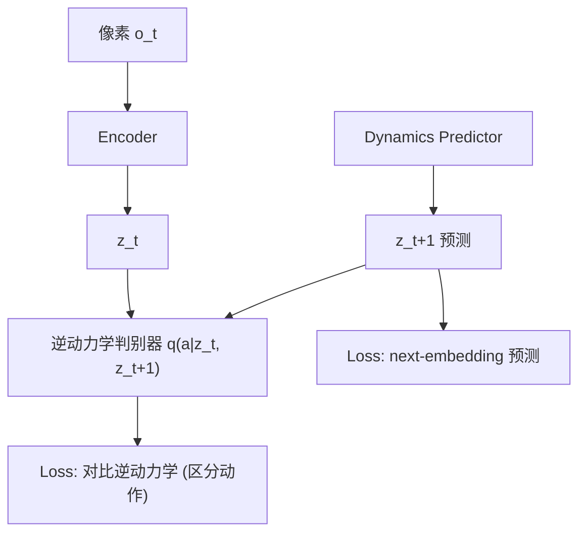

# No Gaussian Required: Contrastive Inverse Dynamics for JEPA World Models

- 本地 PDF：`papers/world-model/NoGaussianRequired_2608.17542.pdf`
- arXiv：https://arxiv.org/abs/2608.17542
- 年份：2026（8 月）
- 团队：LeCun 团队后续（对比 LeWorldModel 的改进）
- 阶段：JEPA 世界模型 — 用对比逆动力学替代 SIGReg 的高斯先验

## 一句话总结

No Gaussian Required 指出 LeWorldModel 的 SIGReg 有一个根本局限：它**预设了 latent 空间必须是各向同性高斯**——但真实世界动态往往是多模态的（同一动作可能通向多个不同结果），强制高斯会抹平这些结构。本文用**对比逆动力学 (Contrastive Inverse Dynamics)** 作为防坍塌信号替代 SIGReg：不预设任何几何形状，而是要求"给定 (z_t, z_{t+1}) 能反推动作 a_t"——让 latent 保留动作可区分性，同时保留多模态动态结构。

## 核心技术

1. **对比逆动力学防坍塌** — 学习一个逆动力学判别器 $q(a|z_t, z_{t+1})$，要求从相邻 latent 对能区分产生它们的动作。防坍塌逻辑：如果 latent 坍塌，逆动力学必然无法区分动作
2. **无高斯先验** — 不强制 latent 分布为各向同性高斯，保留多模态结构
3. **JEPA 架构不变** — 视觉编码器 + 动力学预测器，next-embedding 预测 + 对比逆动力学两个目标

## 底层原理与数学推导

**防坍塌的直觉**：SIGReg 说"latent 分布必须是高斯所以不会坍塌"。对比逆动力学说"latent 必须能区分动作所以不会坍塌"——后者不预设形状，保留任务相关的多模态结构。

**与 SIGReg 的关键差异**：

| 维度 | LeWorldModel (SIGReg) | No Gaussian Required |
|------|----------------------|---------------------|
| 防坍塌机制 | 各向同性高斯正则化 | 对比逆动力学判别 |
| latent 分布假设 | 预设为高斯 | 无预设，自适应 |
| 多模态动态 | 可能被高斯抹平 | 保留 |
| 需要知道动作 | 否（无奖励离线训练） | 是（逆动力学需要动作标签） |

## 物理直觉解释

LeWorldModel 的 SIGReg 像是给 latent 空间"规定了一个形状"——必须是圆形（高斯）。但如果真实世界的动态是"物体可能向左也可能向右"（多模态），这个圆形约束会把两个分支压在一起。

对比逆动力学换了个思路：**不规定形状，只规定"功能"**——"你（latent 空间）必须能回答'从状态 A 到状态 B 发生了什么动作'"。只要能回答这个问题，latent 就一定有足够的信息区分不同的状态转移——坍塌自然不可能。就像考试不规定答案格式，只规定"必须能回答出问题"。

## 工程细节与实操指南

- **逆动力学判别器**：$q(a|z_t, z_{t+1})$，从相邻 latent 对预测动作
- **对比目标**：正确 (z_t, z_{t+1}, a) 三元的分数 > 随机三元（负样本）的分数
- **训练**：需要动作标签（与 LeWorldModel 的无奖励但需动作数据一致）
- **JEPA 架构**：与 LeWorldModel 相同——encoder + dynamics predictor + 潜空间 MPC

## 消融实验与分析

| 消融/对比 | 结论 |
|---------|------|
| 对比逆动力学 vs SIGReg | 保留多模态结构，防坍塌更"自然" |
| 无防坍塌机制 | 表示坍塌 |
| 多模态动态场景 | 对比逆动力学优于高斯先验 |
| 物理量探测 | latent 结构保留物理意义 |

## 技术权衡（Trade-off）

| 优势 | 劣势与工程代价 |
|------|----------------|
| 不预设分布形状，保留多模态结构 | 需要动作标签做逆动力学训练 |
| 防坍塌信号与任务语义对齐（动作可区分） | 对比学习的负样本选择影响质量 |
| 继承 LeWorldModel 的端到端稳定性 | 架构比 SIGReg 多一个判别器网络 |

## 技术价值与演进定位

这是 JEPA 世界模型防坍塌机制的演进：SIGReg（分布形状约束）→ 对比逆动力学（任务语义约束）。方向是"让 latent 结构由任务决定，而不是由正则化器决定"。它代表 JEPA 路线在"表示应该学什么"上的更深思考——不只是"不坍塌"，而是"坍塌的信号要和任务对齐"。

## 与其他论文的关系

- **LeWorldModel** — 直接前身，本文用对比逆动力学替代 SIGReg
- **I-JEPA / V-JEPA** — JEPA 家族，本文延续端到端预测范式
- **TD-MPC2** — 也做 latent 世界模型，但防坍塌靠预测目标 + 任务信号；本文专门研究防坍塌机制本身
- **DIAYN** — 无奖励技能发现也用信息论/对比目标，思路呼应

## 精读问题

1. 逆动力学的动作空间维度 vs latent 维度的匹配——动作空间小时判别器是否过拟合？
2. 对比逆动力学在"不可逆动态"（信息在状态转移中丢失）场景下的表现？
3. 与 SIGReg 的组合——两者是否互补（形状约束 + 语义约束）？
4. 无动作标签的数据（如纯视频）能否用对比逆动力学？自监督动作估计的可行性？
