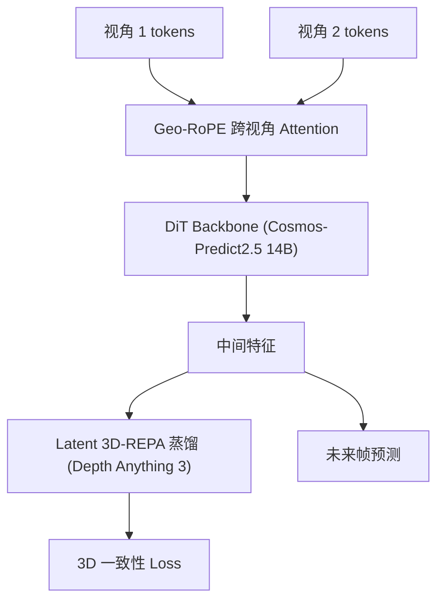

# PAIWorld: A 3D-Consistent World Foundation Model for Robotic Manipulation

- 本地 PDF：`papers/vla-architecture/PAIWorld_2606.18375.pdf`
- arXiv：https://arxiv.org/abs/2606.18375
- 年份：2026（6 月）
- 团队：中科院工业 AI 研究所
- 阶段：3D 一致世界模型 —— Cosmos-Predict2.5 (~14B) + 几何感知跨视角注意力

## 一句话总结

PAIWorld 解决世界模型的多视角 3D 不一致问题——Geo-RoPE 几何旋转位置编码 + Latent 3D-REPA 3D 蒸馏，在 DiT backbone 上同时注入视角间通信和 3D 几何先验。WorldArena 第一，超加性增益 2.64 > 0.93+0.72。

## 核心技术

1. **Geo-RoPE** — 相机射线方向+位姿编码到 RoPE，几何引导的跨视角 token 匹配
2. **Latent 3D-REPA** — 从 Depth Anything 3 蒸馏 3D 特征，pairwise cosine similarity 对齐
3. **超加性效应** — 跨视角注意力 + 3D 蒸馏联合 > 单独之和
4. **下游应用** — Model-based planning, world action models, multi-view policy post-training

## 底层原理与数学推导

Geo-RoPE 双子空间设计：每个注意力头的 query/key 切成两个等维子空间（$d_r = d/2$，$d_p = d/2$），ray 子空间编码像素级 3D 射线方向，pose 子空间编码视角级相机位姿特征（12 维：yaw/pitch/roll + 平移 + 相机位置 + 光轴）。像素 $(h,w)$ 在视角 $v$ 下的世界系射线方向通过相机内参 $K_v$ 反投影并用旋转 $R_v$ 变换得到：

$$
d_v(h,w) = \mathrm{normalize}\big((R_v)^\top (K_v)^{-1} [h+0.5,\ w+0.5,\ 1]^\top\big) \in \mathbb{R}^3
$$

Latent 3D-REPA 用随机锚点采样把相似性矩阵计算从 $O(N^2)$ 降至 $O(MK)$：随机选 $K$ 个锚点 token，测量每个 token 与锚点的余弦相似度 $S(F)_{i,a} = f_i^\top f_a / (\|f_i\| \|f_a\|)$，蒸馏损失为空间项 + 时间项两个 SmoothL1 对齐（$L_{REPA} = L_{spatial} + L_{temporal}$）。

## 物理直觉解释

**PAIWorld 的直觉：让世界模型"睁着一只 3D 的眼睛"做想象**。你在不同角度看到一个杯子，知道是同一个杯子，因为你的视觉系统隐式地重建了 3D 空间——你"知道"杯子的位置、朝向和形状在空间中是同一个实体。传统多视角世界模型没有这个能力：它把两个摄像头的画面当成两段独立的视频去生成，于是同一个物体在不同视角下会漂移、变形、变色——就像两个各画各的画家，分别画同一桌静物，却对不上物体的位置。PAIWorld 的诊断是这种不一致源于两个缺陷：视角之间没有显式的信息通路（每个视角"闭门造车"），模型也没有 3D 几何先验（不知道"物理上正确的跨视角结构"长什么样）。

**Geo-RoPE 是给注意力装上"全球定位系统"**。旋转位置编码（RoPE）原本编码的是 token 在序列中的位置（第几个字、第几行），PAIWorld 把它改造成编码像素在真实 3D 世界中的位置：query 和 key 各自切成两半——ray 子空间编码像素反投影出的 3D 射线方向（同一 3D 点在不同视角的像素，射线会相交，旋转角度就接近），pose 子空间编码相机位姿（yaw/pitch/roll + 平移 + 光轴，共 12 维，同视角 token 共享同一旋转）。效果是跨视角注意力天然"只找与自己看同一个 3D 点的 token 交流"——两个视角看到杯子同一个表面时，它们的 ray 子空间旋转对齐，注意力就把它们匹配起来，信息沿几何对应路径流动，而不是在语义相似的无关 token 之间乱串。

**Latent 3D-REPA 是"3D 老师手把手教"**。光有通路还不够——如果不知道"正确的 3D 结构"长什么样，信息通了也白通。PAIWorld 冻结一个在显式 3D 监督下训练好的基础模型（Depth Anything 3）当老师，让 DiT 的中间特征与老师的特征对齐——而且对齐的不是特征绝对值，而是"token 之间的相似性关系"（随机锚点采样后算 pairwise cosine，把 O(N²) 降到 O(MK)），这样不受两个编码器特征空间差异的干扰。**单有通路没有老师（+0.93）、单有老师没有通路（+0.72），都不行；两者联合提升 +2.64，超过二者之和 1.65**——这就是论文论证的"reinforcing loop"：通路传递信息，监督让信息 3D 一致，只有耦合才能让一致性跨视角连贯传播。就像两个人合作画同一幅 3D 场景：一个负责"对齐画布位置"（通路），一个负责"纠正透视错误"（监督），单独做任何一件都不够，一起做才能画出视角统一的画面。

## 工程细节与实操指南

- Backbone: NVIDIA Cosmos-Predict2.5 (~14B), DiT-based flow matching
- 训练: 200 H200 GPUs, 30K iters, ~7 days
- 数据: 2.5M multi-view robot manipulation clips (AgiBot-World, RoboMIND, Galaxea, RoboTwin, RoboCOIN)
- **Geo-RoPE 注入点**: query/key 各切成 ray/pose 两个等维子空间，ray 子空间用像素反投影射线（经 $K_v$ 和 $(R_v)^{-1}$ 变换）做 RoPE 旋转，pose 子空间用 12 维位姿向量（Euler 角 + 平移 + 相机位置 + 光轴）做 RoPE 旋转——分离设计防止"空间变化"与"空间均匀"两类信号互相干扰
- **跨视角注意力**: 在选定 DiT 层插入 Cross-View Attention 子块 + 周期性的 spatial-concat self-attention，注意力按各视角自身相机几何旋转后再跨视角交换
- **Latent 3D-REPA**: 冻结 Depth Anything 3 作为蒸馏老师，随机锚点采样（每帧 $K_s$ 个空间锚点 + 全片段 $K_t$ 个时间锚点）对齐 token 间相似性关系，O(N²)→O(MK)
- **下游**: model-based planning（想象 rollout 做规划）、world action models 微调、multi-view policy post-training

## 消融实验与分析

| 组件组合 | SSIM ↑ | LPIPS ↓ | FID ↓ | MEt3R ↓ | MEt3R 提升 |
|---------|--------|---------|-------|---------|-----------|
| 基线（仅 backbone） | 0.6912 | 0.2783 | 53.17 | 16.84 | — |
| 仅跨视角注意力（CVA） | 0.7204 | 0.2361 | 50.02 | 15.91 | +0.93 |
| 仅 Latent 3D-REPA | 0.7156 | 0.2447 | 49.88 | 16.12 | +0.72 |
| **两者联合** | **0.7683** | **0.184** | **45.04** | **14.20** | **+2.64** |

其他关键结果：

- **基准排名**：WorldArena 第 1（最佳总 EWMScore 72.31%，Motion Quality 最佳）；AgiBot-Challenge2026 第 2（EWMScore 82.45%，Scene Consistency 90.41% 全场最佳）
- **下游应用**：一致性收益直接传导至 model-based planning、world action models、multi-view policy post-training
- **复杂度**：锚点随机采样把蒸馏的相似性矩阵计算从 O(N²) 降至 O(MK)

**核心结论**：消融链条给出三层证据——(1) 单组件均有效但不足：仅 CVA 提升 MEt3R +0.93（跨视角注意力的几何引导版，即含 Geo-RoPE），仅 3D-REPA +0.72，两者单独都无法消除跨视角不一致；(2) 组合是超加性的：联合提升 +2.64 显著超过单独增益之和 0.93+0.72=1.65，这一非加性跳跃正是第 3.6 节所分析的 reinforcing loop 的实证签名——通路传递信息、目标让信息 3D 一致，只有耦合才能使一致性跨视角连贯传播；(3) 感知质量同向改善：SSIM/LPIPS/FID 均在两者联合时最优（0.6912→0.7683 / 0.2783→0.184 / 53.17→45.04），证明几何增益不以视觉保真度为代价。

## 技术权衡

| 优势 | 劣势与工程代价 |
|------|------|
| WorldArena 第 1（EWMScore 72.31%）、AgiBot-Challenge2026 第 2（EWMScore 82.45%，Scene Consistency 90.41% 最佳） | 14B backbone，200 块 H200 训练 30K iters 约 7 天——成本极高 |
| 超加性效应（+2.64 > 0.93+0.72）验证了联合设计的必要性 | 假设相机外参已知，标定误差的鲁棒性未验证 |
| 一致性收益直接传导到下游（planning / world action / policy post-training） | 2.5M 多视角数据的视角分布是否覆盖真实部署待验证 |
| 锚点采样 O(N²)→O(MK)，蒸馏开销可控 | 冻结 3D 老师（Depth Anything 3）的上限约束了蒸馏目标的表达能力 |

## 技术价值与演进定位

PAIWorld 是 3D 一致世界模型的标杆——它把"多视角 3D 一致性"从工程 trick 提升为可论证的设计原则：论文明确论证了跨视角通信通路与 3D 几何目标"必要且充分"（necessity and sufficiency），并用超加性消融（+2.64 > 0.93+0.72）给出实证签名。三个贡献具有持久影响力：其一，Geo-RoPE 把相机几何（射线方向 + 位姿）编码进 RoPE，让跨视角注意力沿几何对应路径路由信息，是"把标定信息注入生成模型"的优雅范例；其二，Latent 3D-REPA 把 REPA 从 2D 图像扩散扩展到多视角视频世界模型，用冻结 3D 基础模型蒸馏替代昂贵的显式 3D 监督；其三，以 ~14B Cosmos-Predict2.5 为 backbone 证明了"生成式世界模型 + 几何注入"在 2.5M 多视角操作数据上可训练到 SOTA——与 FP3（3D 策略，关注"如何用 3D 做动作"）形成互补，前者关注"如何在 3D 中做想象"。

## 与其他论文的关系

- **WEAVER (2026)** — 多视角世界模型，关注保真度/效率；PAIWorld 关注 3D 一致性
- **RISE (RSS 2026)** — 想象中 RL，PAIWorld 提供了更好的 imagination engine
- **Cosmos-Predict** — PAIWorld 的 backbone，加入了多视角和 3D 能力
- **REPA (24)** — PAIWorld 的 Latent 3D-REPA 将其从 2D 图像扩散扩展到多视角视频世界模型
- **Depth Anything 3 / VGGT / DUSt3R** — 3D 基础模型（深度/点图预测），作为冻结蒸馏老师提供 3D 几何先验

## 精读问题

1. Geo-RoPE 对相机外参标定误差的鲁棒性？位姿错 1°/1cm 时 ray 子空间的旋转对齐会恶化多少，注意力路由是否随之退化？
2. 14B backbone 的推理延迟是否支持实时规划？作为 world simulator 逐帧生成多视角视频的成本 vs 直接规划策略的边界在哪？
3. 超加性效应（+2.64 > 0.93+0.72）的机制归因——是"通路让监督信号跨视角传播"还是"监督让通路的注意力路由更精准"？能否通过中间特征可视化分离两者？
4. Latent 3D-REPA 的锚点采样（O(N²)→O(MK)）——锚点数量 K 与蒸馏保真度的权衡？锚点随机性是否引入训练噪声？
5. 已知相机外参假设的放宽——如果外参由网络在线估计（如 VGGT 式联合预测），Geo-RoPE 与估计误差如何交互？
6. 2.5M 多视角操作视频（AgiBot-World 等）的视角分布是否覆盖真实部署场景？单视角或极端视角（腕部自遮挡）下的 3D 一致性如何？

