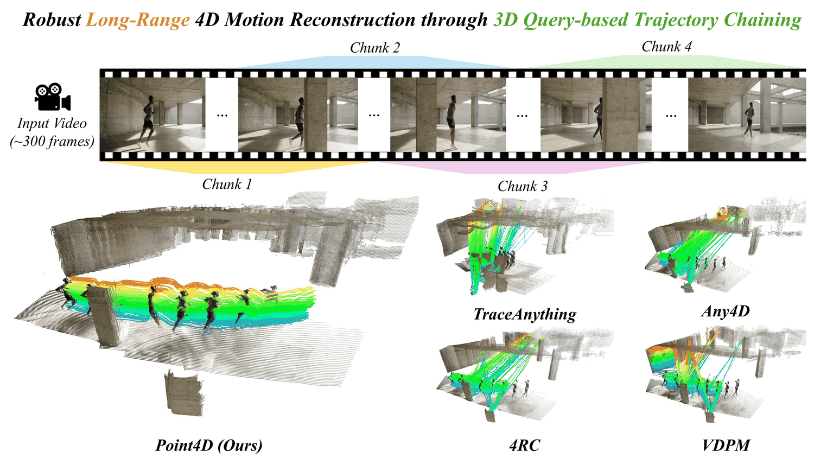
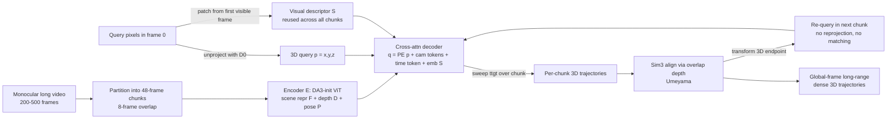
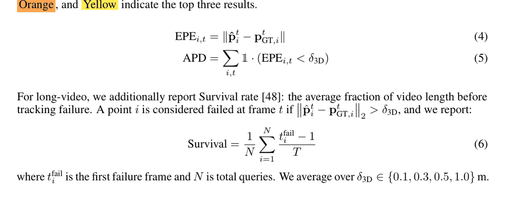

# Point4D: Long-range 4D Motion Reconstruction

- arXiv: https://arxiv.org/abs/2609.09145
- Source: https://arxiv.org/abs/2609.09145
- Project: https://point-4d.github.io
- Local PDF: `/Users/luogu/physical_intelligence/papers/world-model/Point4D_2609.09145.pdf`
- Year: 2026
- Category: 4D motion reconstruction / point tracking
- Priority: medium

## 一句话总结

前馈式 4D 重建只能吃几打帧的短窗口、且遮挡点无法跨块续接的问题，被 Point4D 用「查 3D 点、不查 2D 像素」解决：把 D4RT 的 2D 像素 query 换成 3D 坐标 query（配一个可从任意可见帧提取、全程复用的视觉描述子），使上一块预测出的 3D 端点经 Sim(3) 对齐后可直接在下一块重查询——无需重投影、无需匹配、对遮挡与出画天然免疫；在 200 帧长程 4D 跟踪上 Dynamic Replica EPE 0.155 / Survival 0.812 大幅领先最优前馈基线 VDPM（0.386 / 0.587），500 帧外推（PointOdyssey EPE 0.972）超过所有迭代式追踪器（SpatialTrackerV2 1.008），而单块 64 帧内仅与基线持平——证明增益全部来自 3D 查询式链接而非更强的解码器。

## 九问速览

1. **Problem**：单目长视频（数百帧）的稠密逐点 3D 轨迹前馈重建，遮挡/出画下无法续接
2. **Bottleneck**：现有 4D 法 query 绑在 2D 像素上，跨块需重投影或匹配，遮挡即断
3. **Insight**：query 3D 点而非像素——3D 坐标不依赖可见性，端点可直接进下一块
4. **Method**：DA3 编码器 + 3D 坐标 query 交叉注意力解码器 + Sim(3) 对齐的块间链式传播
5. **Evidence**：200 帧三个基准平均排名第一；Dynamic Replica EPE 0.155 vs VDPM 0.386、Survival 0.812 vs 0.587
6. **Ablation**：2D→3D query：PointOdyssey Survival 0.283→0.514；描述子任意帧 vs 源帧：Dynamic Replica EPE 0.825→0.155
7. **Assumption**：块间重叠帧深度可靠、Sim(3) 可对齐；点至少在某一帧可见过（有描述子）
8. **Failure**：整块都不可见的点无证据支持（OOF 点 PointOdyssey 上 4RC 反超）；深度误差跨块累积
9. **Opportunity**：携带特征记忆的 handoff、闭环回环约束、作为生成式世界模型的稠密运动监督

| 维度 | 论文答案 |
|---|---|
| Perception | 单目视频，48 帧重叠分块编码（训练序列 16–64 帧、宽度采样 [252,518]；评测 294×518）；DA3 ViT 出场景表征 + 逐帧深度/位姿 |
| Closed-loop | 不适用（重建任务）——无预测-控制回路；块间链式传播是纯前馈自回归，不据误差反馈修正 |
| Correction | 无显式校正：每块独立预测、仅 Sim(3) 对齐坐标系；深度/对齐误差跨块单调累积（作者自认局限） |
| Deployment | 训练 = 12 个合成/室内/驾驶数据集混合；评测 = PointOdyssey/Dynamic Replica/PStudio/LSFOdyssey 等分布内外基准 + DAVIS 定性；无真机部署 |

## 核心技术

**信息流拆法（Figure 3 + Algorithm 1）。** 两级结构：(1) **编码器**沿用前馈视觉几何预测范式（Depth Anything 3 初始化）：ViT 骨干 $E$ 以交替的帧内/全局自注意力处理视频块，输出 patch token $Z_i$、相机 token $c_i$、每帧可学习时间 token $t_i$（正弦初始化于 [0,1] 归一化时刻），DPT 头从中解码逐帧深度 $D_i$ 与相机位姿 $P_i$；(2) **解码器**是轻量交叉注意力模块：query 由五元组构成——3D 坐标 $p=(x,y,z)$（正弦位置编码）+ 三个时刻/相机索引（$t_{\text{src}}, t_{\text{cam}}$ 用编码器相机 token、$t_{\text{tgt}}$ 用时间 token）+ 视觉描述子 $S$（query 点在**任意可见帧**的局部图像 patch 的 embedding），求和成 query embedding $q$ 后独立交叉注意场景表征 $F$ 输出 $\hat p\in\mathbb R^3$。查询间无自注意力——任意查询集可灵活批处理。

*论文 Figure 1（p1）：Figure 1: Point4D enables long-range 4D reconstruction via autoregressively chaining motion*

**什么预训练、什么冻结、什么训练。** 编码器与几何头从 Depth Anything 3 预训练权重初始化（微调，lr 缩 0.1），解码器从头训练；附录 C 验证其深度/位姿精度与 DA3 持平（KITTI AbsRel 0.051 vs 0.053）——3D query 的可靠性依赖这个几何底座。

**损失（式 3）。** 四项之和：$\mathcal{L}_{\text{point}}$（主项，L1 on 符号 log 变换后的 3D 位置）、$\mathcal{L}_{\text{conf}}$（每查询置信度调制主损失）、$\mathcal{L}_{2d}$（预测 3D 点投影到 $t_{\text{cam}}$ 帧的 2D L1 一致性）、$\mathcal{L}_{\text{vis}}$（$t_{\text{tgt}}$ 时刻可见性二分类 BCE）。

**长程链式传播。** 视频切成 48 帧块、8 帧重叠：相邻块用重叠帧稠密深度经 Sim(3)（Umeyama）对齐到全局坐标系；每块内 sweep $t_{\text{tgt}}$ 解出全块轨迹；在首重叠帧处把上一块预测的 3D 端点经 Sim(3) 变换进下一块局部坐标作为新 query，视觉描述子从首次可见帧提取后**全程复用**。2D-query 方法在同样的边界上必须把 3D 预测投影回像素再查询——遮挡点投影无定义、可见点也叠加相机预测误差，这正是 Table 1/7 差距的机制来源。

## 底层原理与数学推导

**编码器输出（式 1）。** 前馈几何预测加时间 token 的扩展：

$$
\mathcal F,\ \{c_i, t_i, P_i, D_i\}_{i=1}^{T} = \mathcal E(V)
$$

**3D query 解码（式 2，对 D4RT 的核心改造）。** query 五元组 $(p, t_{\text{src}}, t_{\text{tgt}}, t_{\text{cam}}, S)$：

$$
\hat p = \mathcal D(q, \mathcal F) \in \mathbb{R}^3,\qquad q = \text{PE}_{\sin}(p) + c_{t_{\text{src}}} + c_{t_{\text{cam}}} + t_{t_{\text{tgt}}} + \text{emb}(S)
$$

关键语义：问的是「位于 $p$（$t_{\text{src}}$ 相机系）的点在 $t_{\text{tgt}}$ 时刻、以 $t_{\text{cam}}$ 相机系表示的 3D 位置」。当 $t_{\text{ref}} \ne t_{\text{src}}$（描述子取帧 ≠ 源时刻）时该点可能已移动/被遮挡——2D 像素无定义，但 3D 坐标始终良定。这一改动还有副产物：decoder 不必再联合恢复几何（几何已在输入侧由深度/位姿给出），专注运动；物体边界上「query 是前景还是背景像素」的 2D 歧义也被 3D 坐标消解。

**损失（式 3）。** 符号 log 变换 $\phi(x) = \text{sign}(x)\log(1+|x|)$ 压制远点影响：

$$
\mathcal L = \mathcal L_{\text{point}} + \mathcal L_{\text{conf}} + \mathcal L_{2d} + \mathcal L_{\text{vis}},\qquad \mathcal L_{\text{point}} = \big\|\phi(\hat p) - \phi(p_{\text{GT}})\big\|_1
$$

**块间传播（Algorithm 1 第 9–10 行）。** Sim(3) 变换下的 3D 端点交接：

$$
p_i \leftarrow c\,R\,P_i(t_{k+1}) + t,\qquad (c, R, t) = \text{EstimateSim3}(C_k \cap C_{k+1})
$$

对比 2D 路线的交接 $u_i = \pi\big(P_i(t_{k+1})\big)$：投影 $\pi$ 对遮挡点无定义、对可见点引入相机误差——两种失败模式在长视频里随块数线性放大（Figure 6 的 chunk-wise 曲线即其可视化）。

**评测指标（式 4–6）。** 中值尺度对齐后的端点误差、阈值精度与生存率：

$$
\text{EPE}_{i,t} = \|\hat p^t_i - p^t_{\text{GT},i}\|,\qquad \text{APD} = \sum_{i,t} \mathbb{1}\,\big(\text{EPE}_{i,t} < \delta_{3D}\big),\qquad \text{Survival} = \frac{1}{N}\sum_{i=1}^{N}\frac{t_i^{\text{fail}} - 1}{T}
$$

$\delta_{3D} \in \{0.1, 0.3, 0.5, 1.0\}$ m 取平均；失效判定为 EPE² 超过 $\delta_{3D}$。

## 物理直觉解释

**「记住的是那块石头，不是它在哪张照片里」。** 2D-query 方法把点的身份绑在像素坐标上——好比认人只认「照片第 3 排第 5 个位置」，人一走开（遮挡/出画）身份就丢了，下次出现只能靠投影猜回像素再认一次，猜错一次轨迹就换人。Point4D 把身份存进 3D 坐标 + 一张视觉快照（描述子）：**像在口袋里揣着一颗石子，无论它是否在视野里，你都知道它埋在哪**（3D 坐标在相机系里永远良定）。重新查询只需把坐标从上一块的相机系换算到下一块（一次 Sim(3) 乘法），不需要看见它。Table 7 把这层直觉量化：遮挡点上 Point4D 的优势最大（PointOdyssey EPE 0.597 vs 4RC 0.915），因为遮挡恰是 2D 交接的定义域空洞，而 3D 路线根本不经过这个域。

**「接力棒交在三维空间，交棒误差不随棒数放大」。** 长视频重建像多棒接力：每棒（块）内部跑得都不错，名次差距全在交棒。2D 路线交棒要把 3D 预测投影回像素——这一步同时引入相机估计误差与遮挡不可定义性，**误差像复印机反复复印，每复印一次（每块边界）线条淡一层**；Figure 6 显示基线的 chunk-wise EPE 随块数陡峭上升、VDPM 首块精度更高却在几块内被反超。3D 路线交棒只有 Sim(3) 对齐一个误差源（且由重叠帧稠密深度估计，被平均掉大部分），附录 E 的 500 帧实验里 12 次交接后 Point4D 仍全场第一（EPE 0.972 vs SpatialTrackerV2 1.008）——**误差结构从「乘性放大」变成「加性缓增」**，这是长程能力真正的来源。

**「按需取用 vs 全量上菜」。** DPT 式稠密头是自助餐：不管你要 10 个点还是 10 万个点，整幅深度/运动图全算一遍；query 式解码是点菜：算多少付多少。附录 B 的 runtime 曲线给出精确画像——查询数从 100 到 5000，Point4D 耗时线性增长而 DPT 法恒定：**稀疏查询时 Point4D 是第二快的方法，全量查询时反而落后稠密头但仍能跑完（SpatialTrackerV2 在 5000 查询直接 OOM）**。这个取舍对下游（机器人只关心抓取点附近、AR 只关心注视区域）通常是赚的——真实系统很少需要全部像素的 4D 轨迹，而「要多少算多少」的弹性让同一模型从稀疏交互用到稠密建图。

## 工程细节与实操指南

- **训练配方（附录 A）**：AdamW，峰值 lr $1\times10^{-4}$，150 epochs，线性 warmup 到 10 epoch 后 cosine 衰减；DA3 初始化模块 lr 缩 0.1；8×H100；动态点 loss 相对静态点加权。数据增强：颜色抖动、高斯模糊、随机缩放、宽高比扰动。
- **查询采样（附录 A）**：每帧 $N=750$ 个查询像素，40% 来自 Sobel 边缘区域（强化物体边界覆盖）；$t_{\text{src}}, t_{\text{tgt}}, t_{\text{cam}}$ 均匀采样，40% 查询强制 $t_{\text{cam}} = t_{\text{tgt}}$（频繁练习目标帧自身坐标系）。
- **训练数据混合（Table 4，按 epoch 采样比）**：动态 7 个——PointOdyssey 19.8%、Dynamic Replica 19.8%、BEDLAM2 19.8%、CoTracker-Kubric 11.9%、Kubric Movi-F 11.9%、Waymo Drivetrack 5.8%、OmniWorld 2.0%（无轨迹 GT，查询限制 $t_{\text{src}}=t_{\text{tgt}}$ 退化为深度+相对位姿任务）；静态 5 个——ScanNet / ScanNet++ / BlendedMVS / Co3Dv2 各 2.0%、WildRGBD 1.0%（静态点当不动轨迹）。训练序列 16–64 帧，宽度采样 [252, 518]。
- **推理配置**：块 48 帧、重叠 8 帧（附录 F 定性实验用 16 帧重叠）；附录 B runtime 在单张 A6000（48GB）、294×518 分辨率下测：帧数 16–64 扫描（查询固定 100）、查询 100–5000 扫描（帧固定 48）。
- **评测细节（附录 A）**：长程跟踪评静态+动态点、每序列单一全局尺度对齐（静态点最常出画，直接考核遮挡/出画点精度）；单块跟踪只评动态点、遵循 Any4D 协议逐帧对独立重缩放。附录 D 给 2D 基线四种交接策略（First-frame / Stationary / Linear / Selection）消融，Selection（每个重叠帧投影、选投影深度与深度头最吻合的帧再查询）最优，所有 2D 基线统一用它——**给足了基线公平性**。
- **部署要点**：想要稀疏轨迹（机器人/AR 场景）用 query 批处理直接受益；想要稠密全场运动则接受查询线性开销或退回 DPT 头方法；OOF（出画整块）点无证据时预测不可靠，建议用可见性 logit 门控输出。

## 实验协议清单

| 项目 | 论文设置 | 来源与备注 |
|---|---|---|
| 观测 | 单目视频：长程 200 帧（PStudio 150）/ 扩展 500/300 帧；块 48 帧、重叠 8；训练序列 16–64 帧、宽度 [252,518]；runtime 测试 294×518 | 第 4.1 节 / 附录 A、B |
| 动作空间 | 不适用（重建任务） | — |
| 控制频率 | 不适用（重建任务） | — |
| 重规划频率 | 不适用（重建任务） | — |
| 动作 horizon | 不适用（重建任务）；对应时域范围为 200–500 帧轨迹 / 48 帧块 | — |
| 数据 | 训练 12 数据集混合（动态 7 + 静态 5，采样比 19.8%–1.0%，附录 Table 4）；评测 PointOdyssey、Dynamic Replica、PStudio（长程）、LSFOdyssey、DAVIS（单块/定性） | 第 3.4 节 / 附录 A |
| 奖励 | 不适用（重建损失：$\mathcal{L}_{\text{point}}+\mathcal{L}_{\text{conf}}+\mathcal{L}_{2d}+\mathcal{L}_{\text{vis}}$，式 3） | 第 3.2 节 |
| Reset | 不适用（重建任务） | — |
| 成功定义 | EPE↓ / APD↑（$\delta_{3D}\in$0.1/0.3/0.5/1.0 m）/ Survival↑，中值尺度对齐后计算；深度 AbsRel/δ<1.25、位姿 ATE/RPEt/RPEr（附录 C） | 第 4.1 节 / 式 4–6 |
| 评估次数 | 未报告重复次数；各基准序列数未逐一列出（长程为 200/150 帧序列集） | 全文未见 |
| 随机种子 | 未报告 | 全文未见 |
| 扰动测试 | 无控制型扰动；鲁棒性按可见性分桶（Visible / Occluded / OOF，附录 D Table 7）与块数延伸（500/300 帧，附录 E）评估 | 附录 D、E |
| 真机 | 不适用（重建任务）；应用愿景含机器人/AR/VR（第 5 节） | — |
| 算力 | 训练 8×H100（150 epochs）；推理单张 A6000 48GB 可跑（294×518） | 附录 A、B |
| 特权信息 | 评测用 GT 轨迹做中值尺度对齐与指标计算；训练用各数据集 GT 深度/位姿/轨迹（合成/动捕）；2D 基线各自用自家深度模块 | 第 4.1 节 / 附录 A |

**附录陷阱自查**：
- privileged 信息：无推理期特权输入（深度/位姿均自预测）；评测的尺度对齐用 GT 是 4D 跟踪标准协议，但意味着报告的是 up-to-scale 精度
- reward shaping：不适用；训练加权（动态点 upweight、40% 边缘采样）属标准采样策略
- reset 难度：不适用
- eval budget：序列数未报告，无法核算总评测量；500 帧扩展仅 PointOdyssey/Dynamic Replica 两集
- 底层控制栈：无控制栈；链式传播的 Sim(3) 估计（Umeyama on 重叠深度）是唯一「系统层」组件
- 数据优势：训练混合 12 数据集且评测集（PointOdyssey/Dynamic Replica/PStudio）部分与训练集同源——LSFOdyssey/DAVIS 属分布外；对比迭代追踪器（TAPIP3D/SpatialTrackerV2）时未见其在我方训练混合上微调的说明，公平性待确认

## 消融实验与分析

*论文 Table 1（p7）：Table 1: Long-Video 4D Tracking via Trajectory Chaining. Point4D achieves the best average*

### A. query 形式消融（Table 3，EPE↓ / SR↑）

| Query 形式 | PointOdyssey EPE（长程） | PointOdyssey SR（长程） | Dynamic Replica EPE（长程） | LSFOdyssey EPE（单块） | Dynamic Replica EPE（单块） |
|---|---|---|---|---|---|
| 2D 像素（D4RT 式） | 0.891 | 0.283 | 0.712 | 0.279 | 0.110 |
| 3D（源帧 patch） | 0.869 | 0.380 | 0.825 | 0.442 | 0.121 |
| 3D + 任意可见帧 patch（Point4D） | 0.616 | 0.514 | 0.155 | 0.274 | 0.091 |

**核心结论**：两个设计必须齐备——只换 3D 坐标（源帧 patch）在 Dynamic Replica 长程上反而恶化（0.712→0.825，模型训练时从未见过遮挡/出画 query），加上任意可见帧描述子后才爆发（→0.155）；单块上 3D+任意 patch 略优于 2D（0.091 vs 0.110），说明 3D query 本身也有少量单块增益，但主要收益在链式。

### B. 长程主结果（Table 1，200 帧；PStudio 150 帧）

| 方法 | 类型 | PointOdyssey EPE/SR | Dynamic Replica EPE/APD/SR | PStudio EPE/APD/SR |
|---|---|---|---|---|
| TAPIP3D | 迭代 | 0.952 / 0.317 | 0.185 / 0.806 / 0.748 | 0.230 / 0.741 / 0.622 |
| SpatialTrackerV2 | 迭代 | 0.498 / 0.477 | 0.218 / 0.772 / 0.687 | 0.234 / 0.719 / 0.623 |
| 4RC | 前馈 | 0.789 / 0.463 | 0.336 / 0.733 / 0.654 | 0.379 / 0.613 / 0.534 |
| VDPM | 前馈 | 0.736 / 0.461 | 0.386 / 0.666 / 0.587 | 0.280 / 0.719 / 0.634 |
| Point4D | 前馈 | 0.616 / 0.514 | 0.155 / 0.856 / 0.812 | 0.236 / 0.731 / 0.664 |

**核心结论**：平均排名第一的前馈方法；Dynamic Replica 上全面碾压（EPE 减 60%、Survival +0.225）；PointOdyssey 上 EPE 逊于 SpatialTrackerV2（0.616 vs 0.498）但 Survival 更高（0.514 vs 0.477）且速度快得多（附录 B：迭代法最慢之一）。

### C. 单块对照（Table 2，≤64 帧，EPE↓ / APD↑）

| 方法 | LSFOdyssey | Dynamic Replica | PStudio |
|---|---|---|---|
| 4RC | 0.16 / 0.87 | 0.07 / 0.95 | 0.29 / 0.66 |
| VDPM | 0.14 / 0.85 | 0.14 / 0.84 | 0.17 / 0.79 |
| Point4D | 0.27 / 0.73 | 0.09 / 0.91 | 0.23 / 0.73 |

**核心结论**：单块上 Point4D 不优于甚至略逊于最强稠密头基线——**与 Table 1 合读即论文最硬的因果论证：长程优势全部来自 3D 查询链式，而非解码器变强**（Figure 6 的 chunk-wise 曲线同证：VDPM 首块更准、几块内被反超）。

### D. 可见性分桶与交接策略（附录 D Table 6/7，EPE↓）

| 方法（2D 用最优 Selection 交接） | PO Vis / Occ / OOF | DR Vis / Occ / OOF | PStudio Vis / Occ / OOF |
|---|---|---|---|
| 4RC（Selection） | 0.672 / 0.915 / 1.097 | 0.290 / 0.574 / 0.335 | 0.354 / 0.443 / 0.610 |
| VDPM | 0.636 / 0.860 / 1.171 | 0.346 / 0.607 / 0.379 | 0.261 / 0.332 / 0.493 |
| Point4D | 0.548 / 0.597 / 1.147 | 0.140 / 0.202 / 0.309 | 0.228 / 0.265 / 0.409 |

**核心结论**：可见与遮挡点全面领先、遮挡差距最大（PO Occ：0.597 vs 0.915）；OOF 缩窄且 PointOdyssey 上 4RC 反超——出画整块的点在新块中无任何证据，2D 法裁剪到图像边界查错表面反而误差更小，这是 3D 路线的诚实边界。附：2D 基线四种交接策略中 Selection 最优（4RC PO 全点 EPE 0.789 vs First-frame 0.960），基线已拿满公平性。

### E. 延伸时长与纯动态点（附录 E Table 8/9）

500 帧 PointOdyssey：Point4D EPE 0.972 / APD 0.482 / SR 0.387 全部第一（SpatialTrackerV2 1.008 / 0.461 / 0.307）；300 帧 Dynamic Replica：0.174 / 0.836 / 0.786。仅动态点（Table 8）：Dynamic Replica 0.200 / 0.794 / 0.717 仍最优前馈，PointOdyssey 0.617 逊于 SpatialTrackerV2 0.493——**结论**：块数越多优势越大（12 次交接后反超迭代法），动态性本身不稀释链式增益。

## 技术权衡（Trade-off）

| 优势 | 劣势与工程代价 |
|------|---------------|
| 3D query 解耦可见性：遮挡/出画点可查询、可交接，长程误差加性缓增 | 整块不可见的点无场景证据，预测不可靠（OOF 点反被 2D 裁剪法局部反超） |
| query 式按需解码：稀疏查询第二快、任意查询集灵活批处理 | 查询数线性计费：稠密全图运动反而慢于 DPT 常数时间的稠密头 |
| DA3 几何底座复用：深度/位姿精度与 DA3 持平（KITTI AbsRel 0.051），3D query 初始化可靠 | 依赖预测深度与 Sim(3) 对齐：深度误差沿链复合（作者自认）；尺度只能 up-to-scale 对齐评测 |
| 描述子一次提取全程复用：跨块身份稳定、免匹配 | handoff 只带 3D 坐标 + patch，无场景表征/特征记忆传递——信息瓶盖在 48 帧窗口内 |
| 训练混合 12 数据集（动/静、合成/真实/驾驶）泛化广 | 评测集与训练集部分同源（PointOdyssey/Dynamic Replica）；对迭代基线是否同数据微调未说明 |
| 8×H100 训练、A6000 推理：工程门槛在同类中偏低 | 150 epochs 全量混合的调参成本与数据配比敏感性未报告 |

## 技术价值与演进定位

在「世界模型」书库里，Point4D 代表的是与生成式预测正交的另一半基础能力：**世界状态的稠密几何观测**。VGGT/DUSt3R/Depth Anything 3 一线把静态 3D 前馈化之后，4D（+时间）这条线的卡点从「单块精度」转移到了「长程链式」——静态重建链式只需对齐坐标系（VGGT-Long 的 chunk-and-align），动态重建链式还要传递点的身份，而身份恰恰住在 2D 像素这个最脆弱的载体上。Point4D 的贡献是把身份迁到 3D 坐标 + 视觉描述子这个载体，并用「单块持平（Table 2）+ 长程大幅领先（Table 1）」的对照实验干净地归因。对下游世界模型的意义在于监督信号的形态：生成式世界模型（DWM、EgoExo-WM 一系）缺的正是「被操作物体去哪了」的稠密 3D 轨迹监督，Point4D 这类方法输出的 200+ 帧遮挡鲁棒轨迹是现成的稠密 4D 伪标签发生器。其自认局限（无记忆 handoff、深度误差复合、OOF 无证据）勾勒出后续方向：块间特征记忆、回环约束、以及与生成先验的融合。

## 与其他论文的关系

- **DWM（dexterous-world-models.md）** — 上下游互补：DWM 用静态 3DGS 场景渲染作条件、只学残差动态，但自认「不显式推理 3D 结构/深度/接触」且非刚体失效；Point4D 恰好提供长程稠密逐点 3D 轨迹——可作 DWM 的动作-后果几何监督或其「用作物可微模拟器」愿景的状态读取器。
- **EgoExo-WM（egoexo-wm.md）** — 组件供应商关系：EgoExo-WM 的 exo-to-ego 转换依赖 ViPE 的 4D 场景重建与 SAM-Body4D 姿态；Point4D 式长程 3D 轨迹可提升转换中人体/物体运动的一致性，也可为 WM 提供「物体运动」辅助监督（与腕部一致性损失同构的思路）。
- **V-JEPA 2 / V-JEPA（v-jepa2.md、vjepa.md）** — 「预测什么」的两极：JEPA 系在冻结特征空间预测抽象表征（便宜、语义好、无几何保证），Point4D 在显式 3D 坐标空间预测度量轨迹（精确、可微于物理量、无生成能力）；二者互为对方缺失的维度，特征空间正则 + 几何空间监督的混合是显然的融合实验。
- **PAIWorld（paiworld.md）** — 同属「显式几何进世界模型」潮流：PAIWorld 用几何感知跨视角注意力保 3D 一致性，Point4D 用 3D query 解耦可见性；前者面向操作世界模型的生成侧，后者面向观测侧，几何先验的注入点一个在注意力、一个在查询。
- **TD-MPC2 / Dreamer-v3（td-mpc2.md、dreamer-v3.md）** — latent MPC 世界模型的观测升级候选：其 latent 状态无度量结构，长程规划漂移；若 latent 中拼入 Point4D 式度量轨迹 token，规划目标（如「把物体推到 1m 外」）可表达为可测的 3D 约束——纯推测性方向，待验证。
- **What Matters in WAM（what-matters-wam.md）** — 方法学参照：本文「单块持平 + 长程领先」的归因式消融设计与 WAM 受控实证研究同款——世界模型文献里把「能力来源」与「能力总量」拆开论证的范式正在成为标准。

## 精读问题

1. handoff 只传 3D 坐标 + patch 描述子，等价于把点身份压缩到两个低维载体；若在交接处追加「上一块结尾若干帧的场景特征摘要」（KV cache 式记忆），OOF 点的证据缺失能否被缓解？代价是每块的编码开销还是解码开销？
2. 深度误差经 Sim(3) 链复合是作者自认的误差源；能否在重叠帧上做「尺度漂移估计 + 回溯重对齐」（类似 VGGT-Long 的 loop closure），或对 8 帧重叠窗做多尺度假设维护？500 帧实验中尺度漂移占 EPE 的比例可否分解测出？
3. 视觉描述子从「首次可见帧」提取后全程冻结——长视频中外观会漂移（光照、视角、形变）；换成「最近一次高置信可见帧」滚动更新描述子，是否会因描述子-坐标失配引入新误差？两条策略的切换判据如何设计？
4. 训练时 40% 查询强制 $t_{\text{cam}}=t_{\text{tgt}}$ 是为了稳定坐标系练习；这个比例对链式精度（跨块时 $t_{\text{cam}}$ 常为 0）的敏感度如何？是否存在更结构化的课程（先同系后跨系）？
5. 单块上 DPT 稠密头（4RC/VDPM）仍略优；能否做混合解码——稀疏 query 走 Point4D、稠密需求在同一编码表征上加 DPT 头，按查询密度自动切换？附录 B 的 runtime 交叉点（约多少查询时 query 式开始吃亏）论文未给具体数值，值得补测。
6. 训练混合中 PointOdyssey/Dynamic Replica 与评测同源，LSFOdyssey/DAVIS 分布外结果尚可但范围有限；在真正 in-the-wild 长视频（如 ego4d 片段）上无 GT 时，如何用可见性 logit 与块间一致性做自监督评估？
7. 对世界模型应用：把 Point4D 轨迹作为视频扩散世界模型（DWM 类）的辅助监督（预测视频对应点轨迹的 L1），能否修复 DWM 在非刚体物体上的失效？这需要 Point4D 对生成视频（非真实视频分布）的泛化——其训练分布是否覆盖合成渲染风格？
