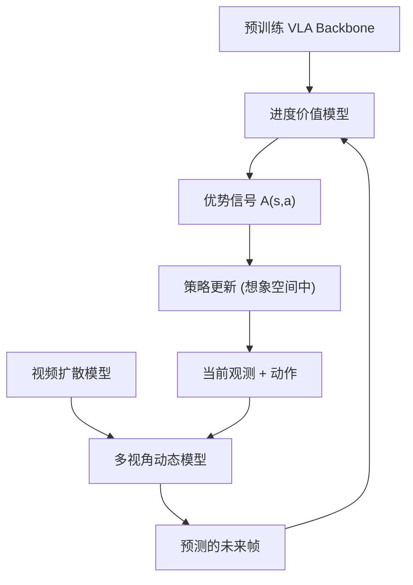

# RISE: Self-Improving Robot Policy with Compositional World Model

- 本地 PDF：`papers/vla-architecture/RISE_2602.11075.pdf`
- arXiv：https://arxiv.org/abs/2602.11075
- 代码：https://github.com/OpenDriveLab/RISE
- 年份：2026 (RSS 2026)
- 团队：OpenDriveLab (HKU), 上海 AI Lab 等
- 阶段：组合世界模型 + 自我改进 RL —— 在 imagination 中训练，不碰真实机器人

## 一句话总结

RISE 提出组合世界模型（Compositional World Model）：将世界模型分解为可控多视角动态模型（视频扩散）和进度价值模型（VLA 预训练），在想象空间中持续自我改进策略，无需物理交互。真实灵巧操作任务上提升 +35%（动态分拣）、+45%（背包打包）、+35%（关盒）。RSS 2026。

## 核心技术

1. **组合世界模型** — 将世界模型分解为两个专业化组件：(1) 多视角动态模型（视频扩散）预测"动作后世界会怎样"，(2) 进度价值模型（VLA backbone 初始化）评估"这样好不好"
2. **想象力空间 RL** — 闭环自我改进 pipeline：动态模型生成想象 rollout → 价值模型估计优势信号 → 策略在想象空间中更新 → 无需物理交互
3. **VLA → 世界模型的迁移** — 利用预训练 VLA 的视觉表征初始化价值模型，使价值估计受益于大规模预训练的语义理解
4. **多视角可控动态** — 动态模型支持多视角渲染，策略可在不同视角下评估同一 rollout

## 底层原理与数学推导

组合世界模型将 MDP 的转移函数 $P(s_{t+1}|s_t,a_t)$ 拆分为视觉动态 $f_\phi$ 和价值模型 $V_\psi$：

$$\hat{s}_{t+1} = f_\phi(s_t, a_t), \quad A(s_t, a_t) = r_t + \gamma V_\psi(\hat{s}_{t+1}) - V_\psi(s_t)$$

策略 $\pi_\theta$ 在 imagination rollout 中通过 PPO 风格更新，无需真实环境交互。

## 物理直觉解释

RISE 做了一件很自然的事：**在脑子里练习，而不是在现实中摔跤**。组合世界模型 = "我如果这样做，世界会怎么样"（动态模型）+ "这样好还是不好"（价值模型）。两者分开训练，各司其职——动态模型学过视频预测，价值模型学过 VLA 操作知识。

为什么 +35-45%？因为 RL 需要试错很多次才能找到好策略，但在真实机器人上每试一次都是钱和时间。RISE 把试错搬到了"想象"里——动态模型生成 1000 种可能的未来，价值模型挑最好的，策略照着学。

## 工程细节与实操指南

- **动态模型**：基于高效视频扩散模型，支持多视角渲染，conditional on action
- **价值模型**：从预训练 VLA backbone 初始化，利用其视觉-语言-动作联合表征
- **训练循环**：动态模型 + 价值模型先单独训练 → 策略在想象中 RL 更新 → 定期用真实数据 fine-tune 动态模型（可选）
- 三个真实灵巧操作任务：dynamic brick sorting、backpack packing、box closing
- 关键优势：真实世界部署时可以零交互或极少交互（只有动态模型 fine-tune 需要）

## 消融实验与分析

| 消融因子 | 变化 | 结论 |
|---------|------|------|
| 组合 vs 统一世界模型 | compositional vs monolithic | 组合设计显著优于单一模型 |
| VLA 初始化价值模型 | with vs without VLA pretrain | VLA 预训练提供关键的语义先验 |
| 多视角 vs 单视角 | multi vs single view | 多视角提升空间理解 |
| 仅 imagination vs real+imagination | pure imagine vs mixed | 纯想象即可获得主要增益，真实交互锦上添花 |

**核心结论**：组合分解和 VLA 预训练是两个最关键的设计——前者解决了世界模型各组分目标冲突的问题，后者解决了价值估计缺乏语义理解的问题。

## 技术权衡（Trade-off）

| 优势 | 劣势与工程代价 |
|------|----------------|
| 想象中 RL，零物理交互即可改进策略 | 动态模型的质量决定了想象中 RL 的上限 |
| 组合设计各组件可独立优化 | 视频扩散模型的推理速度限制了 rollout 吞吐 |
| VLA 预训练直接迁移到世界模型 | 动态模型和真实物理的 gap 可能误导策略 |
| 多视角支持，空间理解好 | 训练复杂度高于单一世界模型 |

## 技术价值与演进定位

RISE 是 "world model for manipulation RL" 方向上继 Dreamer v3、DayDreamer 之后的代表性工作。其核心贡献是证明了组合分解（动态 + 价值 + 策略）比端到端世界模型更有效，以及 VLA 预训练可以赋予世界模型语义理解能力。与 LingBot-VA（因果世界模型 for 策略学习）和 RL Token（在线 RL 精调 VLA）形成技术互补。

## 与其他论文的关系

- **Dreamer v3** — 单一世界模型做 latent imagination，RISE 将世界模型组合分解
- **LingBot-VA (RSS 2026)** — 视频-动作因果世界模型用于策略推理，RISE 用于策略改进
- **RL Token (2026)** — 在线 RL 精调 VLA，需要真实交互；RISE 在想象中 RL，零交互
- **SimDist (RSS 2026)** — 仿真蒸馏世界模型，RISE 互补——一个是仿真→真实迁移，一个是想象中自我改进

## 精读问题

1. 视频扩散模型生成的"想象帧"质量如何？在 contact-rich 任务的 fine-grained 交互中是否足够准确？
2. 组合分解是否引入了 value model 和 dynamics model 之间的 misalignment？如何检测和修正？
3. 纯想象 RL 的性能上限在哪里？什么时候必须引入真实交互？
4. 多视角动态模型对不同机器人 platform 的泛化能力？
