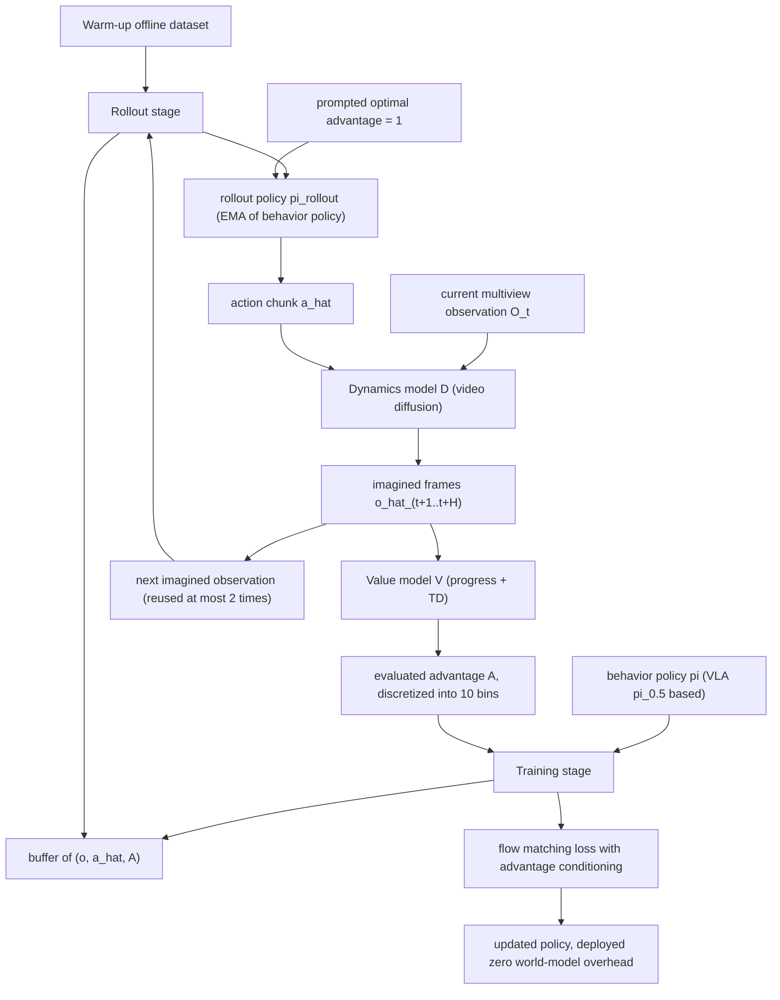

# RISE: Self-Improving Robot Policy with Compositional World Model

- 本地 PDF：`papers/world-model/RISE_2602.11075.pdf`
- arXiv：https://arxiv.org/abs/2602.11075
- 项目主页：https://opendrivelab.com/RISE ，代码：https://github.com/OpenDriveLab/RISE
- 年份：2026 (RSS 2026)
- 团队：CUHK、Kinetix AI、The University of Hong Kong、Shanghai Innovation Institute、Horizon Robotics、Tsinghua University（OpenDriveLab 项目）
- 阶段：imagination-RL 世界模型路线 —— 把 on-policy RL 的学习环境从物理世界整体搬进组合世界模型的想象空间，真机交互量降为零

## 一句话总结

RISE 用一个「组合世界模型」替换真实环境来做 on-policy RL：可控多视角视频扩散模型（由 Genie Envisioner GE-Base 改造）负责"这个动作会产生什么未来画面"，从 $\pi_{0.5}$ 初始化的进度价值模型（progress + TD 学习）负责"这个未来值多少分"，两者在想象空间中合成逐块优势信号，策略通过优势条件化（advantage conditioning）自我改进——整个闭环零真机交互。三个真实灵巧长程任务上相对此前最好方法绝对提升 +35%（Dynamic Brick Sorting：50%→85%）、+45%（Backpack Packing：40%→85%）、+35%（Box Closing：60%→95%）。

## 核心技术

1. **组合世界模型（Compositional World Model）** — 把"世界模型"因子化为两个目标各异的模块：(i) 可控动态模型 $\mathcal{D}$：基于 GE-Base 视频扩散架构，加一个轻量 action encoder 输入动作块，预测多视角未来帧；(ii) 价值模型 $V$：用预训练 VLA $\pi_{0.5}$ 初始化，输出任务进度标量。状态预测与价值评估使用各自最合适的架构与损失，不再共享一个潜空间。
2. **Imagination 中做 on-policy RL** — Rollout 阶段：给 rollout 策略提示"最优优势 = 1"采动作，动态模型想象接下来 $H$ 帧，价值模型给出真实优势并离散化到 10 个 bin，想象出的下一帧还能作为下一次 rollout 的输入（每个离线初始状态最多连续推演两次，规避生成式视频模型的误差累积）；Training 阶段：行为策略以被评估的优势为条件回归该动作块，按 flow matching 目标更新。
3. **Task-Centric Batching** — 动态模型在大规模异构机器人数据（Agibot World + Galaxea）上预训练时，每个 batch 只取少数几个任务、但覆盖同一场景下不同动作的更多样本：优先"同场景的动作多样性"而非"跨场景多样性"，直接提升动作跟随性（EPE 从 1.05 降到 0.54）。
4. **进度 + TD 双目标价值模型** — 先用时间进度回归 $V(o_t,\ell)\approx t/T$ 提供稠密但平滑的信号，再叠加 Temporal-Difference 学习区分成败（失败片段也能给负终值），兼顾数值稳定性与对细微失败的敏感度。
5. **策略 Warm-up 与优势条件化改进** — 离线阶段沿用 RECAP 思路但改两点：优势离散成 10 个均匀 bin（RECAP 是二元 bin）；只有 policy rollout 数据标注学习到的优势，专家示教与人工纠正数据直接配最优优势 1。

## 底层原理与数学推导

### 组合世界模型的形式化定义

多视角观测记为 $o_t=[m_t^1,\dots,m_t^n]$（$n=3$ 个相机视角），历史窗口为 $O_t=\{o_{t-N},\dots,o_t\}$。策略 $\pi$ 给出动作块 $a_t=[a_t,a_{t+1},\dots,a_{t+H-1}]$（本文 $H=50$）。动态模型的条件生成过程写作：

$$
\hat{o}_{t+1},\dots,\hat{o}_{t+H} = \mathcal{D}(O_t, a_t)
$$

价值模型给单个观测打任务进度分：

$$
V(o_t,\ell)\in\mathbb{R}
$$

其中 $\ell$ 为语言指令。注意 RISE 不要求动态模型一路推演到终止状态再拿奖励——这是它与既有"world model 当 RL 环境"工作的最大区别（那些方法要么终端稀疏奖励、要么用启发式距离到目标，长程任务下误差累积不可控）。

### Imagination 优势估计（核心公式）

对候选动作块的奖励定义为每个想象未来帧的价值减去当前真实观测的价值，再沿整块取期望：

$$
\mathcal{A}(o_t,a_t,\ell) = \left(\frac{1}{H}\sum_{k=1}^{H} V(\hat{o}_{t+k},\ell)\right) - V(o_t,\ell)
$$

这就是"块级优势"：它直接回答"这一串动作平均能推进任务多少"，中间步无需设计 shaping reward，且天然避开视频模型的长时程不可靠区间（每次只需可靠地看 $H$ 帧以内）。

### 价值模型的双损失

进度回归项提供单调稠密先验：

$$
\mathcal{L}_{prog} = \mathbb{E}_{(o_t,\ell)\sim\mathcal{D}_{exp}}\left[(V(o_t,\ell) - t/T)^2\right]
$$

TD 项注入成败判别能力（中间步 $r_t=0$，成功终点 $+1$，失败终点 $-1$，折扣因子 $\gamma=0.995$）：

$$
\begin{aligned}
\mathcal{L}_{TD} &= \mathbb{E}_{(o_t,\ell,o_{t+1})\sim\mathcal{D}}\left[(V(o_t,\ell) - y_t)^2\right] \\\\
y_t &= r_t + \gamma V(o_{t+1},\ell)
\end{aligned}
$$

最终 $\mathcal{L}_V = \mathcal{L}_{prog} + \mathcal{L}_{TD}$：前 10k 步只用进度项，之后 40k 步两项联合。附录消融可视化显示纯进度版本只是单调爬升、看不出失误；纯 TD 版本能抓关键步骤但数值不稳定；两者相加同时拿到敏感性和平稳性。

### 优势条件化的策略改进算子

沿用 $\pi^{*}_{0.6}$ 的概率推断框架。先把"确定性提升"事件 $I$ 写进目标分布：

$$
\hat{\pi}(a_t|o_t,\ell) \propto \pi_{ref}(a_t|o_t,\ell)\cdot p(I|\mathcal{A}^{\pi_{ref}}(o_t,a_t,\ell))^{\beta}
$$

由于提升与否完全由优势决定，可用 Bayes 规则把似然写成密度比：

$$
\begin{aligned}
p(I|a_t,o_t,\ell) &\propto \frac{\pi_{ref}(a_t|I,o_t,\ell)\;p(I|o_t,\ell)}{\pi_{ref}(a_t|o_t,\ell)} \\\\
\beta=1 \Rightarrow \hat{\pi}(a_t|o_t,\ell) &= \pi_{ref}(a_t|I,o_t,\ell)
\end{aligned}
$$

无条件的参考先验 $\pi_{ref}$ 被抵消，策略改进退化为"给定'我要变好'这个条件下采样动作"。工程实现即优势条件化训练：策略输入离散化后的优势 bin（式中的正则指数由多项分布上的 RWR 推导支撑），推理时可指定 bin 10 生成高分动作。

```mermaid
graph TD
    OFF["Warm-up offline dataset"] --> ROLL["Rollout stage"]
    ROLL --> POLR["rollout policy pi_rollout (EMA of behavior policy)"]
    ADV1["prompted optimal advantage = 1"] --> POLR
    POLR --> ACT["action chunk a_hat"]
    OBS["current multiview observation O_t"] --> DYN
    ACT --> DYN["Dynamics model D (video diffusion)"]
    DYN --> FUT["imagined frames o_hat_(t+1..t+H)"]
    FUT --> VAL["Value model V (progress + TD)"]
    VAL --> AEV["evaluated advantage A, discretized into 10 bins"]
    FUT --> OBS2["next imagined observation (reused at most 2 times)"]
    OBS2 --> ROLL
    TRAIN["Training stage"] --> BUF["buffer of (o, a_hat, A)"]
    ROLL --> BUF
    BEH["behavior policy pi (VLA pi_0.5 based)"] --> TRAIN
    AEV --> TRAIN
    TRAIN --> LOSS["flow matching loss with advantage conditioning"]
    LOSS --> OUT["updated policy, deployed zero world-model overhead"]
```

## 物理直觉解释

**想象 RL 就是"运动员的意象训练"**。跳水运动员不会每天从十米台跳几百次来学新动作——他们在脑子里一遍遍过动作，想象入水角度差在哪。RISE 把这套流程机械化：动态模型是"脑内放映机"（GE-Base 视频扩散改造，25 帧、192×256×3 视角，一次生成少于 2 秒），价值模型是"评分裁判"（$\pi_{0.5}$ 初始化，见过海量机器人数据所以自带"什么是好的操作"的判断力）。传统真机 RL 卡在三件事——串行慢速执行、硬件风险、人工 reset——全部随"换到想象空间"一起消失，训练结束后这两个模块直接丢弃，部署零额外开销。

**为什么"动态+价值"要拆开而不是训一个端到端世界模型？** 因为两者的数据性质和评价目标根本不同：动态需要的是像素级多视角一致性和动作跟随精度，价值需要的是单帧语义判断和对细微失败的敏感度。合在一个潜空间里（Dreamer 式 latent 世界模型），低容量动态学不出接触丰富操作的丰富视觉动力学；换成高容量生成模型后，价值又没有专用通道。组合设计的实质是让两个模块各自找到最佳架构与损失——一个是扩散 transformer 配 flow matching 训练，一个是 VLA backbone 配回归+TD。

**优势离散化像"复盘时的分段打分"**。策略不是被告知"这局赢了/输了"，而是每一串动作都拿到 0 到 10 的评分，训练目标变成"在知道自己这手打了几分的条件下，复现那一手"。附录优势-bin 实验直观验证了这个机制真的学进去了：同一策略把优势条件设为 bin 10 时完整成功率 85.00%，bin 5 降到 60.00%，bin 1 只有 40.00%（Sorting 精度 95.25%→84.00%）——模型确实理解了"高分动作"和"低分动作"的区别，这正是自我改进可以循环的原因。

## 工程细节与实操指南

- **硬件平台**：双臂 AgileX（每臂 6 DoF + 1 DoF 夹爪，共 14 维动作），绝对关节控制，控制器 30 Hz；顶部相机 + 左右腕部相机三视角，192×256 RGB。Top 视角相机距桌面约 0.75 m。
- **任务与数据**：Dynamic Brick Sorting（传送带上抓彩色积木分类入桶）：3063 条人示教 + 610 条策略 rollout；Backpack Packing（开包、放衣物、提起、拉拉链）：2478 + 507；Box Closing（装杯、折侧板、折后板、塞锁舌）：2286 示教 + 524 rollout + 540 条 DAgger 人工纠正。
- **动态模型训练**：初始化自 GE-Base（LTX-Video 架构系），加轻量 action encoder；上下文帧噪声加强（条件噪声水平 $\sigma=0.2$）以抵抗运动模糊；Logit-Normal 时间步调度（$m=0.2,s=1.0$，SD3 同款）；预训练 120k 步 batch 512（16 张 H100，约 7 天，Galaxea + Agibot World，30 Hz 采样），任务微调 50k 步 batch 64（8 张 H100，约 3 天，15 Hz）；AdamW lr $1\times10^{-4}$，2k 步 warmup；推理 Euler 离散解 flow ODE 共 50 步。输入 4 帧 / 预测 25 帧。
- **价值模型训练**：$\pi_{0.5}$ 初始化，单帧输入、3 视角；50k 步（前 10k 纯进度、后 40k 加 TD），batch 64（8 GPU）约 1 天收敛，lr $2.5\times10^{-5}$，discount 0.995。
- **策略训练**：warm-up 阶段照 RECAP recipe（离线数据含示教/成败 rollout/人工纠正）；self-improving 阶段约 10k 步，全局 batch 64、cosine lr（峰值 $1\times10^{-4}$，最低降至 0.1 倍），chunk $H=50$；rollout 策略用 decay 0.995 的 EMA 权重更新；每批混入离线数据防灾难遗忘。
- **部署细节**：推理频率低但控制 30 Hz，用 Temporal Ensembling 线性加权融合新旧动作块，避免推理间隙运动冻结；$f'\in\mathbb{R}^{14}$ 由时变线性插值产生。
- **评测协议**：每任务 20 次自主试验取平均；Stage-wise Score 满分 10（分拣任务按抓取/正确放置累计封顶 10；背包与关盒按四个里程碑各 2.5/5.0/7.5/10 分档）。
- **效率对比基准**：合成 25 个多视角观测，Cosmos-Predict2.5 需超过 10 分钟，GE 少于 2 秒，约 300 倍加速——这是"视频世界模型能不能进 RL 循环"的分水岭指标。

## 消融实验与分析

主结果（Table I，每格为成功率 %（Stage-wise Score））：

| 方法 | Brick Sorting | Backpack Packing | Box Closing |
|------|--------------|------------------|-------------|
| $\pi_{0.5}$（IL 微调） | 35.00 (8.28) | 30.00 (4.25) | 35.00 (7.50) |
| $\pi_{0.5}$+DAgger | 15.00 (6.10) | 50.00 (7.00) | 40.00 (7.50) |
| $\pi_{0.5}$+PPO | 10.00 (7.68) | 35.00 (5.88) | 10.00 (4.75) |
| $\pi_{0.5}$+DSRL | 10.00 (6.65) | 10.00 (3.50) | 10.00 (7.63) |
| RECAP（复现于 $\pi_{0.5}$） | 50.00 (9.00) | 40.00 (6.13) | 60.00 (8.13) |
| **RISE** | **85.00 (9.78)** | **85.00 (9.50)** | **95.00 (9.88)** |

**核心结论**：三任务的绝对增量 +35%/+45%/+35% 全部来自相对最强基线 RECAP 的提升；在线 RL 直接调真机（PPO、DSRL）反而崩盘——分拣任务从 35% 跌到 10%，说明"物理世界做 on-policy RL"这条路本身不可行，问题不在算法而在环境接口。延长训练也追不上：给 RECAP 和 DSRL 各追加 50k 步，前者饱和在 30%-50%、后者饱和在 5%-10%，而 RISE 仅用 9k 步就从 50% 提到 85%（Fig. 8）。

模块级消融（Table II/III/IV，均在最难的 Dynamic Brick Sorting 上；列为 Pick&Place 成功率 % / Sort 准确率 % / 完整成功率 % / 总分）：

| 变体 | Pick&Place | Sort Acc | Complete | Score |
|------|-----------|----------|----------|-------|
| 离线数据占比 0.1 | 15.00 | 83.33 | 5.00 | 1.35 |
| 离线数据占比 0.6 | 90.00 | 87.50 | 50.00 | 8.32 |
| 无在线动作 | 80.00 | 76.56 | 35.00 | 6.98 |
| 仅在线动作 | 96.25 | 84.42 | 40.00 | 8.73 |
| 在线动作 + 在线状态（完整） | 98.75 | 92.41 | 70.00 | 9.43 |
| 动态模型 w/o 预训练 | 97.50 | 60.26 | 15.00 | 7.43 |
| 动态模型 w/o Task-Centric | 93.75 | 89.33 | 40.00 | 8.78 |
| 价值模型 w/o Progress 损失 | 95.00 | 86.84 | 50.00 | 8.78 |
| 价值模型 w/o TD 学习 | 98.75 | 72.15 | 35.00 | 8.38 |

**核心结论**：在线信号是 self-improving 的真正来源——只加在线动作为 Complete 带来 +5%，再叠加"想象的下一帧接着滚"带来 +30%；动态模型缺视觉预训练会让 Sort 准确率掉 32.15 个百分点（92.41→60.26），去掉 Task-Centric Batching 则 Complete 从 70% 掉到 40%，EPE 同步恶化（0.54→0.68，FVD 反而更低是因为后者偏重外观保真）；价值模型两侧互补：去掉进度项掉 20 个百分点（密集信号缺失），去掉 TD 掉 35 个百分点（微小失败不敏感）。离线数据配比呈倒 U 形：0.1 时崩到 5%（遗忘），0.9 时降到 30%（过度束缚探索），0.6 最优。

## 技术权衡（Trade-off）

| 优势 | 代价与边界 |
|------|------------|
| on-policy RL 完全脱离物理交互，无 reset/安全问题 | 想象质量就是学习上限：稀少或罕见场景下模型仍会生成物理不合理转移（论文 Limitations 第一条） |
| 块级优势绕开"必须模拟到终止态"的视频模型可靠视界限制 | 离线真实数据仍不可省：Table II 显示 offline 比例是硬约束，0.1 直接崩溃 |
| 部署零开销（世界模型只在训练期存在） | 成本从物理搬到算力：动态模型预训练就要 16 张 H100 × 7 天，作者自己称这是一个 open problem |
| 价值模型自带失败敏感度（失败数据也给 $-1$ 终值） | imagine-reality gap 无不确定性度量，坏 rollout 会以正常置信度进入 buffer |
| Task-Centric Batching 显著提高动作跟随 | 该策略牺牲了批内场景多样性，域外任务的迁移收益未验证 |

## 技术价值与演进定位

RISE 把"world model 作为学习环境"这条从 Dyna 就存在的老路，第一次做到了真实世界的接触丰富灵巧操作上，关键在于三个系统级判断：(1) 用视频生成速度（<2 s / 25 帧）而不是画质当第一指标筛选世界模型；(2) 用"块级优势"回避视频模型可靠视界外推；(3) 用 VLA backbone 初始化价值模型，借用其机器人语义先验解决 reward 设计难题。它标志的方向是：机器学习的瓶颈从物理交互成本转移到世界模型保真度与计算成本。局限同样明确——作者列出想象与现实差距、模拟-真实数据平衡、算力开销三条 open problem，其中"多少比例的真实数据才能锚定想象 RL"仍是靠经验调参。

## 与其他论文的关系

- **Dreamer / DayDreamer / TD-MPC2 系列** — 经典 latent 世界模型 RL 用低容量动态在抽象空间里想象，适合仿真与低层控制；RISE 论证这类路线在真实操作的视觉/接触动态面前容量不足，改用高分辨率视频扩散在像素空间想象。
- **$\pi^{*}_{0.6}$ + RECAP** — RISE 的策略改进算子与 warm-up recipe 直接继承 RECAP（优势条件化 offline RL），两处修改是 10 bin 优势离散与"只给 rollout 标优势"；差异在于 RECAP 的优势全部来自离线数据，RISE 补上了世界模型提供的 on-policy 流。
- **PPO / DSRL / HIL-SERL 类真机 RL** — 这些方法被迫重用 off-policy 真实数据或冻结主干只调残差/噪声；RISE 说明瓶颈不是训练算法而是没有安全的交互环境，换到想象空间后连 PPO 这类"调了就崩"的方法对比都有了清晰解释（Table I 中它们全线低于 IL 起点）。
- **Cosmos / Genie Envisioner / UniSim** — 同属视频世界模型，但 Cosmos 一类主打视觉真实性，推理代价高到无法进 RL 循环（>10 分钟/25 帧）；RISE 基于 GE 并证明"快 + 动作可控（Task-Centric Batching，EPE 0.54）"才是 RL 环境的门槛。
- **DiWA / World4RL 等"世界模型精炼扩散策略"工作** — 它们同样在世界模型内做策略优化，但通常显式模拟终止状态获取奖励；RISE 的区别点是不模拟终止、直接产 chunk 级优势，并给出了完整的真实任务系统化验证。

## 精读问题

1. **块级优势的失效边界**：当 $H=50$ 步内价值变化近似为零（例如长程任务的前 20% 还没碰到物体），优势信号是否退化为纯噪声？价值模型的梯度爆炸边界在哪里？
2. **想象误差的选择压力**：世界模型的系统性偏差会不会让策略学到"在想象中占便宜、在现实中翻车"的动作（类似 model-based RL 的 model exploitation）？连续最多推演两次的上限设定能在多大程度上抑制它？
3. **价值模型的泛化不对称**：$\pi_{0.5}$ 初始化带来的先验对训练集覆盖的任务有效，那么价值分数对全新任务类别的校准误差如何估计与修正？
4. **双训练目标的冲突谱系**：进度回归假设价值沿时间单调，这在 retry 行为多的数据上是系统性错误标签——TD 项能否完全纠偏？附录 Fig. 15 的灰色区域说明了什么程度的失稳仍存在？
5. **Task-Centric Batching 的可推广性**：当一个 batch 无法容纳同场景的全部动作变体、或任务间存在物理规律共享（重力、摩擦）时，这种"同场景优先"的采样是否还会是最优排序？
