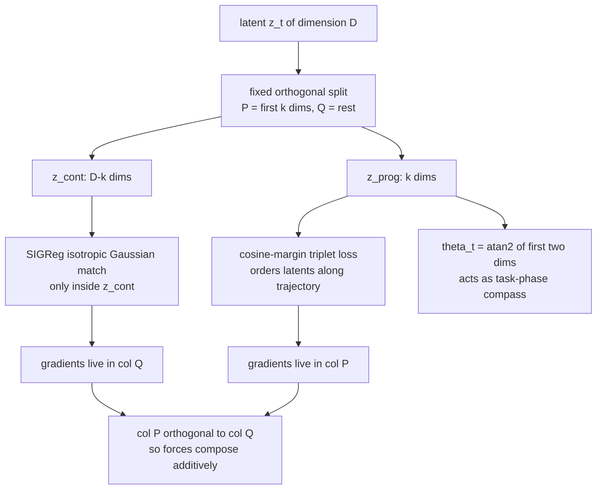

# Subspace-Decomposed JEPAs: Disentangling Progression and Content in Latent World Models

- 本地 PDF：`papers/world-model/SD-JEPA_2605.31111.pdf`
- arXiv：https://arxiv.org/abs/2605.31111
- 年份：2026（preprint v1，2026-05-29）
- 团队：LIX, École Polytechnique + IRT SystemX + Safran Tech（Lucas Thil、Jesse Read、Rim Kaddah、Guillaume Doquet）
- 阶段：JEPA 世界模型的表征结构化转折点——把一个 latent 切成 progression/content 两个正交子空间，证明两股防坍塌力在不相交坐标上相加而非竞争，并涌现出可读的 1-D 进度坐标 $\theta_t$

## 一句话总结

在 LeWM 的 encoder-predictor + SIGReg 框架上插入一次固定的正交分解 $z_t = P z^{\text{prog}}_t + Q z^{\text{cont}}_t$，让 SIGReg 只作用于 content 子空间、cosine-margin triplet 只作用于 $k$ 维 progression 子空间；由梯度支撑集正交（Prop. 1）推出两项防坍塌力不可互相补偿。四环境评测显示 Push-T 从 LeWM 的 96 升到 97.3 (k=8)、Reacher 86→88、Two-Room 87→90、OGB-Cube 74→72；更重要的是训练后自然出现一个可用 $\theta_t = \mathrm{atan2}(z^{\text{prog}}_{t,2}, z^{\text{prog}}_{t,1})$ 读出的"任务相位罗盘"，其角增量 |Δθ| 在 OGBench-Cube 上定位语义接触事件的 AUROC 比 latent 预测误差高 +0.176。

## 核心技术

**子空间分解（式 4）。** 用两个固定正交注入矩阵：
$$
z_t = P\, z^{\text{prog}}_t + Q\, z^{\text{cont}}_t,\quad
z^{\text{prog}}_t\in\mathbb R^k,\ z^{\text{cont}}_t\in\mathbb R^{D-k},\quad
P^\top P=I_k,\ Q^\top Q = I_{D-k},\ P^\top Q=0
$$
实现上取 canonical split $P=[I_k; 0]$、$Q=[0;I_{D-k}]$，也就是直接切前 $k$ 维与后 $D-k$ 维，默认 $k=2$。

**四项训练目标（式 5）。**
$$
\mathcal L_{SD} = \mathcal L_{pred}(z) + \lambda_S\,\mathrm{SIGReg}(z^{cont}) + \lambda_T\,\mathcal L_{trip}(z^{prog}) + \lambda_{str}\,\mathcal L_{straight}(z)
$$
其中：
- $\mathcal L_{pred}(z) = \|\hat z_{t+1}-z_{t+1}\|^2_2$，完整 latent 上照旧；
- $\mathrm{SIGReg}$ 只在 content 子空间内取随机方向并做 Epps-Pulley 正态匹配（继承自 LeWM，方向数不变）；
- $\mathcal L_{trip}$ 是 cosine-margin triplet：anchor 周围时间窗 $\vartheta_t$ 内为 positive，窗外或跨轨迹为 negative——本质上是一个时序排序项；
- $\mathcal L_{straight} = -\mathbb E[\cos(v_t, v_{t+1})]$ 其中 $v_t=z_{t+1}-z_t$ 是可选的显式 straightening 项，但 App. D 的 A4 rung 显示它反而拖累（详见消融小节 D）。

把 triplet 与 straightening 的权重置 0、并把 SIGReg 的作用域恢复到 full $z$，就精确还原回 LeWM baseline，所以这是一份严格的上位扩展而非另起炉灶。

**θ/r 读出与 predictor 条件化（式 6, 7）。** 从 progression 子空间抽出：
$$
\theta_t = \mathrm{atan2}(z^{\text{prog}}_{t,2}, z^{\text{prog}}_{t,1}),\qquad r_t = \|z^{\text{prog}}_t\|_2
$$
以 $(\sin\theta_t, \cos\theta_t, r_t)$ 形式 embed 到 predictor hidden dim 后与 action embedding 相加再做 AdaLN-zero 注入——但 A5 ablation 显示这个 conditioning 反而掉约 2 点，所以 canonical SD-JEPA 实际只用 $k$ 维切分与 triplet，不开 polar conditioning。

**带角度的 planning cost（式 8）。**
$$
\mathcal C(\hat z_H) =
\underbrace{\|\hat z^{\text{cont}}_H - z^{\text{cont}}_g\|^2_2}_{\text{content match}}
+\underbrace{\gamma\,(1-\cos(\hat\theta_H, \theta_g))}_{\text{angular progression match}}
+\underbrace{\delta\,(\hat r_H - r_g)^2}_{\text{radial match}}
$$
规划器仍是 LeWM 的 receding-horizon CEM（300 candidates / top-30 elites / 30 iter on Push-T, 10 iter elsewhere），goal matching 却从单点 MSE 变成 "content 精确 + progression 尺度不变" 的三重描述。

## 底层原理与数学推导

**Proposition 1（不相交梯度支撑集）是整篇的理论支柱。** 设 $z=P z^{prog}+Q z^{cont}$，SIGReg 在 $z^{cont}$ 上生效、任意损失 $\mathcal L$ 只作用于 $z^{prog}$，则：
$$
\mathrm{span}\big(\nabla_z \mathrm{SIGReg}(Q^\top z)\big)\subseteq \mathrm{col}(Q),\qquad
\mathrm{span}\big(\nabla_z \mathcal L(P^\top z)\big)\subseteq \mathrm{col}(P)
$$
且这两个子空间正交。证明仅依赖链式法则——把投影写成矩阵乘法后梯度必然携带 $Q$ 或 $P$ 因子：
$$
\nabla_z\,\mathrm{SIGReg}\big(Q^\top z\big) = Q\,\nabla_{z^{cont}}\mathrm{SIGReg}\big(z^{cont}\big)\in \mathrm{col}(Q),
\qquad
\nabla_z\,\mathcal L\big(P^\top z\big) = P\,\nabla_{z^{prog}}\mathcal L\big(z^{prog}\big)\in \mathrm{col}(P)
$$
而约束 $P^\top Q=0$ 直接给出 $\mathrm{col}(P)\perp \mathrm{col}(Q)$，所以两路梯度在内积意义下互不影响步长方向。

**Proposition 2（无重复计数）。** 在上述支撑集分离下，移除任一项不能通过加强另一项来补偿——因为另一项在被影响的坐标上没有梯度。这解释了为什么简单地把 triplet 加到全 latent（A2_split_full）会从 96 掉到 92：它抢占了 SIGReg 的坐标资源，把本应由 SIGReg 保住的各向同性结构挤掉了。

**理论的前置事实——SSL duality。** 文章借用 Garrido et al. 2023 的 SSL duality 结论：样本对比准则与维对比准则等价于 K 矩阵的行/列范数之差：
$$
\mathcal L_{nc} + \sum_{j=1}^M \|K_{j,\cdot}\|_2^4 = \mathcal L_c + \sum_{i=1}^N\|K_{\cdot,i}\|_2^4,
\qquad \text{在双归一化下} \quad \mathcal L_{nc}=\mathcal L_c+N-M
$$
也就是说 SIGReg 与 cosine-triplet 本质上属于同一个 variance-repulsion 家族——这正是"如果作用在同一坐标上就会互相竞争"这一担忧的形式来源，也是为什么必须把它们拆开到不同子空间。

**Epps-Pulley 统计量的继承形式（LeWM Eq. 2 的 restricted 版本）。** 在 content 子空间内取随机单位方向 $u^{(m)}\in S^{D-k}$：
$$
\mathrm{SIGReg}(z^{cont}) = \frac{1}{M}\sum_{m=1}^{M} T\big(z^{cont} u^{(m)}\big),
\qquad T(h)=\int w(t)\,\big|\varphi_N(t;h)-\varphi_0(t)\big|^2\,dt
$$
注意方向是在 $\mathbb R^{D-k}$ 中采样而非全空间，这保证该正则的梯度严格留在 $\mathrm{col}(Q)$ 里，是 Prop. 1 可用的实施前提。

**cosine-margin triplet 的时间窗结构。** 对 anchor $z^{prog}_t$，positive 从同一轨迹时间窗 $\vartheta_t$ 内取、negative 取窗外或跨轨迹，记相似度为余弦则有序化目标可写成：
$$
\mathcal L_{trip}(t) = \max\!\Big(0,\; m - \cos\big(z^{prog}_t, z^{prog}_{t+}\big) + \cos\big(z^{prog}_t, z^{prog}_{t-}\big)\Big)
$$
其中 $m$ 为 margin。这个形式解释了为什么它会把同一轨迹的进度弧线拉成 S1 流形——角度几何下"近邻拉近 / 远邻推远"的最省力解就是圆环排布。

**CEM 求解器的继承细节。** planner 不变，但 cost 结构被拆成三部分。full-z 规划 vs decomposition 规划的差异是 ±4 pp 量级（App. D），最大增益出现在 Reacher k=8 时 +3.3 pp。

## 物理直觉解释

**把 latent 想成一条"公路上的里程表 + 路边风景册"。** LeWM 那样的单一 latent 向量像是一本把两者印在同一页纸上的旅行日记——里程数与风景写在一起，没法单独标注"走了多远"。SD-JEPA 强制翻开两页：第一页只记进度（几维数字），第二页记其余内容。triplet 损失在第一页上做的事类似要求同一旅行的不同章节按顺序排列、不同旅行的章节互相隔开；SIGReg 继续在第二页维护各向同性高斯的结构。因为两页物理上是不同的纸张维度，加强任何一面的力度都不会污染另一面，这就是 Prop. 2 讲的实际含义。

**为什么 $\theta_t$ 会像 head-direction cell 一样出现？** 因为 triplet 把同一轨迹上邻近状态的 embedding 余弦拉近、不同轨迹的状态推远，再配合极径无关的角度几何，最省力的解就是把同类轨迹都绕到一个圆环或圆弧上——这正是 S1 流形。一旦落在 S1 上，atan2 就成了一个天然的罗盘刻度。作者用 Push-T teleport-and-continue 扰动做了漂亮验证：扰动瞬间 $|\Delta\theta_t|$ 出现约 1.5 rad 的尖峰（约为基线漂移的 75 倍）标出"何时"；随后 θ 并不回到原路径而是从 sector -2.5 relocalize 到 sector -4.0（T-block 在另一侧的新求解模式），标出"是什么"。标准标量 prediction-error 只能告诉你第一件事，对第二件事完全沉默。

**为什么扰动后 relocalize 而不是回弹是个关键观察。** 普通的 MSE surprise 像"你突然喊了一声"，它能报警但不能说明警报指的是什么；而 θ 的偏移像是"指南针指向了一个新的北方"。语义上这意味着模型内部已经形成某种状态机的离散相位划分，每个 phase 对应 progress manifold 的一段弧线。这也是为什么 $\theta$ 能与实际任务的 contact transition 对齐得比 prediction error 更好——后者只在动力学不连续处尖峰，而前者在语义相位转移处平移。

**content 子空间的 episode-specific 性质也值得一提。** t-SNE 显示 $z^{cont}$ 按轨迹分成互不相交的簇、而 $z^{prog}$ 跨轨迹有 arc 相互重叠——这正是 Prop. 1 推论的可视化（不同 episode 的共享 progression 结构汇于 progress 子空间，episode 特异内容留在 content 子空间）。二阶矩数值证据来自 Table 8：跨 episode 固定时刻的余弦相似度 $cos(z^{prog}[t])\approx0.5$ 而 $cos(z^{cont}[t])\approx 0$。

## 工程细节与实操指南

- **架构零新增权重**：$P,Q$ 都是固定正交矩阵非 learnable，参数量保持 LeWM 的 18.04M。
- **训练预算**：10 epochs, batch size 128 与 LeWM 完全一致；encoder ViT-tiny + 6 层 transformer predictor；多 seed 用 {0, 42, 3072}。
- **默认 loss 权重**：$\lambda_S = 0.10$（SIGReg），$\lambda_T=0.10$（triplet），$\lambda_{str}=\gamma_\theta=\delta_r=0$。canonical 配置是 A2 —— subspace split + kprog=2 + SIGReg on z_cont + cosine triplet on z_prog，其他辅助项全部关闭。
- **triplet 正负样本定义**：anchor 取当前时刻 $t$，positive 从同 trajectory 时间窗 $\vartheta_t$ 内采样，negative 则来自窗外或另一条 trajectory。
- **规划的 cost 用 decomposition 版本（式 8）而非 LeWM 原 MSE**：γ 与 δ 默认取 0 时就是纯 content MSE（与 LeWM 等价），开启 γ 后才使用角度项，实验提示这是可选增强而非必需。
- **诊断方法——三种互补 operationalisation**：(a) per-step AUROC 对 ground-truth 事件标签；(b) change-point detection 找 regime boundary；(c) linear probe R² 看单位维度承载的 progress 信息密度。这三个指标刻画的是同一个直觉的不同侧面，建议同时报告以避免选择性偏差。
- **关键 negative control**：若把 planning cost 改成仅在 $z^{prog}$ 上匹配目标（丢掉 content 部分），Push-T 成功率崩到 28% —— 清楚说明 progression 子空间太低维无法独立承担 goal 表达，同时也强调各司其职才是正确用法。
- **评估协议详尽可复现**：50-step horizon，25-step goal offset，CEM with 300 candidate / 30 iterations on Push-T / 10 on others, planning horizon 5 at frame-skip 5。

## 消融实验与分析

### A. 主结果 Table 1（success rate %，matched 10-epoch compute）

| Method | Two-Room | Reacher | Push-T | OGB-Cube | best k |
|---|---|---|---|---|---|
| LEWM（Maes et al., 2026 报告值） | 87 | 86 | 96 | 74 | – |
| SD-JEPA, kprog=2 | 90 (n=3) | 84 (n=3) | 94 (n=3) | 72 (n=3) | – |
| SD-JEPA, best k | 90 | 88 | 97.3 | 72 | 2 / 4 / 8 / 2 |
| Δ vs LEWM | +3 | +2 | +1.3 | −2 | – |

**核心结论**：4 个环境中 3 个有提升、OGBench-Cube 略退步；最优 k 随环境变化（Push-T 要 k=8，Cube 只要 k=2），说"越高越好"不成立，应把 k 当作任务的内在 progression 维度的估计值。

### B. 子空间 split 是否真的 load-bearing（Table 2 falsifier，Push-T 单 seed 3072）

| Variant | kprog | Triplet target | SIGReg domain | Push-T (%) |
|---|---|---|---|---|
| A0 (baseline) | 0 | – | full z | 96 |
| A2_full（split removed） | 0 | full z | full z | 96 |
| A2 (canonical) | 2 | z_prog | z_cont | 98 |
| A2_split_full（mis-targeted） | 2 | full z | z_cont | 92 |

**核心结论**：把 split 移除后恢复 baseline 水平（A2_full = A0 = 96）；更关键的是即使保留 split 但误把 triplet 放到全 latent 也会主动伤害（92 < 96），证明贡献来源于子空间拆分本身而不是 triplet 这个额外项，也从经验层面印证了 Prop. 2 关于 anti-collapse 力不应重叠坐标的预测。

### C. k 的跨环境扫描（Table 3，3-seed mean per cell）

| Env | kprog=2 | kprog=4 | kprog=8 | Best k |
|---|---|---|---|---|
| Push-T | 94.0 | 96.0 | 97.3 | k=8 |
| Two-Room | 90.0 | 88.0 | 90.0 | k={2,8} |
| Reacher | 84.0 | 88.0 | 83.3 | k=4 |
| OGB-Cube | 72.0 | 69.3 | 69.3 | k=2 |

**核心结论**：Push-T 呈单调上升趋势、Reacher 偏好中等 k、OGB-Cube 反而偏好小 k、Two-Room 两端持平中间凹陷——"right k matches intrinsic progression dimensionality" 而非无脑增大。同时报告了 negative control（zprog-only MSE planning 崩塌至 28%）。

### D. 辅助项叠加反而有害（App. D A4/A5/A6 系列）

| rung | 添加内容 | 效果 |
|---|---|---|
| A2 | canonical split only | baseline（论文报告的最优配置） |
| A4 | + temporal straightening on full z | Push-T 掉约 14 点 |
| A5 | A4 + polar(sin θ, cos θ, r) conditioning | 再掉约 2 点 |
| A6 | A5 + angular planning cost（评测期启用） | 不带来超过 A2 的收益 |

**核心结论**：SIGReg 已隐式允许 straightening 涌现（见 LeWM Fig.17），显式再加一项会与之在 z_cont 上发生 overlap 引发 double counting；canonical A2 即最佳配置，添加越多越差。这与 Wang et al. 2026 以 straightening 为核心贡献的工作形成鲜明对照——他们的 stop-gradient 防坍塌不与 straightening 冲突。

### E. θ 作为事件定位器优于标量预测误差（Table 4，40 held-out cube episodes，160 events / 1480 steps）

| tolerance | z-MSE AUROC | \|Δθ\| AUROC | margin | \|Δθ\| wins |
|---|---|---|---|---|
| ±1 step | 0.238 | 0.414 | +0.176 | 39/40 (97.5%) |
| ±2 steps | 0.360 | 0.473 | +0.113 | 34/40 (85%) |
| ±3 steps | 0.513 | 0.565 | +0.052 | 29/40 (72.5%) |

**核心结论**：ground truth 为 gripper-contact transition，|Δθ| 在所有 tolerance 下都胜出且在最严 tolerance 下几乎完美。文章诚实指出互补性——当问题是"哪里幅值异常"（action-corruption test）时 z-MSE 更好，二者测的是不同属性而非优劣关系。

### F. zprog 单位维度信息密度（Table 5，per-episode linear probe，40 eps/env，LOO-CV）

| feature (mean R² over 40 eps) | Cube | Push-T | Reacher | Two-Room |
|---|---|---|---|---|
| step_idx (clock) | 0.291 | 0.617 | 0.286 | 0.690 |
| (sin θ, cos θ)（2 维） | 0.555 | 0.422 | 0.335 | 0.040 |
| random-2d projection（control） | 0.263 | 0.295 | 0.236 | −0.271 |
| z_prog（8 维，占 latent 4.2%） | 0.905 | 0.908 | 0.948 | 0.717 |

**核心结论**：4.2% 维度即还原 72–95% 的 task-progress 方差， cube/Push-T/Reacher 全部 100% episode 为正相关， largest probe-vs-clock gap 出现在 Reacher (+0.66)——而这正是唯一观察到 robust planning lift 的 env。同时 pooled probe 里只有 step_idx 保持可靠正向，是一个 honest caveat：compass 是 per-trajectory phase 坐标不是跨 episode 校准的距离计。

## 技术权衡（Trade-off）

- **固定 P/Q 分解的简洁 vs 学习到的分解的表达力**：论文坦诚固定 canonical split 是一种 modeling choice，learned orthogonal decomposition 是自然的下一步；代价是要引入额外的 rotating orthogonalization 步骤或转置约束。
- **k 调参的 reintroduction**：LeWM 只剩 λ 一个有效超参的优势被部分削弱——虽然 sweep 显示 framework 对 k ∈ {2,4,8} 都 robust，但要达到每个环境的 best-k 还是需要按环境调。作者把它当成"任务内在 progression 维度"来解读是一种解释性补偿。
- **OGBench-Cube 上略退步（−2）**：3D manipulation 的视觉复杂度高，强制切出的 k 维进度通道占用的容量看起来是负收益，说明当内在结构难以用时序排序捕捉时这种分法并不必然有利。
- **θ 作为 compass 的使用限制**：pooled probe 显示跨 episode 只有 step_idx 一致有效——θ 不能作为全局校准的 distance-to-go 读数，只能用于 within-trajectory phase tracking 或异常检测，这限制了它在 hierarchical planning 中替代 goal-conditioning 的潜力。
- **on real robot not yet tested**：延续 LeWM 的仿真-only 设置；作者建议扩展到 WorldGym，也未探讨真实机器人数据里的 camera jitter / occlusion 影响。

## 技术价值与演进定位

这条 JEPA 主线的近期节奏可以概括为"先求稳，再求准"。I-JEPA/V-JEPA (2301/2404) 解决了"latent prediction 学得到运动特征"的问题；V-JEPA 2 (2506.09985) 把规模打上去并用少量机器人数据让 encoder 支撑 MPC，但其世界模型仍然把任务进度淹没在一个巨大的统一表征里。LeWorldModel (2603.19312) 给出了最稳定的端到端配方却也暴露出"Gaussian prior 打压低内在维度结构"的缺陷。SD-JEPA (2605.31111) 第一次正面回应这个问题：既然单一的各向同性高斯不能同时满足多个目标，就把空间切开、给不同性质的信息各自分配子空间和对应的 anti-collapse 力。它带来的意外收获——$\theta_t$ 自发出现为 scene-aware compass——把 latent world model 从"用来 plan 的黑箱"推进到了"可以读出的状态机"，也为后续可解释性研究开了切口。NoGaussianRequired (2608.17542) 沿着同一批判轴走得更远——干脆不要 Gaussian 先验本身，改从 transition 数据里提取 contrastive anti-collapse 信号。可见本文处在该主线的中间站：不再迷信统一 prior，还没放弃 distributional regularizer。

## 与其他论文的关系

- **LeWM / LeWorldModel (2603.19312)** — 直接基座。继承 encoder-predictor stack、SIGReg 机制与 CEM 规划器，改动有三点：加固定正交 split、SIGReg 域从 full-z 缩窄到 z_cont、增加 cosine-margin triplet 作用于 z_prog；总参数量不变（18.04M），LeWM 报告中的 Two-Room 弱势在这里借 by-product 获得 +3 提升。
- **V-JEPA 2 (2506.09985)** — 相反路线的大 scale 极端样本。那里世界观靠 22M clips / 1B 参数喂出来，防坍塌依然用 EMA-target + stop-grad，本篇走的是超小模型（18M）但在表征空间内显式设计结构的相反做法；两者共同揭示：structural bias 与 data scale 是两条可互换的 axis，只是在 sim-to-real 泛化上限上前者的 ceiling 仍不明朗。
- **Wang et al. 2026（curvature-loss 世界模型）** — 同样关注 temporal straightening 但作为主要贡献项；在 matched protocol 下其 best published configuration 达 91.3±2.5 on Push-T，而 SD-JEPA at kprog=8 到 97.3±1.2，领先 6 点。更重要的是他们用 stop-gradient 防坍塌所以 straightening 与之共存没问题，而在 SIGReg 组合下同样的 term 加进来会掉 14 点（A4）。
- **Dwibedi et al. 2019 (temporal context) / Schneider et al. 2023 (time-contrastive networks)** — cosine-margin triplet loss 直接属于这一族 temporal-ordering loss 的延伸，将其作用域从整体 latent 缩到人为指定的 k 维子空间是本文的新颖处。
- **Garrido et al. 2023 (SSL duality)** — 提供理论支点的上游工作。证明了 contrastive and covariance-based SSL criteria 之间的等价变换，使 SIGReg 和 cosine-triplet 可以看作同一 family 的两个 member，从而合理化了"放在同一坐标会冲突、放到不同坐标就 additive"的核心设计。
- **DINO-WM (Zhou et al.)** — 作为 frozen-pretrained-encoder alternative 出现在 baselines 里。在 OGBench-Cube 上 SD-JEPA (72) 仍低于 DINO-WM (86)，再次说明大预训练先验对高视觉复杂度场景仍有必要，subspace-decomposition 不是万能药。
- **DreamerV3 / PLDM** — 分别代表 reward-driven 和 VICReg-based 两条路线，它们都没有明确的 progress/content 解耦机制；SD-JEPA 提供的第 3 种框架可能补足 reward-free 场景下的结构表达能力 gap，但目前两者都有更成熟的 RL/planning pipeline 可供部署。

## 精读问题

1. Prop. 1 成立要求 triplet 仅依赖 $z^{prog}$ 且 SIGReg 仅依赖 $z^{cont}$，但 encoder 的参数梯度是两路之和穿过 chain rule；什么情况下 encoder-level gradient conflict 会让这种"形式上加法"失效？
2. 最优 $k_{prog}$ 与任务"内在 progression 维度"是否真的一一对应？能否构造一个内在维度已知的人造环境验证（例如 $S^1\times S^1\times S^2$ 型 product manifold 任务）？
3. θ_t 从 sector −2.5 relocalize 到 −4.0 这一现象意味着模型内部已有离散 phase 表征；训练数据中并没有 phase 标签，phase 划分的数值来自哪里？会不会只是 contact state 被 triplet 以距离大小间接编码后的副产品？
4. Table 4 显示 z-MSE 在 action-corruption test 上反而更好，作者把这归因于"two metrics measure different things"；能否提出一个 hybrid 信号（如 magnitude-scaled angular surprise $\|\Delta z\|\cdot|\Delta\theta|$）能同时在两类测试上占优？
5. canonical split 把前 $k$ 个维度分配给 progression 说明了什么？ViT 的 [CLS] token 之后 MLP projector 是否有 dimension ordering bias（比如前面维度倾向低频信息），换用随机旋转的 P 会改变结果吗？
6. 在 OGBench-Cube 上 SD-JEPA 反而变慢（−2 pp）；能否通过 conditional k 或者基于 online estimate 的 adaptive dimension allocation 来既保住 Cube 又不损害其他任务？
