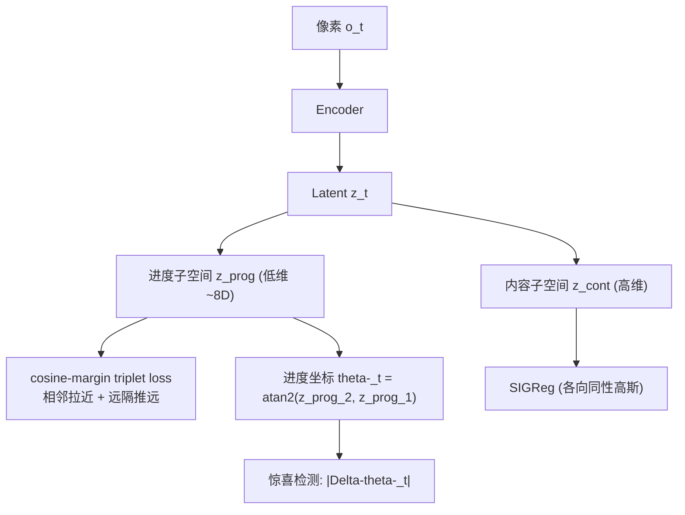

# Subspace-Decomposed JEPAs: Disentangling Progression and Content in Latent World Models

- 本地 PDF：`papers/world-model/SD-JEPA_2605.31111.pdf`
- arXiv：https://arxiv.org/abs/2605.31111
- 代码：https://github.com/LucasStill/SD-JEPA
- 年份：2026（5 月）
- 团队：Lucas Thil, Jesse Read, Rim Kaddah, Guillaume Florent Doquet
- 阶段：JEPA 潜空间解耦 — 进度子空间 + 内容子空间正交分解

## 一句话总结

SD-JEPA 扩展 LeWorldModel，把 JEPA 的 latent 切分为两个正交子空间：(1) **进度子空间** (z_prog)——低维，用 cosine-margin triplet loss 强制时序平滑排序（"离任务完成有多远"）；(2) **内容子空间** (z_cont)——高维，用 SIGReg 正则化防坍塌。理论证明两个防坍塌力作用于不相交的坐标，**可加性组合而非竞争**。规划性能在多数控制 benchmark 上超越 LeWM 基线（Push-T +1.3pp, Reacher +2pp），且 1-D 角度进度坐标 $\theta_t$ 能解释 72-95% 的任务进度方差，惊喜检测（$|\Delta\theta_t|$）在语义事件定位上超越标准 latent 预测误差。

## 核心技术

1. **双正交子空间** — latent 切成 z_prog（低维，~8 维，仅 4.2% 的 latent）+ z_cont（高维），各自有独立的防坍塌机制
2. **进度子空间：cosine-margin triplet loss** — 时间相邻 embedding 拉近，远隔帧推远 → 强制平滑时序排序
3. **内容子空间：SIGReg** — 继承 LeWM 的各向同性高斯正则化
4. **可加性理论** — 证明 triplet loss 和 SIGReg 作用在不相交坐标上，组合无冲突
5. **惊喜检测升级** — 进度坐标的角度变化 $|\Delta\theta_t|$ 比 latent 预测误差 (z-MSE) 更准确定位语义事件

## 底层原理与数学推导

**进度坐标**：$\theta_t = \text{atan2}(z_{prog,2}, z_{prog,1})$ —— 1-D 角度量，随任务进度推进、回退时回归、受扰动后重新定位到语义合适的任务阶段。

**可加性证明**（核心理论贡献）：SIGReg 的正则化项作用于内容子空间的坐标，triplet loss 作用于进度子空间的坐标——两者在 latent 空间中是正交方向，梯度不冲突，可以加性组合。

**结果**：8 维进度子空间（4.2% latent）解释 72-95% 任务进度方差（4 环境 × 40 episodes 线性探测）；$|\Delta\theta_t|$ 在 40 个 held-out cube episodes 上语义事件定位 AUROC 提升 +0.18（±1-step 容忍度下 97.5% per-episode 胜率）。

## 物理直觉解释

**为什么需要"进度坐标"？** 标准 JEPA 的 latent 是"什么都在里面"——位置、形状、颜色、进度混在一起。SD-JEPA 的洞察：**给任务进度一个专门的坐标轴**。就像"考试还剩多少时间"是一个独立的感知——你不是通过"看卷子的所有细节"来推断剩余时间，而是直接看钟。进度子空间就是这个"钟"——一个 1-D 角度坐标，随任务推进匀速转动。

**为什么可加？** 两个防坍塌机制各管各的坐标方向——SIGReg 管内容子空间（防止内容挤成一团），triplet loss 管进度子空间（防止进度轴塌缩）——就像"厨房有厨房的保洁，卧室有卧室的保洁"，互不干扰。

**惊喜检测的升级**：标准做法是用 latent 预测误差（"这次预测不准"）当惊喜信号——但这分不清"预测不准是因为物体换了位置"还是"是因为任务阶段变了"。进度坐标的突变 $|\Delta\theta_t|$ 直接告诉你"任务阶段发生了跳变"——把"惊讶的时刻"和"惊讶的含义"分开了。

## 工程细节与实操指南

- **架构**：LeWM 基础（~15M 参数，单 GPU 可训）
- **进度子空间**：8 维（可调 k），cosine-margin triplet loss
- **内容子空间**：剩余维度，SIGReg
- **规划**：潜空间 MPC（CEM），继承 LeWM
- **评估**：Push-T / Reacher 等控制 benchmark + 40 episodes 语义事件定位
- **注意**：multi-seed 平均可能掩盖单次运行的不稳定性；Push-T 增益对子空间维度 k 和 seed 敏感

## 消融实验与分析

| 消融/对比 | 结论 |
|---------|------|
| SD-JEPA vs LeWM | 多数 benchmark 提升（Push-T +1.3pp, Reacher +2pp） |
| vs 最强非-LeWM JEPA baseline | Push-T 超越 |
| 子空间消融 falsifier | 证明"子空间分离"是增益的关键成分（不是简单加 triplet loss） |
| 进度坐标 vs latent 预测误差 | $|\Delta\theta_t|$ 语义事件定位 +0.18 AUROC |
| 线性探测 | 8 维进度子空间解释 72-95% 任务进度方差 |

## 技术权衡（Trade-off）

| 优势 | 劣势与工程代价 |
|------|----------------|
| 可解释的进度坐标（1-D 角度） | 进度子空间维度 k 是敏感超参 |
| 惊喜检测区分"时刻"和"含义" | 跨 seed 方差可能掩盖单次不稳定 |
| 可加性理论保证两机制无冲突 | 迁移到任务套件之外的环境待验证 |
| 继承 LeWM 的极简训练 | 进度子空间只适合"有明确进度的任务"——开放探索任务不适用 |

## 技术价值与演进定位

SD-JEPA 代表了 JEPA 路线的"结构注入"方向：LeWM 证明了端到端稳定训练（防坍塌），SD-JEPA 进一步证明 **latent 内部可以雕刻出语义轴**——进度、内容分离。这直接呼应了 PALM 的 progress value 思路（在 VLA 里显式预测进度）——SD-JEPA 在 JEPA 世界模型里做到了同样的事，而且是自发涌现的坐标轴而非人工标注。

## 与其他论文的关系

- **LeWorldModel** — 直接前身，SD-JEPA 在其 latent 中切分进度/内容子空间
- **No Gaussian Required** — 同为 LeWM 后续，解决防坍塌的另一种方案（对比逆动力学）
- **I-JEPA / V-JEPA** — JEPA 家族基础
- **PALM (CVPR 2026)** — VLA 中显式 progress value，SD-JEPA 在世界模型中做同样的事
- **StateLinFormer** — 状态化训练中的"环境进度"信息，与进度子空间呼应

## 精读问题

1. 进度坐标对"非单调任务"（来回反复的任务）的适应性？theta-_t 会来回转吗？
2. triplet loss 的 margin 和采样策略——时间间隔多大算"远"？
3. 进度子空间和内容子空间的维度分配比（8:rest）在不同任务上的最优值？
4. 能否把进度坐标直接作为 RL 的 reward 信号（自动进度奖励）？
5. 与显式 progress 标注（PALM 风格）相比，自发涌现的进度坐标精度如何？
