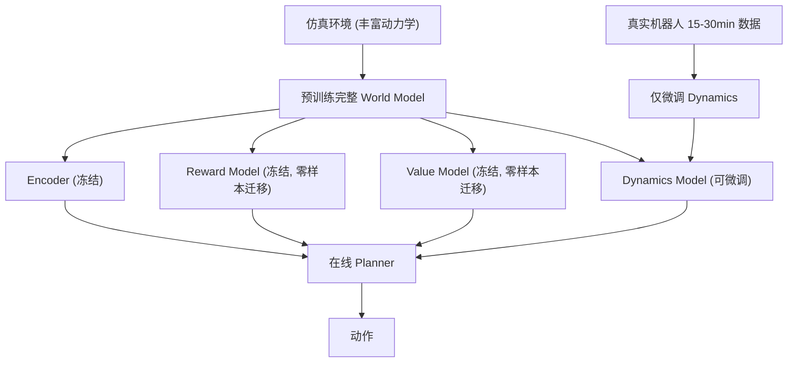

# SimDist: Simulation Distillation — Pretraining World Models in Simulation for Rapid Real-World Adaptation

- 本地 PDF：`papers/vla-architecture/SimDist_2603.15759.pdf`
- arXiv：https://arxiv.org/abs/2603.15759
- 代码：https://github.com/CLeARoboticsLab/simdist
- 年份：2026 (RSS 2026)
- 团队：UT Austin, UW Seattle, FieldAI
- 阶段：仿真蒸馏世界模型 —— 在仿真中预训练，15-30 分钟真实数据快速适应

## 一句话总结

SimDist 提出仿真蒸馏框架：在仿真中预训练世界模型（编码器+奖励+价值），将结构化先验蒸馏到 latent world model。真实部署时仅用 15-30 分钟数据微调 latent dynamics，零样本迁移 reward/value 模型。插销任务 25%→85%（60 次试验），四足滑坡 0%→93%（36 分钟）。RSS 2026。

## 核心技术

1. **仿真蒸馏** — 在仿真中预训练完整的 world model pipeline（encoder + dynamics + reward + value），蒸馏结构化先验
2. **仅微调 dynamics** — 真实世界适应只做短视程监督学习（system identification），reward 和 value 模型零样本迁移
3. **在线规划** — 用微调后的 world model 做 counterfactual reasoning，通过 planner 在线规划动作
4. **避免长视程信用分配** — 将真实世界 RL 问题降为短视程动力学监督学习

## 底层原理与数学推导

核心洞察：真实世界适应的瓶颈是动力学建模（仿真和物理的 gap），不是奖励设计或价值估计。只需在真实数据上做短视程系统辨识，无需端到端 RL。

## 物理直觉解释

SimDist 的逻辑：**仿真器里的物理不够真，但它提供的"什么是好状态"和"什么是好动作"的判断是通用的**。就像你学了汽车仿真器驾驶，虽然仿真器的物理不完全准确，但你知道"不撞车=好"这个判断在真实世界也成立。你在真车上只需要适应刹车的力度和方向盘的灵敏度（动力学），不需要重新学交通规则（奖励函数）。

## 消融实验与分析

| 消融因子 | 结论 |
|---------|------|
| 仅微调 dynamics vs 全模型 RL | SimDist 样本效率高数十倍，更稳定 |
| 零样本迁移 reward/value vs 从零训 | 预训练的 reward/value 是关键增益 |
| 仿真多样性 vs 单一仿真 | 多样化仿真预训练提升泛化 |
| vs IQL/RLPD/SGFT/Diffusion Policy | 在所有比较中数据效率和最终性能均领先 |

## 工程细节与实操指南

- **仿真预训练**：多样化仿真环境（不同摩擦力、质量、几何），训练 encoder + dynamics + reward + value
- **真实适应**：仅 15-30 分钟真实数据，监督学习微调 dynamics model
- **在线规划**：MPPI (Model Predictive Path Integral) 在世界模型中做 counterfactual reasoning
- **任务**：peg insertion (25%→85%, 60 trials) + quadruped slippery slope (0%→93%, 36 min)
- **Baseline**：IQL, RLPD, SGFT, Diffusion Policy

## 精读问题

1. 仿真和真实之间的 dynamics gap 在哪些维度最大（摩擦、刚度、延迟）？微调能否覆盖所有维度？
2. Reward model 如果和真实任务目标不一致怎么办？零样本迁移的 reward 是否被过度信任？
3. 15-30 分钟数据量是否对所有任务类型都足够？

## 技术权衡（Trade-off）

| 优势 | 劣势与工程代价 |
|------|----------------|
| 15-30min 数据即可适应，样本效率极高 | 需要一个较好的仿真器用于预训练 |
| 世界模型中的 planner 保证在线安全 | 离线预训练的 reward model 可能在真实世界有偏差 |
| 避免端到端 RL 的不稳定性 | 仅微调 dynamics 可能不足以处理仿真中未覆盖的物理现象 |

## 技术价值与演进定位

SimDist 代表了 "world model + sim-to-real" 路线的最佳实践——证明了仿真预训练的价值可以被结构化地蒸馏到世界模型中。与 RISE（想象中 RL）和 DayDreamer（真实世界在线学习）形成三条互补路线：SimDist 从仿真出发，RISE 从想象出发，DayDreamer 从真实出发。

## 与其他论文的关系

- **DayDreamer** — 纯在线真实世界学习，SimDist 用仿真预训练加速
- **RISE (RSS 2026)** — 想象中自我改进，SimDist 用仿真知识增强 imagination quality
- **Dreamer v3** — 世界模型 RL 基线，SimDist 将 sim-to-real 融入 world model pipeline
- **RLPD / IQL** — offline-to-online RL baseline，SimDist 在新的数据效率维度上超越
