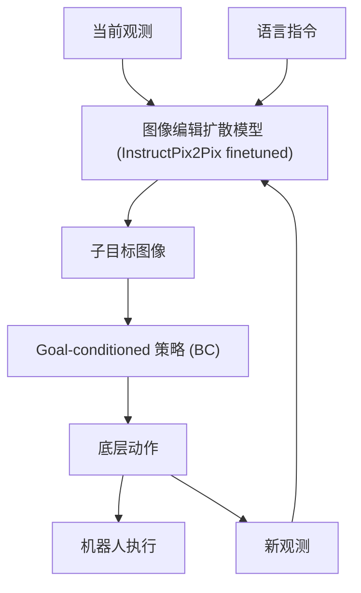

# SuSIE: Zero-Shot Robotic Manipulation with Pretrained Image-Editing Diffusion Models

- 本地 PDF：`papers/world-model/SuSIE_2310.10639.pdf`
- arXiv：https://arxiv.org/abs/2310.10639
- 年份：2023 (ICLR 2024)
- 团队：UC Berkeley, Stanford, Google DeepMind (Kevin Black, Chelsea Finn, Sergey Levine 等)
- 阶段：图像编辑扩散模型作为高层世界模型规划器

## 一句话总结

SuSIE 将预训练 InstructPix2Pix 图像编辑扩散模型微调为高层"世界模型"规划器，生成未来子目标图像，再由低层目标条件策略执行，在 CALVIN 上 SOTA，零样本泛化超越 55B 参数的 RT-2-X。

## 核心技术

1. **图像编辑扩散作为世界模型** — 用 InstructPix2Pix 将当前观测 + 语言指令 → 子目标图像（展示任务完成后的状态），无需从零训练视频生成器
2. **两阶段架构** — (i) 图像编辑模型在人类视频 + 机器人数据上 fine-tune 生成子目标; (ii) 低层 goal-conditioned 策略行为克隆执行
3. **零样本泛化** — 子目标生成利用了预训练扩散模型的组合泛化能力，即使未见过的物体/场景也能生成合理的子目标

## 底层原理与数学推导

## 实验

- **CALVIN benchmark SOTA**，超越所有先前方法
- **零样本泛化**: 真实机器人操作未见过的物体、干扰物、场景
- 显式比较：超越 55B 参数的 RT-2-X（训在更多数据上）
- 子目标生成质量直接对标视频规划方法

## 物理直觉解释

SuSIE 的直觉：**用修图软件"画"出任务完成后的样子，然后让机器人照着做**。不需要理解物理方程、不需要 3D 建模——只要你会"把这盘水果变成沙拉"的图像编辑，机器人就有一个视觉目标可以追逐。这利用了预训练扩散模型在海量互联网图像上学到的视觉常识：它知道"切好的水果"长什么样，即使从没见过你家的厨房。

相比 UniPi（生成整个视频），SuSIE 只生成一帧子目标图像——就像告诉机器人"你往那个方向走就对了"，而不是"每一步的分解慢动作"。这更轻量但依赖于低层策略的鲁棒性。

## 工程细节与实操指南

- **InstructPix2Pix 作为骨干**：预训练在大量图像编辑对上的扩散模型，fine-tune 在 (观测, 语言, 目标图像) 三元组上
- **两阶段训练**：(1) 子目标生成模型在人类视频 + 少量机器人数据上 fine-tune；(2) 低层 goal-conditioned 策略用 BC 训练
- **人类视频数据的利用**：人类做任务的视频中截取 start frame → end frame 对，训练图像编辑模型学会"任务完成"的概念
- 子目标生成推理时间取决于扩散采样步数（DDIM 可加速至 20-50 步）
- 低层策略推理为单步前向（BC policy），延迟极低

## 技术权衡（Trade-off）

| 优势 | 劣势与工程代价 |
|------|----------------|
| 利用预训练扩散模型的视觉常识，零样本泛化强 | 子目标可能物理不可行（hallucination），低层策略会失败 |
| 只需生成一帧图像，比视频规划轻量得多 | 单帧子目标丢失了运动信息（速度、接触力等） |
| 人类视频数据大幅降低机器人数据需求 | 人类视频与机器人视角的 domain gap 需额外处理 |
| 两阶段解耦使各模块可独立改进 | 模块间没有端到端梯度，高层错误无法被低层纠正 |

## 技术价值与演进定位

SuSIE 提供了一条"轻量级世界模型"路线——不需要从头训练视频生成器或世界模型，直接 fine-tune 预训练图像编辑模型即可。这对于数据稀缺的机器人场景有重大实用价值。

## 与其他论文的关系

- **UniPi** 用视频扩散做规划，SuSIE 用图像编辑做——更轻量、更高效
- **GR-MG** 也做 goal image 生成，但用的是专门的图像编辑模块
- **RT-2-X** 是 SuSIE 的闭源对标——SuSIE 以更小模型规模实现超越
- **Dreamer v3** 在 latent 空间做未来预测，SuSIE 在像素空间做

## 精读问题

1. 图像编辑的"编辑强度"如何控制？过强可能导致 hallucination，过弱失去泛化
2. 子目标图像的错误模式有哪些？物理不可行的子目标如何处理？
3. 低层策略对子目标图像质量的容忍度？多大程度的 hallucination 会导致动作失败？
