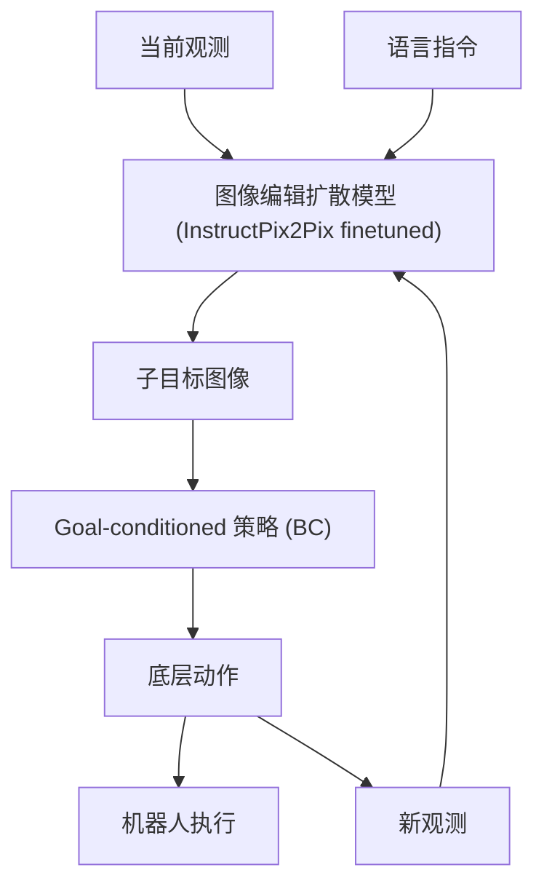

# SuSIE: Zero-Shot Robotic Manipulation with Pretrained Image-Editing Diffusion Models

- 本地 PDF：`papers/world-model/SuSIE_2310.10639.pdf`
- arXiv：https://arxiv.org/abs/2310.10639
- 年份：2023 (ICLR 2024)
- 团队：UC Berkeley, Stanford, Google DeepMind (Kevin Black, Chelsea Finn, Sergey Levine 等)
- 阶段：图像编辑扩散模型作为高层世界模型规划器

## 一句话总结

SuSIE 将预训练 InstructPix2Pix 图像编辑扩散模型微调为高层"世界模型"规划器，生成未来子目标图像，再由低层目标条件扩散策略执行。CALVIN 上 5 连任务成功率 0.26（1 连 0.87，远超 UniPi 的 0.56），真实机器人零样本泛化（新物体/干扰物/新场景）超越 55B 参数的 RT-2-X。

## 核心技术

1. **图像编辑扩散作为世界模型** — 用 InstructPix2Pix 将当前观测 + 语言指令 → 子目标图像（展示任务完成后的状态），无需从零训练视频生成器
2. **两阶段架构** — (i) 图像编辑模型在人类视频 + 机器人数据上 fine-tune 生成子目标; (ii) 低层 goal-conditioned 策略行为克隆执行
3. **零样本泛化** — 子目标生成利用了预训练扩散模型的组合泛化能力，即使未见过的物体/场景也能生成合理的子目标

## 底层原理与数学推导

```mermaid
graph TD
    IMG[当前观测] --> DIFF["图像编辑扩散模型 (InstructPix2Pix finetuned)"]
    LANG[语言指令] --> DIFF
    DIFF --> SUBGOAL[子目标图像]
    SUBGOAL --> LOWPOLICY["Goal-conditioned 策略 (BC)"]
    LOWPOLICY --> ACTION[底层动作]
    ACTION --> ROBOT[机器人执行]
    ACTION --> NEXTIMG[新观测]
    NEXTIMG --> DIFF
```

## 实验

- **CALVIN benchmark SOTA**：1-5 连任务成功率 0.87 / 0.69 / 0.49 / 0.38 / 0.26，全面超越全部先前方法（UniPi 0.56 / 0.16 / 0.08 / 0.08 / 0.04，LCBC 0.67 / 0.31 / 0.17 / 0.10 / 0.06）
- **零样本泛化**: 3 个真实场景 9 个任务——Scene A（分布内）、Scene B（新背景 + 干扰物）、Scene C（全新桌面纹理 + 未见物体），操作未见过的物体、干扰物、场景
- 显式比较：超越 55B 参数的 RT-2-X（训练数据多一个数量级）
- 数据消融（Table 4）：BridgeData-only 子目标模型 Scene B 平均成功率 0.30，加入 Something-Something 人类视频后 0.50；低层策略对背景物体 hallucination 鲁棒（主要关注夹爪位姿与目标物体）

## 物理直觉解释

**SuSIE 的直觉：用修图软件"画"出任务完成后的样子，然后让机器人照着做**。不需要理解物理方程、不需要 3D 建模——只要你会"把这盘水果变成沙拉"的图像编辑，机器人就有一个视觉目标可以追逐。这利用了预训练扩散模型在海量互联网图像上学到的视觉常识：它知道"切好的水果"长什么样，即使从没见过你家的厨房。具体做法是：把 InstructPix2Pix 在 (当前观测, 语言指令 → 未来子目标) 三元组上微调——训练数据一半来自人类操作视频（Something-Something 75k 片段）、一半来自机器人数据（BridgeData V2）——于是"把青椒放进橙色锅里"这种指令在推理时直接被"画"成一张未来画面。

**子目标图像是"高层语义"与"低层控制"之间的翻译层**。相比 UniPi（生成整个视频），SuSIE 只生成一帧子目标图像——就像告诉机器人"你往那个方向走就对了"，而不是"每一步的分解慢动作"。关键洞察是子目标**不需要物理可达**：低层目标条件策略被训练得对子目标中的背景物体幻觉鲁棒（实测它主要关注夹爪位姿与目标物体），因此即使扩散模型"画"出了物理上不可行的画面，低层策略也能把它当作方向信号执行——高层错误被低层消化，这是两阶段解耦架构能工作的核心原因。

**"人类视频 + 少量机器人数据"是数据杠杆的又一次兑现**。子目标生成模型只用人类视频就学会了"任务完成的概念"（Scene B 平均成功率 0.30→0.50 的增益），而低层策略只吃机器人数据；两者结合使整个系统零样本解决新场景任务，训练成本仅 40k 步 × batch 1024、单块 TPU 17 小时——对比 RT-2-X（55B 参数、多一个数量级的机器人数据）仍能在真实任务上胜出，"轻量级世界模型 + 通用低层策略"的架构功不可没。

## 工程细节与实操指南

- **InstructPix2Pix 作为骨干**：预训练在大量图像编辑对上的扩散模型，fine-tune 在 (观测, 语言, 目标图像) 三元组上；40k 步 × batch 1024，单块 v4-64 TPU 约 17 小时
- **数据配比**：仿真只用 CALVIN；真实实验按 60% Something-Something + 40% BridgeData V2 混合采样；Something-Something 经标签过滤（去除 egocentric 运动）后约 75k 片段；BridgeData V2 60k+ 轨迹（45k 带语言标注）
- **推理设置**：DDIM 采样器 50 步，图像引导权重 2.5、文本引导权重 7.5
- **低层策略**：扩散策略（ResNet-50 图像编码器 + 3×256 层 MLP），观测与目标图像通道拼接，预测 4 步动作块保证时间一致性，Adam lr 3e-4
- **两阶段训练**：(1) 子目标生成模型在人类视频 + 少量机器人数据上 fine-tune；(2) 低层 goal-conditioned 扩散策略用 BC 训练

## 消融实验与分析

| 消融/对比维度 | 设置对比 | 关键指标 |
|---------|---------|---------|
| CALVIN 链式任务 | SuSIE vs UniPi (Ours) | 1 连 0.87 vs 0.56；5 连 0.26 vs 0.04 |
| CALVIN 链式任务 | SuSIE vs 语言条件最强基线 LCBC/AugLC | 1 连 0.87 vs 0.67/0.69；5 连 0.26 vs 0.06/0.05 |
| 人类视频数据（Scene B） | BridgeData-only vs +Something-Something | 平均成功率 0.30 vs 0.50（青椒入锅 0.2→0.5，青椒入碗 0.4→0.5） |
| 子目标质量（Scene C） | BridgeData-only vs 完整模型 | 蜡笔入碗 0.9→1.0；仅完整模型能生成全正确的子目标 |
| 低层策略鲁棒性 | 对背景物体 hallucination 的子目标 | 低层策略主要关注夹爪位姿与目标物体，对背景幻觉鲁棒 |
| 规模对比 | SuSIE vs RT-2-X（55B，数据多一个数量级） | 真实任务零样本泛化全面胜出 |

**核心结论**：SuSIE 的验证证据链是"基准超越 + 数据杠杆 + 鲁棒性机制"三层——CALVIN 上 0.87/0.26（1/5 连）对最强语言条件基线 0.67/0.06 的大幅超越证明"图像子目标 > 纯语言条件"的翻译层价值，且链式任务越长优势越大（高层规划作用随任务复杂度放大）；Scene B 的 0.30→0.50 证明人类视频是子目标生成模型的关键数据杠杆；而"低层策略对幻觉鲁棒"的发现解释了为什么单帧子目标（即使不物理可达）足够——这是两阶段解耦架构成立的前提。RT-2-X 的对比则把"轻量级预训练扩散模型 + 少量机器人数据"路线的性价比量化了出来。

## 技术权衡（Trade-off）

| 优势 | 劣势与工程代价 |
|------|----------------|
| 利用预训练扩散模型的视觉常识，零样本泛化强 | 子目标可能物理不可行（hallucination），低层策略会失败 |
| 只需生成一帧图像，比视频规划轻量得多 | 单帧子目标丢失了运动信息（速度、接触力等） |
| 人类视频数据大幅降低机器人数据需求 | 人类视频与机器人视角的 domain gap 需额外处理 |
| 两阶段解耦使各模块可独立改进 | 模块间没有端到端梯度，高层错误无法被低层纠正 |

## 技术价值与演进定位

SuSIE 提供了一条"轻量级世界模型"路线——不需要从头训练视频生成器或世界模型，直接 fine-tune 预训练图像编辑模型即可。这对于数据稀缺的机器人场景有重大实用价值。

## 与其他论文的关系

- **UniPi** 用视频扩散做规划，SuSIE 用图像编辑做——更轻量、更高效
- **GR-MG** 也做 goal image 生成，但用的是专门的图像编辑模块
- **RT-2-X** 是 SuSIE 的闭源对标——SuSIE 以更小模型规模实现超越
- **Dreamer v3** 在 latent 空间做未来预测，SuSIE 在像素空间做

## 精读问题

1. 图像编辑的"编辑强度"如何控制（image/text guidance 权重 2.5/7.5 的敏感性）？过强可能导致 hallucination，过弱失去泛化
2. 子目标图像的错误模式有哪些？物理不可行的子目标如何处理——低层策略对"物体位置错误"vs"背景幻觉"的容忍度差异？
3. 低层策略对子目标图像质量的容忍度？多大程度的 hallucination 会导致动作失败？Table 4 中完整模型反而略降的任务（牙膏 0.7→0.6）如何解释？
4. 单帧子目标丢失运动信息（速度、接触力）——对动态任务（倒水、插拔）是否成为架构性短板？需要几帧才能补齐？
5. Something-Something 人类视频与机器人视角的 domain gap 具体如何影响子目标编辑质量？更大规模人类视频（Ego4D 级）是否线性增益？
