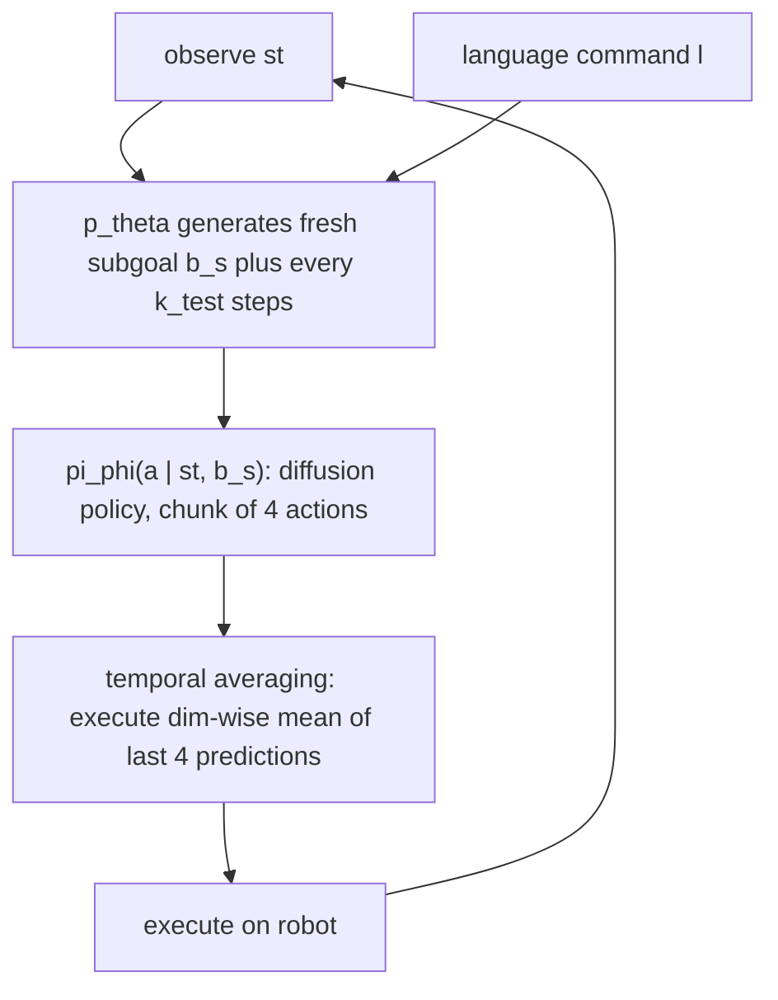

# SuSIE: Zero-Shot Robotic Manipulation with Pretrained Image-Editing Diffusion Models

- 本地 PDF：`papers/world-model/SuSIE_2310.10639.pdf`
- arXiv：https://arxiv.org/abs/2310.10639
- 项目主页：http://rail-berkeley.github.io/susie
- 年份：2023 (arXiv 预印本；PDF 内无会议收录信息，GR-MG 等后续论文均按 arXiv 引用)
- 团队：UC Berkeley (Kevin Black, Mitsuhiko Nakamoto, Pranav Atreya, Homer Walke, Aviral Kumar, Sergey Levine)、Stanford、Google DeepMind (Chelsea Finn)
- 阶段：「图像子目标生成」路线的代表作——用互联网预训练的图像编辑模型当高层规划器，把语言指令翻译成一张未来画面让低层策略去够

## 一句话总结

SuSIE 把预训练的 InstructPix2Pix 图像编辑扩散模型在「当前帧 + 语言指令 → 未来子目标帧」三元组上微调，作为高层规划器；再用一个语言无关的目标条件扩散策略反复追这些子目标。两层分工换来双重收益：语义知识来自互联网预训练与人类视频（Something-Something 75k 片段共训），操作精度来自"跟着一张明确的中间画面走"。CALVIN 零样本（ABC→D）五连任务成功率 0.26 全面刷新 SOTA（最强语言条件基线 AugLC 只有 0.05），真实世界三个泛化梯度场景平均 0.87/0.50/0.88 胜过 55B 参数、数据多一个数量级的 RT-2-X，甚至胜过拿到真值目标图的 Oracle GCBC。

## 核心技术

1. **图像编辑即规划** — 完成任务等价于在约束（语言指令）下"编辑"工作台照片。于是不从头训视频预测器，直接微调 InstructPix2Pix 使其输出"若任务顺利推进若干步后的画面"，把网络规模级的视觉常识原样搬进控制回路。
2. **两阶段完全解耦** — Phase (I) 子目标生成器只在带语言的视频/机器人片段上训练（可用无动作标签的人类视频）；Phase (II) 目标条件策略只在机器人数据上做 GCBC（可用无语言标签的动作数据）。两类部分标注数据因此被同时利用，且大模型与小策略可各自独立更换。
3. **短视界子目标而非全视频** — 只生成一个未来中间帧，落在 $[k_{min}, k_{max})$ 步窗口内：足够近以便低层可达，足够远以产生实质进展。与 UniPi 的根本差异在于不要求生成模型维持整条轨迹的物理一致性。
4. **CLIP 级别的引导分离** — 对文本与输入图像分别施加 classifier-free guidance，测试时词指导 7.5 / 图像指导 2.5，兼顾指令服从与场景保真。
5. **抗幻觉的低层执行** — 目标条件扩散策略被训练为"主要看夹爪位姿与目标物体"，对子目标图中无关背景的幻觉天然鲁棒，这使得非完美生成的子目标仍可用作方向信号。

## 底层原理与数学推导

### 子目标生成的条件扩散目标

数据分三类：$\mathcal{D}_l$（有语言、无动作的视频）、$\mathcal{D}_{l,a}$（有语言有动作的机器人轨迹）、$\mathcal{D}_a$（只有动作）。设 $q(j|i)$ 控制子目标取多远：

$$
q(j|i) = U(j;\,[i+k_{min},\ i+k_{max}))
$$

Phase (I) 在 $\mathcal{D}_l \cup \mathcal{D}_{l,a}$ 上最大化如下对数似然（这是本文的核心建模选择——把"下个任务里程碑"当作图像编辑的结果）：

$$
\mathcal{L}_{subgoal}(\theta) = -\mathbb{E}_{(\tau^n,l_n)\sim\mathcal{D}_l\cup\mathcal{D}_{l,a};\ s_i^n\sim\tau^n;\ j\sim q(j|i)}\Big[\log p_\theta\big(s_j^n \,\big|\, s_i^n,\ l_n\big)\Big]
$$

实现上采用标准 DDPM 变分下界，噪声预测网络同时吃原图与指令：

$$
\mathcal{L}_{VLB}(\theta) = \mathbb{E}_{t,\epsilon}\Big[\big\|\epsilon - \epsilon_\theta\big(s_i,\ l,\ \sqrt{\bar{\alpha}_t}\,s_j + \sqrt{1-\bar{\alpha}_t}\,\epsilon,\ t\big)\big\|^2\Big]
$$

推理时对文本与条件图像各做一次独立 classifier-free guidance 外推（沿用 InstructPix2Pix 的双重条件设计）：

$$
\tilde{\epsilon}_\theta = \epsilon_{ref} + w_l\big(\epsilon_{text}-\epsilon_{ref}\big) + w_s\big(\epsilon_{img}-\epsilon_{ref}\big),\qquad w_l=7.5,\ w_s=2.5
$$

### 目标条件低层策略

Phase (II) 用 goal-conditioned behavioral cloning 在机器人数据 $\mathcal{D}_{l,a}\cup\mathcal{D}_a$ 上训练 $\pi_\phi(a|s_i,s_j)$，注意它不看语言、也不看动作以外的任何监督；目标采样范围加一个裕量 $k_\delta$，因为生成的子目标偶尔会超出 $k_{max}$ 步可达范围：

$$
\mathcal{L}_{GCBC}(\phi) = -\mathbb{E}_{\tau^n;\ (s_i^n,a_i^n)\sim\tau^n;\ j\sim U([0,\ k_{max}+k_\delta))}\Big[\log \pi_\phi\big(a_i^n \,\big|\, s_i^n,\ s_j^n\big)\Big]
$$

整个系统唯一闭环的地方在测试时：每隔 $k_{test}$ 步重新采样子目标，再让策略朝它滚出 $k_{test}$ 步。

```mermaid
graph TD
    OBS["observe st"] --> GEN["p_theta generates fresh subgoal b_s plus every k_test steps"]
    CMD["language command l"] --> GEN
    GEN --> LOW["pi_phi(a | st, b_s): diffusion policy, chunk of 4 actions"]
    LOW --> AVG["temporal averaging: execute dim-wise mean of last 4 predictions"]
    AVG --> ROBOT["execute on robot"]
    ROBOT --> OBS
```

两个独立的超参表值得记住（重复实验时的易错点）：CALVIN 用 $k_{min}=20, k_{max}=22, k_\delta=2$；BridgeData V2 与 Something-Something 都用 $k_{min}=11, k_{max}=14$，其中 Bridge 配 $k_\delta=6$；$k_{test}$ 两边都是 20。

## 物理直觉解释

**像给机器人一台"修图软件"当导航**。人类指挥另一个人干活时说"把那个青椒放进锅里"，对方脑中立刻浮现"青椒已经在锅里"的画面，然后反推手该怎么动——SuSIE 把这个心理过程外化成了模型组件。InstructPix2Pix 学过海量"改图像"的模式，微调之后它知道"完成抓取的手长什么样""物体放进容器后画面怎么变"。关键是这套理解力来自互联网图像先验，而不是机器人演示里的低层动力学，所以它能画出一双没见过的手去拿没见过的东西。语言在这里只是编辑指令，不再需要被端到端地映射到动作空间，"grounding 问题"被整个绕开了。

**子目标是"箭头"而不是"蓝图"——它不必物理精确**。直觉上你可能会担心：扩散模型画出的目标若违反物理（比如背景里多了一件东西），策略会不会照着错误画面操作而翻车？论文的回答是低层策略自带鲁棒机制：它在训练时见过各种噪声目标，实际只关注夹爪应到达到的位姿和要抓的那个物体。所以正确的心智模型是"子图提供方向向量，而非需要逐像素复现的终点"——高层允许犯错，低层负责把错误衰减掉。这也是为什么 Table 4 里仅靠 Bridge 训练的弱生成器在 Scene C 平均仍有 0.80 的成功率：策略消化了大部分幻觉。

**"只画一帧"是对生成模型能力边界的清醒妥协**。UniPi 要求视频模型生成整条 rollout，意味着每一帧都要服从严格的时间物理一致性；开源复现（HiP 版）连夹爪都画不清、模糊得一塌糊涂，自研 3D UNet 版也常出现时序不一致从而扰乱逆动力学模型。单帧子目标把这副重担卸掉了：生成器只需保证"局部合理的一瞬"，物理推演由会闭环反馈的低层策略在真实世界里完成。一句话概括分工边界：**扩散模型负责"去哪"，反馈控制器负责"怎么去"**——前者是它擅长的语义合成，后者是它不擅长的动力学。

**数据杠杆在这里体现为"每类数据喂给最能消化的模块"**。昂贵之处不在收集视频而在打标：Something-Something 的 75k 人类片段没有动作标签却丰富了"任务完成的模样"；Bridge 里那 15k 无语言标签的轨迹照样通过 relabeled 目标图训练低层策略。训练成本也很克制——子目标模型 40k 步、batch 1024，一块 v4-64 TPU 跑 17 小时；低层策略一块 v4-8 TPU 15 小时。而对照对象 RT-2-X 是 55B 参数、跨本体百万级轨迹。这个对比给出的信号是：在需要语义泛化的场景，把预算花在预训练图像模型的下游适配比花在自研巨型 VLA 上便宜得多。

## 工程细节与实操指南

- **真实平台**：WidowX250 单臂；评测 9 个任务 × 10 次，位置姿态每次重摆但所有方法共用同一组设置。
- **三个难度递增的真实场景**：Scene A（Bridge 分布内环境与物体）；Scene B（桌面同款但新背景新干扰物，抓轻滑且几乎撑满夹爪开口的甜椒，还要区分见过/没见过的容器）；Scene C（全新桌布纹理 + 见过/未见物体混杂，需要抵抗模型对高频物体的偏好，如放着勺子不用而去拿蜡笔）。
- **仿真协议**：CALVIN ABC→D 最难零样本切分；360 步内连续完成 5 条语言链；主表结果为 100 条轨迹平均（两个 UniPi 复现版因视频查询开销大，只有 25 条）。
- **子目标模型训练**：InstructPix2Pix 初始化；AdamW lr $10^{-4}$、warmup 800 步、weight decay 0.01、EMA 0.999（测试用 EMA 权重）；40k 步、batch 1024；真机配置下按 60% Something-Something : 40% BridgeData V2 共训；DDIM 采样 50 步。
- **低层策略训练**：观测图与目标图按通道拼接进 ResNet-50，动作头为 3 层 256 维残差 MLP 扩散过程；预测 4 步动作块；每个时间步都重新预测并取最近 4 次预测的逐维均值执行（作者试过 receding horizon，切换模式导致抖动后弃用）；Adam lr $3\times10^{-4}$、warmup 2000、batch 256、445k 步；随机裁剪/缩放/色彩抖动增广。
- **基线复现要点（常被忽略）**：MOO 需要 LLM 从非结构化的 Bridge 语言标注抽取目标实体再喂 OWL-ViT 提框，训练框噪声大是其表现差的主因（测试时反而给了真值框）；UniPi 复现两条路——PVDM 潜空间版真机上画质不可用，3D UNet 自研版分辨率仅 $128\times128$、固定 10 帧视界，配合逐帧逆动力学模型使用。
- **失败诊断入口**：真机多数失败仍是抓取滑落/过早松开（牙膏最典型），说明瓶颈已转移到低层灵巧度而非语义理解——这是作者给后续工作的明确信号。

## 消融实验与分析

CALVIN ABC→D 零样本链式成功率（Table 1）：

| 方法 | 1 连 | 2 连 | 3 连 | 4 连 | 5 连 |
|------|------|------|------|------|------|
| HULC | 0.43 | 0.14 | 0.04 | 0.01 | 0.00 |
| MCIL | 0.20 | 0.00 | 0.00 | 0.00 | 0.00 |
| MdetrLC | 0.69 | 0.38 | 0.20 | 0.07 | 0.04 |
| AugLC | 0.69 | 0.43 | 0.22 | 0.09 | 0.05 |
| LCBC | 0.67 | 0.31 | 0.17 | 0.10 | 0.06 |
| UniPi (HiP 版) | 0.08 | 0.04 | 0.00 | 0.00 | 0.00 |
| UniPi (自研 3D UNet 版) | 0.56 | 0.16 | 0.08 | 0.08 | 0.04 |
| **SuSIE** | **0.87** | **0.69** | **0.49** | **0.38** | **0.26** |

**核心结论**：子目标翻译层的收益随链条长度放大——1 连时领先最强语言条件基线 18 个百分点，5 连时领先 21 个百分点以上，说明层级结构对长程任务的必要性以指数级呈现；同为"生成式规划"的 UniPi 在 1 连就不及 SuSIE（0.56 vs 0.87），印证单帧子目标比完整视频生成更贴合当前开源视频模型的能力上限。

真机精度与数据杠杆（Table 2/3/4 汇总，值为该场景平均成功率）：

| 对比维度 | 基线值 | SuSIE 值 |
|----------|--------|----------|
| Scene A 平均（分布内） | LCBC 0.63 / MOO 0.47 / RT-2-X 0.43 | **0.87** |
| Scene B 平均（新背景干扰物） | LCBC 0.20 / RT-2-X 0.00 | **0.50** |
| Scene C 平均（全新纹理+未见物体） | LCBC 0.18 / RT-2-X 0.75 | **0.88** |
| Scene B：Oracle GCBC（拿真值最终目标图） | 0.05 | **0.50** |
| CALVIN 四单任务均值 Oracle GCBC | 0.66（抽屉 1.00 例外） | **0.95** |
| 子目标模型仅 BridgeData（Scene B/C） | 0.30 / 0.80 | **0.50 / 0.88** |

**核心结论**：Scene A 的领先来自精度而非语义（大家都认识茄子胡萝卜，但只有 SuSIE 的子图能让夹爪稳稳按下甜椒）；"执行真值最终目标的 Oracle GCBC 在 Scene B 只有 0.05"是全文最有说服力的证据——问题从来不是不知道目标是什么，而是缺少够得着的中间视觉锚点，SuSIE 补上的正是这一层；Scene C 输 RT-2-X 的部分反而是纯语义任务，两者失败都以操作失误为主。人类视频的贡献集中在最难的外推场景（0.30→0.50），在分布内几乎无增益。

## 技术权衡（Trade-off）

| 优势 | 代价与边界 |
|------|------------|
| 互联网预训练常识零成本注入，无需重训生成骨干 | 高层与低层各自独立训练，无梯度互通，子目标漂移只能靠频繁重采样缓解 |
| 生成一帧的负担远小于整条视频，开源模型即可胜任 | 运动信息（速度、接触时机）全部压给低层策略，动态性强的任务（倒水、插拔）可能吃不到子图红利 |
| 两类部分标注数据各尽所用，15 小时 TPU 时长的量级成本 | "生成器假设一切数据中的状态皆可达"这一隐含假设未被显式建模（作者承认的性能瓶颈之一） |
| 低层只看图像，绕开语言 grounding 失败模式 | $k_{min}/k_{max}/k_\delta/k_{test}$ 四个视界超参数随数据集手工调整，跨域迁移需重新扫描 |

## 技术价值与演进定位

SuSIE 之后，"预训练图像编辑/生成模型 → 中间视觉表征 → 低层策略"成为一条可复用的流水线范式：它证明了扩散模型的组合泛化能力可以穿过一层很薄的适配（17 小时微调）直达控制系统，同时给出了"子目标只需要信息充分、不需要物理完备"的非对称容错架构观。从谱系上看，它是 UniPi（视频规划）与 HVF（层次视觉预见）两个方向的收敛点——保留视觉规划的语义能力，砍掉长视频的物理一致性负担；后来的 GR-MG 直接以它为起点加入进度条件与双模态条件，是这条线在"多模态目标条件策略"方向的延伸。对研究者的启发价值还在于它的评测方式：用 Oracle 对照拆解增益来源（语义 vs 精度）的设计非常干净，值得在做分层系统的 ablation 时借鉴。

## 与其他论文的关系

- **UniPi** — 同样用生成模型出视觉计划，但 UniPi 生成完整视频序列再用逆动力学模型提动作；SuSIE 只出一帧近程子目标，代价大降、稳定性大升（开源复现上 1 连 0.87 vs 0.56）。
- **HiP** — 其中的 UniPi 复现（PVDM 潜空间视频模型）被 SuSIE 直接拿来当基线，真机上因夹爪模糊与时序不一致无法落地，是"视频生成尚不足以承担全程规划"的实证。
- **HVF (Hierarchical Visual Foresight)** — 更早的视觉子目标 + MPC 结构；SuSIE 用目标条件策略替换 MPC，免除了在大动力学模型上做昂贵的在线搜索。
- **MOO** — 也想给策略注入开放词汇定位，但途径是把 OWL-ViT 检测框塞进观测通道；训练框噪声导致其即便测试时有真值框也全面落后，凸显"看图说话式的抽象子目标"比"检测框特征"更利于控制。
- **RT-2-X** — 规模化 VLA 路线的旗舰（55B 参数、超过 110 万条轨迹）；SuSIE 以约两个数量级更少的数据在其劣势项（精细抓取类 Scene B）大幅胜出、在纯语义场景与之接近，构成两条技术路线的正面交锋记录。
- **APV** — 同样从无动作视频学习、同样不做动作条件化，但 APV 要与策略在线交替微调；SuSIE 的生成器冻结使用，工程流程更简单。
- **GenAug / ROSIE / CACTI** — 属于"生成模型做语义数据增强"的另一支用法，且依赖外给的 bbox 或 mesh 先验；SuSIE 不改训练数据分布、不需要额外几何标注。
- **GR-MG** — 后续工作：保留 InstructPix2Pix 子目标生成，引入任务进度条件并在策略侧同时吃语言+目标图两种条件，专治 SuSIE 中"生成器不知道低层能力、一旦子图错就没人兜底"的两个短板。

## 精读问题

1. **视界超参的可迁移性**：$k_{min},k_{max}$ 决定子图与当前状态的"距离谱"，换到动态或接触密集领域时均匀采样是否最优？自适应的进度条件（如 GR-MG 的 10-bin 进度）能带来多大改进？
2. **幻觉的类型敏感度**：附录与正文都说低层对背景幻觉鲁棒，那么哪几类生成错误（物体被删除/复制、位姿偏移、遮挡关系错误）是不可恢复的？能否用一组破坏实验量化容忍谱？
3. **Oracle GCBC 反差的最优解释**：Scene B 中真值最终目标图反而只拿 0.05，是"距离太远"还是"最优路径歧义"？把真值图换成真值的逐步里程碑图能恢复多少？
4. **两模块能力匹配**：作者指出性能瓶颈已移到低层策略、且建议让生成器感知低层可达集；最自然的实现（条件于策略成功率的生成微调）会不会又把两个模块耦回端到端？
5. **人类视频配比的 Scaling 曲线**：60% Something-Something 是凭经验定的，视频占比继续加大（Ego4D 级、第一视角为主）会在哪个点上因视角鸿沟开始伤害子图质量？
