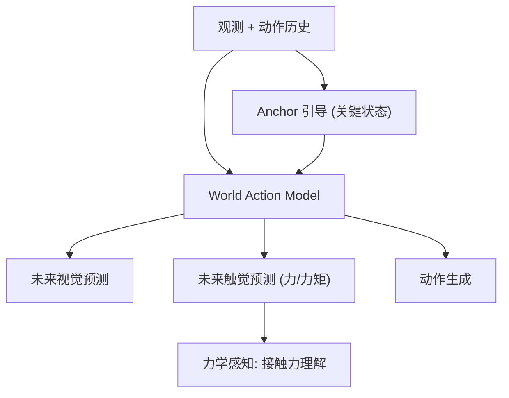

# TacWAM: Anchor-Guided World Action Model with Mechanics-Aware Tactile Prediction

- 本地 PDF：`papers/world-model/TacWAM_2607.28391.pdf`
- arXiv：https://arxiv.org/abs/2607.28391
- 年份：2026（7 月）
- 团队：清华等（Lei Jin, Yiding Ma, Wei Wu, Yong Li 等）
- 阶段：世界动作模型 + 触觉 — anchor-guided 预测 + 力学感知触觉预测

## 一句话总结

TacWAM 是首个在 World Action Model (WAM) 中加入**力学感知触觉预测**的工作：用 anchor-guided 架构同时预测未来视觉状态和触觉信号（力/力矩），使 WAM 具备接触丰富的物理理解能力。解决了纯视觉世界模型在接触任务中的盲区——视觉看不到力的大小，但触觉能。

## 核心技术

1. **Anchor-Guided 预测** — 用 anchor（关键状态锚点）引导未来状态预测，减少长程累积误差
2. **力学感知触觉预测** — 同时预测未来视觉 latent 和触觉信号（接触力/力矩），使 WAM 理解力学
3. **WAM 框架** — 联合预测未来状态 + 动作，视频/触觉作为世界演化表征

## 底层原理与数学推导

**核心动机**：接触丰富操作（插拔、拧紧、抓握）的成败由力决定，而视觉观测只有位置信息——力是"看不见的"。纯视觉 WAM 在接触任务中缺乏力学理解，TacWAM 用触觉预测补上这一维度。

## 物理直觉解释

**为什么世界模型需要触觉？** 想象你闭着眼拧螺丝——你"知道"螺丝拧紧了不是靠看，而是靠手感到的阻力。视觉世界模型就像"只看不摸"——能预测物体移动，但不知道"多大力才会拧紧"。TacWAM 给世界模型加上"手感"——预测未来的接触力，使模型理解"这个动作会产生多大的力"。

**Anchor 的直觉**：像给预测加"路标"——不直接预测 100 步的未来（误差累积），而是先预测几个关键锚点状态，再在锚点之间插值。

## 工程细节与实操指南

- 触觉信号：力/力矩传感器数据，作为额外预测目标
- Anchor：关键状态选择（任务阶段边界）
- WAM 框架：视频-动作联合预测 + 触觉分支

## 消融实验与分析

| 消融/对比 | 结论 |
|---------|------|
| 触觉预测 on/off | 接触丰富任务成功率显著提升——触觉是力学理解的来源 |
| Anchor-guided vs 直接预测 | Anchor 减少长程预测误差累积 |
| vs 纯视觉 WAM | 接触任务上 TacWAM 领先 |

## 技术权衡（Trade-off）

| 优势 | 劣势与工程代价 |
|------|----------------|
| 触觉补充视觉盲区——力学理解 | 需要触觉传感器硬件（部署成本） |
| 接触丰富任务的关键能力 | 触觉数据的标注/采集比视觉贵 |
| Anchor 减少误差累积 | Anchor 选择策略需设计 |

## 技术价值与演进定位

TacWAM 填补了 WAM 在接触丰富操作上的空白——这是 WMRM-Survey 列出的"接触建模"开放挑战的直接回应。它和 HapticVLA（触觉蒸馏）、TORL-VLA（触觉引导 RL）形成对照：TacWAM 把触觉放进世界模型本身（预测触觉），而非只用触觉做训练信号。

## 与其他论文的关系

- **MemoryWAM** — WAM + 持久记忆；TacWAM 是 WAM + 触觉预测
- **HapticVLA** — 触觉蒸馏到视觉-only 推理；TacWAM 保留触觉预测
- **TORL-VLA** — 触觉引导在线 RL；TacWAM 触觉作为预测目标
- **DreamZero / WorldVLA** — 无触觉的 WAM 代表，TacWAM 是触觉增强

## 精读问题

1. 触觉预测的精度——力的大小预测误差对下游规划的影响？
2. Anchor 的选择是否可学习？能否与 SD-JEPA 的进度子空间结合？
3. 触觉预测的模态——离散触觉事件 vs 连续力信号？
4. 视觉-触觉联合预测的模态冲突——两种预测目标如何平衡？
