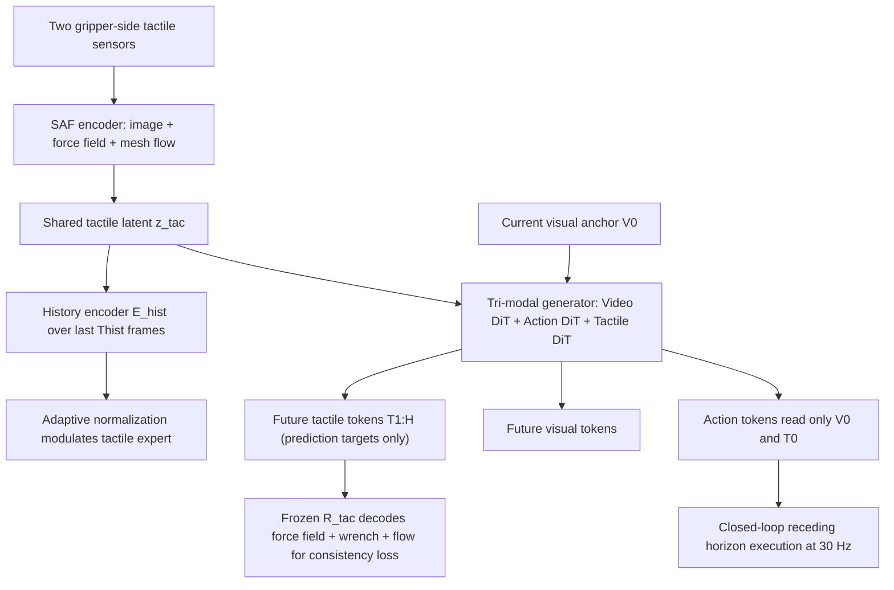

# TacWAM: Anchor-Guided World Action Model with Mechanics-Aware Tactile Prediction

- 本地 PDF：`papers/world-model/TacWAM_2607.28391.pdf`
- arXiv：https://arxiv.org/abs/2607.28391
- 年份：2026（7 月，arXiv v1）
- 团队：清华大学 + Manifold AI（Lei Jin / Yiding Ma 共同一作；通讯 Yong Li）
- 阶段：WAM 的模态扩展方向 —— 在视觉未来之外增加"力学感知的触觉未来"作为训练监督，同时用注意力掩码防止触觉成为部署期特权信息

## 一句话总结

TacWAM 回答了一个此前 WAM 工作都回避的问题：**触觉未来该不该进 WAM、以什么方式进**。纯视觉 WAM 看得到场景怎么变，看不到力、变形、剪切与滑移——一张"看起来很稳"的画面可能正处在打滑边缘。TacWAM 的方案分三步：(1) SAF Tactile Encoder 把触觉外观图像 + 致密力场 + 网格变形流在传感器表面空间配准后融进一个共享 latent 预测空间，并用双边合力/合力矩重建做全局 wrench 监督；(2) 触觉历史编码器把最近接触演化压缩成上下文，解决单帧力的歧义；(3) AGT Attention 用掩码把"当前视觉锚点 / 当前触觉锚点 / 未来预测 token / 动作 token"四类信息隔开——动作分支只能读部署时可得的锚点，未来的触觉序列只做监督不进动作通路。四个真实接触丰富任务上平均成功率 75.0%，比最强基线 VT-WAM 高出 37.5 个百分点。

## 核心技术

1. **SAF（Spatially Aligned Fusion）Tactile Encoder** — 每侧夹爪传感器的三个空间配准信号 $o_t^{tac}=(I_t^{rect}, F_t, M_t^{flow})$：校正后的触觉图像、致密局部力场、网格变形流。每侧各自过对应分支编码后做 bilateral fusion + pooling 融合成单帧 latent $z_t^{tac}$。
2. **力学结构保持的全局监督** — 重建头 $R_{tac}(z_t^{tac})=(\hat{F}_t, \hat{r}_t^{wrench}, \hat{M}_t^{flow})$ 要求 latent 能解出双侧各 3 维力 + 3 维力矩的合力/合矩；wrench 不作为第四个空间输入而是全局约束项，保证 latent 不丢失接触的整体力学含义。
3. **触觉历史调制（Tactile History-Modulated Prediction）** — $c_{t_0}^{tac}=E_{hist}(z_{t_0-T_{hist}+1:t_0}^{tac})$ 压缩 chunk 前的触觉轨迹；**不插入额外 memory token，而是通过 adaptive normalization 调制触觉 expert**，让预测区分同值不同相的接触状态（稳态接触 / 压力增长 / 打滑恢复 / 即将压碎）。
4. **AGT（Anchor-Guided Tri-Modal）Attention** — token 排布为 $[V_0, V_{1:H} \mid T_0, T_{1:H} \mid A]$；三条硬性可见性规则：动作不能读任何未来预测 token；视频不能读 $T_{1:H}$；未来触觉不能读动作 token。骨干是 Mixture-of-Transformers，三模态各走自己的 expert，靠 masked mixed self-attention 通信。
5. **两阶段训练与语义一致性正则** — 先训 SAF 表示（loss $\mathcal{L}_{SAF}=\lambda_F\mathcal{L}_F+\lambda_R\mathcal{L}_{wrench}+\lambda_M\mathcal{L}_{flow}$）后冻结；再联合训 WAM 主干，冻结但可微的 $R_{tac}$ 解码被预测触觉 latent 得到力场/wrench/变形流作为语义一致性正则。
6. **部署一致原则** — 所有进入动作通路的信号（当前帧 $V_0$、当前触觉锚点 $T_0=z_{t_0}^{tac}$、语言/本体感觉上下文）都是真机在线可得量。

## 底层原理与数学推导

**问题形式化**：时刻 $t$ 的观测为

$$o_t = (o^v_t,\; o^{tac}_t,\; q_t,\; l), \qquad z^{tac}_t = E_{SAF}(o^{tac}_t)$$

注意作者明确声明 $z^{tac}_t$ 不是完整物理状态，只是"可由触觉观测到的力学相关信号表示"，这一点决定了后面所有结论的适用边界。chunk 起点 $t_0$ 上三路生成目标为

$$\hat{v}_{t_0+1:t_0+H} = F_V(o^v_{t_0}, q_{t_0}, l), \quad \hat{z}^{tac}_{t_0+1:t_0+H} = F_T(o^v_{t_0}, z^{tac}_{t_0}, c^{tac}_{t_0}, q_{t_0}, l), \quad \hat{a}_{t_0:t_0+H-1} = F_A(o^v_{t_0}, z^{tac}_{t_0}, q_{t_0}, l)$$

可见**动作分支的条件集合是触觉预测分支条件的子集**——这是刻意为之的信息不对称。

**AGT 可见性的严格定义**（正文 Table 1）：用 "query 可读的 key/value 流" 表述，chunk 开始时干净触觉锚点 $T_0 = z^{tac}_{t_0}$，监督目标序列 $T_{1:H}=[z^{tac}_{t_0+1},\dots,z^{tac}_{t_0+H}]$

$$\mathrm{Attn}(A)=\{V_0,\; T_0,\; A\}, \qquad \mathrm{Attn}(T_{1:H})=\{V_0,\; T_0,\; T_{1:H}\text{ 触觉首帧因果内}\}, \qquad \mathrm{Attn}(V)=\{V_0,\dots,V_{1:H}\}$$

关键点在于训练时 $T_{1:H}$ 是加了流匹配噪声的预测变量，而其 clean 版本只出现在损失端；若放行 $A \leftarrow T_{1:H}$，动作头就在吃一个部署时根本不存在的高质量信号，形成 train-test 失配。

**总损失结构**（式 12）：先冻结核表征再联合训练生成器

$$\mathcal{L}_{SAF} = \lambda_F\mathcal{L}_F + \lambda_R\mathcal{L}_{wrench} + \lambda_M\mathcal{L}_{flow}, \qquad \mathcal{L}_{TacWAM} = \lambda_v\mathcal{L}_{video}+\lambda_a\mathcal{L}_{action}+\lambda_z\mathcal{L}_{tac\text{-}latent}+\lambda_{sem}\mathcal{L}_{tac\text{-}decoded}+\lambda_c\mathcal{L}_{contact}$$

其中 $\mathcal{L}_{contact}$ 是轻量的接触事件辅助损失，标签直接从触觉历史窗口的二值接触序列派生（onset / release / stable-contact 三态），只作用于 $E_{hist}$。$\mathcal{L}_{tac\text{-}decoded}$ 这一项的设计值得细品：解码器参数固定、梯度穿过它去修 latent —— 相当于给预测空间上了"必须能还原成力学量"的正则锁，防止 latent 学成退化的碰撞检测开关。

**动作的时间语义**：每个动作 token 是下一步的目标关节状态而非瞬时控制指令，即 $a := q^{target}_{t+1}$，这让 chunk 内的动作天然具有"状态插值"的平滑性。

## 物理直觉解释

**为什么视觉未来不够、触觉未来才有增量？** 图片能告诉你"杯子还在手上"，但不能告诉你"还剩 2 牛顿就滑了"。玻璃杯在被捏碎前的最后一秒，画面几乎完全静止，而指腹间的压力曲线早已越过危险阈值；反过来，看似轻拿轻放的白板擦其实一直在靠剪切力维持贴板运动。视觉信号对这些量是**低通且滞后的代理**，而指侧触觉给出的是力场本身的一手测量。把未来的触觉作为训练目标，等于强迫模型在想象画面之外还要想象"我将会感受到多大的力"——这正是 DreamZero 引言里那句"WAMs may align actions with other predictive modalities such as tactile sensing"的具体实现。

**为什么要保留触觉历史而不是只看当前一帧？** 同样是 5 牛顿的读数，可能是稳稳握住的常力，也可能是刚接触正在爬升的压力，也可能是快要脱手的回落前的假象——力的大小不携带时间导数信息，而任务成败恰恰取决于这股力的**趋势**。人类的手指也一样：闭上眼睛判断"鸡蛋抓牢了没有"，靠的不只是此刻的压力大小，还有过去几百毫秒里压力是涨是落的感觉记忆。TacWAM 把这段历史通过 adaptive normalization 注入触觉 expert，使得同样的当前锚点在不同接触相位下被解读成不同的状态——这也是消融里去掉历史会造成最大幅度掉分的根本原因。

**为什么"动作不许看未来触觉"反而更强？** 直觉上一个更强的模型似乎应该看到更多信息，但训练时可见的未来触觉是带噪预测变量的 clean 版本，是一个部署时永远拿不到的特权线索；一旦允许 $A\leftarrow T_{1:H}$，模型学到的最优策略会依赖这条捷径，上线时却只能拿到自己生成的、含有误差的替代品——输入分布突变导致行为崩坏。**就像考试允许翻教科书训练，考生自然不会记公式；等真正的闭卷考试来临，成绩当然一落千丈**。Attn-AT 消融从 55.0% 掉到 37.5% 正是这个机制的定量注脚。

## 工程细节与实操指南

- **硬件栈**：Agilex Piper 机械臂 + 两只 Xense G1-WS 指侧触觉传感器，超俯视相机 + 腕部相机双视角；所有感知与控制流同步于 30Hz；状态与动作均为关节位置。
- **数据规模**：每任务 300 条示教轨迹，平均每条约 500 帧，逐帧时间对齐；触觉帧本身就是 SAF 需要的三元组（外观图 / 力场 / 变形流），意味着传感器端需要提供力场与变形流的中间输出。
- **四个评测任务及成功判据**：薯片抓取（不可碎不可掉）、樱桃抓取（稳定抓起放置）、白板擦拭（全程持续接触）、双笔转笔（旋转过程中不掉落）；每种方法每任务 20 次真实试验计成功率。
- **训练次序**：Phase 1 训 SAF 编码器与重建器到收敛后**完全冻结**；Phase 2 冻结触觉 tokenizer 训练 tri-modal WAM（Mixture-of-Transformers 三个 expert + masked mixed self-attention），$E_{hist}$ 与主干的其余部分在此阶段一起训练。
- **推理形态**：chunk 级 receding-horizon 闭环，执行完一个 chunk 后重新观测再推下一 chunk；$R_{tac}$ 可以离线解码未来触觉用于分析力与变形的演化趋势，但论文明确没有把它用作在线修正信号。
- **重要声明**：论文自我定位为"触觉预测如何放进 WAM 训练"的方法论研究，明确否认"Tactile prediction 本身是主要创新"；引用的相关工作 DreamTacVLA、N0-VTLA、TacForeSight 都做过预测式触觉学习，差异点集中在 SAF 表示设计 + AGT 信息隔离这两处。

## 消融实验与分析

主结果 Table 2 与嵌套消融 Table 3 的数字逐字摘自 PDF（每次真实试验 20 次）。嵌套顺序为"去掉历史 → 放宽动作侧触觉可见性（Attn-AT）→ 再放宽视觉-触觉未来互通（Attn-VT）"，仅报告两个代表性任务（Chip 薯片 / Wiping 白板）：

| 变体 | Chip | Wiping | Avg. |
|------|------|--------|------|
| TacWAM 完整版 | 90.0% | 75.0% | 82.5% |
| w/o History（历史置零、禁用 contact loss） | 50.0% | 60.0% | 55.0% |
| w/o History + Attn-AT（动作可读全部 $T_{0:H}$） | 30.0% | 45.0% | 37.5% |
| w/o History + Attn-VT（视觉与触觉未来双向互读） | 10.0% | 5.0% | 7.5% |

主对比表 Table 2（五方法 x 四任务，平均成功率）：

| 方法 | Chip | Cherry | Wiping | Twirling | Avg. |
|------|------|--------|--------|----------|------|
| pi0.5（vision-only VLA） | 10.0% | 60.0% | 35.0% | 20.0% | 31.3% |
| Fast-WAM（vision-only WAM） | 15.0% | 40.0% | 20.0% | 5.0% | 20.0% |
| RDP（reactive visual-tactile policy） | 50.0% | 45.0% | 0.0% | 35.0% | 32.5% |
| VT-WAM（visual-tactile WAM，重实现） | 45.0% | 45.0% | 30.0% | 30.0% | 37.5% |
| TacWAM | 90.0% | 70.0% | 75.0% | 65.0% | 75.0% |

**核心结论**：增量最大的地方正是力学信息最不可替代的地方——白板擦拭需要维持持续法向接触，RDP 这种高频反应式触觉策略干脆拿到 0%，而 TacWAM 到 75%（+40 pp 对最强同类基线）；对每任务最强基线的领先分别为 Chip +40.0、Cherry +10.0、Wiping +40.0、Twirling +30.0 点。嵌套消融的节奏也很说明问题：去掉历史平均掉 27.5 点（90.0% 跌到 50.0%，因为稳定抓取前那段"力的爬升"无法从单帧锚点推断），继续放开动作侧触觉可见性再掉 17.5 点（证实特权线索造成 train-test 失配而非增益），最后允许视觉与触觉未来双向互通彻底崩盘到 7.5%——多模态未来 token 的无约束互相纠缠会破坏 co-training 稳定性，这是 AGT 必须如此严格的实证依据。附带的力滚出分析（Fig. 4）显示完整版的预测合力幅值与真值的趋势贴合度明显高于 w/o History 版本，后者滞后于真实的力变化，说明历史通路真正改善了触觉预测本身而不只是下游成功率。

## 技术权衡（Trade-off）

| 优势 | 局限与代价 |
|------|-----------|
| 四个真实接触丰富任务全胜，比最强基线高 37.5 点 | 全部结论建立在 Agilex Piper + Xense G1-WS 单平台、每任务单一物体类型的小数据域上 |
| AGT 让触觉监督零成本注入而不污染部署行为 | 只验证了"不用未来触觉做在线闭环修正"的保守用法，触觉 rollout 的主动价值未被挖掘 |
| 消融链路清晰（历史 → 动作侧放宽 → 双向互通） | 消融只在 2 个任务上报告（Chip/Wiping），Cherry 与 Twirling 上的 mask 敏感性未知 |
| 触觉潜在空间可被 $R_{tac}$ 解码回物理量，诊断性强 | 需要 Xense 类能输出致密力场与网格变形流的高端传感器，普通压阻阵列没法直接套用 |
| MoE 三 expert 结构模态间干扰小 | 参数与显存开销高于共享权重方案，未公布具体规模与训练时长 |

## 技术价值与演进定位

这篇论文的意义要放在 WAM 辩论的纵向轴上看：三大立场讨论的都是"世界模型的角色"（backbone / 辅助目标 / 独立规划器），而 TacWAM 讨论的是"世界模型的**内容**该不该超过像素"。它与 DreamZero 附录 A 里那句"future WAMs may align actions with other predictive modalities such as tactile sensing, force feedback"构成精确呼应——DreamZero 把这个方向留作 future work，TacWAM 给出了第一个系统化实现，并额外贡献了一条对所有多模态 WAM 都适用的工程律令：**预测目标可以作为监督，但不能变成动作的条件**。从评估视角看，它同时暴露了 WorldArena 这类基准的盲区：16 个指标全部基于视觉/3D 几何，完全没有度量力、变形、剪切这些对接触丰富操作至关重要的物理维度——按 WorldArena 的口径，TacWAM 这样的工作即便做了也无处可评，这是 benchmark 一侧尚未跟上的部分。

## 与其他论文的关系

- **DreamZero (NVIDIA)** — WAM-as-backbone 的代表；本文沿用了"chunk 级自回归 + 流匹配 + 视频 DiT/动作 DiT 分流"的骨架思想，并把动作 token 语义同样定义为下一步目标关节状态，相当于在 DreamZero 式框架上加了第三个模态与一套信息隔离规则。
- **WorldArena (清华 + Manifold AI)** — 作者群体高度重叠（Lei Jin / Yiding Ma / Xin Zhang / Chen Gao / Wei Wu / Yong Li），因此可以看作同一团队"评估缺口 → 补齐方法"的两步棋；WorldArena 刻画了视觉保真与具身效用的鸿沟，TacWAM 则专门补上鸿沟中最严重的触觉维度。
- **VT-WAM** — 最强基线（37.5% 平均），也做视觉-触觉-动作联合建模，但没有触觉历史通路也没有 AGT 隔离，Token 之间可以自由互读；两者的差距（37.5 点）直接量化了"信息拓扑设计"的价值。因官方代码缺失，本文 VT-WAM 结果来自作者按原设计重实现，存在复现偏差风险。
- **RDP (Reactive Diffusion Policy)** — 反应式触觉控制的代表（慢快策略结构）；它在薯片抓取上仍有 50%，但在需要长时间连续接触的擦拭任务上是 0%，说明高频反馈能救瞬时失误但救不了持续的力学规划——这恰是预测式触觉相对反应式触觉的结构优势。
- **Fast-WAM** — vision-only WAM 基线，保留了视觉预测共训练但推理时不生成未来帧；它的整体垫底（平均 20.0%）说明纯粹的视觉 WAM 目标不足以覆盖接触丰富任务，触觉信号才是这个领域的稀缺资源。
- **pi0.5** — 作为 vision-only VLA 的参照系，Cherry 任务反而有 60% 仅低于 TacWAM 10 点，提示对于接触简单但尺寸变化的抓取任务，VLA 的通用先验仍然很有竞争力；TacWAM 的增量集中在需要力学推理的任务上。
- **WorldVLA (阿里)** — 与其 action attention mask（切断动作对先前动作的读取）构成本有趣对照：两者都在"某些 token 不许看另一些 token"这件事上获益，但 WorldVLA 是为了阻断动作误差累积，TacWAM 是为了阻断特权监督泄漏——掩码这一机制如今已成为多模态机器人基础模型的标准工具箱件。
- **DreamTacVLA / N0-VTLA / TacForeSight** — 同属预测式触觉学习一脉，本文明确声明增量不在"是否预测触觉"而在"如何表征（SAF）+ 如何用（AGT）"，定位诚实，可作为综述分组时的判据。

## 精读问题

1. 触觉历史窗口 $T_{hist}$ 具体取多少帧、adaptive normalization 是作用在 LayerNorm 的 scale 还是 bias？论文没有公布这两个对性能影响极大的配置——若把 $T_{hist}$ 从几百毫秒拉长到整条轨迹，会不会反而引入不相关的早期接触噪声？
2. Attn-VT 变体崩到 7.5% 的机理是什么？若是"未来视觉 token 读未来触觉 token 造成训练不稳定"，更温和的做法如单向（仅触觉读视觉、不允许反向）或逐步升温的课程式放开能否保住大部分收益？
3. 力滚出分析只展示了合力幅值的趋势贴合——那切向力（剪切/滑移的关键信号）与力矩三分量的预测误差在擦拭任务中有多大，能否撑起滑移预警这类真正需要精度的下游应用？
4. 每任务 300 条轨迹在这个平台上已经足够让 TacWAM 达 75%，但 pi0.5 只有 31.3%——如果换成少量数据（例如每任务 50 条）触觉的优势是放大还是缩小？触觉分支会不会像大多数小样本模态一样拖累收敛速度？
5. 论文承认预测出的未来触觉没有被用作在线修正信号，那么把它接回控制器（例如检出预期剪切力突变则提前减速）大概需要多少额外延迟？在被 30Hz chunk 循环限制的前提下，这样的闭环在 P200ms 以内的预算里可行吗？
