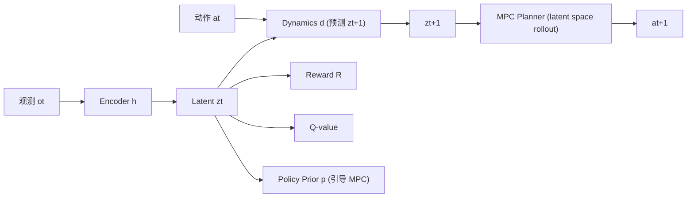

# TD-MPC2: Scalable, Robust World Models for Continuous Control

- 本地 PDF：`papers/world-model/TD-MPC2_2310.16828.pdf`
- arXiv：https://arxiv.org/abs/2310.16828
- 年份：2023 (ICLR 2024)
- 团队：UC San Diego (Nicklas Hansen, Hao Su, Xiaolong Wang)
- 阶段：可扩展隐式世界模型 + MPC 规划

## 一句话总结

TD-MPC2 提出隐式（decoder-free）世界模型 + latent space MPC 规划，单一超参配置在 104 个连续控制任务上超越 Dreamer v3 和 SAC，并成功训练 317M 参数单一 agent 执行 80 个跨域/跨具身/跨动作空间任务。

## 核心技术

1. **隐式世界模型 (Decoder-free)** — 不做像素重建，直接预测 latent 下一步表征 + reward + value，训练更高效，世界模型学习与任务目标对齐
2. **Joint-Embedding Prediction** — encoder $h_\theta$ 映射观测到 latent，dynamics $d_\theta$ 预测下一步 latent，reward $R_\theta$ 和价值 $Q_\theta$ 从 latent 预测
3. **Latent Space MPC (Model Predictive Control)** — 在 latent 空间采样动作序列，用世界模型 rollout，挑选最优轨迹，执行第一步后重新规划
4. **大规模多任务训练** — 317M 参数模型在 DMControl + Meta-World + ManiSkill2 + MyoSuite 四域共 80 任务上联合训练

## 底层原理与数学推导

TD-MPC2 五大组件：
- **Encoder** $h_\theta$: $o_t \to z_t$（观测 → latent）
- **Dynamics** $d_\theta$: $(z_t, a_t) \to z_{t+1}$（latent 前向动态）
- **Reward** $R_\theta$: $(z_t, a_t) \to r_t$
- **Value** $Q_\theta$: $(z_t, a_t) \to q_t$（TD-learning）
- **Policy prior** $p_\theta$: $z_t \to a_t$（引导 planner 采样，减少计算）

**与 Dreamer v3 关键区别**: TD-MPC2 不做解码器（无重建 loss），用 TD-learning 提供任务信号，使世界模型学习直接服务于任务。

## 物理直觉解释

TD-MPC2 的核心直觉：**不需要学会"看到"未来，只需要学会"感知"未来**。就像驾驶——你不需要在脑子里渲染一帧一帧的影像来预测 3 秒后的路况，你只需要知道"大概在什么位置、什么方向"就够了。TD-MPC2 的世界模型学的是这种抽象的 latent 预测——省去了从 latent 重建像素的巨大计算开销，把全部容量聚焦在"什么状态更好、什么动作更优"上。

MPC 规划则像下棋时的走一步看多步：在 latent 空间快速模拟几个候选动作序列，用 Q-value 评估哪个最好，只执行第一步，下次观测后再重新规划——这天然提供闭环鲁棒性。

## 工程细节与实操指南

- **Encoder $h_\\theta$**: 观测 → latent $z_t$，共享于所有下游组件
- **Dynamics $d_\\theta$**: $(z_t, a_t)$ → $z_{t+1}$，学习 latent 前向动态
- **Reward $R_\\theta$**: $(z_t, a_t)$ → $r_t$，预测即时奖励
- **Value $Q_\\theta$**: $(z_t, a_t)$ → $q_t$，TD-learning 估计期望回报
- **Policy prior $p_\\theta$**: $z_t$ → $a_t$，引导 MPC 采样（减少随机采样浪费）
- **MPC 推理**：在 latent space 采样 N 条动作轨迹，用 dynamics roll-out H 步，Q-value 评估，选最优轨迹第一条动作执行；下次观测后重规划
- 多任务训练 317M 参数需大量 GPU（论文用 TPU v3 pod），但推理时单 GPU 可行
- Policy prior 的作用：将随机采样引导到高概率区域，大幅减少 MPC 所需采样数

## 实验

**单任务 (104 tasks, 固定超参)**:
| Domain | 任务数 | vs Dreamer v3 | vs SAC |
|--------|-------|---------------|--------|
| DMControl | 39 | 显著超越 | 显著超越 |
| Meta-World | 50 | 显著超越 | 显著超越 |
| ManiSkill2 | 5 | 显著超越 | 显著超越 |
| MyoSuite | 10 | 显著超越 | 显著超越 |

**多任务 scaling**: 317M 参数 agent 执行 **80 个任务**（4 域 × 多具身 × 多动作空间），单个模型单一超参。

## 技术权衡（Trade-off）

| 优势 | 劣势与工程代价 |
|------|----------------|
| 无解码器，训练更高效（无重建 computation） | 缺少重建可视化，难以 debug 世界模型质量 |
| 单一超参 104 任务，超越特化算法 | MPC 在 latent space 的采样仍消耗推理时间 |
| 多任务 scaling 到 317M/80 tasks | 庞大规模训练需要大量计算资源 |
| Policy prior 引导 MPC 采样，减少计算 | Prior 质量影响 planner 效率，差 prior 需更多采样 |

## 技术价值与演进定位

TD-MPC2 是"世界模型 + 规划"路线的代表——与 Dreamer 无模型路线（actor-critic 在 latent 想象训练）形成多任务 RL 两条主线。对机器人领域的影响：证明了大规模多任务世界模型是可行的，且隐式世界模型（不做像素重建）在某些场景下更优。

## 与其他论文的关系

- **Dreamer v3** 同是世界模型 RL，但用显式解码 + 像素重建，TD-MPC2 用隐式 + TD-learning
- **DayDreamer** 将 Dreamer 应用到真实机器人，TD-MPC2 的隐式世界模型在真实机器人上待验证
- **π0 / π0.5** 用 VLM + flow matching 做模仿学习，TD-MPC2 用 RL + planning，互为补充

## 精读问题

1. 隐式世界模型的不可观测性如何验证？如何确保 latent space 学到了有意义的表征？
2. Policy prior 的质量多大程度上影响 MPC 的效率？差的 prior 需要多少额外采样？
3. 317M 模型在 80 任务上是否出现负迁移？多任务训练 vs 单任务训练的性能差距？
