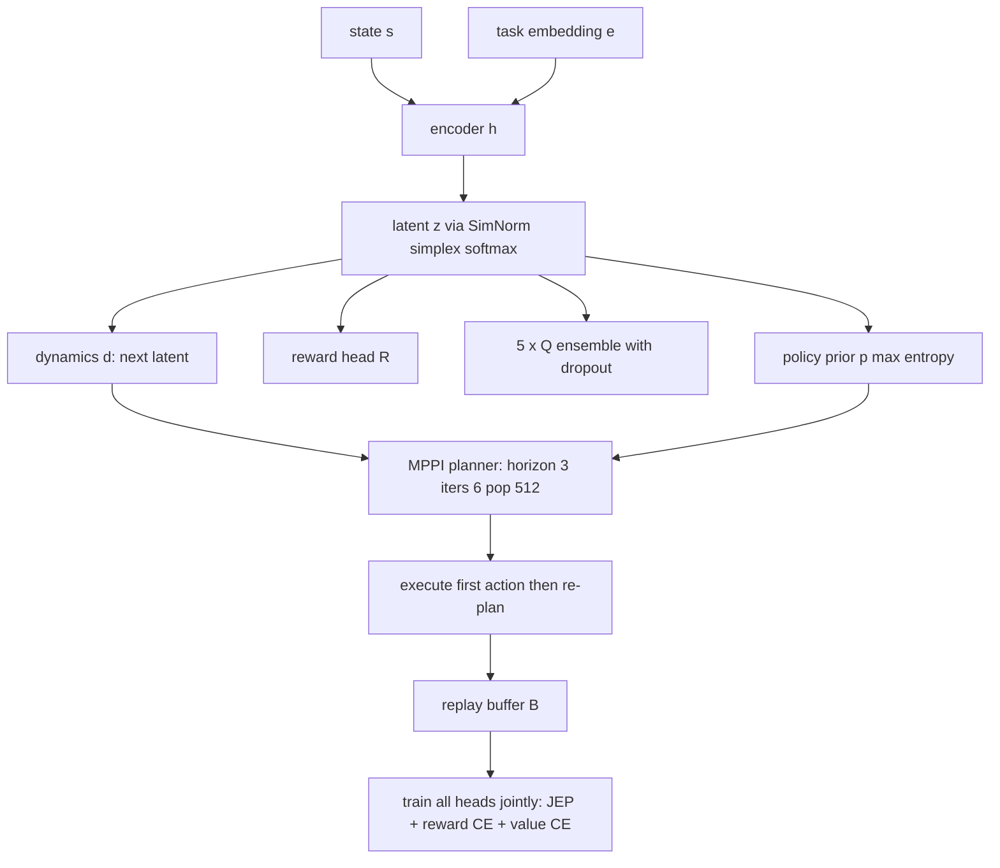

# TD-MPC2: Scalable, Robust World Models for Continuous Control

- 本地 PDF：`papers/world-model/TD-MPC2_2310.16828.pdf`
- arXiv：https://arxiv.org/abs/2310.16828
- 年份：2023（ICLR 2024，Spotlight 档位待确认：论文页眉仅标 "Published as a conference paper at ICLR 2024"，未写口头/spotlight）
- 团队：UC San Diego（Nicklas Hansen，advisor Hao Su 与 Xiaolong Wang）
- 阶段：latent 世界模型 RL 双主线中的 decoder-free MPC 一支——隐式世界模型 + MPPI 规划，五种规模统一超参扩到 80 任务多具身泛化

## 一句话总结

TD-MPC2 在一个不含解码器的隐式（joint-embedding）世界模型上做局部轨迹优化：encoder 把观测压成 SimNorm 归一化的 latent，latent dynamics、reward、terminal value 三个头用 joint-embedding 预测 + 离散回归 + TD 学习联合优化，推理时用带策略先验的 MPPI 在 latent 里在线规划；凭借 LayerNorm+Mish 架构、SimNorm、Q-ensemble 等鲁棒性改造与可学习任务嵌入 + 动作掩码的多任务框架，单组超参覆盖 DMControl/Meta-World/ManiSkill2/MyoSuite 共 104 个连续控制任务，并把单个 317M 参数 agent 训练到同时执行横跨多具身、多动作空间的 80 个任务。

## 核心技术

1. **五组件隐式世界模型**：Encoder $z=h(s,e)$、Latent dynamics $z'=d(z,a,e)$、Reward $\hat r=R(z,a,e)$、Terminal value $\hat q=Q(z,a,e)$、Policy prior $\hat a=p(z,e)$；$e$ 是任务嵌入。没有 decoder——模型只学"预测回报所需的最少动态信息"。
2. **TD 学模型（joint-embedding prediction + discrete regression）**：潜在下一步 $z'_t$ 用 $\ell_2$ 对齐 stop-gradient 后的编码 $h(s'_t)$；reward/value 都是 log 空间 101-bin 的 soft cross-entropy 离散回归，使损失量级与任务奖励量级无关。
3. **SimNorm 单纯形归一化**：把 latent 分成若干长度为 8 的分组、逐组 softmax，得到稀疏化且范数受控的表征；配合全网络 LayerNorm+Mish，消灭了 TD-MPC 一代的梯度爆炸。
4. **Q-ensemble 与 min-clipping**：默认 5 个 Q 网络（各带 1% dropout），TD target 取两个随机子采样 EMA target Q 的最小值抑制过估计。
5. **策略先验引导的 MPPI 规划**：horizon 只有 3、迭代 6 次、population 512、精英 64，其中一部分候选序列来自最大熵 policy prior；执行第一个动作后 warm-start 重规划。规划是显式的（区别于 Dreamer 的"想象中训练策略"），policy/plan 可叠加使用。
6. **多任务机制**：可学习任务嵌入（96 维，$\ell_2\le1$）条件化全部五个组件；输入输出按最大维度 zero-pad，无效动作维度在训练与规划时都被掩掉。

## 底层原理与数学推导

### 1. 模型目标：在 latent 里同时学动态、奖励与价值

对 replay buffer 中采样的片段 $(s,a,r,s')_{0:H}$，五个组件联合最小化（论文式 3）：

$$
\begin{aligned}
L(\Phi) \,.=\, \mathbb{E}\Bigg[\sum_{t=0}^{H}\lambda^t\Big(&\big\|z'_t-\mathrm{sg}(h(s'_t))\big\|_2^2 \\
&+\;\mathrm{CE}(\hat{r}_t,\,r_t)\;+\;\mathrm{CE}(\hat{q}_t,\,q_t)\Big)\Bigg],\qquad
q_t \,.=\, r_t+\gamma\,\bar{Q}(z'_t,\ p(z'_t))
\end{aligned}
$$

其中 $\mathrm{sg}$ 是 stop-gradient（保证 representation 学习不受 TD target 干扰），$\bar Q$ 是 Q 网络的 EMA。三个损失各有分工：joint-embedding 项让 latent 具备可预测的单步动态结构（BYOL 式防坍塌靠 EMA target 完成）；reward CE 提供 task-grounding；value CE 让 latent 直接编码折扣回报，这正是"DMP 需要的是回报预测而非观测重建"的数学表达。reward/value 采用 log 变换空间里的离散回归，等价于把 dreamer v3 的 symexp twohot 思想搬到 MLP 世界：交叉熵只看 bin 概率，与奖励数值大小解耦。

TD target 里通过 policy prior $p(z')$ 选动作而不是随机动作，意味着价值学习发生在"当前最好策略"的 on-policy 轨迹流形附近，这与 SAC 型 actor-critic 共享同一套 self-consistency 直觉。

### 2. 策略先验的最大熵目标

policy prior 学一个随机最大熵策略（论文式 4）：

$$
L_p(\theta) \,.=\, \mathbb{E}_{(s,a)_{0:H}\sim B}\left[\sum_{t=0}^{H}\lambda^t\left[\alpha\,Q(z_t,\,p(z_t))-\beta\, H\bigl(p(\cdot|z_t)\bigr)\right]\right],\qquad z_{t+1}=d(z_t,a_t),\ z_0=h(s_0)
$$

梯度只流向 $p$。$\alpha,\beta$ 的相对尺度决定探索强度，且随数据集与训练阶段漂移——为免过早熵坍塌，TD-MPC2 用移动统计量自动调 $\alpha$（等价做法还有按熵目标调 $\beta$，作者称实验上两者差异不大）。熵只在有效动作维度上计算，这是多动作空间不出错的关键细节。

```mermaid
flowchart TB
    S["state s"] --> ENC["encoder h"]
    E["task embedding e"] --> ENC
    ENC --> Z["latent z via SimNorm simplex softmax"]
    Z --> DYN["dynamics d: next latent"]
    Z --> RW["reward head R"]
    Z --> QN["5 x Q ensemble with dropout"]
    Z --> PP["policy prior p max entropy"]
    DYN --> PLAN["MPPI planner: horizon 3 iters 6 pop 512"]
    PP --> PLAN
    PLAN --> ACT["execute first action then re-plan"]
    ACT --> BUF["replay buffer B"] 
    BUF --> TR["train all heads jointly: JEP + reward CE + value CE"]
```

### 3. 规划目标：bootstrapped 局部轨迹优化

MPC 的原始问题是有限视界回报最大化；MPPI 把它化为对高斯轨迹分布参数 $(\mu,\sigma)$ 的搜索（论文式 6）：

$$
\mu^{*},\sigma^{*} = \arg\max_{(\mu,\sigma)}\ \mathbb{E}_{(a_t)\sim N(\mu,\sigma^2)}\left[\gamma^{H}Q(z_{t+H},a_{t+H}) + \sum_{h=t}^{H-1}\gamma^{h}R(z_h,a_h)\right]
$$

末端价值项 $Q(z_{t+H}, a_{t+H})$ 是整篇算法的灵魂：纯 MPC 只能得到局部最优策略，而 bootstrapping 让超出 horizon 的收益被 critic 概括进来，从而逼近完整 RL 目标。实现上：每步从 $N(\mu,\sigma^2)$ 采 512 条候选（部分来自 policy prior）、按softmax 温度 0.5 加权精英均值更新 $(\mu,\sigma)$、迭代 6 次（动作维度 $\ge20$ 时加到 8）、最后从首步分布采一个动作执行并整体左移一位 warm-start。

### 4. SimNorm 与折折扣启发式

SimNorm 把 $z$ 分成 $L$ 组、每组 $V=8$ 维独立 softmax：

$$
z^{\circ} = [g_1,\ldots,g_L],\qquad g_i = \mathrm{softmax}\!\left(z_{i:i+V}/\tau\right),\qquad V=8,\ \tau=1
$$

它可视作 VQ-VAE 的"软"版本：$\tau\to\infty$ 时退化为 one-hot 离散码，$\tau=0$ 时退化为常数向量，中间态在不施加硬约束的前提下诱导稀疏表征并稳定数值范围。跨任务的另外两个超参被规则化：折扣因子按回合长度取 $\gamma=\mathrm{clip}\bigl((T/5-1)/(T/5),\,[0.95,0.995]\bigr)$（DMControl 得 0.99）；种子步数取 $S=\max(5T,1000)$，保证 replay 先攒够一个模型的起步量再开训。

## 物理直觉解释

**decoder-free 是"为了开车不需要学会画风景画"的取舍**。重建式世界模型（Dreamer 一系）要求模型复制像素级未来，包括云的形状、草的纹理这些和控制毫无关系的细节；TD-MPC2 主张模型应该"最准确预测我关心的结果"——给定动作序列后的 return。它的训练信号只有三样：latent 下一步要像真的下一步（JEP 项）、reward 要猜得准、Q 要收敛到自洽的不动点。直观类比是老司机 vs 写生画家：司机脑子里有一套关于"踩油门后车速/姿态/位置会怎么变"的低维抽象模型，足以完成驾驶决策，却未必能凭记忆画出挡风玻璃外的每一片树叶。代价是解释性——没有像素 rollout 可以肉眼看模型想象了什么。

**MPPI 加 terminal value 是"导航仪路线搜索 + 目的地直觉"的组合**。Planning 只往前看 3 步，等于导航仪每次只推演最近的几个路口；如果只有这 3 步之和，agent 会目光短浅，绕进"眼前舒服、长远吃亏"的死胡同。Critic 提供的 $Q(z_{t+H},a_{t+H})$ 相当于老司机的方向感：一个把"再往后的路好不好走"压缩成单一分数的直觉模块。3 步 horizon 的巨大好处是实时性——512 条候选 × 6 次迭代的采样预算极小，且大量候选直接抄自 policy prior（策略已经会把车开向大致正确的方向，planner 只需修正细节）。这也是它与 Dreamer 的根本分工：Dreamer 在想象里离线打磨策略、执行时不搜索；TD-MPC2 执行时现场搜索，环境一变（光照变化、物体挪动）立刻反映到规划里。

**SimNorm 是给 latent 状态装的"稳压器"**。原版 TD-MPC 对 latent 不加任何约束，训练中 latent 会自我膨胀、梯度爆炸直至发散——论文附录 G 显示 Dog Trot、Walker Stand 等任务上 TD-MPC 梯度范数飙到 $10^9$ 以上。SimNorm 把 latent 切成一组和为 1 的单纯形坐标，天然有界且偏向稀疏（每个 group 内少数维度携带大部分概率质量），等于强迫世界模型"用离散词汇的软混合来描述状态"。这个改动看似工程小技巧，却是整个 scaling 结论（朴素放大 TD-MPC 反而变差、TD-MPC2 五档规模单调变好）的前提条件；与之配套的任务嵌入归一化（$\ell_2\le1$）同理保证了 80 任务混训时不同任务的条件信号不会互相放大。

## 工程细节与实操指南

| 项目 | 值 | 备注 |
|------|-----|------|
| Planning | horizon 3 / 迭代 6 / population 512 / 精英 64 / 温度 0.5 | 动作维度 ≥20 时迭代 +2；无动量；warm-start 左移一位 |
| Policy prior 采样 | 24 条 / 步 | 最大熵 RL，log std 截断 [-10, 2] |
| 网络架构 | 全 MLP + LayerNorm + Mish；encoder dim 256、MLP dim 512、latent 512（5M 版本） | Q 头第一层后接 1% dropout |
| 损失系数 | JEP 20 / reward 0.1 / value 0.1 / 时间衰减 λ=0.5 | reward,value 为 101-bin 离散回归 |
| Q-ensemble | 5 个（target 取随机 2 个的 min，EMA momentum 0.99） | 317M 版本用 8 个 |
| SimNorm | 分组维 V=8，τ=1 | 附录含 3 行 PyTorch 实现 |
| 优化 | UTD 1、batch 256、lr 3e-4 / encoder 1e-4、Adam、梯度裁剪 norm 20 | 多任务训练 batch 放大到 1024，其余不变 |
| 启发式 | $\gamma=\mathrm{clip}((T/5-1)/(T/5),[0.95,0.995])$；seed steps $\max(5T,1000)$ | DMControl T=500 得 γ=0.99 |
| 多任务 | 任务嵌入 96 维 max-norm 1；输入输出 zero-pad；无效动作维度掩码 | 条件化全部五个组件 |
| 模型规模表 | 1M(d128)/5M(d512)/19M(d768,enc1024)/48M(d768,enc1792)/317M(d1376,enc4096) | 编码器层数 2/2/3/4/5；19M 起 latent 768 |

实操要点：(1) 数据集构建——多任务模型用的是 240 个单任务 agent replay buffer 合并出的 545M transitions；80 任务集合由全部 50 个 Meta-World 任务加 30 个 DMControl 任务组成（另有 30-task 纯 DMControl 子集单独报告了扩容曲线）；(2) 评测发布 300+ checkpoints；(3) 若做视觉输入，换 4 层浅 CNN encoder + 64×64 输入 + random shift 增强，其余超参不动；(4) 微调新任务时可把 $e$ 初始化成语义相近任务的嵌入或随机向量。

## 消融实验与分析

| 实验 | 对照设置 | 关键数字结果 |
|------|------|------|
| 扩容主曲线（图 7，80 任务 normalized score） | 1M/5M/19M/48M/317M | **16.0 → 49.5 → 57.1 → 68.0 → 70.6**；30 任务 DMControl 子集 **18.9 → 28.3 → 54.2 → 59.4 → 71.4**；TD-MPC 同规模不升反降 |
| Actor 消融（图 9 bar，19M 80 任务） | 仅策略 vs 仅规划 vs 策略+规划 | Policy **42.2**、Planning **53.7**、Planning+Policy **54.2**（单任务难例集上三者为 Actor 曲线组） |
| 表征归一化（图 9） | No Norm vs SimNorm vs LN+SimNorm | **46.8 → 51.0 → 54.2** |
| 回归形式（图 9） | 连续回归 vs 离散回归 | Continuous **49.6** vs Discrete **54.2** |
| Q 数量（图 9） | 2 / 5 / 10 个 | **53.5 / 54.2 / 57.0** |
| 任务嵌入归一化（图 18） | unnormalized vs normalized（ℓ2≤1） | **46.6** vs **54.2** |
| 少样本迁移（图 8） | 从零训练 vs 70 任务预训练后在 10 个 held-out 任务微调 20k 步 | From scratch **24.0** vs Finetuned **47.0**（约 2 倍提升） |
| 训练成本（表 1，单张 RTX 3090 GPU 天） | 各规模 | 1M:**3.7** 天(score 16.0)、5M:**4.2**(49.5)、19M:**5.3**(57.1)、48M:**12**(68.0)、317M:**33**(70.6) |
| 样本效率对照（表 5，ViT-L 冻结评测） | V-JEPA vs OmniMAE / VideoMAE / Hiera-L | K400 **80.8** vs 65.6/77.8/75.5；SSv2 **69.5** vs 60.6/65.5/64.2；AVA **25.6** vs 14.4/21.6/15.8；预处理仅见 **270M** 样本（基线最高 2400M） |

**核心结论**：(1) 扩容有效性是本文第一主张——TD-MPC2 的 score 随参数近线性于 log 参数上升且 317M 时仍未饱和，而同样放大的 TD-MPC 性能下降，说明瓶颈在算法鲁棒性而非规模。(2) 消融贡献排序清晰：去掉整个 planning 掉约 12 分（42.2 对 54.2）是最痛的一刀，其后依次是 Latent 归一化（46.8 对 54.2）、回归形式（49.6 对 54.2）、任务嵌入归一化（46.6 对 54.2）；Q-ensemble 则给出正向扩展信号（2 个 53.5 到 10 个 57.0），规划主体（Planning 53.7）已经接近完整方法，说明 value-quality 与模型质量承担了大部分能力。(3) 少样本翻倍（24.0 到 47.0）与视觉任务持平 DrQ-v2/DreamerV3 说明该配方不止在 state 输入下成立，为"通用世界模型作为机器人基础模型"提供了第一批可复现证据。

## 技术权衡（Trade-off）

| 优势 | 代价与边界 |
|------|-----------|
| 无需像素重建，模型容量集中在控制相关信息，支持大规模混训与跨具身 | 没有 rollout 可视化，调试只能依赖 reward/Q 曲线与 t-SNE 任务嵌入 |
| 显式规划响应快（horizon 3、分钟级内可重规划），对分布偏移更鲁棒 | 每个动作要跑 6 次 MPPI 迭代 × 512 候选的模型前向，吞吐低于直接查表式策略 |
| 统一超参覆盖 104 个连续控制任务并可零改扩到视觉 | 不支持离散动作空间（附录 I 明示为开放问题，Atari/Minecraft 类任务仍需 Dreamer 一系） |
| 依赖 reward 才能定义任务，多任务靠嵌入区分 | 作者自列三条风险：reward 错误设定导致意外行为、把不受约束的自主权交给模型可能有灾难性后果、小团队难以负担大规模数据采集导致的资源集中；且简单 reward 之外的监督（success label、偏好）如何用于预训练仍是开放问题 |

## 技术价值与演进定位

TD-MPC2 第一次证明"RL 世界模型也能像 LLM 一样扩而不崩"，它给出的可扩容配方由三件事组成：受约束的表征（SimNorm + LayerNorm 数值域）、与奖励量级解耦的目标（离散回归）、以及跨任务条件化的接口（任务嵌入 + zero-pad/mask）。在此之前，model-based RL 的共识是"加大模型常常变差"；此文与其 appendix G 的梯度可视化一起把这个结论修正为"未稳住的模型才会"。对机器人方向的定位是承上启下的：它是 model-based RL 到通用机器人的桥——80 任务、多具身、多动作空间的单一 checkpoint，加上预训练模型微调翻倍的 few-shot 结果，预告了后来 world-model-as-foundation-model 的技术路线；它也明确点名下一步需要把 "reward 换成 success label、人类偏好或 goal embedding 距离" 这类广义监督来做大规模预训练。

## 与其他论文的关系

- **Dreamer v3 — 同题对立的镜像方案**：两者都是"latent 世界模型 + actor-critic"，但 Dreamer 用重建损失学生成式模型、在想象中训练策略、执行时不搜索；TD-MPC2 用 JEP 学隐式模型、执行时 MPPI 搜索。本文实验直接报告 DreamerV3 baseline（S 尺寸 20M、UTD 512）在 Dog 任务数值不稳、操纵任务弱于自己；反过来其附录 I 承认离散动作无法处理。
- **TD-MPC（2022）— 直接前身**：保留"latent 规划 + TD 学模型"骨架，新增 LayerNorm+Mish 架构、SimNorm、max-entropy policy prior、Q-ensemble（2 到 5）、离散回归、任务嵌入多任务框架，并用 uniform replay 替代优先回放、删去 MPPI 动量，换来"朴素扩容不再退化"这一关键性质。
- **I-JEPA / BYOL — JEP 表示学习的同源思想**：模型目标的 JEP 项就是 BYOL 式 online-target-EMA 结构；差别在于 JEPA 用于静态感知预训练，而此处把它作为控制回路内模型的动态正则，并与 TD bootstrap 共存。
- **V-JEPA — 表征线的视频端延伸**：同属"predict in latent space"家族，V-JEPA 预测时空块特征并以 attentive probe 消费；TD-MPC2 则把 latent 预测用于动作条件的规划。两者共同支撑了 LeCun "predicting in representation space" 的技术主张，前者走向通用视觉表征，后者走向机器人基础策略。
- **DayDreamer — 同族路线的真机分支**：DayDreamer 证明 Dreamer 型重建世界模型能在真机 1 小时学会走路；本文引用的 Modem 与 Modem-V2（Lancaster et al.）把同一支 TD-MPC 路线推向真实机器人操纵，其中 Modem-V2 已支持 9×224×224 大分辨率视觉输入，延续"decoder-free + 规划"的真机可行性。
- **Gato / RT-1 / GSL — 扩容对照组**：这三条线分别依赖专家演示、动作 token 化或种群蒸馏，TD-MPC2 强调自己不需要 near-expert 数据、不做动作离散化即可容纳混合质量数据与高维连续动作。

## 精读问题

1. **规划的贡献边界**：消融显示 Planning-only 已达 53.7（完整方法 54.2），那么对多任务泛化真正关键的究竟是"在 latent 里搜索"还是"TD 逼出的高质量 Q"？如果把 horizon 从 3 扩到 10、planning 迭代减半，80 任务曲线会怎么移动？
2. **任务嵌入学到的是什么**：t-SNE 显示 Door Open 与 Door Close 相邻、聚类更贴近动力学相似性而非目标相似性——那么对一个动力学相同但奖励相反的新任务，这种嵌入空间还能提供有意义的初始化吗？
3. **JEP 权重 20 对 0.1 的悬殊比例**：representation 损失权重是 reward/value 的 200 倍，为什么 latent 结构需要如此强势？这是否等价于把世界模型当作"表征学习方法"、把 reward/value 当作轻量探针？
4. **离散回归的 bin 设计风险**：101 个 log-space bin 的范围必须覆盖所有任务的奖励与 Q 量级，多任务混训时极端任务（如 Pick YCB 的稀疏 success 奖励）是否会挤占 bin 分辨率？换 twohot 式分段线性变换是否更稳？
5. **扩容曲线上限**：317M 时 70.6 仍在上升，但继续扩容需要更多任务与数据，而 545M transitions 已来自 240 个 agent 的 replay——瓶颈会不会先出现在任务多样性而非参数量？
6. **与采样式规划的替代关系**：CEM/MPPI 这种 derivative-free 优化在动作维度高时的缩放规律是什么？若换成 MuZero 式树搜索（作者在附录 I 建议），是否需要先重新参数化离散动作的搜索接口，还是可以借鉴 Hubert et al. 用采样把 MCTS 搬到连续动作空间的思路反向操作？
