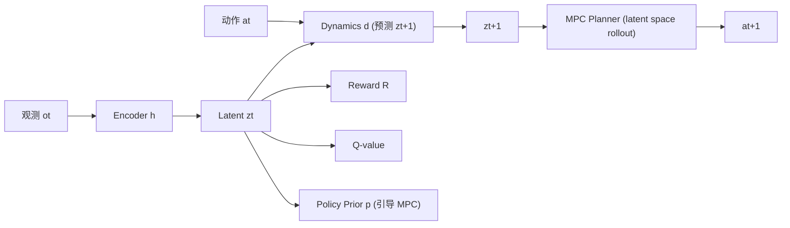

# TD-MPC2: Scalable, Robust World Models for Continuous Control

- 本地 PDF：`papers/world-model/TD-MPC2_2310.16828.pdf`
- arXiv：https://arxiv.org/abs/2310.16828
- 年份：2023 (ICLR 2024)
- 团队：UC San Diego (Nicklas Hansen, Hao Su, Xiaolong Wang)
- 阶段：可扩展隐式世界模型 + MPC 规划

## 一句话总结

TD-MPC2 提出隐式（decoder-free）世界模型 + latent space MPC 规划，单一超参配置在 104 个连续控制任务上超越 Dreamer v3 和 SAC，并成功训练 317M 参数单一 agent 执行 80 个跨域/跨具身/跨动作空间任务。

## 核心技术

1. **隐式世界模型 (Decoder-free)** — 不做像素重建，直接预测 latent 下一步表征 + reward + value，训练更高效，世界模型学习与任务目标对齐
2. **Joint-Embedding Prediction** — encoder $h_\theta$ 映射观测到 latent，dynamics $d_\theta$ 预测下一步 latent，reward $R_\theta$ 和价值 $Q_\theta$ 从 latent 预测
3. **Latent Space MPC (Model Predictive Control)** — 在 latent 空间采样动作序列，用世界模型 rollout，挑选最优轨迹，执行第一步后重新规划
4. **大规模多任务训练** — 317M 参数模型在 DMControl + Meta-World + ManiSkill2 + MyoSuite 四域共 80 任务上联合训练

## 底层原理与数学推导

TD-MPC2 五大组件：
- **Encoder** $h_\theta$: $o_t \to z_t$（观测 → latent）
- **Dynamics** $d_\theta$: $(z_t, a_t) \to z_{t+1}$（latent 前向动态）
- **Reward** $R_\theta$: $(z_t, a_t) \to r_t$
- **Value** $Q_\theta$: $(z_t, a_t) \to q_t$（TD-learning）
- **Policy prior** $p_\theta$: $z_t \to a_t$（引导 planner 采样，减少计算）

```mermaid
graph LR
    O["观测 ot"] --> ENC["Encoder h"]
    ENC --> Z["Latent zt"]
    Z --> DYN["Dynamics d (预测 zt+1)"]
    Z --> R["Reward R"]
    Z --> Q["Q-value"]
    Z --> P["Policy Prior p (引导 MPC)"]
    A["动作 at"] --> DYN
    DYN --> ZNEXT["zt+1"]
    ZNEXT --> PLAN["MPC Planner (latent space rollout)"]
    PLAN --> ANEXT["at+1"]
```

**与 Dreamer v3 关键区别**: TD-MPC2 不做解码器（无重建 loss），用 TD-learning 提供任务信号，使世界模型学习直接服务于任务。

**SimNorm 表示归一化**：latent 被划分为 L 组、每组 V 维，逐组 softmax 得到单纯形嵌入（simplex embedding），天然偏向稀疏表示：

$$
z^\circ = [g_1, \ldots, g_L], \quad g_i = \frac{e^{z_{i:i+V} / \tau}}{\sum_{j=1}^{V} e^{z_{i:i+V} / \tau}}
$$

其中 $\tau > 0$ 为温度参数，调节表示的"稀疏度"。论文实验表明 SimNorm 对 TD-MPC2 的训练稳定性至关重要（多任务归一化分数 No Norm 49.6 → SimNorm 54.2）。

## 物理直觉解释

**TD-MPC2 的核心直觉：不需要学会"看到"未来，只需要学会"感知"未来**。就像驾驶——你不需要在脑子里渲染一帧一帧的影像来预测 3 秒后的路况，你只需要知道"大概在什么位置、什么方向"就够了。TD-MPC2 的世界模型学的是这种抽象的 latent 预测——省去了从 latent 重建像素的巨大计算开销（Dreamer v3 用约 20M 参数做生成式重建，TD-MPC2 只用 5M 参数且 UTD=1 vs DreamerV3 的 512），把全部容量聚焦在"什么状态更好、什么动作更优"上。这也解释了为什么 TD-MPC2 能在 104 个任务上单一超参全面超越 SAC/DreamerV3/TD-MPC——不是靠更大的模型，而是靠"把计算花在决策信号上而不是像素重建上"。

**MPC 规划像下棋时的走一步看多步**：在 latent 空间快速模拟几个候选动作序列，用 Q-value 评估哪个最好，只执行第一步，下次观测后再重新规划——这天然提供闭环鲁棒性，且不需要像 actor-critic 那样显式训练策略。5 个 Q-function 的 ensemble 用 EMA 更新目标、取最小值防乐观偏差（源自 clipped double-Q）；policy prior 则像"棋手的开局库"——把随机采样引导到高概率区域，大幅减少 MPC 需要的采样数。

**SimNorm 是让这一切稳定收敛的"隐形功臣"**。多任务联合训练中 latent 空间会发生漂移（不同任务、不同动作空间的表征尺度差异巨大），SimNorm 把 latent 逐组 softmax 到单纯形上——像把不同国家的货币统一换算成"占总额的比例"——天然稀疏且尺度有界，多任务归一化分数从 49.6 提到 54.2。加上任务 embedding 的语义结构（相关任务在 embedding 空间邻近），317M 参数的单一 agent 才能在 80 个跨域任务上联合训练而不崩。

## 工程细节与实操指南

- **Encoder $h_\\theta$**: 观测 → latent $z_t$，共享于所有下游组件
- **Dynamics $d_\\theta$**: $(z_t, a_t)$ → $z_{t+1}$，学习 latent 前向动态
- **Reward $R_\\theta$**: $(z_t, a_t)$ → $r_t$，预测即时奖励
- **Value $Q_\\theta$**: $(z_t, a_t)$ → $q_t$，TD-learning 估计期望回报
- **Policy prior $p_\\theta$**: $z_t$ → $a_t$，引导 MPC 采样（减少随机采样浪费）
- **MPC 推理**：在 latent space 采样 N 条动作轨迹，用 dynamics roll-out H 步，Q-value 评估，选最优轨迹第一条动作执行；下次观测后重规划
- 多任务训练 317M 参数需大量 GPU（论文用 TPU v3 pod），但推理时单 GPU 可行
- Policy prior 的作用：将随机采样引导到高概率区域，大幅减少 MPC 所需采样数

## 实验

**单任务 (104 tasks, 固定超参)**:
| Domain | 任务数 | vs Dreamer v3 | vs SAC |
|--------|-------|---------------|--------|
| DMControl | 39 | 显著超越 | 显著超越 |
| Meta-World | 50 | 显著超越 | 显著超越 |
| ManiSkill2 | 5 | 显著超越 | 显著超越 |
| MyoSuite | 10 | 显著超越 | 显著超越 |

**多任务 scaling**: 317M 参数 agent 执行 **80 个任务**（4 域 × 多具身 × 多动作空间），单个模型单一超参。

## 消融实验与分析

| 消融/对比维度 | 设置对比 | 关键结果 |
|---------|---------|---------|
| 数据效率（104 任务） | TD-MPC2（单一超参）vs SAC/DreamerV3/TD-MPC | 全部任务域胜出；TD-MPC 部分任务因梯度爆炸发散 |
| 无先验基准（MyoSuite） | 发布前未跑过该 benchmark 的配置 | 10 个 MyoSuite 任务依然全面胜出，排除调参嫌疑 |
| 高难任务（Pick YCB） | TD-MPC2 vs 其他方法（14M 步，74 个 YCB 物体） | TD-MPC2 >60% 成功率，其他方法在预算内学不出来 |
| 表示归一化（80 任务多任务） | No Norm vs SimNorm | 归一化分数 49.6 → 54.2，SimNorm 对训练稳定性至关重要 |
| Q-function ensemble | 2 / 5 / 10 个 | 实践中用 5 个；ensemble + EMA 目标降低 TD-target 偏差 |
| 模型规模 scaling | 1M / 5M / 19M / 48M / 317M | 多任务性能随规模单调提升，317M agent 执行 80 任务 |
| 训练预算对比 | batch 256 / UTD 1（TD-MPC2）vs batch 512（SAC/TD-MPC）vs UTD 512（DreamerV3） | 相同甚至更少的更新预算下性能更优 |

**核心结论**：TD-MPC2 的验证逻辑是"广度 + 深度"双层——广度上，104 个任务单一超参全面超越特化调参的 SAC/TD-MPC 与生成式 DreamerV3，且 MyoSuite 的"无先验"结果排除了过拟合基准的嫌疑；深度上，Pick YCB（74 物体）>60% vs 其他方法学不出来，说明隐式世界模型在高维视觉操作任务上具有架构性优势。消融层面，SimNorm（49.6→54.2）与 Q-ensemble 是稳定性支柱，模型规模 1M→317M 单调 scaling 证明算法创新的可扩展性——这与 WEAVER/FlashSAC 观察到的"scaling 配方在 RL 中复现"互相印证。

## 技术权衡（Trade-off）

| 优势 | 劣势与工程代价 |
|------|----------------|
| 无解码器，训练更高效（无重建 computation） | 缺少重建可视化，难以 debug 世界模型质量 |
| 单一超参 104 任务，超越特化算法 | MPC 在 latent space 的采样仍消耗推理时间 |
| 多任务 scaling 到 317M/80 tasks | 庞大规模训练需要大量计算资源 |
| Policy prior 引导 MPC 采样，减少计算 | Prior 质量影响 planner 效率，差 prior 需更多采样 |

## 技术价值与演进定位

TD-MPC2 是"世界模型 + 规划"路线的代表——与 Dreamer 无模型路线（actor-critic 在 latent 想象训练）形成多任务 RL 两条主线。它的三个贡献具有持久影响力：其一，**隐式（decoder-free）世界模型的可行性证明**——不做像素重建、以 TD-learning 提供任务信号，使世界模型的学习目标与任务目标直接对齐，5M 参数 + UTD=1 就超过 20M 参数 + UTD=512 的生成式方法；其二，**大规模多任务 scaling 实证**——317M 参数单 agent 在 80 个跨域/跨具身/跨动作空间任务上联合训练，配合 SimNorm 表示归一化解决 latent 漂移，为"通用机器人 RL 基础模型"提供了可复现配方；其三，**latent space MPC + policy prior 的规划范式**——MPC 以规划替代显式 actor，天然闭环鲁棒。后续 TD-MPC2 系（如与 VLA 结合的离线世界模型微调）持续沿用这一底座，SimDist 的 MPPI 规划也直接复用 TD-MPC 的实现。

## 与其他论文的关系

- **Dreamer v3** 同是世界模型 RL，但用显式解码 + 像素重建，TD-MPC2 用隐式 + TD-learning
- **DayDreamer** 将 Dreamer 应用到真实机器人，TD-MPC2 的隐式世界模型在真实机器人上待验证
- **π0 / π0.5** 用 VLM + flow matching 做模仿学习，TD-MPC2 用 RL + planning，互为补充

## 精读问题

1. 隐式世界模型的不可观测性如何验证？如何确保 latent space 学到了有意义的表征？SimNorm 的稀疏偏置是否限制了表示容量？
2. Policy prior 的质量多大程度上影响 MPC 的效率？差的 prior 需要多少额外采样？prior 与 planner 的交互是否存在博弈（prior 变好 → planner 采样分布收窄 → 探索退化）？
3. 317M 模型在 80 任务上是否出现负迁移？多任务训练 vs 单任务训练的性能差距？任务 embedding 的语义结构与迁移方向的关系？
4. UTD=1 与 batch 256 在 104 任务上通用，但在真实机器人（样本昂贵、非平稳）上是否仍然成立？离线微调（Feng et al. 2023）的边界在哪？
5. 规划视界 H 与 Q-value 评估的交互——长视界下 latent 动力学误差如何累积？MPC 重规划频率与性能的权衡？
