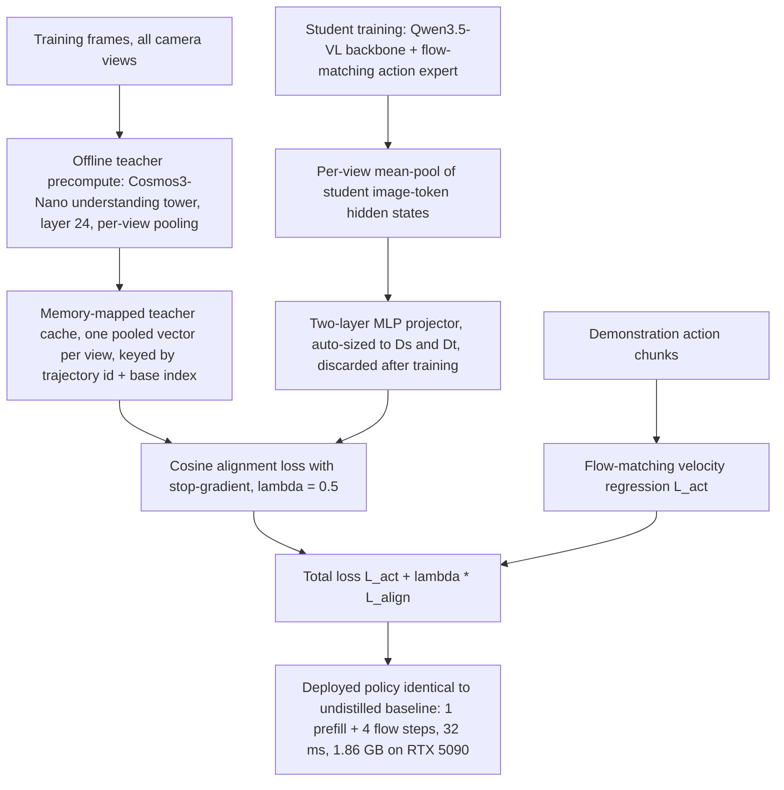

# ThinkWVLA: Think Like a World Model, Act Like a VLA（把世界模型表征蒸馏进紧凑 VLA）

- arXiv: https://arxiv.org/abs/2609.24682
- Source: https://arxiv.org/abs/2609.24682
- Project: https://thaw-vla.trung-dt.com/
- Local PDF: `/Users/luogu/physical_intelligence/papers/world-model/ThinkWVLA_2609.24682.pdf`
- Year: 2026
- Category: world-model
- Priority: high

## 一句话总结

ThinkWVLA 的核心洞察是把世界模型的两种资产拆开：**关于物理场景的知识在其内部特征里，生成未来只是产出这些特征的目标函数**——于是可以在训练期向一个冻结世界模型（Cosmos3-Nano 理解塔，8B）的特征缓存对齐学生 VLA 的池化图像 token（一项余弦对齐损失，教师离线跑一次、训练时零教师前向、训练后投影器直接丢弃），部署图与未蒸馏基线完全相同：0.8B 学生在 RTX 5090 上 32 ms / 1.86 GB（对照 DreamZero 3 s / 45.9 GB 在 H100 上、32 GB 的 5090 直接 OOM），LIBERO 97.9±0.5（同架构未蒸馏 95.3±0.7，+2.6）、RoboCasa-GR1 人形操作 48.2 到 50.5（+2.3），真机单臂鸡蛋任务 46.7% 到 60.0%（4B π 型策略 70.0%），且增益穿越学生规模（0.8B/1B/4B）、骨干家族（Qwen3.5-VL/InternVL/Qwen3-VL）、对齐层（L8-L24 差距小于 4 个点）与教师家族（三个教师 +1.2 到 +2.6）——证据指向"迁移的是广义表征先验而非两个特定网络的偶然对齐"。

## 核心技术

1. **零推理成本的世界模型蒸馏配方**：在普通 VLA 训练损失上加一项特征对齐——冻结世界模型对训练帧跑一遍、逐相机视图 mean-pool 后写入 memory-mapped 缓存（键为 trajectory id + base index），训练时只读缓存；学生侧同样对图像 token span 做逐视图 mean-pool，经两层 MLP 投影器对齐教师方向。训练全程不加载教师权重、训练结束丢弃投影器，部署网络与未蒸馏基线逐位相同（含 flow 步数）。
2. **方向对齐而非数值复现**：损失是余弦距离而非 L2——学生只需与教师特征**同方向**，可以保留动作目标所需的额外结构；因此师生不必共享特征空间或维度，投影器可自适应任意 $(D_s, D_t)$ 组合，一份缓存可服务多个学生。
3. **学生**：QwenGR00T（StarVLA 代码库）——Qwen3.5-VL 家族视觉-语言骨干 + GR00T 式 flow-matching 动作专家，观测为多相机视图 + 语言指令 + 本体感觉；推理为一次骨干 prefill + 4 个 flow 步。
4. **教师**：Cosmos 3（omnimodal MoT 世界模型）的 understanding tower——从统一 checkpoint 抽出其 Qwen3-VL-8B reasoner（16B 模型的 8B 塔），读第 24 层图像 token 隐状态、逐视图池化，$D_t=4096$；该塔确定性（无扩散时间步/采样）。
5. **刻意排除动作通道**：教师动作目标完全不用（师生动作参数化不同，依赖教师动作的配方无法教师无关）；教师的一切贡献都通过内部状态进入。
6. **四轮评估协议**：流匹配动作头采样非确定 + 仿真渲染器跨 GPU 非位一致，故每个 checkpoint 用 2 个种子 × 2 种 GPU（A100-80GB、RTX 5090）评 4 次报均值±标准差——LIBERO 离散度约 1-1.5 个点、RoboCasa-GR1 换 GPU 可摆动数个点。

## 底层原理与数学推导

方法的全部数学内容是"一个 flow-matching 动作损失 + 一个余弦对齐损失"，其力量来自教师特征承载的物理接地先验。

**动作目标**（式 1）：动作专家以速度回归沿 flow 路径去噪。设噪声 $\epsilon\sim\mathcal{N}(0,I)$、flow 时间 $\tau\in[0,1]$、线性插值 $a_\tau=\tau\epsilon+(1-\tau)a_{t:t+K}$，专家回归路径速度 $\mathrm{d}a_\tau/\mathrm{d}\tau=\epsilon-a_{t:t+K}$：

$$\mathcal{L}_{\text{act}}=\mathbb{E}_{o_t,\tau,\epsilon}\big\lVert v_\theta\big(a_\tau,\tau,h(o_t)\big)-(\epsilon-a_{t:t+K})\big\rVert^2,$$

其中 $h(o_t)\in\mathbb{R}^{L\times D_s}$ 是骨干最终层隐状态，$L$ 为前缀 token 数（各视图图像 token + 指令 token + 状态 token）。动作监督始终来自真值演示，教师动作目标一律不用。

**对齐目标**（式 2、3）：对每个相机视图 $c\in\mathcal{C}$，对 $h(o_t)$ 的该视图图像 token span $\mathcal{I}_c$ 做平均池化得 $f^S_c(o_t)=\frac{1}{|\mathcal{I}_c|}\sum_{i\in\mathcal{I}_c}h_i(o_t)\in\mathbb{R}^{D_s}$（各视图 span 不相交、只覆盖图像部分），投影后与缓存中的教师特征 $f^T_c\in\mathbb{R}^{D_t}$ 做余弦对齐：

$$\mathcal{L}_{\text{align}}=1-\cos\!\Big(p_\phi\big(f^S_c(o_t)\big),\;\mathrm{sg}\big[f^T_c(o_t)\big]\Big),\qquad \cos(u,v)=\frac{u^\top v}{\lVert u\rVert\,\lVert v\rVert},$$

总损失为 $\mathcal{L}_{\text{act}}+\lambda_{\text{align}}\mathcal{L}_{\text{align}}$，$\lambda_{\text{align}}=0.5$ 全程固定。$\mathrm{sg}[\cdot]$ 保证梯度只进学生与投影器。

**为什么余弦而不是 L2**：REPA 一线（扩散 Transformer 表征对齐）验证过逐点、投影中介的余弦目标足以迁移中间层知识；余弦只约束单位球面上的方向，学生特征范数与其携带的动作相关信息不受教师特征尺度的挤压——这是"师生可以生活在不兼容环境、一份缓存服务多个学生"的形式基础。

**归因逻辑（消融设计的数学意图）**：设蒸馏增益 $G=S_{\text{distill}}-S_{\text{base}}$，论文通过固定部署图（推理零额外计算）排除容量与测试期算力两个混杂，再在教师族 $\{ \text{Cosmos3}, \text{Fast-WAM}, \text{V-JEPA2-AC} \}$、学生规模 $\{0.8\text{B},1\text{B},4\text{B}\}$、骨干族 $\{\text{Qwen},\text{InternVL}\}$、对齐层 $\{L8,L12,L16,L24\}$ 四个维度分别重测 $G$——若 $G$ 是两个特定网络的偶然对齐，任一维度替换应使其消失；实测 $G$ 在全部维度上保持正值（+1.2 到 +2.6 / +2.5 / +2.4 / +1.6 相对 L16 等），支持"广义表征先验"解释。

## 物理直觉解释

**第一段：老师傅不下场，学生抄观察笔记**。世界模型像一位懂物理的老师傅：他之所以懂，是因为常年被要求"预测下一刻会发生什么"（生成式目标逼他内化时间结构与因果后果），但让他亲自操作（每个决策把未来滚动一遍）要 3 秒一次，根本进不了控制回路。ThinkWVLA 的做法是**学生只抄老师傅的观察笔记**——冻结教师对每帧训练图像的看法（第 24 层池化特征）被一次性誊写成卡片（缓存），学生学习"我看到这幕时，笔记应该怎么写"。生成未来这套昂贵的手艺本身从不传授，因为老师傅的见识已经长在他的笔记风格里；学生抄会了笔记，等于继承了"看一眼就知道哪里会动、哪里受力、哪里是物体"的物理直觉，而下场操作仍用自己的轻量身手（32 ms 一次出手）。部署时笔记课毕、卡片锁进抽屉，学生凭内化的眼光独立作业。

**第二段：缓存让蒸馏变成"读菜谱"而不是"请私教"**。传统特征蒸馏要在训练的每个 batch 里前向教师——8B 教师全程驻留显存、每步重算同样的帧特征，像**每学一道菜都把私教请到家里重做一遍演示**。因为教师冻结、其输出只依赖训练帧，ThinkWVLA 把所有演示提前做好、写进 memory-mapped 缓存（LIBERO 全量约 4 GPU 时），训练时像**读装订好的菜谱**：零教师显存、零教师前向、蒸馏训练成本等于基线训练成本；一份菜谱还能给多个学生用（投影器自适应任意 $(D_s,D_t)$），教师与学生可以住在互不兼容的软件环境里。这个工程性选择是"零推理成本"之外的第二重成本消除——训练成本也被摊平。

**第三段：方向一致即可，保留自己的方言**。余弦对齐的语义是**只要求笔记的方向一致，不要求逐字相同**：两个学生描述同一幕可以用不同的词汇量（维度）、不同的口音（额外结构），只要"物体在哪、哪里在动"的几何方向对上就行。这解决了跨架构蒸馏最脆的一环——若用 L2 逼学生逐字复述教师的 4096 维特征，学生为匹配陌生尺度必须挤掉自己的动作相关结构，动作目标与对齐目标直接打架；只锁方向，学生保留"我自己的方言"（动作头需要的那些信息），双方在单位球上握手。消融里这套宽容性的回报是：换学生规模、换骨干家族、换对齐层（L8 到 L24 都稳定训练、最大差距小于 4 个点）、甚至换教师家族（视频 DiT、enc-predictor、omnimodal VLM 三种教师全部有效），增益都不消失——配方的稳健性正来自"传方向不传内容"这个设计决策。

## 工程细节与实操指南

- **模型规模**：学生 0.8B（Qwen3.5-VL 骨干 + GR00T 式 flow-matching 专家；消融另有 InternVL 1B、Qwen3-VL 4B）；教师 Cosmos3-Nano 理解塔 8B（属 16B 的 Cosmos 3 checkpoint，抽 Qwen3-VL-8B reasoner、读第 24 层、$D_t=4096$/视图）；消融教师 Fast-WAM（Wan2.2-TI2V-5B 底座、读 video expert 第 15/30 层 frame-0、$D_t=3072$）与 V-JEPA2-AC（ViT-g/16 编码器 1.0B + 0.3B 预测器、读 predictor 归一化前隐状态、$D_t=1024$、需在目标数据集上后训）。
- **训练配置**：4×A100-80GB，DeepSpeed ZeRO-2，有效 batch 256，余弦调度、最小 lr 随全程步数预算衰减；$\lambda_{\text{align}}=0.5$；学生推理 1 次 prefill + 4 个 flow 步。**学习率峰值、总训练步数**：待确认——论文未给出具体数值。
- **数据规模**：LIBERO 四套件约 273k 演示步、双相机视图，每套件 50 episodes × 10 任务 = 500 次评估；RoboCasa-GR1 24 个 GR1 Fourier 人形环境（单 ego 相机、29 维双臂动作、58 维状态）每环境 1000 条演示、共 24k episodes / 6.02M 步，单策略联合训练、每环境 20 episodes 评估。
- **教师缓存成本**：LIBERO 约 4 GPU 一小时；每缓存行是每相机视图一个池化向量，存储廉价。
- **推理成本**（图 1b）：本文 0.8B——32 ms / 1.86 GB（RTX 5090，32 GB 卡）；π0.5（3B）——65 ms / 8.79 GB（RTX 5090）；DreamZero（14B）——3 s（H100，经缓存/核融合/量化/蒸馏多层优化后）/ 45.9 GB，5090 上 OOM。
- **评估协议**：仿真主表为 4 次评估均值（2 种子 × A100-80GB + RTX 5090），报均值±std；RoboCasa-GR1 消融因算力所限单次 A100（故表 IV 的 50.3/52.8 与表 II 的 48.2/50.5 不可直接对齐）；层消融只训 1/4 日程、绝对值低于主表、只有排序有意义。
- **真机**：AgileX Nero 7-DoF 单臂（水果、鸡蛋两个 pick-and-place）+ TRIP-Bag 7-DoF 双臂（双手交接）；每格 30 次试验；单臂任务约 30 分钟遥操作微调、双臂 1 小时。
- **代码**：待确认——论文给项目页 https://thaw-vla.trung-dt.com/ 但正文未声明代码开源；学生家族来自 StarVLA 代码库（arXiv:2604.05014，开源）。

## 消融实验与分析

主结果与四组消融（LIBERO 为四轮均值±std；RoboCasa-GR1 消融为单次 A100）：

| 实验 | 配置 | 成功率 (%) | 蒸馏增益 |
|---|---|---|---|
| 主结果 LIBERO | 0.8B 无蒸馏 vs 蒸馏 | 95.3±0.7 → 97.9±0.5 | +2.6 |
| 主结果 RoboCasa-GR1 | 0.8B 无蒸馏 vs 蒸馏 | 48.2±2.1 → 50.5±2.3 | +2.3 |
| 教师消融（LIBERO） | V-JEPA2-AC / Fast-WAM / Cosmos3-Nano | 96.5±0.3 / 96.9±0.8 / 97.9±0.5（基线 95.3） | +1.2 / +1.6 / +2.6 |
| 学生规模与骨干（GR1） | Qwen3.5-VL 0.8B / InternVL 1B / Qwen3-VL 4B | 50.3→52.8 / 50.9→53.3 / 56.8→58.4 | +2.5 / +2.4 / +1.6 |
| 对齐层（GR1，1/4 日程） | L8 / L12 / L16 / L24(最终) | 47.5 / 49.4 / 45.9 / 49.8 | 排序非单调，最佳与次佳差 0.4 |

**核心结论：**
1. **教师无关性成立**：三个在训练目标（enc-predictor / 视频 DiT / omnimodal VLM）、架构、特征宽度（1024/3072/4096）上全部不同的世界模型教师都提升同一学生（+1.2 到 +2.6），且保持"世界模型 > 未蒸馏"的一致排序——收益归因于世界模型表征本身而非 Cosmos3 的特殊性。
2. **规模与骨干不是前提**：0.8B、1B、4B 三个规模与两个骨干家族全部为正增益（+2.5/+2.4/+1.6），4B 上增益略小但把 4B QwenGR00T 从 56.8 推到 58.4、距最强已发布 4B 系（ABot-M0 58.3）持平——配方可叠加在更大底座上。
3. **对齐层宽容但不单调**：L8-L24 全部稳定训练、最大差 3.9 个点（49.8 vs 45.9），最终层 L24 最佳且实现最便宜（动作头本来就要消费它，无需保留中间层激活）——论文自己也承认 1/4 日程分辨不出最佳与次佳（差 0.4），这是"宽容"而非"最优层"的证据。
4. **真机增益集中在接触精细段**：水果任务蒸馏 0.8B 追平 4B（93.3 = 28/30）；鸡蛋任务控制组 46.7%（14/30）、蒸馏恢复 4/7 差距到 60.0%（18/30，4B 为 70.0%/21/30）；双臂交接 40.0% 到 46.7%（4B 53.3%）——难度越高、越靠接触响应，蒸馏的相对回收越多；失败模式分析显示残差失败全是"放置最后几厘米"类接触误差而非识别错误，恰是表征先验帮助最小的部分。
5. **推理零成本是构造性保证**：部署图与未蒸馏基线逐位一致（蒸馏模块全部丢弃），32 ms / 1.86 GB 对比 π0.5 的 65 ms / 8.79 GB——所有增益只能来自表征而非容量或测试期算力。

## 技术权衡（Trade-off）

| 优势 | 劣势 |
|---|---|
| 零推理成本：部署图、延迟、显存与未蒸馏基线完全相同，增益归因干净 | 增益幅度温和（仿真 +2.3 到 +2.6、真机 +6.7 到 +13.3），远小于"换大模型"的跨度——解决的是同预算内的边际性能 |
| 零训练期教师成本：缓存一次构建（LIBERO 约 4 GPU 时），训练不加载教师，蒸馏 run 成本等于基线 run | 教师质量决定上限：教师缓存必须覆盖全部训练帧，数据集更换/在线增广时需重建缓存；教师看过什么数据成为隐性依赖 |
| 教师无关、规模无关、层宽容：配方对 $(D_s,D_t)$、骨干、教师族全部自适应 | 无动作通道蒸馏：教师只出视觉特征，世界模型对"动作-后果"的先验（动力学知识）能通过静态帧特征迁移多少存疑——动作条件预测器教师的增益（+1.2）确实最低 |
| 表格化可复现：4 轮评估协议（2 种子×2 GPU）带 std，正视了仿真评估的方差问题 | RoboCasa-GR1 消融只跑单次 A100、层消融只训 1/4 日程——两个最想看的消融恰恰是统计上最弱的 |
| 与任何图像 token 化 VLA 兼容（只需池化 span 与投影器），对 StarVLA 全家族即插即用 | 只对齐每视图单向量（mean-pool 丢弃空间结构），更细粒度（token 级/区域级）对齐是否有额外增益未探索 |

## 技术价值与演进定位

这篇论文在"WAM 太贵不能部署、VLA 太脆需要接地"的张力里选了一条极简路径：不是把世界模型压缩、不是把世界模型变成策略的模块，而是**把世界模型的接地当作一种可缓存、可蒸馏的训练期资产**。它把 REPA 式表征对齐从生成模型训练移植到 VLA 训练，并论证了关键差异——冻结教师的目标函数（预测场景演化）决定了其特征携带时间与因果结构，学生继承这种结构却从不需要自己预测未来。方法学上它的"归因卫生"值得效仿：部署图不变排除测试期算力混杂、缓存排除教师容量混杂、四维消融排除特定网络配对的偶然性。在库内 JEPA/WAM 演进图上，它代表"世界模型作为知识源而非组件"的第三条路线（区别于规划器路线与 WAM 联合训练路线），且是三条路里唯一不付世界模型推理税的。局限：增益温和、静态帧特征不含显式动力学、最大对手（4B 以上定制预训练系统如 ACE-Ego-0 的 72.8%）仍远在其上——它买到的是"同预算更强"，不是"小模型超越一切"。

## 与其他论文的关系

1. **notes/world-model/dreamzero.md（DreamZero，2602.15922）**：动机对照与延迟标尺——DreamZero 14B 每次推理 3 s（H100，已做缓存/核融合/量化/蒸馏优化）、45.9 GB 显存（RTX 5090 32 GB 直接 OOM），本文 0.8B 学生 32 ms / 1.86 GB；本文 LIBERO 97.9 对比 DreamZero 作为 WAM 直接当策略的路线，展示了同一世界模型知识的两种兑现方式（蒸馏进策略 vs 在线滚动规划）的代价差两个数量级。
2. **notes/architecture/pi05.md（π0.5，2504.16054）**：速度/显存的直接对照（65 ms / 8.79 GB vs 32 ms / 1.86 GB，同在 RTX 5090）与真机 4B π 型基线（水果 93.3 / 鸡蛋 70.0 / 双臂 53.3）——0.8B 蒸馏学生水果追平、鸡蛋差 10 个点、双臂差 6.6 个点，参数量为其五分之一。
3. **notes/world-model/v-jepa2.md（V-JEPA 2 / V-JEPA2-AC，2506.09985）**：消融教师之一（enc-predictor 家族，$D_t=1024$，增益 +1.2）；本文需要先在目标数据集后训 V-JEPA2-AC 才能当教师，是三个教师中唯一要额外训练的——也暗示其表征与操作数据的域差最大。
4. **notes/world-model/what-matters-wam.md（WhatMattersWAM，2609.24048）**：共享 Fast-WAM（2603.16666）这一支点——本文把 Fast-WAM 当蒸馏教师（LIBERO 96.9，+1.6），WhatMattersWAM 把 Fast-WAM 当因果结构消融的固定框架；两文合读出现一个真问题：WhatMattersWAM 发现生成未来的**内容**对动作几乎不重要（腐蚀 <1% 动作变化），而本文蒸馏恰好只传静态帧特征不传生成过程且有效——两侧证据共同收敛于"世界模型的价值主要沉淀在特征/时间组织里而非生成内容里"。
5. **notes/world-model/worldvla.md（WorldVLA，2506.21539）**：本文表 I 中的世界模型系基线（7B，LIBERO 平均 81.8）——WAM 联合训练路线在小模型段被本文显著超越（97.9 vs 81.8，但底座不同），支持"蒸馏接地优于联合训练小模型"的解读（需谨慎：WorldVLA 未做同底座对照）。
6. **notes/architecture/flow-matching.md（Flow Matching）**：学生动作专家的 flow-matching 速度回归与教师选择的关系——视频 DiT 教师（Fast-WAM）与 flow-matching 动作头共享去噪范式，但消融显示确定性 VLM 教师（Cosmos3 理解塔）反而最好，说明对齐收益与去噪范式同构性无关。
7. **notes/world-model/sd-jepa.md / notes/world-model/leworldmodel.md（JEPA 表征线）**：对齐目标的形式（余弦 + stop-gradient + 投影器）与 JEPA 线的 predictor-in-latent-space 哲学同源——都在说"表征方向比像素/数值更重要"；区别是 JEPA 线用预测任务塑造表征，本文直接借用现成世界模型的表征当锚。

## 精读问题

1. mean-pool 把每视图压成单向量，丢掉了空间结构——token 级对齐（每个图像 token 找教师最近邻）或区域级对齐能否把 LIBERO 增益从 +2.6 推到 +4 以上，代价（缓存体积、对齐头复杂度）会涨多少？
2. 三个教师的增益排序（Cosmos3 +2.6 > Fast-WAM +1.6 > V-JEPA2-AC +1.2）与其宽度（4096 > 3072 > 1024）完全同序——增益到底来自"世界模型知识"还是仅仅来自教师特征维度更高，用宽度对齐的对照（如把 4096 投影到 1024 再对齐）能否解耦？
3. 教师缓存是静态帧特征，不含动作-后果配对——若教师输入改为（帧，动作）对并缓存动作条件特征（如 V-JEPA2-AC 预测器中间态按动作分组），动力学先验能否被蒸馏，会不会超过 +1.2？
4. 对齐层消融用 1/4 日程且无每层无蒸馏对照——"每个对齐层都有正增益"这一主张（贡献 3）实际并未被直接测量过（只有不同对齐层之间的排序），全日程的层×蒸馏/不蒸馏二维扫描会推翻它吗？
5. 蒸馏增益在 RoboCasa-GR1（+2.3）远小于真机接触任务（鸡蛋 +13.3）——这是否因为 GR1 基线本身欠拟合（48-58% 区间）而真机任务在基线成功率 40-60% 的陡峭段，能否用一个"基线成功率 vs 蒸馏增益"的 sigmoid 模型预测蒸馏在什么任务上最划算？
6. 失败模式分析说残差失败全是"最后几厘米"的接触/放置误差、正是表征先验帮不上的——那么把对齐目标从视觉特征换成**接触敏感特征**（力/触觉教师的特征，库内 tacwam/dextacwam 一线），能否啃掉这部分残差？
7. 缓存只建一次而学生训练有数据加载顺序与增广——若训练中对输入帧做强视觉增广（颜色/模糊），缓存特征与增广后帧的对应关系会断裂，配方在重增广训练管线里如何保持有效？
