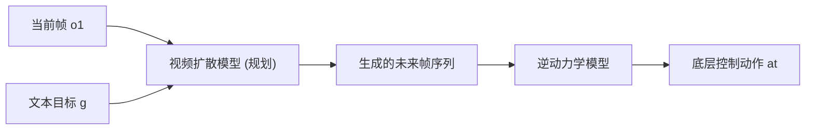

# UniPi: Learning Universal Policies via Text-Guided Video Generation

- 本地 PDF：`papers/world-model/UniPi_2302.00111.pdf`
- arXiv：https://arxiv.org/abs/2302.00111
- 年份：2023 (NeurIPS 2023)
- 团队：MIT, Google DeepMind, UC Berkeley (Yilun Du, Mengjiao Yang, Pieter Abbeel 等)
- 阶段：视频即策略 —— 文本引导视频扩散作为通用规划器

## 一句话总结

UniPi 将序列决策重定义为文本条件视频生成问题：扩散模型先合成展示任务完成的未来视频帧（规划），再通过逆动力学模型提取底层控制动作。视频和文本作为通用接口，使策略能跨环境、跨任务泛化。

## 核心技术

1. **Policy-as-Video 范式** — 策略 = 视频规划器 + 动作提取器，视频是 observation 和 action 的统一接口
2. **文本条件视频扩散** — 用大规模预训练视频扩散模型作为规划器，以当前帧 + 文本目标生成未来帧序列
3. **逆动力学提取** — 从生成的 video plan 中回归底层动作
4. **UPDP (Universal Prediction Decision Process)** — 替代 MDP 的通用决策框架，图像 = 状态，文本 = 任务

## 底层原理与数学推导

### 通用预测决策过程 (UPDP)

与 MDP 的核心区别：
- 状态空间：图像（通用、跨环境）
- 任务指定：文本（无需 reward engineering）
- 策略：视频扩散 π(Δ | o₁, g)

### 两阶段架构

### 关键技术

1. **Conditioned Video Synthesis** — 第一帧显式作为条件输入
2. **Trajectory Consistency via Tiling** — 中间噪声帧与条件帧拼接，保持环境一致性
3. **Hierarchical Planning** — 粗到细视频超分，处理长序任务
4. **Behavior Modulation** — 推理时可注入额外约束

## 物理直觉解释

UniPi 的核心直觉：**把"规划"变成"拍电影"**。传统规划器在抽象的数学空间（状态、动作、奖励函数）中运行，而 UniPi 直接在像素空间中"想像"未来——给定当前画面和"把红色方块放到青色方块右边"的语言描述，它"画"出未来几帧完成这一目标的视频。这相当于在脑子里过一遍电影的视觉预览。

为什么这是个好主意？因为图像是通用的——无论是仿真环境、真实厨房还是工厂产线，图像格式一样。文本也是通用的——自然语言描述目标不需要写 reward function。这种统一接口使同一个规划器可以跨环境、跨任务工作。视频还天然包含了动作信息——你看到物体在画面中移动，逆动力学模型就可以从中提取控制命令。

## 工程细节与实操指南

- **Conditioned Video Synthesis**: 第一帧作为条件显式输入扩散模型，后续帧从噪声去噪
- **Trajectory Consistency via Tiling**: 中间噪声帧与条件帧拼接（concat），保持环境背景一致性——防止"物体出现在正确位置但桌子颜色变了"
- **Hierarchical Planning**: 先生成低分辨率粗规划，再超分到高分辨率精细帧，处理长序列任务
- **Behavior Modulation**: 推理时可注入额外约束（如"慢一点"、"不要碰到旁边的杯子"），通过修改 diffusion 的 guidance
- 视频扩散推理较慢（多步去噪 + 多帧生成），适合高层规划（低频调用），配合低层高频控制器使用

## 数据与训练

- **Internet-scale pretraining**: 14M 视频-文本对 + 60M 图像-文本对 + LAION-400M
- **Robot fine-tuning**: Bridge Dataset (7.2K 视频-文本对)

## 关键能力

| 能力 | 说明 |
|------|------|
| 组合泛化 | 语言描述的新物体排列（如 "red block to right of cyan block"） |
| 多任务学习 | 10 个任务训练，泛化到未见任务 |
| 长序规划 | 粗到细视频生成处理 multi-step |
| Internet 知识迁移 | 从 YouTube 视频到真实机器人操作 |

## 技术权衡（Trade-off）

| 优势 | 劣势与工程代价 |
|------|----------------|
| 视频作为通用接口，天然跨环境 | 视频生成质量直接影响策略质量 |
| 语言组合泛化能力强 | 视频扩散推理慢（多步采样） |
| Internet 视频提供巨大预训练语料 | 逆动力学模型需额外训练 |
| 无需 reward 工程 | 生成视频与物理现实的 gap 待解决 |

## 技术价值与演进定位

UniPi 是"视频世界模型 + 策略"路线的开创者——将 sequence modeling 和 video generation 两大范式统一。后续 SuSIE（图像编辑 → 子目标规划）、AV-ALOHA（主动视觉 + 模仿学习）在不同层面延续这一思路。

## 与其他论文的关系

- **SuSIE** 将 UniPi 的视频规划简化为图像编辑子目标规划，效率更高
- **Dreamer v3** 在 latent 空间做世界模型，UniPi 在像素空间做
- **Diffusion Policy** 在动作空间扩散，UniPi 在图像空间扩散
- **GR-1** 在 latent 空间预测未来 RGB，与 UniPi 像素空间互为补充

## 精读问题

1. 视频规划的质量瓶颈在哪？像素级 vs latent 级的准确度差距？
2. 逆动力学模型的环境特定性——新环境需要重新训练吗？
3. 长时间视频的一致性如何保证？tiling 策略的上限在哪？
4. 从 YouTube 到真实操作的知识迁移是 semantic-level 还是 motion-level？
