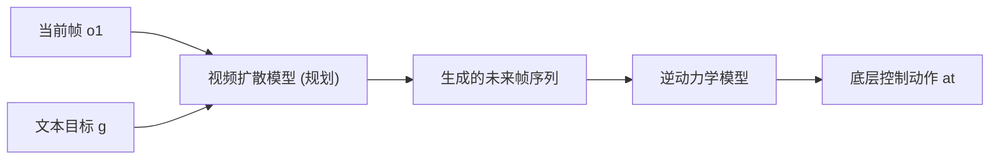

# UniPi: Learning Universal Policies via Text-Guided Video Generation

- 本地 PDF：`papers/world-model/UniPi_2302.00111.pdf`
- arXiv：https://arxiv.org/abs/2302.00111
- 年份：2023 (NeurIPS 2023)
- 团队：MIT, Google DeepMind, UC Berkeley (Yilun Du, Mengjiao Yang, Pieter Abbeel 等)
- 阶段：视频即策略 —— 文本引导视频扩散作为通用规划器

## 一句话总结

UniPi 将序列决策重定义为文本条件视频生成问题：扩散模型先合成展示任务完成的未来视频帧（规划），再通过逆动力学模型提取底层控制动作。视频和文本作为通用接口，使策略能跨环境、跨任务泛化。

## 核心技术

1. **Policy-as-Video 范式** — 策略 = 视频规划器 + 动作提取器，视频是 observation 和 action 的统一接口
2. **文本条件视频扩散** — 用大规模预训练视频扩散模型作为规划器，以当前帧 + 文本目标生成未来帧序列
3. **逆动力学提取** — 从生成的 video plan 中回归底层动作
4. **UPDP (Universal Prediction Decision Process)** — 替代 MDP 的通用决策框架，图像 = 状态，文本 = 任务

## 底层原理与数学推导

### 通用预测决策过程 (UPDP)

与 MDP 的核心区别：
- 状态空间：图像（通用、跨环境）
- 任务指定：文本（无需 reward engineering）
- 策略：视频扩散 π(Δ | o₁, g)

### 两阶段架构

```mermaid
graph LR
    IMG["当前帧 o1"] --> DIFFUSE["视频扩散模型 (规划)"]
    TEXT["文本目标 g"] --> DIFFUSE
    DIFFUSE --> VIDPLAN["生成的未来帧序列"]
    VIDPLAN --> INVDYN["逆动力学模型"]
    INVDYN --> ACTION["底层控制动作 at"]
```

### 关键技术

1. **Conditioned Video Synthesis** — 第一帧显式作为条件输入
2. **Trajectory Consistency via Tiling** — 中间噪声帧与条件帧拼接，保持环境一致性
3. **Hierarchical Planning** — 粗到细视频超分，处理长序任务
4. **Behavior Modulation** — 推理时可注入额外约束

### 视频规划器的条件扩散采样

规划器 $s(\tau_k, k \mid c, x_0)$ 以文本目标 $c$ 与首帧 $x_0$ 为条件去噪，推理时用 classifier-free guidance 强化条件：

$$
\hat{s}(\tau_k, k \mid c, x_0) = (1+\omega) \, s(\tau_k, k \mid c, x_0) - \omega \, s(\tau_k, k)
$$

其中 $\omega$ 控制文本与首帧条件的强度。生成视频 $\{x_h\}_{h=0}^{H}$ 后由逆动力学模型提取动作：

$$
\pi(\cdot \mid \{x_h\}_{h=0}^{H}, c) \to a_t
$$

"视频即策略"的数学本质是把 MDP 中的策略 $\pi(a|s)$ 替换为"图像条件生成 + 逆动力学回归"两步，状态/动作/奖励的抽象被图像与文本两种通用接口取代。

## 物理直觉解释

**UniPi 的核心直觉：把"规划"变成"拍电影"**。传统规划器在抽象的数学空间（状态、动作、奖励函数）中运行，而 UniPi 直接在像素空间中"想像"未来——给定当前画面和"把红色方块放到青色方块右边"的语言描述，它"画"出未来几帧完成这一目标的视频。这相当于在脑子里过一遍电影的视觉预览。组合环境实验中，这种"电影式规划"对未见过的语言组合（Novel Place/Relation）仍达 60.1%/46.1% 成功率，而最强的行为克隆基线只有 13.2%/9.1%——差距来自互联网预训练赋予的"物体关系常识"（红色方块在青色方块右边长什么样），这不是从 20 万条仿真视频里能学到的。

**为什么图像和文本是"通用接口"？** 图像是通用的——无论是仿真环境、真实厨房还是工厂产线，图像格式一样；文本也是通用的——自然语言描述目标不需要写 reward function。这种统一接口使同一个规划器可以跨环境、跨任务工作。视频还天然包含了动作信息——你看到物体在画面中移动，逆动力学模型就可以从中提取控制命令，规划与控制的鸿沟被"视频中帧间差异 = 动作"这一等价关系桥接。这正是 UniPi 与"视频世界模型"路线的关键区别：它不预测视频用于评估策略，而是直接**用视频当策略**。

**三个工程决策各自解决视频规划的经典痛点**。Tiling（中间噪声帧与条件帧拼接）防止背景漂移——否则模型可能"把物体放对了但桌子颜色变了"；层次化规划（粗分辨率先规划、超分到细帧）让长序任务可行——视频扩散的采样成本随分辨率爆炸；classifier-free guidance 的 ω 控制条件强度，还支持行为调制（"慢一点"、"别碰旁边的杯子"）在推理时注入约束。但代价是推理慢（多步去噪 × 多帧生成），所以 UniPi 定位为低频高层规划器，必须与低层高频控制器搭配——这也是"视频即策略"路线的架构性妥协。

## 工程细节与实操指南

- **Conditioned Video Synthesis**: 第一帧作为条件显式输入扩散模型，后续帧从噪声去噪
- **Trajectory Consistency via Tiling**: 中间噪声帧与条件帧拼接（concat），保持环境背景一致性——防止"物体出现在正确位置但桌子颜色变了"
- **Hierarchical Planning**: 先生成低分辨率粗规划，再超分到高分辨率精细帧，处理长序列任务
- **Behavior Modulation**: 推理时可注入额外约束（如"慢一点"、"不要碰到旁边的杯子"），通过修改 diffusion 的 guidance
- 视频扩散推理较慢（多步去噪 + 多帧生成），适合高层规划（低频调用），配合低层高频控制器使用

## 数据与训练

- **Internet-scale pretraining**: 14M 视频-文本对 + 60M 图像-文本对 + LAION-400M
- **Robot fine-tuning**: Bridge Dataset (7.2K 视频-文本对)

## 关键能力

| 能力 | 说明 |
|------|------|
| 组合泛化 | 语言描述的新物体排列（如 "red block to right of cyan block"） |
| 多任务学习 | 10 个任务训练，泛化到未见任务 |
| 长序规划 | 粗到细视频生成处理 multi-step |
| Internet 知识迁移 | 从 YouTube 视频到真实机器人操作 |

## 消融实验与分析

| 消融/对比维度 | 设置对比 | 关键指标（成功率 ± 标准差） |
|---------|---------|---------|
| 组合泛化（Seen Place） | UniPi vs 最强基线 State+Transformer BC | 59.1±2.5 vs 19.4±3.7 |
| 组合泛化（Seen Relation） | UniPi vs 最强基线 Image+TT | 53.2±2.0 vs 12.8±1.8 |
| 组合泛化（Novel Place） | UniPi vs 最强基线 Image+TT | 60.1±3.9 vs 13.2±4.1 |
| 组合泛化（Novel Relation） | UniPi vs 最强基线 Diffuser | 46.1±3.0 vs 9.6±1.7 |
| Internet 预训练（Table 4） | 预训练 vs 从零（Bridge 数据上） | 预训练显著提升 FID/FVD，CLIP 略升；从零模型生成"任务未完成"的错误计划（图 6/8） |
| 数据规模 | 组合环境训练集 | 200k 示例视频，语言指令 70% 训练 / 30% 仅测试 |
| 预训练语料 | 互联网数据 vs 仅机器人数据 | 14M 视频-文本 + 60M 图像-文本 + LAION-400M；Bridge 仅 7.2k 视频-文本对 |

**核心结论**：UniPi 的增益主体来自"互联网预训练 + 视频规划接口"的组合——组合泛化实验中 UniPi（59.1/53.2/60.1/46.1）对最强基线（19.4/12.8/13.2/9.6）的优势高达 3-5 倍，且未见组合（Novel）与已见组合（Seen）表现几乎持平，说明泛化来自预训练视频模型对物体关系的语义理解而非对训练分布的过拟合；Table 4 的 FID/FVD 对比则从生成质量侧印证预训练价值——从零训练的模型在 CLIP 分数上看似正常（分数无法反映任务完成度），生成的视频却经常"做错任务"；Tiling 与层次化规划是让"拍电影"在长序与背景一致性上可行的工程保障。

## 技术权衡（Trade-off）

| 优势 | 劣势与工程代价 |
|------|----------------|
| 视频作为通用接口，天然跨环境 | 视频生成质量直接影响策略质量 |
| 语言组合泛化能力强 | 视频扩散推理慢（多步采样） |
| Internet 视频提供巨大预训练语料 | 逆动力学模型需额外训练 |
| 无需 reward 工程 | 生成视频与物理现实的 gap 待解决 |

## 技术价值与演进定位

UniPi 是"视频世界模型 + 策略"路线的开创者——将 sequence modeling 和 video generation 两大范式统一，提出了 UPDP（Universal Prediction Decision Process）这一以"图像 = 状态、文本 = 任务、视频 = 策略"的通用决策框架。它对后续工作的影响是双重的：一方面，SuSIE 把 UniPi 的整段视频规划压缩为单帧子目标图像编辑（效率大幅提升，代价是丢失运动信息），GR-1/GR-MG 把像素空间未来预测改到 latent space（效率再升）；另一方面，UniPi 暴露的"视频生成质量 = 策略质量、推理慢"两大痛点，直接催生了 latent 世界模型 + 离线策略改进（WEAVER/SimDist）与想象中 RL（RISE）两条后续主线。作为 2023 年的开创性工作，它的"用生成模型统一观测与动作接口"的思想至今仍是 VLA 世界模型路线的重要坐标。

## 与其他论文的关系

- **SuSIE** 将 UniPi 的视频规划简化为图像编辑子目标规划，效率更高
- **Dreamer v3** 在 latent 空间做世界模型，UniPi 在像素空间做
- **Diffusion Policy** 在动作空间扩散，UniPi 在图像空间扩散
- **GR-1** 在 latent 空间预测未来 RGB，与 UniPi 像素空间互为补充

## 精读问题

1. 视频规划的质量瓶颈在哪？像素级 vs latent 级的准确度差距？（UniPi 像素空间 vs GR-1/WEAVER latent 空间）
2. 逆动力学模型的环境特定性——新环境需要重新训练吗？逆动力学是否成为跨环境泛化的隐藏瓶颈？
3. 长时间视频的一致性如何保证？tiling 策略的上限在哪（帧数、分辨率、任务时长）？
4. 从 YouTube 到真实操作的知识迁移是 semantic-level 还是 motion-level？Table 4 中 CLIP 分数无法反映任务完成度的深层原因？
5. classifier-free guidance 的 ω 与行为调制如何交互？"不要碰到旁边的杯子"这类约束如何编码进扩散采样？
6. 视频规划器在接触-rich 任务（需要精确力控制）上的物理一致性如何保证？生成的视频是否存在"视觉合理但物理不可能"的轨迹？
