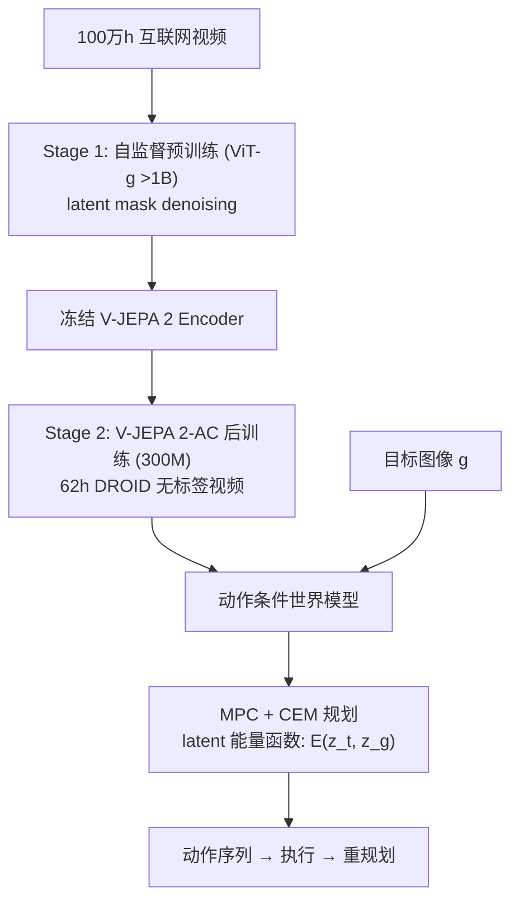

# V-JEPA 2: Self-Supervised Video Models Enable Understanding, Prediction and Planning

- 本地 PDF：`papers/world-model/V-JEPA2_2506.09985.pdf`
- arXiv：https://arxiv.org/abs/2506.09985
- 年份：2025（6 月）
- 团队：Meta AI (FAIR)
- 阶段：JEPA 路线旗舰 — 100 万小时互联网视频 + 62 小时机器人数据 → 零样本规划

## 一句话总结

V-JEPA 2 是 Meta 的第二代视频 JEPA 世界模型：**Phase 1** 在 100 万+ 小时互联网视频 + 100 万图像上自监督预训练（ViT-g >1B 参数，latent 空间 mask denoising，不做像素重建）；**Phase 2** 用 <62 小时无标签 DROID 机器人视频后训练为 V-JEPA 2-AC（动作条件世界模型，300M 预测器）。关键成果：零样本部署到训练中未见过的 Franka 机械臂做 pick-and-place（65-80% 成功率），MPC + CEM 规划每步仅 16 秒（Cosmos 基线 4 分钟），无需目标任务数据、任务特定训练或奖励监督。

## 核心技术

1. **两阶段训练** — Stage 1 从互联网视频学物理（自监督 latent 预测）→ Stage 2 少量机器人视频迁移到控制（动作条件后训练）
2. **Latent 空间 mask denoising** — 重建被 mask 的时空 patch 的 latent 表示而非像素——避免像素重建的低效，学习运动、物体动力学、交互模式
3. **V-JEPA 2-AC 动作条件世界模型** — 300M 预测器，block-causal attention，teacher-forcing + short-rollout 目标，预测未来 latent 状态
4. **MPC 零样本规划** — 给定目标图像定义 latent 能量函数，CEM 优化动作序列，闭环重规划
5. **数据 scaling** — VideoMix22M（SSv2, Kinetics, HowTo100M, YT-Temporal-1B, ImageNet），22M 样本，progressive resolution 训练（最高 64 帧 384×384）

## 底层原理与数学推导

**Stage 2 的预测目标**（V-JEPA 2-AC）：

$$\min_\theta \mathbb{E}\left[\|p_\theta(z_{t+1} \mid z_{1:t}, a_{1:t}) - z_{t+1}\|^2\right]$$

**MPC 规划**：$a^* = \arg\min_{a_{t:t+H}} \|z_{t+H}(a) - z_g\|^2$，用 CEM 优化 + 每步闭环重规划。

**关键性质**：
- 无奖励、无任务标签、无目标任务数据
- 只依赖 monocular RGB
- latent 预测比像素预测高效 15-30×

## 物理直觉解释

**为什么"预测 latent"而不是"预测像素"？** 想象你预测"球接下来会滚向哪"——如果你必须画出下一帧的每个像素（草、云、背景），99% 的精力浪费在无关细节。V-JEPA 2 只在"抽象表示空间"预测——"球在 (x, y, z) 速度 v"——就像预测足球比赛中的"球权归属"而不是"渲染整个球场"。

**62 小时数据够用的原因**：Phase 1 已经从 100 万小时视频里学到了"物体怎么动"（物理直觉），Phase 2 只需要学会"我的机械臂怎么动"（本体模型）——就像一个有经验的人换一辆新车，只需要熟悉方向盘和油门的位置，不需要重新学驾驶。

**零样本 MPC 的直觉**：给定目标图像（"把杯子放到这里"），模型在 latent 空间定义"距离目标的远近"，CEM 模拟候选动作序列、选择使 latent 距离最小的序列——下棋时的"走一步看三步"，只不过在 latent 空间"看"。

## 工程细节与实操指南

- **Stage 1 数据**：VideoMix22M（22M 样本，来自 SSv2, Kinetics, HowTo100M, YT-Temporal-1B, ImageNet）
- **Stage 1 训练**：252K iterations，progressive resolution（最高 64 帧 @ 384×384）
- **Stage 2 数据**：<62 小时 DROID 单臂 Franka 子集，无标签
- **V-JEPA 2-AC**：300M 预测器，block-causal attention
- **规划**：CEM MPC，每步 ~16 秒（vs Cosmos ~4 分钟）
- **评估**：2 个实验室的未见 Franka 机械臂，pick-and-place + reach
- **物理推理 benchmark**：IntPhys 2（物理不可能事件）、MVPBench、CausalVQA
- **开源**：代码 MIT，权重 CC BY-NC 4.0（非商业）

## 消融实验与分析

| 消融/对比 | 结论 |
|---------|------|
| 理解/预测 benchmark | SSv2 77.3%, Epic-Kitchens 39.7 recall@5, 6 benchmark 平均 88.2% |
| LLM 对齐后 | PerceptionTest 84.0, TempCompass 76.9（8B 规模 SOTA） |
| 零样本机器人规划 | 65-80% pick-and-place, 100% reach |
| vs Cosmos 规划速度 | 16 秒 vs 4 分钟（15×） |
| vs 人类（物理推理） | 落后 20-30 个百分点（IntPhys 2 类任务） |

## 技术权衡（Trade-off）

| 优势 | 劣势与工程代价 |
|------|----------------|
| 100 万小时视频预训练 → 62 小时机器人数据即可规划 | 权重 CC BY-NC（非商业）——工业落地受限 |
| 规划比 Cosmos 快 15× | latent 预测不可解释——"规划的依据"难验证 |
| 零样本跨实验室泛化（未见机械臂） | JEPA 目前是被动观察者——无主动探索 |
| 无奖励、无任务标签 | 物理推理仍落后人类 20-30pp |

## 技术价值与演进定位

V-JEPA 2 是"predict latent → control"范式的旗舰证据，直接连接 JEPA 路线（I-JEPA → V-JEPA → V-JEPA 2 → LeWorldModel → SD-JEPA）。它回答了一个关键问题：**自监督世界模型能否直接用于机器人控制？**——答案是"能"，且数据效率极高（62 小时 vs π0 的数万小时遥操作）。它的局限（被动观察者、非商业权重）也定义了后续工作的空间。

## 与其他论文的关系

- **I-JEPA / V-JEPA** — 前身，V-JEPA 2 首次扩展到 >1B 参数 + 动作条件化
- **LeWorldModel / SD-JEPA** — V-JEPA 2 的"极简清理版"：15M 参数端到端训练，对比 V-JEPA 2 的 1B+ 复杂配方
- **Cosmos (NVIDIA)** — 像素级世界基础模型，V-JEPA 2 规划快 15×（latent vs 像素）
- **Dreamer v3** — latent 世界模型 + RL 训练，V-JEPA 2 是自监督（无 RL）
- **TD-MPC2** — latent + MPC，V-JEPA 2 用预训练表征替代从零学习

## 精读问题

1. 62 小时数据的"迁移极限"——接触丰富的任务（力、摩擦）能否同样零样本？
2. latent 能量函数的几何——目标图像的 latent 表示在多模态目标下是否稳定？
3. CEM 规划在长 horizon（>5 秒）的退化——latent 预测误差的累积效应？
4. V-JEPA 2-AC 的 block-causal attention 与 DreamZero 的非对称 QKV mask 的异同？
5. IntPhys 2 落后人类 20-30pp——latent 预测缺了什么物理信息？
