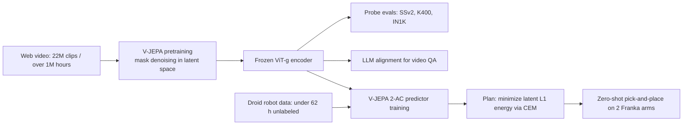

# V-JEPA 2: Self-Supervised Video Models Enable Understanding, Prediction and Planning

- 本地 PDF：`papers/world-model/V-JEPA2_2506.09985.pdf`
- arXiv：https://arxiv.org/abs/2506.09985
- 年份：2025（preprint，Meta FAIR 技术报告，48 页）
- 团队：FAIR at Meta + Mila – Quebec AI Institute and Polytechnique Montréal（Assran、Bardes、Garrido、LeCun、Ballas、Rabbat 等）
- 阶段：JEPA 主线的旗舰扩量之作——把 action-free 视频预训练推到 1M 小时 + 1B 参数，再用 62 小时机器人数据后训练出可零样本部署的动作条件世界模型 V-JEPA 2-AC

## 一句话总结

先用 V-JEPA 目标在约 100 万小时互联网视频上把视觉编码器扩到 ViT-g/1B 并得到通用运动理解表征，再冻结该编码器、只用 Droid 数据集不到 62 小时的无标注机器人视频训练一个自回归动作条件预测器 V-JEPA 2-AC，最后通过最小化 latent 空间 L1 能量函数 + CEM 的 MPC，实现两间新实验室 Franka 臂上的零样本图像目标抓取与放置（如 pick-&-place cup 达 80%），全程不采集新数据、不做任务专项训练。

## 核心技术

**第一阶段：V-JEPA 视频/图像预训练（action-free）。**
- 目标是 representation-space mask denoising：对视频做 multiblock masking 掉部分 patch，编码器只看可见 token，预测器拼接 learnable mask token $\Delta y$ 后预测被掩部分的 EMA-target 表征，用 L1 损失回归。
- 架构：encoder 从 ViT-L(300M) 扩到 ViT-g(1B)，predictor 类似 ViT-small；输入按 tubelet 2x16x16 patchify；用 3D-RoPE（将特征维切成时间/高/宽三段分别做一维旋转）替代绝对 sincos 位置编码，作者指出这一改动稳定了最大模型的训练。
- 四个 scaling 关键要素：(1) 数据从 VM2M 2M 条扩到 VideoMix22M 22M 条视频（>1M 小时）；(2) 模型 300M→1B；(3) 训练时长 90K→252K iterations，配合 warmup-constant-decay 学习率；(4) 分辨率/时长渐进提升到 384x384 与 64 帧。

**第二阶段：V-JEPA 2-AC 动作条件世界模型。**
- 冻结 V-JEPA encoder 逐帧编码，特征图尺寸 16x16x1408；把 action $a_k$（7 维末端位姿增量）、本体状态 $s_k$、patch 特征按时间交错输入 predictor，预测下一帧表征 $\hat z_{k+1}$。
- 联合优化 teacher-forcing 损失（$T=15$）与两步 rollout 损失（只反传一步递归），抑制自回归误差累积。
- predictor 约 300M 参数、24 层、16 heads、hidden 1024，block-causal attention：当前时刻 patch 可见同帧 action/pose/token 与全部历史帧。

**第三阶段：latent 能量最小化规划。**
- 给定目标图像编码 $z^g$，在 horizon $T$ 上最小化 $\mathcal E = \|P(\hat a_{1:T}; s_k, z_k) - z^g\|_1$，用 Cross-Entropy Method 采样求解，每步只执行第一个动作再重规划（receding horizon）。
- 单卡 RTX 4090 上 800 samples / 10 次迭代 / horizon 1 → 每个动作 16 秒；对比 Cosmos 视频生成世界模型 80 samples / 10 次迭代需 4 分钟每动作。

## 底层原理与数学推导

**预训练目标（式 1，representation-space 去噪）。** 对同一视频的上下文视图 $x$ 与目标视图 $y$：

$$
\text{minimize}_{\theta,\phi,\Delta y}\ \big\| P_\phi\big(\Delta_y, E_\theta(x)\big) - \mathrm{sg}\big(E_{\bar\theta}(y)\big)\big\|_1
$$

其中 $\Delta_y$ 是指示被丢弃 patch 位置的可学习 mask token，$\mathrm{sg}(\cdot)$ 是 stop-gradient，$\bar\theta$ 是编码器权重 $\theta$ 的指数滑动平均。损失只在被掩 patch 的预测上计算。防坍塌完全依赖 EMA target + stop-gradient 这两个启发式组合——这正是后续 LeWM 用 SIGReg 替换的对象。

**V-JEPA 2-AC teacher-forcing 损失（式 2）。** 逐帧编码得 $(z_k)_{k\in[16]}$，$z_k := E(x_k)\in\mathbb R^{H\times W\times D}$，交错序列送入 predictor 得 $(\hat z_{k+1})$：

$$
\begin{aligned}
\mathcal L_{\text{teacher-forcing}}(\phi) &:= \frac{1}{T}\sum_{k=1}^{T}\big\|\hat z_{k+1}-z_{k+1}\big\|_1 \\
&= \frac{1}{T}\sum_{k=1}^{T}\Big\|P_\phi\big((a_t, s_t, E(x_t))_{t\le k}\big)-E(x_{k+1})\Big\|_1,\quad T=15
\end{aligned}
$$

**rollout 损失（式 3）与总目标（式 4）。** 让 predictor 把自己的输出回灌为输入再前滚 $T$ 步（实际 $T=2$，即只穿过一次递归求导）：

$$
\mathcal L_{\text{rollout}}(\phi) := \big\|P_\phi(a_{1:T}, s_1, z_1) - z_{T+1}\big\|_1,\qquad
\mathcal L(\phi) := \mathcal L_{\text{teacher-forcing}}(\phi)+\mathcal L_{\text{rollout}}(\phi)
$$

注意梯度路径的不对称：teacher-forcing 中编码器已经全部真实可见，而 rollout 里 $\hat z_t$ 是预测值回灌，因此该项直接惩罚多步误差累积，这是它能支撑 15 步以内短 horizon 规划的关键。

**规划为能量最小化（式 5）。** 当前帧编码 $z_k$、本体状态 $s_k$、目标图像编码 $z^g$ 已知，优化动作序列：

$$
\mathcal E(\hat a_{1:T}; z_k, s_k, z^g) := \big\|P(\hat a_{1:T}; s_k, z_k) - z^g\big\|_1,\qquad
(a_i^\star)_{i\in[T]} := \operatorname{argmin}_{\hat a_{1:T}} \mathcal E
$$

CEM 初始化为零均值单位方差的高斯序列，取 top-$k$ 轨迹的统计量更新均值方差，重复若干次后返回末代均值作为动作序列。论文能量地形可视化显示 $\mathcal E$ 关于单个笛卡尔控制量近似平滑且局部凸，最优点靠近真值动作附近（$\Delta x,\Delta y\approx(0,-0.05)$），这就是 CEM 这种无梯度采样法也能收敛的原因。

**附录 B.4 的坐标轴辨识检验。** 在 200 步随机移动轨迹上求解线性最小二乘 $W^\star=\operatorname{argmin}_{W\in\mathbb R^{2\times2}}\|AW-B\|^2$ 以对齐推断动作与真值动作（$A,B\in\mathbb R^{200\times2}$），发现所有相机方位的平均绝对预测误差约 1.6 cm，但推断出的动作坐标系随相机角度明显旋转——说明模型是隐式地从单目 RGB 推断动作坐标系，缺少显式外参校准时的不稳定来源之一。

## 物理直觉解释

**表征去噪不是补像素，而是"听懂别人半句话"。** 人听到"今天下午三点和小明一起……"时不需要逐字脑补缺失词，而是抓住会面这件事的语义即可。V-JEPA 2 的 mask denoising 做的就是这件事：编码器看到被掩掉大块的视频片段，不需要还原每一帧像素，只要让预测器的输出落到"这段视频的语义坐标"上。因为目标本身是 EMA 编码器算出来的表征，损失逼着网络学会对运动和事件敏感的特征——这也是为什么它在 SSv2 这类强依赖时序关系的任务上明显超过图像系编码器（DINOv2 在同协议下 SSv2 只有 50.7，V-JEPA 2 ViT-g 到 75.3）。

**动作条件预测器像"学开车的肌肉记忆"，而不需要先读懂说明书。** 冻结编码器意味着"怎么看世界"这件事已经定型，2-AC 只学一件事："在这个画面状态下执行这个末端位移指令，画面会怎么变"。它学的对象是视觉后果而非任务规则，所以既不需要 reward 也不需要任务标签——Droid 里成功与失败的轨迹都照单全收。这带来了一个重要的泛化性质：换到从未见过的新实验室时，只要物理过程相似（7 自由度机械臂推动物体），预测仍然成立，规划就仍然有效。代价是相机视角必须大致合理，因为模型的隐式坐标系是从画面推断的。

**latent 里做规划等于"闭眼在心里排练"。** 面对一张目标图，系统在想象空间里反复尝试不同动作序列，挑那条把自己心里的状态表征拉近目标表征的路——类似棋手落子前的盲算。整个排练发生在压缩后的表征空间里，所以每步只需一次轻量的 transformer 前向，比 Cosmos 那种要"脑内渲染出完整视频"的做法快约 15 倍（16 秒 vs 4 分钟一个决策步）。render 式想象保留的是像素细节，thumbnail 式想象保留的是决策所需的状态差分——操控任务真正需要的往往只是后者。

## 工程细节与实操指南

- **数据配比靠手工调权**：VM22M 由 SSv2、Kinetics-400/600/700、HowTo100M、YT-Temporal-1B（含 ImageNet 图像复制成 16 帧静态视频参与联合图像/视频训练）组成，各源采样权重经人工调整。YT1B 先过 retrieval-based curation（抽场景→嵌入聚类检索以匹配 Kinetics/SSv2/COIN/EK 行动分布），并保证目标验证集不在池中。
- **渐进分辨率训练是省卡关键**：12K iteration warmup（16 帧 @256x256）+ 228K constant + 12K cooldown（升到 64 帧 @384x384，同时线性衰减学习率）。若从头就在全分辨率下训 ViT-g 需要约 60 GPU-year，渐进方案降为约 8.4 倍提速；而且 cooldown 阶段用更长 clip 训练即使只在 16 帧下评测也有 +0.7 点收益。
- **warmup-constant-decay 还有组织学价值**：可以从同一份 constant-phase checkpoint 起多个 cooldown 分支（不同分辨率/时长），半精度调参成本远低于一次性 half-cosine 调到底。同时简化了 Bardes et al. 2024 配方：teacher EMA 与 weight decay 都固定常数，不再做 ramp-up，下游理解任务差异极小。
- **2-AC 输入细节**：Droid 中丢弃不足 4 秒的短片后剩不到 62 小时；采样 4 秒 16 帧 @256x256；action 定义为相邻帧末端状态的 7 维差分（位置 3 + 外旋欧拉角 3 + 夹爪 1），random-resize-crop 宽高比采样于 (0.75, 1.35)；位置编码用复用的 3D-RoPE，其中仅时间维 rotary embedding 施加到 action 与 pose token 上。
- **规划数值约束很关键**：每个采样动作被约束在半径 0.075 的 L1 ball 内（对应单步末端位移上限约 13 cm），否则大动作会让分布外的预测污染规划。pick-&-place 用两张子目标图分阶段切换（4 步朝抓取子目标、10 步朝放置点附近、最后 4 步朝最终目标），代替单一 final goal 来化整长程问题。
- **部署硬件与控制器**：双实验室 Franka Emika Panda + RobotiQ 夹爪，未标定的低分辨率单目 RGB，运行操作空间控制的底层控制器；blocking control 用于 V-JEPA 2-AC 与 Cosmos，Octo 同时试了 blocking/non-blocking 取最好。
- **复现入口**：代码 `https://github.com/facebookresearch/vjepa2`，博客 `https://ai.meta.com/blog/v-jepa-2-world-model-benchmarks`。

## 消融实验与分析

### A. scaling 要素逐步叠加（Figure 3，ViT-L/16 基线，6 任务平均精度）

| 配置 | 平均精度 |
|---|---|
| V-JEPA 1 baseline（2M videos） | 84.2 |
| + Data Scaling（22M videos） | 85.2 |
| + Model Scaling（ViT-g/16） | 86.7 |
| + Long Training（90K → 252K iter） | 87.5 |
| + Higher Resolution（384px, 64 frames） | 88.2 |

**核心结论**：每个干预都带来正贡献，累计 +4.0 点；其中数据扩充 +1.0、模型放大 +1.5、延长训练 +0.8、提高分辨率 +0.7。说明在 JEPA 这个目标下 video SSL 可以正常吃到 scaling laws——这也是整条 JEPA 世界模型路线第一次拿到"可扩张的世界模型基础编码器"的证据。

### B. 冻结编码器分类评测（Table 4，统一协议 attentive probe）

| 方法 | 参数 | Avg | SSv2 | Diving-48 | K400 | COIN | IN1K |
|---|---|---|---|---|---|---|---|
| DINOv2 | 1.1B | 81.1 | 50.7 | 82.5 | 83.6 | 90.7 | 86.1 |
| PEcoreG | 1.9B | 82.3 | 55.4 | 76.9 | 88.5 | 95.3 | 87.6* |
| InternVideo2s2-1B | 1B | 87.0 | 69.7 | 86.4 | 89.4 | 93.8 | 85.8 |
| V-JEPA ViT-H（2404） | 600M | 85.2 | 74.3 | 87.9 | 84.5 | 87.1 | 80.0 |
| V-JEPA 2 ViT-L | 300M | 86.0 | 73.7 | 89.0 | 85.1 | 86.8 | 83.5 |
| V-JEPA 2 ViT-g | 1B | 87.5 | 75.3 | 90.1 | 86.6 | – | – |
| V-JEPA 2 ViT-g384 | 1B | 88.2 | 77.3 | 90.2 | 97.8 | 87.3 | 91.1 |

**核心结论**：纯图像编码器（DINOv2/PEcoreG/SigLIP2）在 motion 任务上系统性落后（SSv2 最高仅 55.4），V-JEPA 2 反过来把 IN1K 提升到 84.6（相对 V-JEPA +4.6 点），证明大规模视频预训练可以两者兼顾；同门"上一代" V-JEPA ViT-H 在同协议下 SSv2 74.3 vs 77.3、Avg 85.2 vs 88.2，升级配方整体优于纯加大模型。

*注：PEcoreG 带 \* 表示其 ImageNet 数字出自其原论文的 448px 更大输入与不同 probe 结构，非同一协议下数字。*

### C. 零样本机器人操控成功率（Table 2，10 trials per task per lab）

| 方法 | Reach | Grasp Cup | Grasp Box | Reach w/Obj Cup | Reach w/Obj Box | P&P Cup | P&P Box |
|---|---|---|---|---|---|---|---|
| Octo（octo-base-1.5 + BC 微调）Lab2 | 100% | 10% | 0% | 10% | 70% | 10% | 10% |
| V-JEPA 2-AC Lab1 | 100% | 70% | 30% | 90% | 80% | 80% | 80% |
| V-JEPA 2-AC Lab2 | 100% | 60% | 20% | 60% | 70% | 80% | 50% |
| V-JEPA 2-AC Avg | 100% | 65% | 25% | 75% | 75% | 80% | 65% |

**核心结论**：reach 任务三家都接近满分，差距在被控物体交互上拉开——Grasp Cup Octo 15% vs V-JEPA 2-AC 65%，Pick-and-Place Cup 15% vs 80%。这说明 BC-based VLA 泛化不了的根本原因是"目标图像条件下的低层物理因果预测"缺位，而不是简单策略容量不够。

### D. 规划成本对照（Table 3，同为 closed-loop MPC on RTX 4090）

| 方法 | #Samples | Iter. | Horizon | 单动作耗时 | Reach | Grasp Cup | Grasp Box | P&P Cup | P&P Box |
|---|---|---|---|---|---|---|---|---|---|
| Cosmos（latent diffusion-7B） | 80 | 10 | 1 | 4 min | 80% | 0% | 20% | 0% | 0% |
| V-JEPA 2-AC | 800 | 10 | 1 | 16 sec | 100% | 60% | 20% | 80% | 50% |

**核心结论**：V-JEPA 2-AC 用 10 倍样本数、1/15 时间，同时在所有技能上都占优；完成一条完整 pick-and-place 轨迹如果走 Cosmos 一条路要超过一小时，实际上不可交互。"压得动的 representation + 够用的生成能力"在对机器人的实时性要求面前比"最大的扩散世界模型"更实用。

### E. 其他小消融

- Curated-YT-1B vs 未整理 YT1B（ViT-L/16, 90K iter）：平均性能 +1.4 点；Curated-YT-1B 单独就能逼近完整 VM22M 的 ViT-L 性能，但在更大模型上 VM22M 仍更优，说明"curated 高质量数据 + 多源混合"在 scale 下互补而非互相替代。
- cooldown 阶段由 16 帧扩展到 32/64 帧：仅评 16 帧时平均还能提 +0.7 点（Figure 5 Right）。
- progressive vs single-resolution training at 384p：GPU-days 减少至最多 8.4 倍（Figure 5 Middle）。
- 附录 B.4 相机敏感性：扫描 35–85 度范围内的方位角，平均绝对预测误差约 1.6 cm，但推断坐标系的角度随相机位置漂移。

## 技术权衡（Trade-off）

- **EMA + stop-gradient 防坍塌换来不透明性**：这组机制理论上并不等价于任何显式目标的下降方向，使得崩溃"看起来不会发生"却讲不清为什么；LeWM 后来以 SIGReg 显式高斯匹配替换这套启发式，数学形式更清晰，但代价是要额外管超参。这条分岔正是本文位置的关键参照。
- **表征空间的缩略图 vs 像素空间的全片**：L1-on-latent 能量又快又稳，却意味着无法回答"这个场景里具体哪块像素会怎样"。对于精细接触型任务（比如插针穿环）、对遮挡或负空间敏感的场景，这种近似可能不够。
- **零样本便利 vs 相机位姿脆弱性**：由于模型需要从画面隐式猜动作轴系，未标定单目视角的不当摆放会破坏动作语义。工程上只能靠人工试摆相机来解决——这是一个尚未被模型自身吸收的不变量。
- **短 horizon 可行、长 horizon 受限**：自回归 rollout 误差累积 + 动作搜索空间随时长指数膨胀双重压力，迫使 multi-stage 子目标切分（grasp → approach → place 各 4/10/4 步）。子目标是人工给的，一旦任务没有自然分段就只能靠后续工作引入层级或语言分解。
- **62h 小数据后训练的红利依赖巨大预训练**：正是 1M 小时/1B 参数带来的强表征，才使 23k 条轨迹就足够让 predictor 学到"动作→视觉变化"映射。没有第一阶段就没有第二阶段的效率，这个先后顺序本身就是方法的一部分。

## 技术价值与演进定位

这条 JEPA 世界模型主线的演进可以这样读：I-JEPA (2301.08243) 在图像上确立 masked-prediction-in-latent-space 目标；V-JEPA (2404.08471) 将之搬到视频并验证多块 masking + tubelet 结构学到运动敏感特征；V-JEPA 2 (2506.09985) 则把这件事从"表征学习能 scale 吗"推进到"这样学的表征能否承载动作规划"，用一张冻结的 1B 视频编码器和 62 小时机器人数据做出了第一批零样本跨实验室抓放结果。它也是本主线里唯一一篇用巨量通用视觉数据打底的工作——与 LeWM (2603.19312)、SD-JEPA (2605.31111)、NoGaussianRequired (2608.17542) 这些"从零端到端在小规模环境里打磨训练稳定性"的小参数对比鲜明：后者在答"最少要几个 loss 才能稳定"，前者在答"最多能 scale 到多少还能用于 control"。两条子问题相向而行，共同构成"JEPA 作为世界模型主线"现在的形状。值得注意的是 V-JEPA 2-AC 本身仍带 EMA-target 预训练痕迹，其后训练 loss 是简单的 L1 + rollout 组合，不再有防坍塌负担——因为坍塌防线已经在第一阶段筑好了。

## 与其他论文的关系

- **I-JEPA / V-JEPA** — 直接前身。继承了"predict in representation space + EMA target + stop-grad"的目标形式与 multiblock masking；主要改动是把 tubelet patchify 换成 3D-RoPE、引入 warmup-constant-decay 调度与渐进分辨率，并把数据和模型从 2M/ViT-H 扩到 22M/ViT-g。
- **LeWorldModel（2603.19312）** — 批判式继承者。它指出本文依赖的 EMA+stop-gradient 缺乏明确目标函数（原文 App. C 引述已有分析），改用 SIGReg 强制各维边缘为各向同性高斯来实现端到端 15M 参数稳定训练，把可调 loss 超参从 6 个减到 1 个；但其规划速度反超是在 LeWM 的 ~200x 少 token 编码下的对比结果，规模与真实性都比本文小得多。
- **PLDM（Sobal et al.，"Stress-testing offline reward-free RL: A case for planning with latent dynamics models"）** — 同样主张端到端 JEPA 世界模型，但用的是 7-term VICReg 变体目标导致训练不稳与调参昂贵；V-JEPA 2 选择了相反方向——非端到端（先冻编码器再加 predictor）换取单调收敛与大 scale。
- **Cosmos（Agarwal et al., NVIDIA）** — 代表"像素/latent-video 生成式世界模型"分支的对照基线。在 reach 任务上可达 80%，但物体交互崩盘且单步 4 分钟；侧面证明对规划而言"训练了一个精确的生成模拟器"不如"训练了一个便宜的表征模拟器"。
- **Dreamer 系列 / TD-MPC2** — 经典 latent 世界模型分支，但都以 reward 或 value 信号塑造表征、常绑定 RL 训练循环；V-JEPA 2-AC 保持 reward-free，规划期也不在线更新模型，属于"纯观察 + 纯几何目标"谱系。
- **Octo（goal-conditioned VLA baseline）** — 展示"行为克隆配大 multi-embodiment 预训练"在未见环境的极限：reach 满分但 grasp 15%、box grasp 0%。可以作为对照阅读——BC 学到的关联在图像条件稍有偏移时就失效，而 latent 世界模型是拿因果预测去做检索式规划，天然更鲁棒。

## 精读问题

1. teacher-forcing 损失用 EMA-target 表征做监督的前提是 encoder 已冻结；那在第一阶段里同样使用 EMA target 的 mask denoising 为什么不会因为 target 迁移造成自我指涉式的退化，而在 2-AC 阶段却被刻意规避？
2. rollout 损失只反传一步递归（$T=2$），若把深度拉到 $T=5$ 或更长，遇到的最直接瓶颈是梯度爆炸还是短视野数据的动作分布覆盖不足？能否设计实验区分？
3. CEM 中采样动作被限制在半径 0.075 的 L1 球内，论文描述为"防止大动作离分布"；在 Droid 训练集动作幅度分布已知的情况下，是否可以用 KL 约束或重要性加权来软化这一硬截断，从而允许偶尔的大位移动作？
4. 论文 Figure 9 只对单个 ∆y reaching 任务可视化了能量地形并定性描述其平滑与局部凸；能否把这种性质量化为 planning basin of attraction 半径，并与其他 latent 世界模型的能量几何做系统比较？这对 CEM 初值方差的选择有何指导意义？
5. 若把子目标切换逻辑（4-10-4）换成 hierarchical policy learning（例如先训一个产生中间目标的世界模型条件下的 sub-goal generator），现有 frozen encoder 表征是否已经包含足够的中间态信息？
6. 论文坦承相机方位影响坐标轴推断（App. B.4 平均绝对误差约 1.6 cm 但角度漂移明显）；加入一次性的单帧标定或让模型联合预测单应矩阵是否能降低这层敏感？
