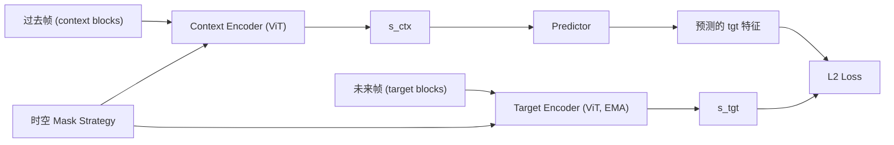

# V-JEPA: Revisiting Feature Prediction for Learning Visual Representations from Video

- 本地 PDF：`papers/world-model/V-JEPA_2404.08471.pdf`
- arXiv：https://arxiv.org/abs/2404.08471
- 年份：2024
- 团队：Meta AI (FAIR) — Adrien Bardes, Yann LeCun 等
- 阶段：视频 JEPA —— 纯 latent 预测学习视觉表征

## 一句话总结

V-JEPA 将 I-JEPA 的 latent space 预测扩展到视频——从过去帧预测未来帧的 latent 表征，不使用预训练图像编码器、文本、负样本或像素重建。2M 视频训练，ViT-H/16 frozen backbone 在 Kinetics-400 81.9%、SSv2 72.2%、ImageNet 77.9%。

## 核心技术

1. **视频 JEPA** — 从过去帧的特征预测未来帧特征，纯 latent 空间预测无像素重建
2. **No pretrained encoders / text / negatives** — 不需要初始化、文本监督、负样本，数据效率高
3. **多 block 时空预测** — context 提供空间分散的过去块 + target 为未来块，在时空维度扩展 mask 策略
4. **Video-only training → Image transfer** — 2M 视频训练 → frozen backbone 在图像任务竞争，展示跨模态泛化

## 底层原理与数学推导

### 架构

### 关键设计

- **时空 mask**: context blocks 分布在过去帧（空间分散），target blocks 在未来帧（大尺度语义块）
- **仅视频数据训练**: 2M 公共数据集视频，不混图像
- **Frozen evaluation**: 冻结 backbone 评估，不微调——验证表征的通用性

## 实验结果 (Frozen Backbone)

| Task | V-JEPA ViT-H/16 | 对比 |
|------|----------------|------|
| Kinetics-400 | **81.9%** | 超 VideoMAE, OmniMAE |
| Something-Something-v2 | **72.2%** | 动作理解远超像素预测方法 |
| ImageNet1K | **77.9%** | 仅视频训练零样本迁移图像 |

## 消融实验与分析

| 消融因子 | 变化 | 结论 |
|---------|------|------|
| 时空 mask vs 纯空间 mask | spatiotemporal vs spatial-only | 时空 mask 对运动理解（SSv2）至关重要 |
| Context 帧数 | 多帧 vs 单帧 | 多帧 context 对时序预测必要 |
| Video-only vs image+video | pure video vs mixed | 纯视频训练即满足 image transfer |
| Frozen vs fine-tune | frozen vs ft | Frozen eval 证明了表征的通用性 |

**核心结论**：时空 mask 策略在时间维度扩展 context-target 预测，使模型学会运动理解。纯视频训练即可零样本迁移到图像任务。

## 技术权衡（Trade-off）

| 优势 | 劣势与工程代价 |
|------|----------------|
| 纯视频训练，无需文本/负样本/重建 | 视频数据的质量和多样性影响上限 |
| Latent 预测使模型聚焦语义信息 | 需要精心设计的时空 mask 策略 |
| Frozen backbone 跨任务通用 | 对非常低层的感知（如细粒度纹理）可能不如重建方法 |

## 物理直觉解释

V-JEPA 的直觉：**不看完整视频，看开头猜结局**——而且不是猜像素长什么样，而是猜"这一段视频在讲什么故事"。给你看几帧过去的画面（context blocks，空间分散），让你预测未来几帧的 latent 表征。猜像素是浪费精力的（草的颜色、背景纹理这些对理解动作无关紧要），猜 latent 才是真正在学"事物怎么运动、变化"。

这就像看球赛——你不是在预测下一帧的每个像素，而是在预测"球员往哪跑、球往哪飞"这种高层语义。V-JEPA 的时空 mask 设计就是这个直觉的工程实现：context 覆盖过去帧的多个空间区域（给你足够上下文），target 是未来帧的大语义块（不是几个像素的小补丁——那是猜纹理，不是学运动）。

## 工程细节与实操指南

- **ViT backbone**: ViT-H/16 或 ViT-L/16，context encoder 可训练，target encoder 用 EMA 更新
- **时空 mask 策略**: context blocks 在时间维度分布过去多帧（空间分散），target blocks 堆在未来帧的大尺度块（至少 15-20% 的画面面积）
- **训练数据**: 2M HowTo100M + Kinetics 视频片段（无文本、无标签），仅用视频像素
- **Predictor**: 窄 ViT（比 encoder 小），在 context 表征上预测 target 表征
- **Frozen evaluation**: 冻结 backbone 做 linear probe 或 attentional probe，不 fine-tune——验证表征的通用性
- 训练效率: 无需 decoder，训练比 MAE 快约 2×（因不做像素重建）

## 技术价值与演进定位

V-JEPA 证明了"纯 latent 预测 + 视频数据"可以培养出通用的视觉表征——既擅长外观理解（ImageNet, K400）也擅长运动理解（SSv2）。这是 LeCun 的 H-JEPA 愿景的重要一步：通过预测而非重建实现世界理解。在机器人领域，V-JEPA 的时空 latent 预测范式直接影响了视频预训练世界模型（GR-1, GR-MG）的技术路线。

## 与其他论文的关系

- **I-JEPA** — 图像版前身，单帧 latent 预测；V-JEPA 在时空维度扩展 mask 策略
- **MAE / VideoMAE** — 像素重建方法，V-JEPA 在 latent 空间做预测（更高效、更语义）
- **GR-1 / GR-MG** — 将 V-JEPA 的时空 latent 预测应用于机器人世界模型预训练
- **Dreamer v3** — 同为 latent prediction，但用 RSSM + 在线学习而非 ViT + 离线预训练

## 精读问题

1. 时空 mask 的最优设计：多帧 context vs 单帧 context 对运动理解的影响？
2. 2M 视频训练 vs ImageNet 1B 图像训练的 scale 效应？
3. 对机器人操作视频（egocentric, short-horizon）的泛化能力？
