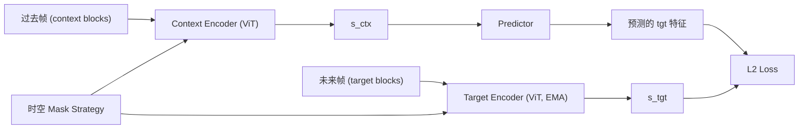

# V-JEPA: Revisiting Feature Prediction for Learning Visual Representations from Video

- 本地 PDF：`papers/world-model/V-JEPA_2404.08471.pdf`
- arXiv：https://arxiv.org/abs/2404.08471
- 年份：2024
- 团队：Meta AI (FAIR) — Adrien Bardes, Yann LeCun 等
- 阶段：视频 JEPA —— 纯 latent 预测学习视觉表征

## 一句话总结

V-JEPA 将 I-JEPA 的 latent space 预测扩展到视频——从过去帧预测未来帧的 latent 表征，不使用预训练图像编码器、文本、负样本或像素重建。2M 视频训练，ViT-H/16 frozen backbone 在 Kinetics-400 81.9%、SSv2 72.2%、ImageNet 77.9%。

## 核心技术

1. **视频 JEPA** — 从过去帧的特征预测未来帧特征，纯 latent 空间预测无像素重建
2. **No pretrained encoders / text / negatives** — 不需要初始化、文本监督、负样本，数据效率高
3. **多 block 时空预测** — context 提供空间分散的过去块 + target 为未来块，在时空维度扩展 mask 策略
4. **Video-only training → Image transfer** — 2M 视频训练 → frozen backbone 在图像任务竞争，展示跨模态泛化

## 底层原理与数学推导

### 架构

```mermaid
graph LR
    PAST["过去帧 (context blocks)"] --> CTX["Context Encoder (ViT)"]
    FUTURE["未来帧 (target blocks)"] --> TGT["Target Encoder (ViT, EMA)"]
    CTX --> CTX_OUT[s_ctx]
    TGT --> TGT_OUT[s_tgt]
    CTX_OUT --> PRED["Predictor"]
    PRED --> PRED_OUT["预测的 tgt 特征"]
    PRED_OUT --> LOSS["L2 Loss"]
    TGT_OUT --> LOSS
    MASK["时空 Mask Strategy"] --> CTX
    MASK --> TGT
```

### 关键设计

- **时空 mask**: context blocks 分布在过去帧（空间分散），target blocks 在未来帧（大尺度语义块）
- **仅视频数据训练**: 2M 公共数据集视频，不混图像
- **Frozen evaluation**: 冻结 backbone 评估，不微调——验证表征的通用性

## 实验结果 (Frozen Backbone)

| Task | V-JEPA ViT-H/16 | 对比 |
|------|----------------|------|
| Kinetics-400 | **81.9%** | 超 VideoMAE, OmniMAE |
| Something-Something-v2 | **72.2%** | 动作理解远超像素预测方法 |
| ImageNet1K | **77.9%** | 仅视频训练零样本迁移图像 |

## 消融实验与分析

| 消融因子 | 设置对比 | 关键指标（top-1 准确率） |
|---------|---------|---------|
| 预测目标空间（Table 1/2） | 特征空间 vs 像素空间（ViT-L/16，90K 迭代） | K400 73.7 vs 68.6；SSv2 66.2 vs 66.0；IN1K 74.8 vs 73.3；K400 fine-tune 85.6 vs 85.4 |
| 特征池化（Table 3） | Attentive pooling vs Average pooling | K400 +17.3 分；SSv2 +16.1 分 |
| 预训练数据规模（Table 2） | 数据分布变化（VideoMix2M 子集） | 下游平均性能随预训练集规模增加而提高 |
| 模型规模 | ViT-L/16 → ViT-H/16 → ViT-H/16³⁸⁴ | K400 81.9%（ViT-H/16，纯视频训练） |
| 训练效率 | 无 decoder 的特征预测 vs 像素重建（MAE 系） | 训练显著更快（不做像素重建） |
| 评估范式 | 冻结 backbone + attentive probe vs fine-tune | 冻结评估即达 K400 81.9%，无需微调 |

**核心结论**：V-JEPA 的消融链条回答了两个关键问题——(1) "预测什么"：特征空间预测全面优于像素空间（K400 73.7 vs 68.6、IN1K 74.8 vs 73.3），且在 end-to-end fine-tune 下依然保持优势（85.6 vs 85.4），证明"学语义而非学像素"不仅是效率选择更是质量选择；(2) "怎么读取"：attentive pooling 的 +17.3（K400）/+16.1（SSv2）证明冻结表征的语义信息需要通过交叉注意力池化释放，简单平均池化严重低估了表征质量。加上数据规模单调 scaling 与模型规模 73.7→81.9 的提升，V-JEPA 确立了"纯 latent 预测 + 视频数据"作为通用视觉表征训练范式的可行性。

## 技术权衡（Trade-off）

| 优势 | 劣势与工程代价 |
|------|----------------|
| 纯视频训练，无需文本/负样本/重建 | 视频数据的质量和多样性影响上限 |
| Latent 预测使模型聚焦语义信息 | 需要精心设计的时空 mask 策略 |
| Frozen backbone 跨任务通用 | 对非常低层的感知（如细粒度纹理）可能不如重建方法 |

## 物理直觉解释

**V-JEPA 的直觉：不看完整视频，看开头猜结局**——而且不是猜像素长什么样，而是猜"这一段视频在讲什么故事"。给你看几帧过去的画面（context blocks，空间分散），让你预测未来几帧的 latent 表征。猜像素是浪费精力的（草的颜色、背景纹理这些对理解动作无关紧要），猜 latent 才是真正在学"事物怎么运动、变化"。这就像看球赛——你不是在预测下一帧的每个像素，而是在预测"球员往哪跑、球往哪飞"这种高层语义。特征空间 vs 像素空间的消融（K400 73.7 vs 68.6、IN1K 74.8 vs 73.3）给出了量化证据：即使端到端微调，特征预测依然更优。

**多 block 时空 mask 是这个直觉的工程实现**。context 覆盖过去帧的多个空间区域（给你足够上下文），target 是未来帧的大语义块——短程 mask 8 块覆盖每帧 15%，长程 mask 2 块覆盖每帧 70%，平均遮蔽率约 90%，块纵横比随机取 (0.75, 1.5)。为什么要"大语义块"？因为预测"整只手在动"比预测"这一小块纹理变化"难得多也更有信息量——前者逼模型学会物体运动，后者只是像素插值。90% 的平均遮蔽率进一步堵死了"从相邻像素抄答案"的捷径，模型必须真正理解场景的物理演化。

**"只用视频、冻结评估"是 V-JEPA 对数据效率的宣言**。约 2M 视频（HowTo100M + K710 + SSv2 去重叠，16 帧 × frame-skip 4 ≈ 3 秒片段，90K 迭代 batch 3072）训练出的 ViT-H/16，冻结 backbone 直接拿 81.9%（K400）、72.2%（SSv2）、77.9%（ImageNet1K）——没有文本、没有标签、没有负样本、没有预训练图像编码器。这种"预测即理解"的哲学（LeCun 的 H-JEPA 愿景）在机器人领域的回声是 GR-1/GR-MG 用视频 latent 预测做世界模型预训练：给机器人看人类操作视频，它学会的是"物体如何运动"而不是"画面长什么样"。

## 工程细节与实操指南

- **ViT backbone**: ViT-L/16 或 ViT-H/16（另有 384 分辨率变体 ViT-H/16³⁸⁴），context encoder 可训练，target encoder 用 EMA 更新
- **时空 mask 策略**: 短程 mask = 8 个随机 target 块覆盖每帧 15%，长程 mask = 2 块覆盖每帧 70%，平均遮蔽率约 90%，块纵横比随机 (0.75, 1.5)
- **训练数据**: VideoMix2M ≈ 2M 视频（HowTo100M + K710 + SSv2，去除与验证集的重复），无文本无标签，仅用视频像素
- **训练配置**: 16 帧 × frame-skip 4（约 3 秒片段），ViT-L/16 与 ViT-H/16 用 batch 3072、90K 迭代，384 分辨率变体用 batch 2400
- **Predictor**: 窄 ViT（比 encoder 小），在 context 表征上预测 target 表征
- **Frozen evaluation**: 冻结 backbone 做 attentive probe（交叉注意力池化 + 线性分类器，比平均池化高 17.3/16.1 分），不 fine-tune——验证表征的通用性
- 训练效率: 无需 decoder，训练显著快于 MAE 类像素重建方法

## 技术价值与演进定位

V-JEPA 证明了"纯 latent 预测 + 视频数据"可以培养出通用的视觉表征——既擅长外观理解（ImageNet, K400）也擅长运动理解（SSv2）。这是 LeCun 的 H-JEPA 愿景的重要一步：通过预测而非重建实现世界理解。在机器人领域，V-JEPA 的时空 latent 预测范式直接影响了视频预训练世界模型（GR-1, GR-MG）的技术路线。

## 与其他论文的关系

- **I-JEPA** — 图像版前身，单帧 latent 预测；V-JEPA 在时空维度扩展 mask 策略
- **MAE / VideoMAE** — 像素重建方法，V-JEPA 在 latent 空间做预测（更高效、更语义）
- **GR-1 / GR-MG** — 将 V-JEPA 的时空 latent 预测应用于机器人世界模型预训练
- **Dreamer v3** — 同为 latent prediction，但用 RSSM + 在线学习而非 ViT + 离线预训练

## 精读问题

1. 时空 mask 的最优设计：多帧 context vs 单帧 context 对运动理解的影响？90% 遮蔽率是否已到信息下界？
2. 2M 视频训练 vs ImageNet 1B 图像训练的 scale 效应？视频数据的"有效信息密度"如何与图像比较？
3. 对机器人操作视频（egocentric、短视界、重复动作）的泛化能力？V-JEPA 学到的是"通用物体运动"还是"数据集特有运动模式"？
4. 特征空间预测优于像素空间（73.7 vs 68.6）的机制——是损失函数的信息论优势（预测高熵特征）还是表示学习的隐式正则？
5. 冻结评估中 attentive pooling 的巨大增益（+17.3）意味着什么？表征的语义信息分布在空间上如何组织？
