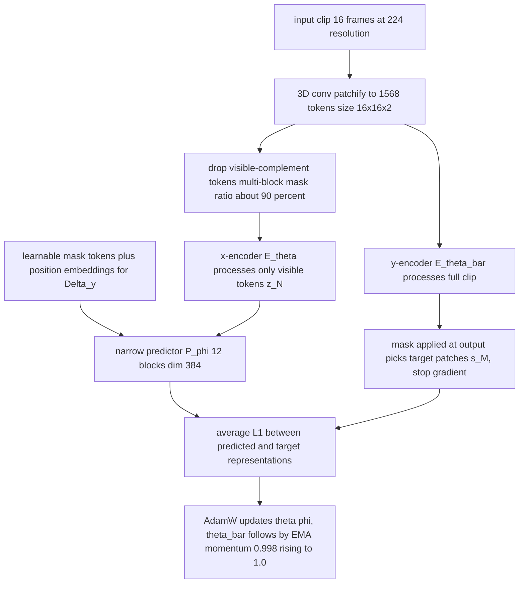

# Revisiting Feature Prediction for Learning Visual Representations from Video (V-JEPA)

- 本地 PDF：`papers/world-model/V-JEPA_2404.08471.pdf`
- arXiv：https://arxiv.org/abs/2404.08471
- 年份：2024（arXiv 技术报告，报告日期 April 15, 2024；发表会议待确认：标题页未标注）
- 团队：FAIR at Meta，与 Inria、ENS、NYU Courant 合作（Adrien Bardes、Quentin Garrido、Jean Ponce、Xinlei Chen、Michael Rabbat、Yann LeCun、Mahmoud Assran、Nicolas Ballas；Assran 与 Ballas 共同末位作者）
- 阶段：JEPA 范式从图像扩展到视频的第一次系统性验证——只用特征预测这一个目标、不靠任何图像模型初始化或文本监督，就训出运动与外观任务通吃的视觉表征，是 I-JEPA 与 V-JEPA 2 之间的关键一环

## 一句话总结

V-JEPA 把 I-JEPA 的 "EMA target 表征回归" 目标搬到时空 token 上（损失换成更稳的 L1），配合覆盖约 90% token 的 short-range + long-range 多块掩码，仅用约 200 万条公开视频预训练三个模型：最大的 ViT-H/16@384 在 Kinetics-400 达 **81.9%**、Something-Something v2 达 **72.2%**、ImageNet-1K 冻结评测达 **77.4%**（双层 attentive probe 升至 77.9%）；相比像素重建方法在所有下游视频任务上以更少样本（270M 对 410M-2400M）、约 2 倍墙钟速度取得一致优势。

## 核心技术

1. **三网络结构沿用 I-JEPA 骨架**：x-encoder $E_\theta$ 只处理可见 token；y-encoder $E_{\bar\theta}$ 编码完整 clip 并在其输出端施加掩码挑选目标块（contextualized targets 思路来自 data2vec）；narrow predictor $P_\phi$ 为 12 层、embedding 固定 384 的浅层 ViT，输入可见表征加带位置嵌入的可学习 mask token。
2. **L1 回归替代 I-JEPA 的 L2**：损失为预测块表征与目标表征的平均 L1 距离。论文明确说这是相对 Assran et al. 2023 的修改，理由是 L1 "more stable"；并给出理论解释（见下节）：最优 L1 predictor 是条件中位数，此时编码器梯度变为最小化条件中位绝对偏差 MAD。
3. **多块多尺度掩码（multi-block）**：short-range 掩码取 8 个随机空间块、每帧覆盖 15%；long-range 取 2 个大块、每帧覆盖 70%；块宽高比采样自 $(0.75, 1.5)$，且空间块沿整段时间轴重复——平均掩码率约 $90\%$，同时杜绝时间冗余造成的信息泄漏。
4. **多头采样的摊销技巧（multi-mask）**：每次迭代对同一 clip 采两种掩码分别前向 x-encoder 与 predictor，但 y-representation 只算一次，把最贵的目标计算成本摊薄一半。
5. **无监督、无 [cls]、纯视频训练**：不使用文本、负样本、重建或图像预训练权重；输入 16 帧（stride 4）即约 2-3 秒素材，经 3D 卷积切成 $16\times16\times2$ tubelet 得到 1568 个 token。
6. **attentive probing 评测协议**：冻结骨干后用一层可学习的 cross-attention 池化（learnable query token + 残差 + 两层 MLP + LayerNorm + 线性分类器）代替简单平均池化。

## 底层原理与数学推导

### 1. 训练目标与防坍塌机制（式 1、2）

朴素地写回归会存在平凡解——编码器对任何输入都输出常数即可零损失：

$$
\min_{\theta,\phi}\ \bigl\Vert\, P_\phi\bigl(E_\theta(x),\,\Delta y\bigr)-E_{\bar\theta}(y)\bigr\Vert_1
\qquad\Rightarrow\qquad \text{collapse}
$$

实际采用的两处修正是在目标侧同时挂 stop-gradient 与指数滑动平均（论文原式 1，下式保留其结构并按均值形式改写）：

$$
\begin{aligned}
\mathcal{L}&=\frac{1}{M}\sum_{k\in(i_1,\dots,i_M)}\bigl\Vert\hat{s}_k-s_k\bigr\Vert_1\\
\hat{s}_M&=P_\phi\bigl(z_N,\ m_M\bigr),\quad z_N=E_\theta(x_N),\quad m_M=\text{mask token}+\text{pos emb}(\Delta y)
\end{aligned}
$$

其中 $M$ 是被掩码的 token 数（$N+M=L=1568$）。梯度只回传给 $\theta$ 与 $\phi$，target 权重 $\bar\theta$ 由 Polyak 平均缓慢跟随。这与 BYOL 的坍塌防护同源，论文还引用了 Tian et al. 2021 的理论工作作为支撑。

```mermaid
flowchart TB
    CLIP["input clip 16 frames at 224 resolution"] --> TOK["3D conv patchify to 1568 tokens size 16x16x2"]
    TOK --> DROP["drop visible-complement tokens multi-block mask ratio about 90 percent"]
    DROP --> XENC["x-encoder E_theta processes only visible tokens z_N"]
    TOK --> YENC["y-encoder E_theta_bar processes full clip"]
    YENC --> OUT["mask applied at output picks target patches s_M, stop gradient"]
    MSKT["learnable mask tokens plus position embeddings for Delta_y"] --> PRED
    XENC --> PRED["narrow predictor P_phi 12 blocks dim 384"]
    PRED --> LOSS["average L1 between predicted and target representations"]
    OUT --> LOSS
    LOSS --> OPT["AdamW updates theta phi, theta_bar follows by EMA momentum 0.998 rising to 1.0"]
```

### 2. 为什么用 L1：条件中位数梯度理论

论文提供了对 Grill et al. 2020（BYOL）分析的 L1 版改编。忽略条件变量并把表示降为一维，记目标表示为随机变量 $Y=E_{\bar\theta}(y)$，则最优 predictor 为：

$$
P^\star\bigl(E_\theta(x)\bigr)=\arg\min_P \bigl\Vert P\bigl(E_\theta(x)\bigr)-Y\bigr\Vert_1=\mathrm{median}\bigl(Y\mid E_\theta(x)\bigr)
$$

把它代回期望损失并对编码器求梯度，得到干净的结果：

$$
\nabla_\theta\,\mathbb{E}\,\bigl\Vert P^\star\bigl(E_\theta(x)\bigr)-Y\bigr\Vert_1=\nabla_\theta\,\mathrm{MAD}\bigl(Y\mid E_\theta(x)\bigr)
$$

即：当 predictor 接近最优时，编码器的更新方向是最小化目标表示在给定上下文下的**中位绝对偏差**——而唯一能把 MAD 压下去的办法就是让 $E_\theta(x)$ 携带尽可能多的关于视频的信息。中位数还是比均值更鲁棒的统计量（对异常帧噪声不敏感），这给 "L1 更稳" 提供了一个候选解释。假设前提是 EMA 保证 predictor 比 encoder 进化更快、始终近似最优。

### 3. 视频材料的 token 化

$$
16\times224\times224\times3\ \xrightarrow{\ \text{3D conv}\ 2\times16\times16\ }\ 8\times14\times14\times d\ \longrightarrow\ 1568\times d\ \text{token 序列}
$$

时间维 stride 为 2 意味着每个 token 覆盖相邻两帧；加上绝对 3D sin-cos 位置嵌入后展平。这个压缩让约 $90\%$ 的掩码率在工程上可行——如果 token 更细，可见 token 的注意力开销会失控。

## 物理直觉解释

**特征预测的本质是要求模型输出"语义摘要"而不是"逐帧重绘"**。像素重建必须花掉全部容量去抠树叶晃动、噪点、光影这类既不可预测也不重要的细节；latent 空间预测则允许模型自由决定丢弃什么——比如预测"一个人在做挥拍动作"这个信息本身，而不必逐像素画出球拍边缘恰好落在哪几列。**这就像影评人复述一部电影**：他能准确讲清楚剧情走向和人物动作，却从不负责还原每一帧画面。Table 1 的对照实验正是这句话的量化版——同样的 ViT-L、同样的数据与迭代数，只把预测目标从像素换成特征，K400 从 68.6 涨到 73.7、SSv2 涨 0.2 个点以内持平、K400 微调持平于 85.6。

**多块高比例掩码是在逼模型理解"动作的意义"而非记住"画面的纹理"**。random-tube 以 90% 比例随机打洞，留下的碎片足以靠相邻纹理插值糊出来，所以学到的特征语义薄弱（Table 4 里 K400 只有 51.5）；把遮挡组织成沿整个时间轴贯通的大块之后，任何一段被挖掉的动作都无法从邻近帧偷看，模型只能依靠上下文推断"发生了什么"。short-range 小块训练局部细节推理，long-range 大块训练整体叙事补全，两种考题混编构成课程。**long-range 那 70% 的空洞如同让你只看一行字的句子开头和结尾去猜中间一句**——你必须懂语言才能续写；causal 变体（只看前 6 或前 12 帧）成绩反而下降这件事说明：双向观看形成的理解远比单向预测丰富，这对想要因果预测的机器人世界模型是个重要警示。

**EMA target 加 stop-gradient 是一套防合谋的制度设计**。若允许梯度直接流进目标侧，两个编码器会在几分钟内学会一起输出常向量，损失归零、表征死亡；EMA 让"出题人"只缓慢追随"答题人"，误差永远存在，系统被迫持续提取新信息。论文进一步给出该机制的 L1 定量版本——最优 predictor 收敛到条件中位数时，编码器梯度变成对 MAD 的梯度，压低它的唯一途径是最大化上下文所含信息量，这就把"防止坍塌"从工程手段提升为"要求编码器保存最大信息"的理论等价物。

**attentive probe 的 +17 分提醒我们评价方式本身塑造结论**。论文坦承非归一化的损失没有理由保证特征落在线性可分的子空间里，mean pooling 会把强判别性的少数维度稀释在高维 averaged 向量里；cross-attention 让下游自己挑出相关方向。**相当于把满仓货物按需求重新装车而不是整车过磅**——56.7 到 73.7 的跳变说明 V-JEPA 的很多能力确实藏在特征里，但也意味着冻结评测的成绩有一部分要归功于这个额外的 learnable 层。

## 工程细节与实操指南

| 项目 | 值 | 备注 |
|------|-----|------|
| 数据 | VideoMix2M 约 200 万视频：HowTo100M + K400/600/700 + SSv2，剔除验证集重叠 | Table 2 显示混合数据平均分最高 |
| 输入 | 16 帧、temporal stride 4、分辨率 224（H@384 用 384）；hflip；random resize scale $(0.3,1.0)$、AR $(0.75,1.35)$ | 每个 token 为 $16\times16\times2$ tubelet，共 1568 个 |
| 掩码 | short-range 8 块 @15%/帧 + long-range 2 块 @70%/帧，AR $(0.75,1.5)$，全时间轴延伸；平均约 $90\%$ | 每 iter 采 2 套掩码、共享一次 y-encoder 前向 |
| 模型 | ViT-L/16、ViT-H/16@224、ViT-H/16@384；predictor 一律 12 层、dim 384、head 数同主干 | 无 [cls]，bf16 在 A100 80G 上训练 |
| 优化 | batch 3072（H@384 为 2400），90K iterations；lr 从 $2\times10^{-4}$ 线性升到 $6.25\times10^{-4}$（12K 步 warmup）再 cosine 衰减到 $10^{-6}$；scheduler_scale_factor 1.25 即余弦周期超出总步数 25% | 不在计划内提前停可少走弯路 |
| EMA 与 wd | momentum $0.998\to1.0$；weight decay $0.04\to0.4$ 线性渐增 | 与 I-JEPA 配方一致 |
| 评测 | attentive probe：learnable query cross-attention + 残差 + 两层 MLP（单 GeLU）+ LayerNorm + 线性头；对比实验用多视角（K400 为 $16\times8\times3$） | 低样本设定取 5%/10%/50% 标签、3 个随机划分共 9 组 |

实操要点：(1) 若要迁移此配方到机器人第一视角数据，掩码的时间轴贯通性质应该保留，因为它是消融里得分最高的成分；具体块数与尺寸的细粒度扫描见论文附录 E.4。(2) 复现效率关键在 multi-mask 摊销——两次 predictor 前向配一次 y-encoder 前向。(3) 冻结评测务必写明用 mean 还是 attentive pooling，两者相差可达 17 个点。(4) 论文未提供任何 few-label 微调之外的适配管线，模仿其协议需自行准备 attentive probe 训练代码（官方仓库 github.com/facebookresearch/jepa）。

## 消融实验与分析

| 实验（出处） | 对照设置 | 关键数字结果 |
|------|------|------|
| 特征 vs 像素目标（表 1，ViT-L，VideoMix2M，90K iter） | 同架构扫 lr/wd 后对比 | 像素目标 K400 **68.6**、SSv2 **66.0**、IN1K **73.3**、K400-ft **85.4**；特征目标 **73.7**/**66.2**/**74.8**/**85.6** |
| 掩码策略（表 4，ViT-L，K710+SSv2） | random-tube[0.9] / causal multi-block[6] / causal multi-block[12] / multi-block | **51.5/46.4/55.6**、**61.3/49.8/66.9**、**71.9/63.6/72.2**、**72.9/67.4/72.8**（K400/SSv2/IN1K） |
| 数据规模与配比（表 2） | K710(700K)/K710+SSv2(900K)/K710+HT(1900K)/VideoMix2M(2000K)，ViT-L；ViT-H 后两档 | ViT-L 平均分 **70.9**/**71.0**/**71.1**/**71.5** 单调升；ViT-H 为 **72.0**（900K）vs **72.8**（2000K）；但单项最优各属不同配比（如 K400 最佳来自纯 K710 的 75.8） |
| mean pool vs attentive probe（表 3，ViT-L） | 平均池化 vs cross-attention 池化 | K400 **56.7** vs **73.7**；SSv2 **50.1** vs **66.2** |
| 同架构对照像素法（表 5，ViT-L/Hiera-L 冻结+微调） | OmniMAE(2400M samples)/VideoMAE(410M)/Hiera(770M)/V-JEPA(**270M**) | 冻结 K400/SSv2/AVA/IN1K：OmniMAE **65.6/60.6/14.4/75.1**、VideoMAE **77.8/65.5/21.6/71.1**、Hiera **75.5/64.2/15.8/68.9**、V-JEPA **80.8/69.5/25.6/74.8** |
| 低样本标签效率（表 7，K400 5%） | 每类约 29 个样本 | V-JEPA H@384 **68.2±0.2** vs MVD **62.6**、VideoMAE **62.3**、VideoMAEv2-g 仅 **37.0±0.3**（性能跌 30%，V-JEPA 跌 12%） |

**核心结论**：(1) 特征预测作为独立目标是成立的——控制架构后它以最少的样本数（270M 对 410M-2400M）和约 2 倍墙钟加速在全部视频任务上压过三类像素法，且优势随标签减少而扩大。(2) "预测什么位置" 至关重要且不可省略：全时间轴 multi-block 与 random-tube 相差超过 20 个点，把掩码改成单向 causal 还会再掉，说明视频自监督的关键不是遮得多而是"遮成需要真正理解才能填上的形状"。(3) 诚实的边界同样清晰：ImageNet 上略输直接在图像上训练的 OmniMAE（74.8 对 75.1），外观主导的任务仍是互联网级图像模型的领地；non-normalized 损失使特征不以线性可分形态呈现，评测端必须借助 learnable pooling 才能兑现能力。

## 技术权衡（Trade-off）

| 优势 | 代价与边界 |
|------|-----------|
| 单一目标免增广免标注，跨运动/外观任务通用，样本效率与速度双优 | 能力依赖 attentive probe 兑现，mean pooling 下缩水 17 点，对外暴露的是"需要轻量适配"而非即插即用 |
| latent 空间可以自由丢弃不可预测细节，不被像素噪声绑架 | 因此不是生成模型；要看清它到底存了什么必须另训扩散 decoder（定性展示 object permanence 与位置不确定性） |
| L1 + 中位数理论给稳定性提供了机理层面解释 | 该分析是一维化简且假定 predictor 近似最优，没有收敛速率或坍塌避免的形式化保证 |
| 纯视频训练天然产出运动敏感特征（SSv2 领先图像模型 21 点） | 外观类任务仍受制于视频数据的多样性不足，作者自己也承认现有视频语料弱于互联网级图像库 |

## 技术价值与演进定位

这篇报告回答的问题是 "feature prediction 能否独立支撑视觉预训练"，答案是肯定的，而且是在运动理解这一视频特有的难点上拉开最大差距。它把 LeCun 2022 的 JEPA position paper 从理念变成了有完整数字、完整消融、开源代码的产品级证据链，随后成为 V-JEPA 2 及机器人侧一系列 JEPA 变体（库内 LeWorldModel、SD-JEPA 等）的直接出发点。对本图书馆而言它的角色有三重：感知侧它是 I-JEPA 的视频续篇与 V-JEPA 2 的地基；方法论上它与 Dreamer v3 的重建路线、TD-MPC2 的 JEP+TD 路线共同构成"预测发生在哪个表征层级"的三种答案；概念上其 L1/MAD 分析是三条线里第一个给出明确优化几何解释的，值得在阅读后续世界模型论文时当作参照系。

## 与其他论文的关系

- **I-JEPA — 图像前作，配方几乎逐项对应**：同样是 x/y 双编码器加 narrow predictor，I-JEPA 用 L2 且掩码只在空间维切块，V-JEPA 改用 "found more stable" 的 L1 并把掩码升级为沿时间轴贯通的多块组合；SOTA 对照表中 I-JEPA ViT-H@512 冻结评 SSv2 只有 **50.0**，比 V-JEPA-H 的 **71.4** 低 21 点以上，直接量化了"视频自监督必须在视频上学"。
- **VideoMAE / OmniMAE / Hiera — 受控比较的像素对照组**：三者代表 masked autoencoding 的像素重建路线，本工作用相同主干（ViT-L 或同级 Hiera-L）逐一对照并在冻结评测全胜；区别在损失的空间而非架构，这是全文最重要的论证设计。
- **DINOv2 / OpenCLIP-G — 互联网级图像基础模型的能力镜**：它们在外观任务上仍领先（DINOv2-g IN1K **86.2** 对 V-JEPA **77.4**），却在 SSv2 上落后 V-JEPA 约 21 点，拼出了当前自监督版图"图像管外观、视频管运动"的分工草图。
- **V-JEPA 2 — 直接扩容后继，图书馆已有笔记**：把预训练推到更大模型与百万小时级数据后加入动作条件 predictor 并落到机械臂操作，是本文范式向控制的自然延伸；阅读顺序建议 I-JEPA -> 本文 -> V-JEPA 2。
- **Dreamer v3 / TD-MPC2 — 世界模型 RL 的平行主线**：那两条线分别在像素重建与 JEP 无重建目标上加 TD 学习来产生行为，本文则是无动作、无奖励情形下纯表征版本的同族路线；其多块时空掩码思想对机器人操作的 affordance 预训练有直接借鉴价值。
- **BYOL 与 data2vec — 防坍塌机制的技术祖先**：EMA + stop-gradient + predictor 的组合出自 BYOL，contextualized target 出自 data2vec；本文贡献在于把它们组合后的视频实例做通并补充了 L1 条件中位数版本的动机分析。
- **MVD（Masked Video Distillation）— 诚实的同期对照**：MVD 先用图像教师再蒸馏视频目标，路线不同但在低样本 K400 上也不差（5% 时 **62.6**），说明蒸馏与从头特征预测两条路径尚未分胜负。

## 精读问题

1. **双向掩码为何优于因果掩码**：causal multi-block[12] 已经接近完整方案（71.9 对 72.9），但对机器人这种必须"从过去推未来"的应用，本文的最优掩码不是因果的——能否设计出保持表征质量又强制时间因果的训练变体？
2. **attentive probe 到底测到了什么**：56.7 到 73.7 的差距有多少来自特征质量、多少来自池化层的额外容量？是否应该以 "mean-pooling 成绩" 作为表征的保守下界来比较各论文？
3. **L1 稳定性的真实来源**：中位数梯度论证依赖于 predictor 恒近似最优这个无法验证的前提；能否通过监测预测残差分布的分位数来实证检验"MAD 最小化"确实在驱动 encoder 更新？
4. **数据配比的单项 vs 平均矛盾**：ViT-L 在纯 K710 上 K400 最高（75.8）却在 VideoMix2M 上只有 73.7，说明均衡平均分会牺牲头部任务；机器人领域的下游（抓放、操作）应该按照什么原则取舍预训练数据？
5. **object permanence 只是定性图**：decoder 可视化展示了被遮挡物体的持续性，但没有定量指标；如何构造一个探针任务把"表征存储了多少物理恒常性"变成可与 V-JEPA 2、LeWorldModel 横向比较的数字？
