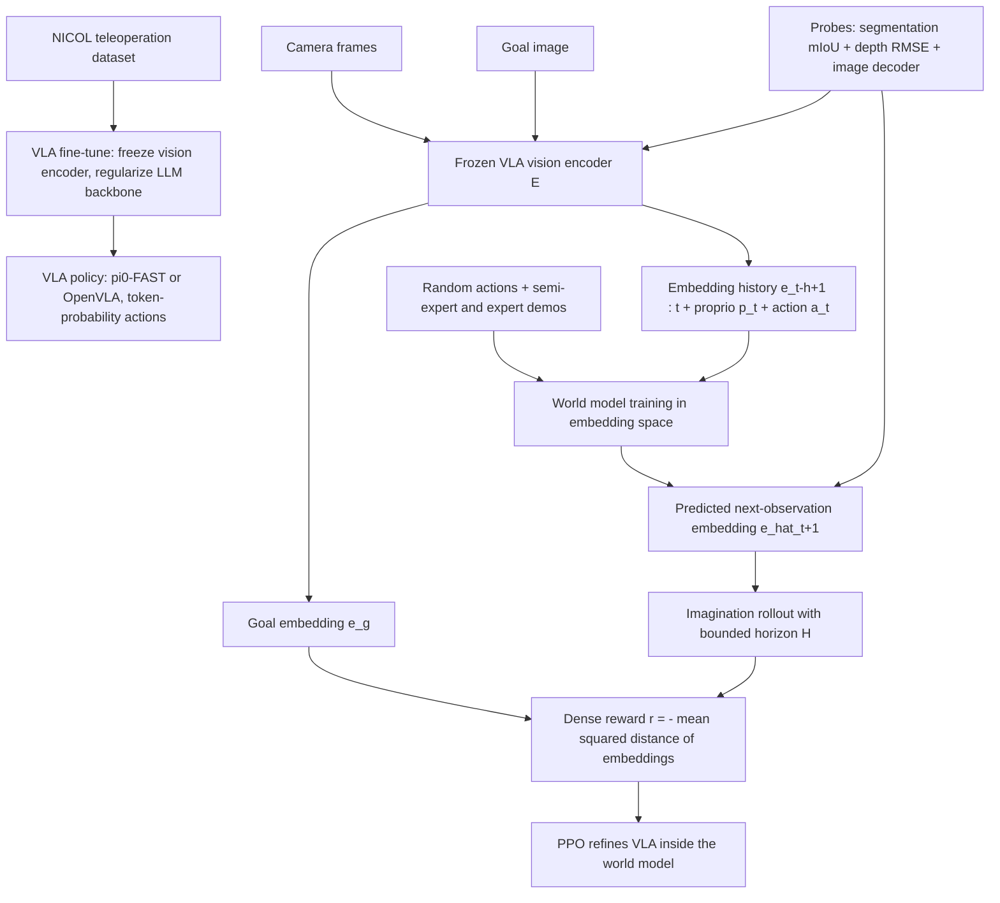

# VLA-Dreamer: Refining VLA Behavior Using World Models（用世界模型在 VLA 嵌入空间内做梦精修行为）

- arXiv: https://arxiv.org/abs/2609.31313
- Source: https://arxiv.org/abs/2609.31313
- Project:
- Local PDF: `/Users/luogu/physical_intelligence/papers/world-model/VLA-Dreamer_2609.31313.pdf`
- Year: 2026
- Category: world-model
- Priority: high

## 一句话总结

这是一篇**概念论文**（concept paper，正文自述 "In this concept paper, we propose..."，无任何实验结果）：VLA-Dreamer 提出复用 VLA 自己冻结的视觉编码器作为潜空间，在其嵌入上训练一个动作条件的 JEPA 式世界模型，再让已在 NICOL 真人形机器人上微调过的 VLA（候选骨干为 π0-FAST 与 OpenVLA，因二者输出 token 概率、RL 管线更简单）在这个世界模型内部用 PPO 做强化学习精修——奖励就是当前状态嵌入与目标图像嵌入的负均方距离；论文的真正主张是一个可证伪的假设检验：**如果 VLA 的视觉嵌入不足以支撑未来预测，就证明了当前 VLA 架构缺乏一个非有损的隐式世界模型**，这是 VLA 范式的结构性缺陷。

## 核心技术

1. **单一编码器三用**：冻结 VLA 视觉编码器的嵌入同时充当（a）策略输入、（b）世界模型的预测目标、（c）目标距离奖励的比较空间——策略输入、预测目标、奖励三共享一个表征，避免像 V-JEPA 2-AC + MPC 那样为规划单独维护一条嵌入通路。
2. **嵌入空间世界模型**：输入为当前动作 $a_t$、机器人本体感觉 $p_t$ 和最近若干帧观测嵌入历史，预测下一帧观测嵌入（π0-FAST 版还预测下一本体感觉状态；OpenVLA 版把本体感觉仅作为辅助损失，因为 OpenVLA 训练配方不消费本体感觉）。损失在嵌入空间而非像素空间，论文明确将其类比 joint-embedding predictive architecture。
3. **探测式嵌入评估（Embedding Assessment）**：在视觉编码器上挂 3 个探针——语义分割探针（指标 mIoU）、深度估计探针（指标 RMSE 与 threshold accuracy）、图像解码探针（仅用于可视化"模型在做梦什么"的有损画面）——用探针精度作为"嵌入是否编码了动作相关信息"的证据；同一组探针再作用于世界模型预测的嵌入，探针精度随想象视界的衰减成为世界模型保真度与漂移的直接度量。
4. **编码器选择的论证**：排除 SmolVLA 这类视觉编码器全程冻结的 VLA（担心 VQA 式预训练没把动作相关特征——如物体精确位置——编进嵌入），选 π0-FAST（SigLIP 起、经 PaliGemma-3B 的 VLM 训练再到 π0-FAST 机器人训练）与 OpenVLA（Prismatic 系的 DINOv2 + SigLIP 双流融合，且训练中更新过视觉编码器）做对照——这个对照同时检验"VLA 训练让视觉编码器额外学到了什么"。
5. **嵌入内 RL 精修**：世界模型当模拟器，VLA 策略在其中交互；密集奖励为当前嵌入与目标嵌入的负均方距离；明确限制想象视界并保持策略靠近预训练先验，以同时抑制复合漂移和世界模型误差被利用。选 token 概率型 VLA 的原因是可直接采样动作、跑 PPO 这类 model-free 算法；RL 定位为"精修细粒度动作"而非"从零发现"。
6. **数据与正则策略**：先在 NICOL 遥操作模仿数据上微调 VLA（冻结视觉编码器避免与世界模型嵌入错位、强正则 + 冻结 LLM 骨干大部分权重防止语义知识流失）；世界模型训练数据为随机动作与半专家/专家策略演示的混合，保证动态覆盖。

## 底层原理与数学推导

整个方案可以浓缩为一个闭环：冻结编码器 $E$ 把帧变成嵌入，世界模型 $f_{\mathrm{WM}}$ 在嵌入上单步前推，策略（VLA 本体）在世界模型展开的轨迹上用距离奖励更新。论文没有给出编号公式，以下为其文字描述的忠实转写。

**世界模型预测目标**：记 $e_t=E(o_t)$ 为冻结编码器输出、$p_t$ 为本体感觉、$h$ 为嵌入历史长度，世界模型学习

$$\hat{e}_{t+1}=f_{\mathrm{WM}}\big(e_{t-h+1:t},\;a_t,\;p_t\big),\qquad \mathcal{L}_{\mathrm{WM}}=\big\|f_{\mathrm{WM}}(e_{t-h+1:t},a_t,p_t)-\mathrm{sg}\,[\,E(o_{t+1})\,]\big\|^2,$$

其中 $\mathrm{sg}[\cdot]$ 表示编码器侧不回传梯度（论文反复强调训练时视觉编码器冻结，"To avoid misalignment between the world model embeddings and the VLA's vision encoder, we freeze the vision encoder"）。OpenVLA 版本中本体感觉预测 $p_{t+1}$ 只作辅助损失：$\mathcal{L}_{\text{aux-prop}}$ 不进入 RL 阶段的策略输入。

**密集奖励**：给定目标图像嵌入 $e_g=E(o^{\text{goal}})$，奖励为负均方距离

$$r_t=-\frac{1}{D}\,\lVert e_t-e_g\rVert_2^2,$$

$D$ 为嵌入维度。论文在讨论中承认两个隐患：同一目标状态可能对应多组视觉片段（嵌入距离未必单射），且均方距离对某些任务**不一定单调**——即 $r_t$ 可能存在把策略引向"嵌入近但任务未完成"区域的局部陷阱，其缓解设想是语义抽象 + 语言 prompt 定义目标，不足时用任务成功分类器的稀疏信号替换或增补奖励。

**受约束的 RL 目标**：论文口头描述"restrict the imagination horizon and keep the policy near its pre-trained prior"，转写为带视界截断与先验锚定的策略目标

$$\mathcal{J}(\theta)=\mathbb{E}_{\pi_\theta,\,f_{\mathrm{WM}}}\!\left[\sum_{k=0}^{H-1}\gamma^k\,r_{t+k}\right]-\beta\,\mathrm{KL}\big(\pi_\theta\;\big\|\;\pi_{\text{SFT}}\big),$$

其中 $H$ 为受限制的想象视界、$\pi_{\text{SFT}}$ 为 NICOL 微调后的先验策略、$\beta$ 为保持靠近先验的正则强度（论文未给出 $\gamma,\beta,H$ 的取值或具体形式，此式是"限制视界 + 靠近先验"两句设计意图的标准形式化，待实验论文落地确认）。

**漂移的可测性**：把探针作用于预测嵌入，想象步 $k$ 处的分割 mIoU$_k$ 与深度 RMSE$_k$ 构成漂移曲线——论文将其定义为"world-model fidelity and drift"的直接度量，这是方案里最可操作的贡献：与其看像素 PSNR，不如看语义/几何探针随 $k$ 的衰减速率来决定 RL 的 $H$ 上限。

## 物理直觉解释

**第一段：在自己做的梦里练琴**。方案的核心图景是给 VLA 造一个**私人梦境排练厅**：舞台布景（视觉嵌入）就是它平时用来感知世界的同一套编码，演员（VLA 策略）在这个布景里反复试错，琴弹错了梦里不会真摔坏东西。与 V-JEPA 2-AC 的 MPC 相比，后者每次决策都要在"梦里"枚举候选动作、逐个向前滚动比距离（昂贵且需要子目标图像当路标），VLA-Dreamer 的思路是**别在推理时做梦，把梦做完之后把本事练进身体里**——RL 把"在嵌入空间里靠近目标"这件事内化成策略权重，部署时一次前向就出动作。这个视角也解释了为什么 RL 只被定位为"精修"：梦境（世界模型）是从真实演示学来的有损复现，只能在预训练先验附近小范围校正，不能指望它教出先验里根本没有的技能。

**第二段：一套货币，三个市场**。冻结编码器的嵌入在系统里同时流通于三个市场——**策略的感官输入、世界模型的记账单位、奖励的计分标尺**——像一座城市用同一种货币同时结算商品、期货和罚款。好处是零兑换损耗：世界模型预测的嵌入就是策略能直接消费的状态，奖励就是这个世界内部的自然距离，不存在"模拟器状态翻译回像素再重新编码"的信息瓶颈。风险也是金融式的：货币本身若是劣币（编码器没把物体精确位置、接触几何编进嵌入），三个市场会一起伪繁荣——策略在世界模型里得分很高，真机上抓空。这正是论文设计分割/深度探针的动机：先验币，再开市。

**第三段：复印机复印复印件**。自回归想象里的复合误差像**反复复印的复印件**：世界模型预测的嵌入被当成下一步的输入，一步的小误差在 $H$ 步内复利放大，梦境逐渐失真。论文对漂移的态度很务实——不追求修好复印机，而是（a）限制复印次数（限制想象视界 $H$），（b）把策略拴在预训练先验上（KL 锚定），（c）用探针精度随 $k$ 的衰减来**测量**复印到第几版就不能再用。这个"漂移曲线决定视界"的设计把一个通常靠手感调的超参变成了可观测量的函数，是概念论文里最接近可执行工程规程的部分；代价是结论的上限也被钉死——若漂移曲线衰减很快，这套架构只能做短视界的精细校正，无法支撑长程规划，论文自己也在讨论里承认了这一点。

## 工程细节与实操指南

- **VLA 骨干（2 个候选）**：π0-FAST（视觉编码器起点为 SigLIP，经 PaliGemma-3B 的 VLM 训练再经 π0-FAST 机器人训练配方，即编码器权重被更新过）与 OpenVLA（Prismatic 系 DINOv2 + SigLIP 双流融合视觉编码器）。选型标准是"输出 token 概率而非 diffusion/flow-matching"，以便采样动作跑 PPO。π 家族不限于单张输入图，深度估计可以不是单目设定。
- **机器人与数据**：NICOL 半人形机器人（Kerzel et al., IEEE Access 2023）；模仿数据为语言指令 + 遥操作数据（含关节位置本体感觉与每步相机帧）；世界模型数据为随机动作与半专家/专家策略混合。论文未给数据集规模数字。
- **微调纪律**：VLA 微调阶段冻结视觉编码器（避免与世界模型嵌入错位）、强正则并冻结 LLM 骨干大部分权重（保语义知识）。
- **评估设计**：分割探针 mIoU、深度探针 RMSE + threshold accuracy、解码探针仅可视化；同一探针作用于预测嵌入以量化漂移；示例任务为方块堆叠。
- **世界模型架构/规模、lr/batch/训练步数、训练与推理硬件、推理延迟**：待确认——概念论文未披露任何实现级超参或算力信息；论文结论段明确"下一步才是训练世界模型与探针"，即撰写时尚无训练产物。
- **RL 算法**：PPO（model-free，利用 token 概率采样）；奖励为嵌入负均方距离，备选增强为任务成功分类器的稀疏信号。
- **代码/项目页**：待确认——PDF 未提供任何代码库或项目页链接（致谢部分只有 DFG LUMO 项目号 551629603 与三项 Horizon Europe MSCA 资助号）。

## 消融实验与分析

**本论文为概念论文，PDF 内没有任何实验结果、消融表格或基准数字**；以下表格整理的是论文自己设计的对照矩阵与可量化指标（全部为设计常量与架构事实，不是测量结果），用于说明其假设检验的对照结构：

| 设计轴 | π0-FAST 分支 | OpenVLA 分支 | 计划的量化指标 |
|---|---|---|---|
| 视觉编码器来源 | SigLIP 起步，经 PaliGemma-3B（3B 参数 VLM）与机器人训练更新 | Prismatic 的 DINOv2 + SigLIP 双流融合，训练中更新过编码器 | 分割 mIoU、深度 RMSE |
| 探针数量 | 3 个（分割、深度、解码） | 3 个（同左） | 深度 threshold accuracy |
| 本体感觉预测 | 主损失（下一 proprio 状态） | 仅辅助损失（RL 阶段不喂给 VLA） | 想象视界各步的探针衰减 |
| 预期深度能力 | 较弱（SigLIP 谱系，单图为主） | 较强（论文预期 DINOv2 带来深度优势） | mIoU / RMSE 组间对照 |

**核心结论：**
1. 该论文的可评估产出是假设而非数字：若冻结 VLA 嵌入上训练的世界模型预测误差大、探针精度低，则支持"当前 VLA 缺乏非有损隐式世界模型"的负面结论——这是一个对 VLA 范式的可证伪检验，与只报成功率的系统论文价值维度不同。
2. 设计中唯一的结构性对照是编码器谱系（SigLIP/PaliGemma-3B vs DINOv2+SigLIP）：论文预期 OpenVLA 的 Prismatic 嵌入在深度探针上占优（因 DINOv2），π0-FAST 嵌入可能更弱——若这一对照成立，将定量回答"VLA 训练让视觉编码器额外获得了哪些可用特征"。
3. 最关键的未量化风险（论文自己列出）：嵌入均方距离对任务不单调、目标状态多视觉片段歧义、漂移限制视界——三者中任何一个都可能让"负均方距离奖励"退化为错误奖励，论文的缓解方案（语义抽象 + 语言目标 + 稀疏分类器信号）在本文中都停留在设想层面。
4. 待确认：世界模型规模、探针训练协议、RL 超参（$H$、$\beta$、$\gamma$）全部未披露，实验落地前无法评估其与 DayDreamer/Dreamer 类想象 RL 的实际差距。

## 技术权衡（Trade-off）

| 优势 | 劣势 |
|---|---|
| 嵌入三用（策略输入/预测目标/奖励空间）消除表征翻译损耗，且不重训视觉编码器、训练成本集中在小世界模型上 | 完全押注 VLA 视觉编码器的嵌入质量：嵌入若不含动作相关信息（物体精确位置、接触几何），整条管线失效——论文自认这是最大风险 |
| 相比 V-JEPA 2-AC 的 MPC：部署时无迭代规划开销，无需子目标帧序列，任务视界不受子目标间隔限制 | 相比 MPC 的显式规划：RL 内化的行为无法在部署时换目标重规划，换任务需重跑 RL；对奖励非单调性更脆弱（MPC 至少能逐候选比较） |
| 相比自建仿真器：想象生成算力远低于构建/运行完整仿真，且从真实演示学得、天然规避 sim-to-real 差距与手工建模遗漏 | 世界模型漂移与复合误差限制想象视界，实质只能做短视界精修；论文明确"substantial drift 可能只允许 fine-grained refinement" |
| token 概率型 VLA（π0-FAST/OpenVLA）让 PPO 管线简单，可直接复用预训练语义先验与语言条件 | 排除了 diffusion/flow-matching 动作头（π0 系本体、当前多数据效率更高的动作头家族），选择面收窄；且 RL 精修依赖的密集奖励正是最脆弱的组件 |
| 概念阶段的可证伪设计（探针 + 漂移曲线）让后续实验无论正负都有明确信息量 | 无任何实验支撑，所有机制论证停留在假设；训练一个足够好的世界模型本身"requires substantial compute"（论文原话），与宣称的样本效率收益尚未对账 |

## 技术价值与演进定位

在"世界模型 × VLA"的融合谱系里，VLA-Dreamer 占据一个尚未被实验占据的位置：**世界模型不作为部署期规划器（V-JEPA 2-AC MPC、DINO-WM 式潜空间规划），也不作为训练期动作条件辅助目标（WAM 系），而是作为训练期模拟器直接做 RL 精修场地**，并且是这个方向上少见的"用策略自己的编码器当潜空间"提案。它继承了 Dreamer 一系"在想象中学习"的纲领，但把想象空间从自训练潜变量换成 VLA 冻结嵌入，把"学世界模型"的成本换成了"验证 VLA 嵌入是否值得信赖"的科学问题——这个反转使它更像一份研究纲领而非系统报告：即便实验失败（嵌入不可预测），也产出"VLA 范式缺非有损隐式世界模型"这一结构性结论。对库内主线的价值在于它把 JEPA 式嵌入预测（I-JEPA/V-JEPA/LeWM 一线）与 VLA 精修（RL for VLA 一线）对接成一个具体可跑的实验方案，其探针-漂移评估协议对任何潜空间世界模型都可直接复用。

## 与其他论文的关系

1. **notes/world-model/v-jepa2.md（V-JEPA 2 / V-JEPA 2-AC，2506.09985）**：直接对照对象。V-JEPA 2-AC 用冻结视频编码器 + 动作条件预测器支撑 MPC 规划，代价是推理期迭代规划开销与对目标图像/子目标帧的依赖（视界受子目标间隔限制）；VLA-Dreamer 的宣称是用 RL 在嵌入内训练轻量策略以替代 MPC，但注意 V-JEPA 2-AC 已有 62 芯片真机演示等实证（见库内笔记），而本文尚无数字可对。
2. **notes/world-model/daydreamer.md（DayDreamer，2206.14176）与 notes/world-model/dreamer-v3.md（DreamerV3，2301.04104）**：想象内 RL 的谱系源头——Dreamer 系在自训练潜空间世界模型里学行为；VLA-Dreamer 的差异点是潜空间换成 VLA 冻结嵌入、策略换成带语义先验的大 VLA 而非小 MLP，并借语言 prompt 定义目标。
3. **notes/architecture/openvla.md（OpenVLA）**：两大候选骨干之一；本文对其 Prismatic（DINOv2+SigLIP）编码器的赌注是"训练中更新过编码器所以嵌入更动作相关"，其 7B 规模带来的 RL 训练成本问题论文未讨论（待确认其最终选型）。
4. **notes/architecture/fast-tokenizer.md（FAST tokenizer，π0-FAST）与 notes/architecture/pi0.md（π0）**：π0-FAST 因 FAST 离散 token 化输出成为"可跑 PPO"的候选；这也暴露其排除项——π0 本体的 flow-matching 动作头（库内 notes/architecture/flow-matching.md）被排除在方案之外。
5. **notes/rl/vla/rove.md、notes/rl/vla/simplevla-rl.md、notes/rl/vla/z-1.md（RL for VLA 一线）**：同一问题空间（用 RL 精修 VLA）的不同技术路线——ROVE/SimpleVLA-RL/Z-1 在真实环境或大规模并行仿真中用成功奖励训 VLA，VLA-Dreamer 主张在自训世界模型的嵌入里用密集距离奖励，省掉真机交互与仿真器构建；三者的实证结果（见各自笔记）正好构成本文缺失的基线。
6. **notes/world-model/d-jepa.md（D-JEPA，2609.24749）**：直接威胁本文奖励设计的证据。D-JEPA 量化了潜空间目标距离在决策边界附近系统性失灵（top-4 内 within-start Spearman 跌至 0.11、反转率 49.0%），而 VLA-Dreamer 的密集奖励恰恰是逐状态的嵌入目标距离——若 D-JEPA 的结论迁移到 VLA 嵌入空间，本文奖励在接近目标时最不可信，恰是最需要奖励精确的阶段。
7. **notes/world-model/tacwam.md（TacWAM，2607.28391）**：同为"复用预训练表征做预测"的路线对照——TacWAM 复用的是视频生成先验并强调部署一致性（未来 token 只做监督），VLA-Dreamer 复用的是 VLA 编码器且未来预测只在训练期使用，两者共享"训练期特权信息不进部署路径"的原则。

## 精读问题

1. VLA 视觉编码器为 VQA/对齐目标训练，其嵌入对"物体精确位姿 + 接触几何"的编码上限在哪里——用本文的分割/深度探针之外，是否应该直接加一个"位姿回归探针"（物体 6D 位姿误差）来更贴近操作任务真正需要的动作相关信息？
2. D-JEPA 已证明潜空间目标距离在决策边界附近排序失灵（top-4 Spearman 0.11），那么负均方嵌入距离奖励在目标附近的梯度方向可信度如何——能否在 VLA-Dreamer 的框架内做一个"距离奖励 vs 成功分类器稀疏奖励"的受控对比，量化距离奖励带来的局部陷阱率？
3. 冻结编码器保证了策略与世界模型表征对齐，但代价是编码器无法为"可预测性"优化——若允许嵌入末端加一个轻量可训练投影（世界模型侧适配器），预测误差与策略迁移各受多少影响，会不会重演 I-JEPA 与重建式表征的表征分工问题？
4. 论文用探针精度随想象步数的衰减定义漂移曲线，漂移曲线与 RL 最终策略性能之间的定量关系是什么——是否存在一个可测的"半衰期"阈值，低于它的世界模型做 RL 精修必然负收益？
5. OpenVLA 版把本体感觉仅作为辅助损失、RL 阶段不喂给策略，这与 π0-FAST 版（本体感觉进输入）在接触丰富任务上的差距会有多大——两种设定的对照能否回答"VLA 需要本体感觉通路吗"这一独立于世界模型的问题？
6. 世界模型在"随机动作 + 半专家/专家演示"混合数据上训练，混合比例未给出——覆盖广（随机段）与动态准确（专家段）的权衡是否存在可诊断的最优比例，还是应按任务族分别采集？
