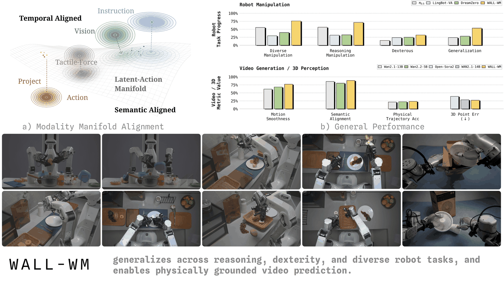
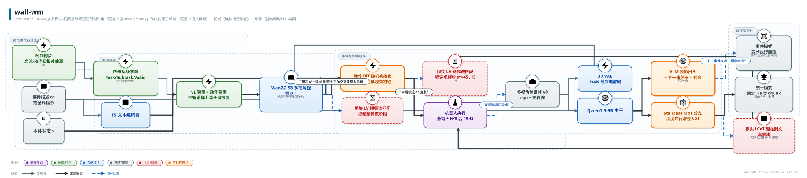
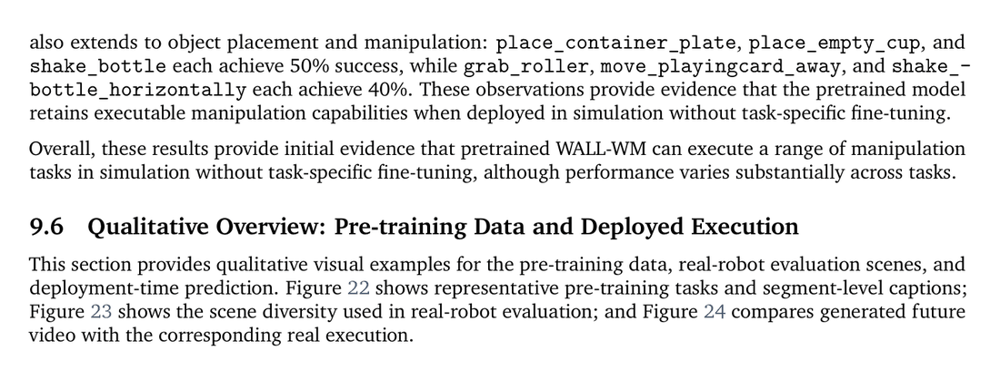

# WALL-WM: Carving World Action Models with Semantic Events

- arXiv: https://arxiv.org/abs/2606.01955
- Source: X Square Robot Team（自变量机器人，46 页技术报告 v2，2026-09-09）
- Project: https://github.com/X-Square-Robot/wall-wm
- Local PDF: `papers/world-model/WALL-WM_2606.01955.pdf`
- Year: 2026
- Category: company WAM / semantic-event chunking (X Square)
- Priority: high

## 一句话总结

**Problem**：WAM 从多模态/视频基础模型适配时沿用「固定长度 action chunk」作优化原子单位，语言（语义目标）、视觉（连续场景演化）、动作（控制级时标）被同一外部时钟切割，粒度失配使 VLA 训练退化为短视程相关拟合，甚至用 chunk 特有捷径覆写预训练视觉-语义先验；**Insight**：把视频-动作学习的原子单位换成「动作落地的语义事件」（reach/grasp/lift/place 等可被语言命名、视频可见、动作可实现的可变长片段），"Fixed chunks cut by clock; semantic events cut by embodied dynamics"；**Mechanism**：事件级字幕 + 聚类平衡采样数据生态 + Wan2.2-5B 视频 DiT 与动作 DiT 层耦合的流匹配双塔去噪（先训视频后冻视频训动作，锚定视频步 s*=45）+ Qwen3.5-9B/Staircase 潜在 CoT 支撑「事件模式（变长执行）/统一模式（固定 chunk）」双推理；**Evidence**：真机四套件 Task Progress 全面第一（Diverse 75.86 vs pi0.5 的 55.64，Generalization 53.75 vs 24.00，Reasoning 71.60 vs 56.40），事件+跨视角消融 Reasoning 32.6→71.6，RoboTwin 零样本 15.2%（76/500），蒸馏+FP8 后端到端 10Hz。

## 九问速览

1. **Problem**：WAM 用固定长度 chunk 作优化单位，语言/视觉/动作三种时间尺度被同一时钟硬切，训练退化为短视程相关拟合。
2. **Bottleneck**：chunk 非语言-视频-动作共享的自然对象：切断语义行为中段、合并多个行为、全局指令下局部 chunk 病态（歧义）。
3. **Insight**：原子单位应为动作落地语义事件——语言可命名、视频可接地、动作可实现，边界由可执行行为变化决定。
4. **Method**：事件对齐三元组 (V_e, a_e, c_e) + 双 DiT 流匹配去噪（视频塔先训后冻）+ VLM/Staircase 双模式推理。
5. **Evidence**：真机 Task Progress：Diverse 75.86、Reasoning 71.60、Generalization 53.75，vs pi0.5 的 55.64/56.40/24.00（Table 6）。
6. **Ablation**：事件模式+跨视角 vs 预训练统一解码：Reasoning 32.6→71.6、Generalization 22.0→53.75（Table 4）；蒸馏去动作损失 → action MAE 恶化 53%。
7. **Assumption**：事件边界可被标注管线可靠切分（依赖密集时间标注，作者自认）；Wan 的 T2V 簇中心先验可被事件训练保留并转化为物理先验。
8. **Failure**：Dexterous 32.00 vs 从头训统一基线 31.25——精细接触不吃事件分解红利；RoboTwin 零样本仅 15.2%，绝对水平仍低。
9. **Opportunity**：自监督事件边界（把标注负担移入训练目标）；事件级 latent 原语作为下一代 WAM 预训练的自回归单位；事件级评估协议。

| 维度 | 论文答案 |
|---|---|
| Perception | 多视角 RGB 关键帧（每相机一帧；部署 rig 为 ego+左右腕三视角，Camera RoPE 免标定扩展到异构多机位多具身）+ 本体状态专用 token；触觉力为可选接触信号而非必需模态 |
| Closed-loop | 事件模式：整段事件开环执行后重观测，**重规划间隔=事件时长（可变，示例 2.5s/5.0s/7.5s）**；统一模式：每 H_a 步 chunk 边界重规划。语义边界把重规划放在行为切换处（抓取闭合、释放、插入对准），而固定 chunk 边界可能落在语义中段（打断）或跨多个语义（拖延纠错）——这是本文与库内固定 chunk 理论的直接对话点 |
| Correction | 训练侧三重机制：接触位姿随机初始化的恢复数据混合、Segment 级字幕把重抓/纠错显式定位成可采样事件、聚类平衡上浮长尾非名义轨迹；执行侧无块内修正 |
| Deployment | DMD 分布匹配蒸馏（少步学生）+ FP8 逐块 PTQ + CUDA Graph → 端到端 10Hz 满足闭环预算；事件模式运行时依赖微调 Qwen3.5(-VL)-9B 头给出下一事件描述与剩余时间估计 |

## 核心技术

**总纲：把「在哪里放视频-动作学习的原子单位」从工程 convenience 提升为第一性设计问题，然后用语义事件替换固定 chunk，并让语言/视频/动作三模态在这个单位上对齐。** 三个设计原则（Sec 1）：geometry preservation（不把三模态压扁进同一嵌入空间）、prior preservation（兼容 caption-to-video 先验）、executable causality（预测目标有清晰时间支撑、时长跟任务走）。固定 chunk 三条全违反：它可能切断语义行为中段、把多个行为并进一个目标、需要历史上下文才能确定 chunk 语义。

*论文 Figure 1（p2）：Figure 1 Conceptual illustration of modality hierarchy and WALL-WM’s general performance. Left: a st*

### 1. 语义事件的定义与切分（Sec 4.2–4.3，离线数据管线）

**事件（action-grounded semantic event）**：一段时间上连贯的可执行行为（reaching、grasping、lifting、moving、placing……），起止由底层可执行行为的变化决定而非外部时钟；语言命名它（c_e）、视频接地它的时空演化（V_e）、动作实现它（a_e）。切分不是在线检测器，而是**离线标注管线**，先于聚类与采样完成：

1. **时间同步**：相机编码/控制器日志/遥操作中间件/落盘引入近乎常数的视频-动作偏移——接触附近几帧就能把语义状态从"接近"变成"触碰"。做法：对每 episode 构造视觉运动信号（ego+腕部相机帧间光流幅度）与动作运动信号（左右末端位置流的有限差分），平滑归一化后扫小整数滞后窗取互相关最大的偏移，跨相机跨通道聚合（20 FPS 下两帧偏移约 100ms）；弱相关/源级投票不一致/超窗的 episode 隔离或降权（Sec 4.2，Fig 11）。
2. **事件边界切分**：在同步后的视频-动作流上**先按原子操作动作（atomic manipulation actions，引 GEBD 式事件分割）边界切分，再配字幕**——语言区间与视觉/控制的物理区间对齐，而非按固定帧窗切。
3. **四级层级字幕**：Task（L3，episode 全局目标）/ Subtask（L2，中间目标：接近、建立抓取、搬运、放置）/ Action（L1，操作原语：reaching、对准夹爪、闭合、提升、平移、插入、撤回）/ Segment（L0，最细粒度短事件）+ 可选 Human 层（人工标注子集，用于验证自动层级与边界质量）。单个 episode 的量级示例（Fig 12）：1 个 Task × 10 个 Subtask × 42 个 Action × 109 个 Segment。恢复行为（重抓、打滑重试、小位姿修正）在 Segment 层获得自己的描述，可被 dataloader 按时间区域采样/加权，而非被平均进全局任务描述。
4. **双聚类平衡采样**（Sec 4.4）：冻结多模态编码器做 VL（指令-场景主题）聚类 + 动作轨迹空间聚类（长尾集中了恢复/重抓/接触修正），训练 batch 同时平衡两类簇——罕见但重要的指令-场景组合与非名义轨迹成为显式采样单元。两轮聚类离线预计算，训练只消费簇标签，零额外前向/优化器开销。
5. **准静态帧剪枝**：事件构造时剪掉准静态帧，让流匹配监督集中在末端运动显著的段。
6. **恢复数据**（Sec 4.5）：对每个接触富集事件 e，在其标称接触位姿 q_e* 的小测地球内采样初始扰动，回放示教或采集新恢复 rollout，按混合权重 alpha 掺入（公式见下节）——聚类是"上浮已有非名义轨迹"，恢复初始化是"主动制造接触空间局部覆盖"。

### 2. WAM 目标如何按事件组织（Sec 3.1–3.3）

模型学 p_theta(V_e, a_e | V_0, s, c_e)：V_0 是当前多视角观测（每相机一关键帧）、s 本体状态、(V_e, a_e) 事件对齐的未来多视角视频与末端轨迹（**长度均随事件变化**）、c_e 事件字幕。训练分两阶段（Sec 5.1）：先只训视频 DiT（Wan 式 v-prediction 流匹配 + 事件级字幕条件，caption-drop 调度），后冻结视频 DiT 只训动作塔（动作流匹配，交叉注意力键值来自**锚定在固定去噪步 s\*=45 的单次视频前向**，K=6 个动作噪声级复用同一次视频前向摊薄吞吐）。架构：视频塔继承 Wan 单视角 DiT，嫁接跨视角分支（零初始化输出投影 + Camera RoPE + 训练期 sight-cone/tube 掩码）；动作塔为等深 DiT，每块对匹配视频层特征做单向交叉注意力（ViewConcat + E_tau/E_abs 时间索引），本体状态走专用交叉注意力。

### 3. 双推理模式（Sec 3.4 / 5.5）

- **事件模式**：在事件空间 rollout——微调 Qwen3.5(-VL)-9B（或人/agent）提议下一事件描述 + 当前事件剩余时间估计，WALL-WM 去噪出变长视频-动作段并整段执行，完成后观测推进、进入下一事件。时长跟任务自然走。
- **统一模式**：保留常规固定 H_a 步 chunk 推理，但条件不再只是原始全局指令——VLM（对齐到 T5 特征空间的 drop-in 替换，附带下一事件头与剩余时间回归头）+ **Staircase 潜在 CoT 解码**（MoT 分支挂在冻结 Qwen3.5-9B 上，在 relay 深度 N_r 之上深度并行生成 K_c 个连续潜在推理态，冻结 Qwen3.5-0.8B 做潜在到文本重建监督）供给逐 chunk 文本侧上下文。三个可混用信号源：梯度连续全局指令 / 每 chunk 原子指令 / VLM-CoT 潜在态，运行中可无缝切换。

*架构速览：Problem：WAM 从多模态/视频基础模型适配时沿用「固定长度 action chunk」作优化原子单位，语言（语义目标）、视觉（连续场景演化）、动作（控制级时标）被同一外部时钟切割，粒度失配使 VLA 训练退化为短*

## 底层原理与数学推导

**（1）事件级 WAM 目标：流匹配双塔去噪（式 7/13，Sec 3.2–3.3）。** 模型建模联合条件分布并最小化两项流匹配损失：

$$
p_\theta(V_e, a_e \mid V_0, s, c_e),\qquad \mathcal{L}_{\text{event}} = \mathcal{L}_V + \mathcal{L}_A
$$

$$
\mathcal{L}_V = w_V(t_V)\,\big\|\hat C_V - C_V^{\star}\big\|^2,\;\; C_V^{\star} = \epsilon_V - z_0^{V};\qquad
\mathcal{L}_A = \frac{1}{K}\sum_{k=1}^{K} w\!\left(t_k^{A}\right)\big\|\hat y_k^{A} - y_k^{A\star}\big\|^2,\;\; y^{A\star} = \epsilon_A - a_0
$$

视频侧为 Wan 式 v-prediction（可选逐时间步加权 w_V，border masking 恒开）；动作侧默认同为 v-prediction，接触密集数据可切 x-prediction（直接输出干净动作，因接触事件只占几帧、v-prediction 在高噪声下权重不足），另有 Type-II DCT 辅助损失可选（指数 bin 衰减 e^{-j/(T_a/4)}，高噪声处按 (1 - t_k^A/T)^2 降权；主配方 w_DCT=0 全关）。

**（2）事件边界的形式化定义与 caption-drop（式 20，Sec 5.1）。** 事件是把 episode 时间轴按原子动作边界切出的变长分割：

$$
\mathcal{E}(\pi) = \{e_i = [t_i, t_{i+1})\}_{i=1}^{N_e},\quad t_{i+1} \text{ 由可执行行为变化（动作边界）决定而非固定步长};\qquad
\rho(L_e)=\rho_{\min}+\frac{\rho_{\max}-\rho_{\min}}{2}\Big(1-\cos\tfrac{\pi\,(L_e-L_{\min})}{L_{\max}-L_{\min}}\Big)
$$

其中 L_e 为事件原始帧长，rho_min=0.1、rho_max=0.9、L_min=129（=截断上限，65 latent frames/stride-2 下 129 raw frames）、L_max=220——**事件越长越可能丢字幕**（余弦爬坡），逼模型在无字幕步退化为"观测锚定的未来合成"（只看当前多视角观测推断接触与末端动力学的物理合理延续），短事件则几乎总有字幕。这一调度把"语义条件"与"纯物理外推"做成随事件时长滑动的混合。

**（3）与固定 chunk 目标的对比（Fig 2 / Sec 1）。** 两种目标的形式：

$$
\text{chunk-centric:}\;\; \max_\theta \sum_t \log p_\theta\big(a_{t:t+H}\,\big|\, o_t,\ \ell_{\text{global}}\big)
\qquad\text{vs}\qquad
\text{event-grounded:}\;\; \max_\theta \sum_{e\in\mathcal{E}} \log p_\theta\big(V_e, a_e \,\big|\, V_0, s,\ c_e\big)
$$

关键差异在**适定性（well-posedness）**：全局指令 l_global 对局部等长 chunk 是歧义条件（同一指令在不同时刻对应不同动作），必须加历史窗口才能恢复 next-chunk 预测的适定性；而 c_e 天然把预测区间局部化，next-event 预测无需历史即适定，且 caption-视频-动作描述同一语义区间，caption-to-video 先验（Wan 的 T2V 训练结构）被原样继承。事件模式的代价是 H 变成随机变量 |e|（训练需长度分桶 + 多事件序列打包）。

**（4）恢复数据的混合分布（式于 Sec 4.5）。**

$$
\tilde p_{\text{train}}(q, e) = (1-\alpha)\, p_{\text{nominal}}(q, e) + \alpha\,\mathbb{E}_{e}\big[p(q \mid e)\big],\qquad \mathrm{supp}\; p(q\mid e) \subset B_\epsilon\!\big(q_e^{\star}\big)
$$

接触位姿分布支撑在标称接触位姿的小测地球内——局部于事件、保留接触几何，创造受控局部覆盖。

**（5）视频-动作去噪步映射（式 12，Sec 3.3）。** 冻结视频 + 大规模动作训练采用非对称 1-to-N_d 映射：所有 N_d=50 个动作去噪步都读同一次锚定视频前向：

$$
m(j) = s^{\star},\;\; \forall j \in \{0,\dots,N_d-1\},\qquad t_k^{A} \overset{\text{u.a.r.}}{\sim} \Phi_A,\; k=1,\dots,K
$$

s\*=45（50 步调度上经验选定，训练期带小抖动窗）。对称 1-to-1（t_A=t_V）只在两塔端到端小数据联合拟合时用；冻结视频下高噪声视频特征与真值段不对应、近干净特征结构信息不足，故锚在"结构保真与可用证据平衡"的中等噪声步。VLM 文本条件阶段另有三项损失（式 21）：L_text = lambda_align·||c_l^VLM − c_l^T5||^2 + lambda_next·CE + lambda_time·Huber——VLM 隐状态被对齐到 DiT 原生 T5 特征几何，成为 drop-in 替换。

## 物理直觉解释

**语义事件 ≈ 乐句，固定 chunk ≈ 节拍器。** 乐谱按等长小节切分只是记谱方便，演奏家呼吸、换弓、渐强都发生在乐句边界——若强迫演奏者每四拍必须换一次气，再快的指法也会在乐句中段被切断，跨乐句的长句又被肢解成碎片。机器人操作同理：reach、grasp、lift、place 的自然时长各不相同（论文 Fig 2 的三个事件分别 2.5s、5.0s、7.5s），固定 chunk 这个"节拍器"既会在语义行为中段硬切（把一次抓取切成两半，监督信号自相矛盾），又会把多个行为并进一个目标（模型只能学它们的边缘平均）。WALL-WM 的标题化用柏拉图"Carve nature at its joints"（在关节处下刀）：事件边界就是操作的"关节"——行为发生切换的地方，在那里切开，每一片语义都是完整的。

**等长 chunk 的监督错位 ≈ 字幕组拿错了台词本。** 附录 9.1 给出本文最深的一层洞察：T2V 训练里文本是"高维视觉未来流形上的低维簇中心标签"——网络必须先承诺要渲染哪一类语义轨迹再动笔，这是互联网规模免费送来的语义锚定自监督；而 I2V/JEPA 式"给上一帧续下一帧"的目标没有这个锚，最容易学成高级光流。事件对齐让一条字幕、一段画面、一段动作指认**同一个物理区间**，Wan 先验里的簇中心结构原样继承；等长窗口则像字幕组拿着整部电影的总简介去配每一分钟的片段——字幕与画面系统性错位，模型只好丢掉语义先验、改学短视程捷径，这正是摘要所说"主动覆写预训练视觉-语义先验"的机制。

**锚定视频前向 s\*=45 ≈ 在半干的水彩稿上描线。** 动作塔既不与视频塔联合去噪、也不读干净视频，而是把 50 步去噪调度固定停在第 45 步——一张"半干"的草稿：物体在哪、接触几何如何的大结构已经显现，细节尚虚。太干净的稿子（低噪声）信息量反而低（所有动作都对着同一张确定画面，学不到"哪种视频证据支撑哪种轨迹"）；太高噪声的稿子与真值段不对应，动作监督会被误导。动作塔在草稿的**每一个深度层**上描出末端轨迹（逐层单向耦合），一次视频前向配 K=6 个独立噪声级的动作前向——同一张稿子反复用，摊薄计算。这解释了为什么"视频塔冻结"不是省事，而是给动作学习提供了噪声水平恒定、语义结构在场的交叉注意力证据。

**事件边界重规划 ≈ 在换挡点踩离合，而非每秒匀速踩一次。** 固定 chunk 部署像定时换挡：不管路面如何每 H 步必换，接触瞬间（夹爪闭合、插入对准）这种信息量最大的时刻未必赶上重观测，语义中段的重规划则是浪费。事件模式把重观测放在行为切换的"挡位边界"，剩余时间头还在告诉系统当前挡位还剩多久。但 Dexterous 套件敲了警钟：32.00 vs 从头训基线 31.25，几乎零差距——挡位换对了不够，**挡位内部的位姿精度与接触时序**（窄容差插入、精细对准）是另一层瓶颈，事件分解帮不上忙。

## 工程细节与实操指南

**五阶段训练流水线（Table 1，Sec 5）**：

| 阶段 | 训练 | 冻结/未接 | 要点 |
|---|---|---|---|
| 1. 视频 PT | 视频 DiT（含跨视角分支） | 3D VAE、T5 冻结；动作塔未接 | 事件 latents 上 v-prediction 流匹配；截断 65 latent frames；caption-drop rho(L_e)；EMA 0.9999；分辨率/长度分桶 |
| 2. 动作 PT | 动作 DiT（随机初始化） | 视频 DiT 冻结 | 关闭视频损失；s\*=45 锚定单次视频前向；K=6 噪声复用；cluster-balanced 采样 |
| 3. VLM 文本 | project-out 头 + 下一事件头 + 剩余时间头 | Qwen3.5-9B 全冻 | 对齐 T5 特征空间（drop-in）+ CE + Huber 三项损失 |
| 4. Staircase 蒸馏 | MoT 分支 + prefix projector | 主干与重建 LM（0.8B）冻 | 潜在到文本重建 L_CoT；深度并行潜在 CoT |
| 5. next-chunk 适配（可选） | 双 DiT 塔 | T5 冻结 | 观测中心历史窗 + 全局指令（Task 级）；历史条件窗口重跑双聚类 |

**关键超参速查**：N_d=50、s\*=45（带抖动窗）、K=6（仅训练吞吐技巧，推理不用）、rho∈[0.1,0.9]、L∈[129,220]、截断 65 latent frames（stride-2 下 129 raw）、EMA 0.9999、主配方 w_DCT=0 且 tube 掩码关闭（p_tube=0；sight-cone 注意力监督与 border masking 恒开，均仅训练期，推理免标定）。

**数据工程实操**：时间同步在 caption/聚类/采样**之前**做（否则接触附近的帧-动作错配会毒化一切下游）；清洗第二遍剔除缺相机流、非单调/重复动作记录、异常 FPS、帧-动作长度失配、无效机器人状态、运动学不连续、夹爪状态损坏、重定向后越工作空间的段；非结构化采集（无预设任务/重置/episode 边界的自由操作长流）靠"先 caption 后 cluster"管线吸收进同一平衡采样器，突破遥操作示教的吞吐天花板；UMI 式无本体采集（XRZero-G0：VR 跟踪头显 + 手持夹爪几何与部署机器人末端一致，IK 重定向到部署 URDF，毫米级位姿）与少量真机锚定配对。视频侧窗口几何：3D VAE 是 1+4N 时间编解码（leading-one/trailing-four），观测中心窗 M=1 时 1+4M+4N raw frames 一次编码成 1+M+N latents，历史-未来无重编码接缝；动作侧每个视频 latent 配 K_p 个相对位姿 token（锚点为 0）。

**部署压缩栈（Sec 6.2）**：DMD 分布匹配蒸馏把去噪步数压到个位数量级，联合目标保留原动作预测损失锚住动作头——**去掉它 action MAE 恶化 53%**（纯分布监督下动作头漂移）；FP8 逐块 PTQ（权重离线预打包、激活量化融合进前算子 epilogue，当前 GPU 上约 2x BF16 吞吐）+ CUDA Graph 消除 host 侧 launch 开销 → 端到端 10Hz。**训练基础设施（Sec 6.1）**：DMuon（vanilla Muon 的 NS 迭代在分片训练下优化器步开销可达前后向合计的 2x，DMuon 用 LPT 参数属主 + reduce/broadcast + CuteDSL 对称 Gramian 核把它降到次要成本）、TVM FFI 自定义核库（绕过 PyTorch dispatcher 与 GIL，训练/推理同一核保数值一致）、Ulysses 序列并行下细粒度重叠藏掉每层 4 次 all-to-all、**多事件序列打包**（按固定总长拼多个事件 + 阻断跨事件泄漏的注意力掩码，替代整 episode latent 缓存，保住有效 batch size）。

## 实验协议清单

| 项目 | 论文设置 | 来源与备注 |
|---|---|---|
| 观测 | 多视角 RGB 关键帧（每相机一帧；部署示例 ego+左右腕 N_v=3；Camera RoPE 支持异构多机位免标定）+ 本体状态（专用 state token）；触觉力可选 | Sec 3.1/3.2，Fig 1/3；分辨率未报告 |
| 动作空间 | 末端执行器轨迹（相对观测锚点位姿的 relative-pose 流；每视频 latent K_p 个动作 token；含夹爪——清洗项有 gripper-state corruption）；UMI 数据 6-DoF 控制器轨迹 IK 重定向到部署 URDF | Sec 3.3/4.1；动作维度数值未报告 |
| 控制频率 | 压缩后端到端推理 10Hz（DMD+FP8+CUDA Graph）；去噪调度 N_d=50 步（蒸馏前）；数据采集举例 20 FPS | Sec 6.2（10Hz）；机器人本体控制带宽未报告 |
| 重规划频率 | 事件模式：事件边界处（变长，示例 2.5s/5.0s/7.5s）；统一模式：每 H_a 步 chunk 边界 + 可配置历史窗（M=1 示例） | Sec 5.5，Fig 2；H_a 数值未报告 |
| 动作 horizon | 事件模式变长（训练截断至多 65 latent frames = 129 raw frames，stride-2）；统一模式固定 H_a（未报告数值）；长程预训练任务达 78 segs（Deal Mahjong） | Sec 5.1；Fig 22 |
| 数据 | 1.2M-clip OpenVID 切片 + HD-VILA 等网络视频；Ego4D/EPIC-KITCHENS 自我中心；XRZero-G0 UMI 无本体；AgiBot World/DROID/开源 + 自采（结构化+非结构化遥操作）+ 恢复数据；场景分布 Industrial 42.7%/Home 22.0%；时长 Medium(20s-1min) 55.4%/Short 20.0%/Long 21.2%/Extra-long 3.3%；视频生成评测集 200 ID + 50 OOD 任务 | Sec 4.1/7.1，Fig 8/9；总时长/总 episode 数未报告 |
| 奖励 | 无 RL 奖励（纯生成式预训练）；真机评估用 Task Progress 稠密 0-100 分（10 分制 rubric 归一化，逐任务部分得分规则见 Table 7）；RoboTwin 用二元任务成功 | Sec 7.2，Table 7 |
| Reset | 结构化采集遵循预定义任务范围与 reset 协议（明确起止/目标条件）；真机评测 reset 细节未报告 | Sec 4.1；评测侧未报告 |
| 成功定义 | 真机：Task Progress（按任务 rubric 给可观察中间步骤部分分，如"Pick up(2)+align(3)+place(4)+retract(1)"）；RoboTwin：任务完整执行的二元成功 | Sec 7.2，Table 7；式 23 |
| 评估次数 | RoboTwin：50 任务 × 10 episodes = 500；真机每任务 trial 数未报告 | Sec 9.5，Table 5 |
| 随机种子 | 未报告 | — |
| 扰动测试 | Generalization 套件：多物体共享场景 + 随机顺序切换指令 + 干扰物；训练侧接触位姿随机初始化恢复数据；无外力推动/碰撞类物理扰动测试 | Sec 4.5/7.2.4 |
| 真机 | 是。自研平台：高性能桌面双臂（主评测平台）+ QUANTA X1/X1 Pro 移动 + QUANTA X2 轮式人形（高自由度灵巧手）；基线 pi0.5/DreamZero/LingBot-VA 经标准动作接口适配，同一任务定义/指令/多视角流/场景随机化/评分 rubric | Sec 4.1/7.2，Fig 7 |
| 算力 | 未报告（仅 infra 描述：DMuon、TVM FFI 核库、序列并行重叠、多事件打包）；模型家族从 <10B 到数十 B 参数 | Sec 6/8；GPU 数量/小时未报告 |
| 特权信息 | 明确声明：任何方法 rollout 期间均无特权状态信息或任务特定评分反馈；本体感知为策略常规输入（非特权） | Sec 7.2 |

**附录陷阱自查**：
- privileged 信息：rollout 无特权状态/评分反馈（论文明示）；但 Task Progress 由外部 rubric 判分（事后评分，非策略输入）——无泄漏
- reward shaping：Task Progress 是稠密部分得分，比二元成功更"宽容"，WALL-WM 相对基线的差距可能被 rubric 粒度放大/缩小；RoboTwin 二元成功（15.2%）作交叉参照，量纲不可比
- reset 难度：真机 reset 协议未报告；自研平台 + 数据同源 = 作者自认的评测环境优势（Sec 8"cannot be fully removed"）
- eval budget：真机每任务 trial 数未报告（无法算置信区间）；RoboTwin 每任务仅 10 episodes，零成功率任务的分辨率粗
- 底层控制栈：末端位姿流 + IK 重定向（URDF）；底层跟踪器/阻抗参数未报告；10Hz 为压缩后推理频率
- 数据优势：自采数据与部署平台几何对齐 + 1.2M 网络视频 + 非结构化采集吞吐 + 恢复数据增强；基线（LingBot-VA/DreamZero 等）的方法特定调剂量不对等（作者 Sec 8 自述）

（事实优先从 PDF 附录提取；查不到写「未报告」，严禁编造）

## 消融实验与分析

*论文 Table 5（p36）：Table 5 Zero-shot evaluation of pretrained WALL-WM on RoboTwin. Task success rates (SR) are reported*

| 对照 | 设置 | 结果（Task Progress / 指标） | 来源 |
|---|---|---|---|
| 事件模式 vs 从头训统一模式（同任务监督） | WALL-WM-E vs WALL-WM-U-Scratch（移除事件预训练+事件条件推理，固定长度指令到动作） | Diverse 75.86 vs 63.00（+12.86）；Reasoning 71.60 vs 59.50；Generalization 53.75 vs 18.50（+35.25）；Dexterous 32.00 vs 31.25（≈0） | Table 6，Fig 16-19 |
| 事件执行 + 跨视角 vs 预训练统一解码（去 VI-SA） | 均有预训练；Base = 固定长度统一解码无 View-Interaction Self-Attention，Event = 事件模式 | Reasoning 平均 32.6 → 71.6（Press Button in Order 0→64，Pick Fruits 60→96）；Generalization 平均 22.0 → 53.75（Push Cloth 26→78，Insert Screwdriver 14→47）；注意：VI-SA 与执行格式同时变化，是**组合效应** | Table 4，Sec 7.2.5 |
| 蒸馏时去掉联合动作损失 | DMD 分布匹配蒸馏 ± 动作预测损失 | 动作 MAE 恶化 53%（动作头随去噪轨迹压缩漂移） | Sec 6.2 |
| 事件级具身训练 vs 原生视频先验 | WALL-WM（Wan2.2-5B 初始化） vs Wan2.1-1.3B / Wan2.2-5B（无事件训练） | 交互质量 0.434 vs 0.226/0.219（约 1.9x）；语义对齐 0.886 vs 0.805/0.857；运动平滑 0.771 vs 0.683/0.619；指令遵循 0.391 vs 0.298/0.308；图像质量 0.503 vs 0.527/0.577（略降，先验换轨的代价） | Table 2，Sec 7.1 |
| 3D 感知探针 | CO3Dv2 probing vs 6 个视觉表征 | WALL-WM Point Err 0.271 / Depth Err 0.132，优于 WAN2.1-14B 的 0.284/0.151；AUC@5 0.210 vs 0.200 | Table 3，Sec 7.1 |
| 零样本仿真 | RoboTwin 50 任务 × 10 episodes，无任务微调 | 平均 15.2%（76/500），26/50 任务至少 1 次成功；最高 click_bell 90%、press_stapler 80%、click_alarmclock 60%；最低多任务 0% | Table 5，Sec 9.5 |

**与库内 chunking 理论的接口——「语义事件 vs 固定 chunk 长度」消融的缺失与替代证据。** 本文**没有做固定 chunk 长度 H 的扫描消融**（why-chunking-works 的 π̂_n^k 矩阵、chunking-exploratory 的执行块长扫描在这里不存在）；它把对照重构成三个层级：(a) 语义边界 + 事件监督 vs 无事件分解的固定长度从头训（U-Scratch，四套件 +0 到 +35.25）；(b) 同一预训练骨架上事件模式执行 vs 固定长度统一解码（Table 4，Reasoning 32.6→71.6，但混入 VI-SA）；(c) 作者在 Sec 8 直接承认边界条件：任务少、指令固定、无 OOD 需求、数据稀缺时，固定长度推理可能**更快到达局部最优**——即事件分解的收益是有条件的，与 chunking-exploratory 的"开环稳定任务上对数长度即够"结论遥相呼应：当部署分布窄、指令-动作映射近确定时，块长权衡的最优解就在固定端。Generalization 套件（53.75 vs 18.50）是语义边界对"指令切换 + 共享场景"最硬的正面证据；Dexterous（+0.75）则是反面：接触精度瓶颈不在切分单位。**待确认：Table 4 的 Base 基线是否也去掉了层级字幕采样（论文未逐一拆分 VI-SA / 事件执行 / 采样策略的贡献）。**

## 技术权衡（Trade-off）

| 优势 | 劣势与工程代价 |
|------|---------------|
| 粒度对齐：语言/视频/动作在同一语义单位上监督，caption-to-video 先验原样继承（语义对齐 0.805→0.886） | 依赖密集时间标注与四级字幕管线——事件边界是**标注出来的**，不是学出来的；作者自列为首要 future work |
| 变长执行：重规划落在行为切换处，Generalization 53.75 vs 固定长度基线 18.50-28.50 | 变长事件=开环执行整段（可达数秒），接触时序敏感任务上无块内修正——Dexterous 32.00 几乎无增益 |
| next-event 预测无需历史窗口即适定（c_e 局部化区间），训练窗口干净 | 训练侧要为变长买单：长度分桶、多事件序列打包、65 latent frames 截断（超长事件被截、语义可能不完整） |
| 双模式共享一个事件预训练骨架：事件模式管开放泛化，统一模式管常规固定 horizon 评测 | 统一模式回到固定 chunk 的老问题（H_a 如何选未报告），Staircase/VLM 头引入额外推理栈复杂度 |
| 视频塔冻结 + s*=45 锚定：动作训练吞吐高（K=6 复用）、先验不被动作梯度覆写 | 单向耦合意味着视频不被动作反馈改进；锚定步是经验超参（数据/尺度迁移性未消融） |
| 恢复数据 + Segment 级字幕显式暴露纠错行为，长尾可采样加权 | 事件模式运行时依赖 VLM 出下一事件描述——上游提议错误会级联到整段执行；剩余时间头误差的影响未报告 |
| 压缩后 10Hz 满足闭环预算；DMuon/打包/核库保住大 batch 有效利用率 | 视觉质量略降（图像质量 0.527→0.503）；FP8/蒸馏均为工程妥协，与"scale-driven generalization 为第一前沿"的立场并存 |

## 技术价值与演进定位

**定位：WAM 规模化路线图（roadmap）而非单点模型——"less a short adaptation of a video foundation model, more a prior-preserving scale-up methodology"。** 三条主轴：(1) 优化单位从 chunk 换事件（本笔记主题）；(2) 数据生态五轴（来源覆盖/时间同步/四级字幕粒度/双聚类/恢复增强）把网络视频-自我中心-无本体-遥操作四象限喂进同一管线；(3) 基础设施（DMuon、TVM FFI 核库、多事件打包、DMD+FP8）支撑 <10B 到数十 B 家族。讨论部分给出两个战略判断：延迟是"更可解的工程问题"而泛化天花板丢了难找回（先 scale 后压缩）；高频操作模型不应与通用 agent 竞争高层推理参数——把高层任务分解为逐事件文本描述，事件级指令泛化才是本体模型的第一优先级。

**在库内 chunking 支线中的位置——固定 chunk 理论边界之后的第三条路。** 库内两篇理论笔记划定了固定 chunk 的边界：`notes/architecture/why-chunking-works.md` 证明 chunking 收益 ≈ 延迟条件预测的隐式集成（块内时序一致性非必要、随机延迟才是关键），且 50-60Hz 高频区延迟无法复制 chunking 收益；`notes/architecture/chunking-exploratory.md` 证明在开环 EISS 动力学下执行块长只需对数于稳定参数即得 horizon-free 误差界、超长只有边际收益，而数据侧噪声注入（激励可控 Gramian 大特征方向）是与 chunking 对偶的另一条绕开指数复合误差的路。两篇共同暗示：**块长本身不是价值载体，它只是"何时重观测/何种监督密度"的代理变量**。WALL-WM 把这个代理变量直接换成语义：长度不再是超参而是数据的语义属性（事件多长就执行多长），监督密度由 Segment 级字幕控制，重观测时机由行为边界决定。其恢复数据混合 (1-α)·p_nominal + α·E_e[p(q|e)] 与 chunking-exploratory 的噪声注入采集在结构上同构（都在误差最易复合的接触子空间制造带干净标签的局部覆盖），只是前者按语义事件定位、后者按可控性方向定位。代价同样清晰：理论失去了时钟域的解析分析（变长开环区间的稳定性没有 EISS 式刻画），Dexterous 的零增益就是这一空白的实证投影。

## 与其他论文的关系

- **notes/architecture/why-chunking-works.md（2608.02547）**：该文证明固定 chunk 的收益来自"延迟重规划 + 隐式集成"而非块内一致性——WALL-WM 的事件模式等于把"延迟窗口"从固定 k 步推广为"一个语义事件的时长"，是随机延迟集成的语义化版本；但 WALL-WM 未做 RDE 式机制隔离，事件收益与跨视角建模纠缠（Table 4 组合效应）。互补读法：why-chunking 解释了为什么"切在哪"比"切多长"更本质。
- **notes/architecture/chunking-exploratory.md（2507.09061）**：该文的块长权衡（对数长度即够 + 开环不稳定则灾难）预言了 WALL-WM 的两面性——Generalization 大涨（重规划时机对了）与 Dexterous 零增益（开环变长区间内接触精度无人兜底）；两文的"接触富恢复数据 vs 噪声注入采集"是同一机制的数据侧镜像。
- **notes/rl/core/q-chunking.md（2507.07969）**：Q-chunking 把 TD 学习搬进 chunked action space 得无偏 n-step backup；WALL-WM 的事件=语义 chunk，天然是"event-level RL"的跳步单位（一个 backup 跨一个完整语义行为）——本文纯生成式预训练未涉及 RL，这是最明显的开放接口。
- **notes/rl/core/dqc.md（2512.10926）**：DQC 解耦"值学习的 chunk 长 h"与"策略执行的 chunk 长 h_a"；WALL-WM 是同一解耦思想在监督学习侧的镜像——预训练监督单位（事件，变长）与部署执行单位（事件模式变长 / 统一模式固定 H_a）分离，且论证了"预训练用事件、部署可固定"的组合优于"从头固定"（U-Scratch 对照）。
- **notes/briefs/action-chunking-brief.md（88 方法地图）**：WALL-WM 落在分类轴 1（Horizon/长度自适应：ChunkFlow 元动作归纳、A³、ACSAC 等）的"语义监督"分支——不是在线自适应选长度，而是离线把长度交给事件边界；同时呼应轴 8 理论类（2608.02547 / 2507.09061 的工程回应）。
- **notes/architecture/pi0.md / pi05.md**：π0.5 是最强真机基线（Diverse 55.64 / Reasoning 56.40 / Generalization 24.00 vs WALL-WM 75.86/71.60/53.75）；π0 系的 flow-matching 动作专家 + 固定 chunk 正是 WALL-WM 批判的"chunk-centric"原型——同为流匹配动作生成，监督单位从固定 chunk 换事件后 Generalization 翻倍以上，是这条路线最有力的对照实验。
- **notes/world-model/unipi.md（2302.00111）**：UniPi 确立"视频即策略"（视频扩散规划 + 逆动力学提动作）；WALL-WM 继承"视频是语言到动作的脚手架"论断（Sec 1 直接引用该线），但用动作塔逐层读视频特征替代显式 IDM——动作不再从生成的视频里"翻译"，而是在共同去噪中对齐。
- **notes/world-model/gr-mg.md（2408.14368）**：GR-MG 用 progress-guided 目标图作视觉子目标；WALL-WM 的事件描述是纯文本子目标 + 剩余时间标量（progress 的对偶：GR-MG 把进度注入生成器，WALL-WM 把进度作为 VLM 输出头）。
- **notes/world-model/leworldmodel.md（2603.19312）**：附录 9.1 点名对比——JEPA 系（V-JEPA-2/LeWorldModel）走 native-I2V 时间外推（无文本锚、易学成光流），WALL-WM 坚守像素空间 native-T2V 簇中心先验；这是"预测在特征空间还是像素空间、语义锚要不要"之争的当前表态。
- **库内其余**：lingbot-va / dreamzero（真机基线 + 附录 9.4 KV-cache 流式的局限讨论——仍是固定 horizon 预测，不在语义端点停）；worldarena（视频生成评估协议来源，2602.08971）；xr-1 系可对照 XRZero-G0 无本体采集（2604.13001）。

## 精读问题

1. **事件边界检测误差如何影响 WAM 训练？** 切分先于字幕，边界噪声会让 c_e 与 (V_e, a_e) 系统性错位——等价于把"视频-动作时序失配"（论文自己在 Sec 4.2 花大力气修的问题）以语义粒度重新引入。论文只报告了人工层校准字幕质量，没有边界误差敏感性消融（如故意抖动边界 ±k 帧看 Task Progress 变化）。
2. **事件粒度是否可学习？** 四级层级（Task/Subtask/Action/Segment）中训练到底消费哪层、不同层混采比例多少未完整披露；作者 future work 自认"自监督事件边界"是核心方向——把标注负担移进训练目标（如边界作为 latent 变量端到端学）后，本管线多少成分可以删？
3. **事件模式的整段开环执行在接触密集区是否安全？** Dexterous 32.00 vs 31.25 暗示事件内无纠错的极限；对照 why-chunking-works 的 50-60Hz 失效区，是否需要"事件内子 chunk 重规划"的混合模式（事件定边界、chunk 定执行）？
4. **锚定步 s*=45 与视频塔冻结的耦合**：锚定步是在当前数据分布上选的，模型家族扩到数十 B、或数据分布漂移后是否要重选？训练期"小抖动窗"的宽度与作用未量化。
5. **remaining-time 头的闭环角色**：它被训练（Huber 监督）并随事件模式输出，但执行段终止到底由模型隐式决定还是由该标量截断？其估计误差导致的事件过执行/欠执行未被分析。
6. **Task Progress 与二元成功的量纲差**：真机 75.86（稠密分）与 RoboTwin 15.2%（二元）无法互译——预训练泛化的真实上限在哪里？作者自己也在 Sec 8 呼吁事件级评分与"视频预测性能→机器人性能"的评估器。
7. **统一模式的 H_a 与 Staircase 潜在 CoT 的分工**：固定 chunk 部署时事件结构只剩潜在条件，Fig 2 承诺的"历史窗恢复适定性"与 Staircase 的语义注入是否冗余？消融只到组合层面（Table 4），缺逐项拆解。
