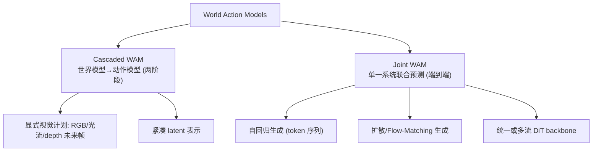

# World Action Models: The Next Frontier in Embodied AI (Survey)

- 本地 PDF：`papers/world-model/WAM-Survey_2605.12090.pdf`
- arXiv：https://arxiv.org/abs/2605.12090
- 年份：2026（5 月）
- 团队：复旦大学等
- 阶段：World Action Model (WAM) 首个系统综述 — 统一"世界预测 + 动作生成"

## 一句话总结

这是首个系统性的 World Action Model (WAM) 综述。WAM 定义为"统一预测状态建模与动作生成的具身基础模型"，目标建模未来状态**和**动作的联合分布——区别于 VLA（只做观测→动作映射）和纯世界模型（只预测未来状态不做动作）。将现有方法分为 **Cascaded WAM**（世界模型先生成未来状态/视觉计划，动作模型再解码动作）和 **Joint WAM**（单一系统联合预测状态和动作）。系统分析了数据生态（遥操作、UMI 类便携人类演示、仿真、互联网 egocentric 视频）和评估协议（视觉保真度、物理常识、动作合理性）。

## 核心概念

### WAM 与 VLA / 世界模型的区别

| 模型类型 | 建模目标 | 代表 |
|---------|---------|------|
| VLA | $p(a_t \| o_t, l)$ — 观测→动作反应式映射 | π0, OpenVLA, GR00T |
| World Model | $p(o_{t+1} \| o_t, a_t)$ — 未来观测预测 | Dreamer, TD-MPC2, V-JEPA |
| **WAM** | $p(o_{t+1:T}, a_{t:T} \| o_t)$ — 未来状态+动作联合 | LingBot-VA, RISE, MemoryWAM |

WAM 的核心价值：VLAs 学的是"反应式映射"而不显式建模物理世界如何随动作演化——WAM 显式建模前瞻（foresight）、物理接地（physical grounding），并能力利用大规模无动作人类视频数据。

### 两条技术路线

## 数据与评估

**数据生态 4 类**：
1. 机器人遥操作数据（动作标签完整，但采集贵）
2. UMI 类便携人类演示（动作无标签，需逆动力学）
3. 仿真数据（可无限生成，但 sim-to-real gap）
4. 互联网 egocentric 视频（规模最大，无动作）

**评估 3 维**：视觉保真度（预测的帧像不像）、物理常识（符不符合物理）、动作合理性（解码的动作可不可执行）

## 技术权衡（Trade-off）

| Cascaded WAM | Joint WAM |
|-------------|-----------|
| 模块解耦，可独立改进世界模型/动作模型 | 端到端联合优化，表征共享 |
| 中间产物（未来帧）可解释、可验证 | 无中间产物，latent 直接耦合 |
| 误差在模块间累积 | 无累积误差但可解释性差 |
| 可复用大规模无动作视频（先练世界模型） | 需要视频-动作联合数据 |

## 核心技术

WAM 的两条技术路线（详见"核心概念"）：
1. **Cascaded WAM** — 世界模型先生成未来状态/视觉计划，动作模型再解码动作（显式视觉计划 / 紧凑 latent 表示）
2. **Joint WAM** — 单一系统联合预测状态和动作（自回归 token / 扩散 Flow-Matching / 统一或多流 DiT）

## 底层原理与数学推导

**Cascaded WAM** 的联合分布分解：
$$p(o_{t+1:T}, a_{t:T} \mid o_t) = p_{\text{WM}}(o_{t+1:T} \mid o_t) \cdot p_{\text{action}}(a_{t:T} \mid o_t, o_{t+1:T})$$

**Joint WAM** 直接建模联合分布：
$$p(o_{t+1:T}, a_{t:T} \mid o_t) = \int p_\theta(o_{t+1:T}, a_{t:T} \mid o_t) \, d\theta$$

前者模块解耦可独立改进，后者端到端联合优化。WAM 与 VLA 的本质区别：VLA 建模 $p(a_t | o_t)$（反应式），WAM 建模 $p(o_{t+1:T}, a_{t:T} | o_t)$（前瞻式）。

## 物理直觉解释

**为什么"预测未来"比"直接反应"更强？** VLA 像闭着眼睛走路——每一步只根据当前画面决定动作，不知道动作会导致什么后果。WAM 像睁着眼睛走路——先"看到"如果这样做未来会发生什么（世界模型预测），再决定动作。这就像下棋时的"走一步看三步"vs"只看当前"。

**Cascaded vs Joint 的直觉**：Cascaded 像"先请导演拍未来片段，再请演员照着演"——中间产物（未来帧）可检查可验证，但两步可能有偏差。Joint 像"演员直接即兴演出，边演边想象未来"——更一体，但不可解释。Cascaded 能用无动作视频先训世界模型（视频不需要动作标签），Joint 需要视频-动作对。

## 工程细节与实操指南

- **Cascaded 落地**：先训练世界模型（用大规模无动作视频），再训练动作解码器（用少量机器人数据）——数据分层利用
- **Joint 落地**：需要视频-动作联合数据集（遥操作）——数据要求更高
- **评估三维**：视觉保真度（帧像不像）、物理常识（符不符合物理）、动作合理性（动作可不可执行）
- **数据生态**：遥操作（贵但完整）→ UMI 人类演示（无动作需逆动力学）→ 仿真（无限但 gap）→ egocentric 视频（最大但最弱）

## 消融实验与分析

综述本身无消融实验，但对比了方法家族的关键取舍：

| 对比维度 | Cascaded | Joint |
|---------|----------|-------|
| 中间产物可解释性 | 高（未来帧可见） | 低（latent 直接耦合） |
| 误差累积 | 模块间累积 | 无累积但难调试 |
| 无动作视频利用 | 可（先训世界模型） | 难（需联合数据） |
| 端到端优化 | 两阶段非端到端 | 端到端 |

## 技术价值与演进定位

WAM 综述标志着一个范式转向：**从"反应式 VLA"到"预测+行动统一模型"**。2026 年的 LingBot-VA（自回归视频-动作）、RISE（组合世界模型+想象 RL）、MemoryWAM（持久记忆 WAM）都是这一范式的实例。这份综述为你提供了理解"世界模型赛道"的坐标系——你已有的 10 篇世界模型笔记都能在 Cascaded/Joint 框架下定位。

## 与其他论文的关系

- **LingBot-VA (RSS 2026)** — Joint WAM 代表（MoT 架构，视频+动作联合自回归）
- **RISE (RSS 2026)** — 组合世界模型做想象 RL，属 Cascaded+RL 融合
- **MemoryWAM** — Joint WAM + 持久记忆
- **Dreamer v3 / TD-MPC2** — 纯世界模型（无动作生成），WAM 的前身
- **π0 / OpenVLA** — 纯 VLA，被 WAM 超越的"反应式"范式

## 精读问题

1. WAM 的"动作合理性"评估如何操作化？目前有没有可复用的指标？
2. Cascaded 的中间"视觉计划"是否需要像素级？latent 级计划（更高效）的可行性边界？
3. WAM 训练需要视频-动作联合数据——无动作人类视频的利用（逆动力学蒸馏）是否成熟？
4. WAM 与 VLA 的终极关系——是替代还是融合（VLA 做语义理解，WAM 做物理预测）？
