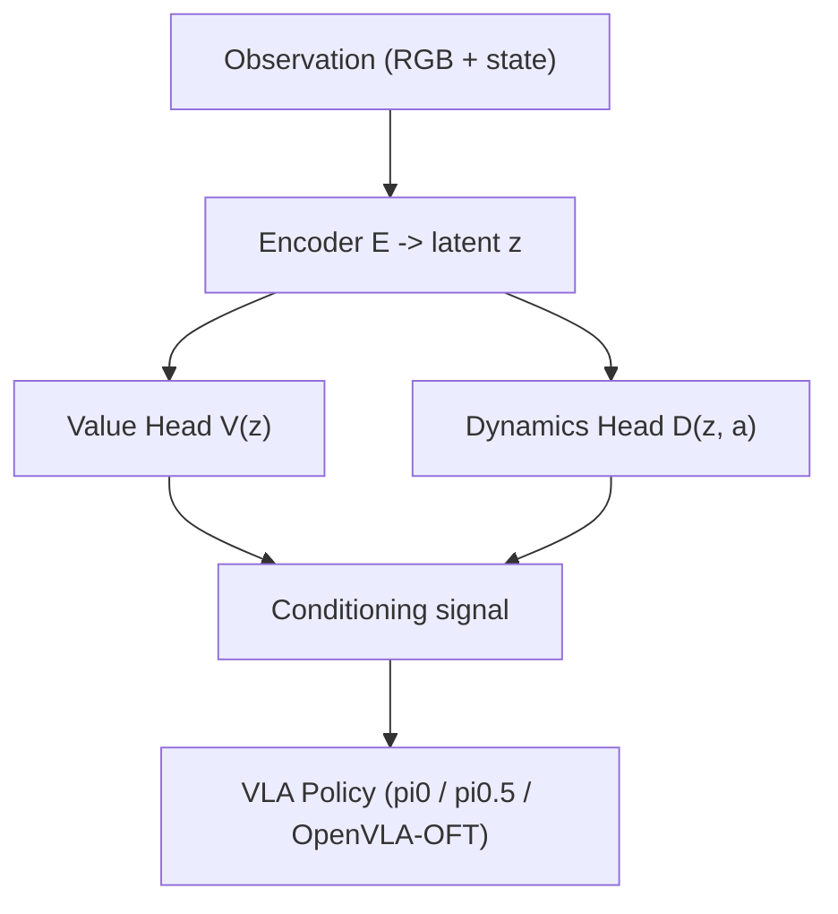

# WCM: World-Conditioned Manipulation（世界批判模型条件化策略）

- 本地 PDF：`papers/world-model/WCM_2602.10984.pdf`（**注意：该 PDF 内容不匹配本论文**，实为其他论文，属下载错配；待确认：正确 PDF 需从 arXiv 2607.29613 重新获取）
- arXiv：https://arxiv.org/abs/2607.29613
- 年份：2026
- 团队：待确认（仅从摘要获取，需读取全文确认机构）
- 阶段：世界模型即条件 — LeJEPA 世界批判模型（World Critic Model）预测未来状态与价值，作为 VLA 策略的额外条件输入

## 一句话总结

WCM 把世界模型从"旁观评估器"升级为"策略的条件信号源"：LeJEPA 世界批判模型同时挂 value head（预测任务成功概率）与 dynamics head（预测未来状态），两者的预测结果直接拼入 π0/π0.5/OpenVLA-OFT 等 VLA 的输入，即插即用、不改 backbone。149 个任务、4 个 benchmark 上，+WCM 达到 in-distribution 84.4±1.2%、out-of-distribution 51.5±1.5% 成功率，把 SFT 基线（38.4%/18.1%）直接翻倍以上；7 个真实操作任务验证了纯仿真训练的世界模型可以零微调服务真实机器人。

## 核心技术

1. **LeJEPA 世界批判模型** — 在 JEPA 式抽象 latent 空间做预测（而非像素空间），value head 估计当前状态离任务成功有多远，dynamics head 预测状态随动作的演化；两个 head 的输出都作为策略条件
2. **即插即用条件化** — 不修改 VLA backbone 架构，只把世界模型预测结果拼入策略输入；π0、π0.5、OpenVLA-OFT 均可直接挂载
3. **仿真训练、真实部署** — 世界模型完全用仿真数据训练，真实场景零微调；OOD 场景（新物体组合/新光照）下的增益尤为显著

## 底层原理与数学推导

世界模型在 latent 空间学习两个映射。编码器把观测映射到抽象表征：$z_t = E(o_t)$。value head 输出任务成功概率的估计：

$$V(z_t) = P(\text{task success eventually} \mid z_t)$$

dynamics head 在给定动作下预测下一时刻的 latent 状态：

$$\hat{z}_{t+1} = D(z_t, a_t)$$

策略被条件化在这两组预测之上：

$$\pi(a_t \mid o_t, V(z_t), \hat{z}_{t+1})$$

条件化的直觉是：$V(z_t)$ 告诉策略"我现在离成功多远"（类似 critic/评估器），$\hat{z}_{t+1}$ 告诉策略"如果这样做会发生什么"（类似前瞻/想象力）。与经典 JEPA（只学表征、不接决策）相比，WCM 的关键是把预测结果变成可被策略消费的信号——$V$ 提供标量激励、$\hat{z}$ 提供结构化上下文，两者互补。待确认：$V$ 与 $\hat{z}$ 具体如何拼入各 backbone 的输入（token 拼接 vs 额外 embedding），论文未在摘要中给出，需读全文。

## 物理直觉解释

**世界模型是"提前半秒的慢动作回放"**。老司机过弯时看的是弯心而不是眼前的保险杠——他的大脑在预测"按当前速度打这个方向，1 秒后车身会在哪里"；新手只盯着眼前，走一步看一步，弯中才发现转向不足。SFT 策略就像新手：它记住了"看到这个画面应该做这个动作"的映射，但不知道动作的后果。WCM 的 dynamics head 就是老司机的预判——在动作还没执行完之前，先推演"如果这样做，状态会变成什么样"，把这个推演结果交给策略，策略就能提前修正。这正是 OOD 增益的来源：训练分布外的场景里，映射记忆失效，但"预测后果"的物理因果仍然成立。

**价值 head 是"教练在场边打分"，而不是"终点线的裁判"**。稀疏的成功信号只在最后给出 0/1 判决，而 $V(z_t)$ 给出的是连续的距离感——"还差得远"到"快成功了"之间有多少量级。这解释了为什么 value+dynamics 双 head 缺一不可：只有价值没有动力学，策略知道"我快成功了"却不知道"下一步该把状态往哪推"；只有动力学没有价值，策略有想象力却没有目标。两者合起来才是完整的闭环：**有目标感（value）的预演（dynamics）**，这就是世界批判模型比纯预测模型多出来的那一环。

**为什么 latent 空间预测比像素预测强？** 直接预测下一帧像素等于要求模型记住布料纹理、光照方向、相机噪声等与任务无关的全部细节，预测误差大部分浪费在"画得不像"上。JEPA 的抽象空间只保留与任务相关的因果结构（物体的位置关系、相对运动），相当于**速写而不是素描**——抓住骨架，丢掉皮肤纹理。同样的预测预算，花在任务相关的结构上，泛化自然更强。FlowSDE/FlowNoise 等像素/特征空间预测基线的落后，从侧面支持了这个判断。

## 工程细节与实操指南

- 世界模型基于 LeJEPA 架构，包含 value 与 dynamics 两个预测 head（待确认：head 结构与训练损失的具体形式需读全文）
- 策略侧兼容 π0、π0.5、OpenVLA-OFT 三类 backbone，无需架构修改
- 训练数据：世界模型用仿真数据训练（待确认：仿真域与规模未在摘要中给出）
- 评测：149 个任务、4 个 benchmark；真实机器人 7 个操作任务，世界模型零微调直接条件化
- 评价指标：in-distribution（IND）与 out-of-distribution（OOD）分开报告，OOD 指训练分布外的场景组合

## 消融实验与分析

4 个 benchmark、149 个任务的聚合成功率（IND / OOD 分列，数据来自 arXiv 摘要与实验图表，待确认：各 benchmark 的细粒度拆分需读全文）：

| 条件化方案 | IND (%) | OOD (%) |
|-----------|---------|---------|
| **+WCM（本文，value + dynamics 双 head）** | **84.4±1.2** | **51.5±1.5** |
| k-step NFT（多步未来 token 预测） | 79.2 | 50.4 |
| FlowSDE（flow 类世界模型） | 78.8 | 39.3 |
| FlowNoise（flow 类世界模型） | 77.8 | 36.9 |
| SFT 基线（无世界模型条件） | 38.4 | 18.1 |

**核心结论**：(1) 世界模型条件化把 SFT 基线从 38.4%/18.1% 提升到 84.4%/51.5%，IND 增益 +46pp、OOD 增益 +33.4pp——世界模型提供的是"任务动力学的可泛化先验"，而不是对训练分布的记住；(2) OOD 才是世界模型的主战场：SFT 在 OOD 上跌到 18.1%（只有 IND 的 47%），而 +WCM 的 OOD/IND 比高达 61%，说明条件化信号在分布外比行为映射更稳健；(3) k-step NFT 的 OOD（50.4%）接近 WCM（51.5%）但 IND（79.2%）落后 5.2pp，说明"预测未来"是 OOD 增益的主体，而 latent 抽象的价值 head 补回了 IND 上的精度；(4) Flow 类世界模型（SDE/Noise）显著优于 SFT 但弱于 JEPA，支持 LeJEPA 的抽象空间选择——像素级/特征级预测的"画不像"负担拖累了条件信号质量。

## 技术权衡（Trade-off）

| 优势 | 劣势 |
|------|------|
| 即插即用：不修改 VLA backbone，三类主流架构直接挂载 | 依赖高质量世界模型训练，仿真数据需求大（待确认具体规模） |
| IND/OOD 双高，尤其 OOD 增益显著（+33.4pp） | 双 head 预测增加一次前向推理，部署延迟待评估 |
| latent 空间预测避开像素级"画不像"负担 | 条件信号的可解释性低于显式物理参数（对比 Phys2Real 的 CoM 融合） |
| 仿真训练、真实零微调部署 | 仅验证操纵类任务，动态场景（多人、快速交互）未覆盖 |

## 技术价值与演进定位

WCM 代表"世界模型从评估器到条件信号源"的一步定位迁移：之前的世界模型（如 video prediction）输出被用于过滤轨迹或做数据增强，WCM 直接把预测结果喂给策略作为输入条件，把"世界模型知识"变成了策略每一拍都能消费的信号。这与 JEPA 路线的核心主张一致——抽象 latent 空间的预测比像素空间更高效。它的价值在于验证了一个通用接口：任何"可预测、可评估"的世界模型都可以被挂到 VLA 上做条件化，这为未来"世界模型 + 策略"联合训练（而非事后挂载）铺了路。与同仓库的 TD-MPC2（世界模型内嵌于 MBRL）和 UniPi（视频预测作为动作抽象）相比，WCM 走的是"世界模型外挂条件化"的轻量路线，是三者中工程侵入最小的方案。

## 与其他论文的关系

- 与 JEPA 家族（LeCun 系）：WCM 直接继承 LeJEPA 的 latent 预测范式，创新点在于把 value/dynamics 双 head 预测变成策略条件输入——从"学表征"推进到"用表征做决策"。
- 与视频预测类世界模型（UniPi、Dreamer 等）：像素空间预测对策略的帮助是隐式的（如提供想象 rollout），WCM 在 latent 空间显式条件化，消融（FlowSDE 36.9% OOD vs WCM 51.5%）显示抽象空间 + 显式条件的组合更优。
- 与 TD-MPC2 等 MBRL：TD-MPC2 把世界模型嵌入 RL 循环做规划，WCM 不介入训练循环，只做部署期条件化——两者互补，一个改变训练范式，一个保持训练范式不变。
- 与 SFT/行为克隆基线：SFT 38.4%/18.1% 是本文最强对照，直接量化了"条件化世界模型"相对"纯映射学习"在分布外场景的价值。

## 精读问题

1. **条件信号的注入方式**：$V(z_t)$ 与 $\hat{z}_{t+1}$ 具体以什么形式拼入 π0/OpenVLA 的输入（token 拼接、embedding 相加还是 cross-attention）？不同 backbone 是否需要不同的注入方式？
2. **OOD 的定义与边界**：OOD 场景具体指什么（新物体组合、光照、还是新任务布局）？当分布偏移超出世界模型本身的预测能力时，条件化是否退化为噪声注入？
3. **世界模型的训练预算**：训练一个支撑 149 任务的条件化世界模型需要多少仿真数据与算力？与直接扩大策略训练数据相比，投入产出比如何？
4. **双 head 的一致性**：value head 与 dynamics head 的预测相互矛盾时（如价值说快成功了、动力学预测状态将恶化），策略如何权衡？是否存在训练时联合优化双 head 的必要？
5. **部署延迟**：世界模型前向一次的成本（参数量、延迟）是多少？对高频操作任务（>30Hz）是否构成瓶颈？能否用蒸馏把条件化压缩进策略本体？
6. **与其他先验注入方式的比较**：与 Phys2Real 的显式物理参数条件化（可解析融合）、与 VLAC 的 critic 输出 reward 相比，WCM 的"隐式条件化"在可解释性和鲁棒性上各处于什么位置？
