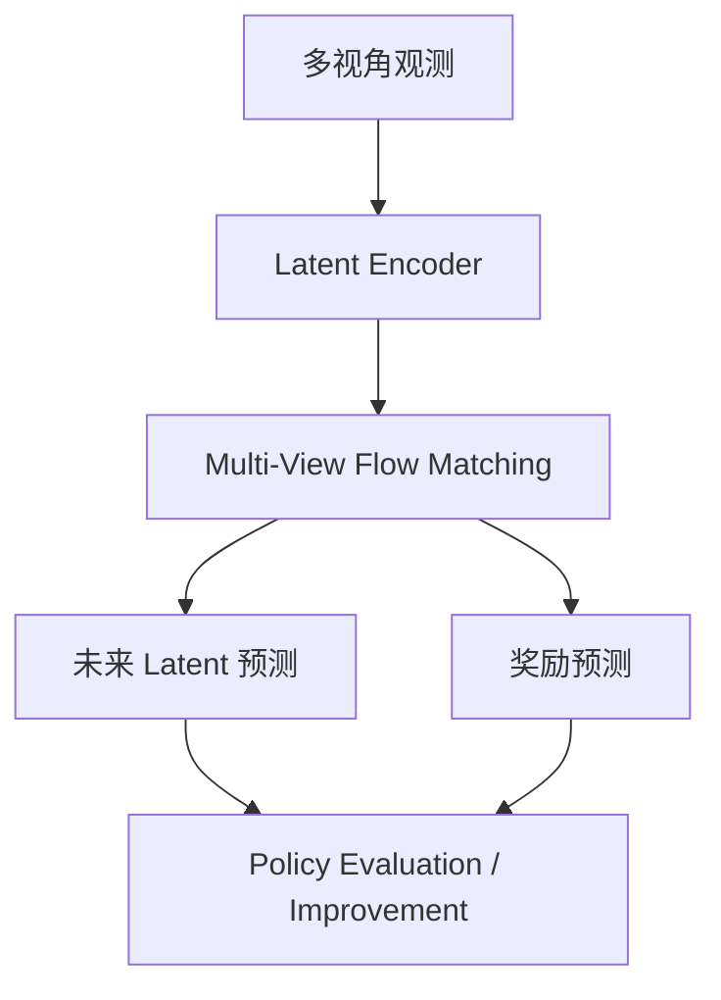

# WEAVER: Better, Faster, Longer — An Effective World Model for Robotic Manipulation

- 本地 PDF：`papers/vla-architecture/WEAVER_2606.13672.pdf`
- arXiv：https://arxiv.org/abs/2606.13672
- 年份：2026（6 月）
- 团队：CMU + Mila (Arnav Jain, Yilin Wu, Jesse Farebrother 等)
- 阶段：多视角世界模型 —— 保真度+长程一致性+推理效率三目标联合优化

## 一句话总结

WEAVER 是多视角 world model，同时优化预测保真度（ρ=0.870）、长程一致性、推理效率（5-10× Ctrl-World）。离策略改进无需真机交互即提升 π0.5 38% 成功率。融合 JEPA + Flow Matching + Diffusion Forcing 设计。

## 核心技术

1. Multi-View Flow Matching 联合预测未来 latent + reward
2. 融合 JEPA (latent prediction) + Diffusion Forcing + Ctrl-World (multi-view memory)
3. 三个应用验证：policy evaluation (ρ=0.870), offline improvement (+38%), best-of-N planning (+14%)

## 底层原理与数学推导

Flow matching loss 在 latent space 联合预测视觉状态和奖励。多视角一致性通过跨视角 latent fusion 实现。

## 物理直觉解释

WEAVER 像一个"机器人驾驶模拟器"——你不需要真的上赛道，在模拟器里就能评估策略好不好（ρ=0.870 相关）、找到更好的策略（+38%）、在每个路口选最佳路线（test-time +14%）。

## 工程细节与实操指南

- 五个真实操作任务: pick-and-place, deformable object manipulation 等
- 推理加速 5-10× over Ctrl-World
- Offline improvement 完全在 replay buffer 上完成，零真机交互

## 消融实验与分析

| 消融 | 结论 |
|------|------|
| Flow Matching vs Diffusion | FM 更快且保真度不降 |
| 有/无 Reward prediction head | Reward head 对 policy evaluation 必要 |
| Multi-view vs single-view | Multi-view 对操作任务的空间理解关键 |

## 技术权衡

| 优势 | 劣势 |
|------|------|
| Zero-interaction improvement over π0.5 | 离线改进受限于 replay buffer 的 coverage |
| 5-10× faster than prior WM | 多视角训练计算需求较高 |

## 技术价值与演进定位

WEAVER 和 RISE 同时出现在 RSS 2026——标志着 world model 从"视频预测玩具"变成了"真实策略改进工具"。

## 与其他论文的关系

- **RISE (RSS 2026)** — 想象中 RL, WEAVER 离线改进
- **PAIWorld (2026)** — 3D 一致性，WEAVER 关注效率
- **π0.5** — 被 WEAVER 离线超越的 baseline

## 精读问题

1. Offline improvement 的 38% 增益主要来自 policy distillation 还是 advantage reweighting？
2. ρ=0.870 的 correlation 是否跨任务一致？
