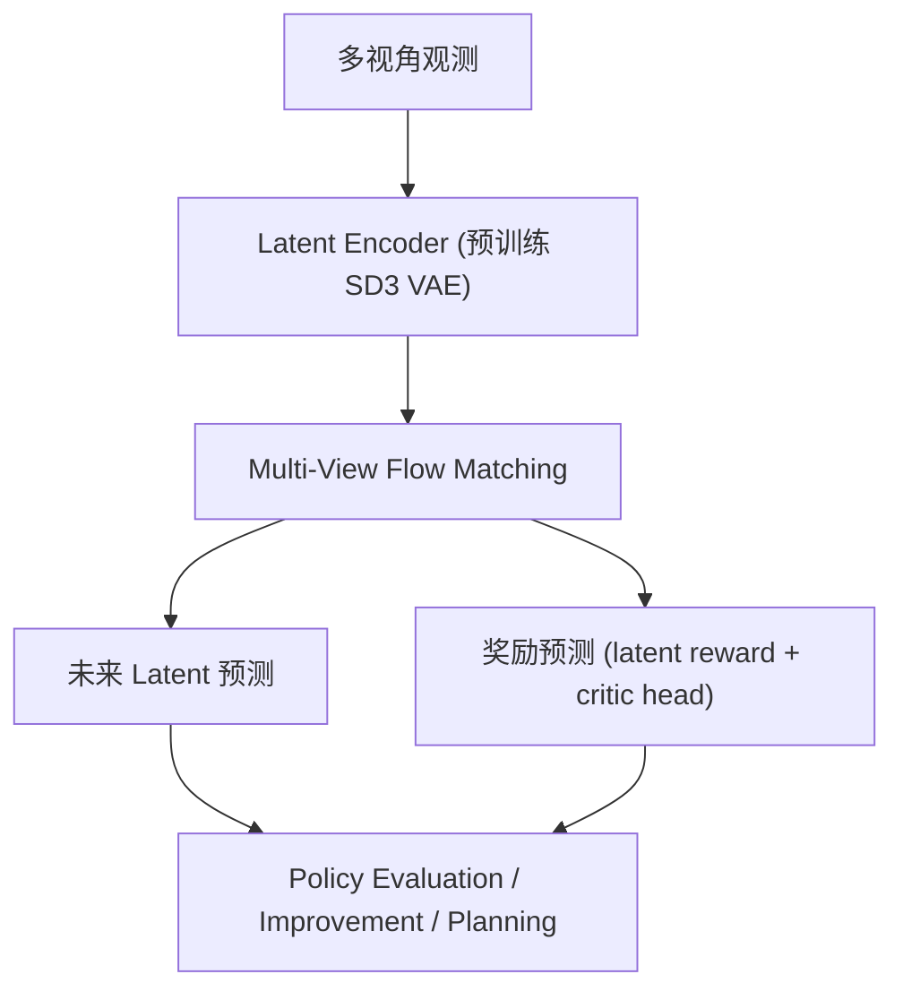

# WEAVER: Better, Faster, Longer — An Effective World Model for Robotic Manipulation

- 本地 PDF：`papers/architecture/WEAVER_2606.13672.pdf`
- arXiv：https://arxiv.org/abs/2606.13672
- 年份：2026（6 月）
- 团队：CMU + Mila (Arnav Jain, Yilin Wu, Jesse Farebrother 等)
- 阶段：多视角世界模型 —— 保真度+长程一致性+推理效率三目标联合优化

## 一句话总结

WEAVER 是多视角 world model，同时优化预测保真度（ρ=0.870）、长程一致性、推理效率（5-10× Ctrl-World）。离策略改进无需真机交互即提升 π0.5 38% 成功率。融合 JEPA + Flow Matching + Diffusion Forcing 设计。

## 核心技术

1. Multi-View Flow Matching 联合预测未来 latent + reward
2. 融合 JEPA (latent prediction) + Diffusion Forcing + Ctrl-World (multi-view memory)
3. 三个应用验证：policy evaluation (ρ=0.870), offline improvement (+38%), best-of-N planning (+14%)

## 底层原理与数学推导

```mermaid
graph TD
    OBS["多视角观测"] --> ENC["Latent Encoder (预训练 SD3 VAE)"]
    ENC --> FM["Multi-View Flow Matching"]
    FM --> FUTURE["未来 Latent 预测"]
    FM --> REWARD["奖励预测 (latent reward + critic head)"]
    FUTURE --> POLICY["Policy Evaluation / Improvement / Planning"]
    REWARD --> POLICY
```

给定稀疏记忆 $z^{mem}_t$（每隔 k 步的 latent）与短程历史 $z^{hist}_t$（最近 m 步）以及 h 步动作块 $a_t$，世界模型预测未来 latent：

$$
\hat{z}_t \sim f_\phi(\cdot \mid z^{mem}_t,\; z^{hist}_t,\; a_t)
$$

未来 latent 通过预训练解码器还原为观测（相机视角 + 本体状态）用于迭代调用策略；同时 latent reward 模型对预测打分：

$$
\hat{r}_t \sim R(\cdot \mid \hat{z}_t,\; \ell)
$$

训练目标是在 latent space 上的 flow matching 损失——联合预测多视角视觉 latent 与奖励值。离线改进时，对每个状态采样多个 h 步计划、用 latent reward + critic head 估计优势 $\hat{A}$，仅当 $\hat{A} > \epsilon_{adv}$ 时将该动作蒸馏进基础策略（advantage-based filtering），避免在"世界模型预测更差"的状态上更新策略。多视角一致性来自对每个视角的 latent 联合预测（外视角 + 腕部视角），配合稀疏记忆与短程历史解决操作中的遮挡与视角切换问题。

## 物理直觉解释

**WEAVER 像一个"机器人驾驶模拟器"**——你不需要真的上赛道（真实机器人），在模拟器里就能评估策略好不好（预测成功率与真实成功率相关 ρ=0.870）、离线找到更好的策略（+38% 成功率）、并在每个路口选最佳路线（test-time best-of-N 规划 +14%）。它和学习式视频预测的差别在于：WEAVER 不在像素空间生成视频，而是在**压缩的 latent 空间**里用 flow matching 预测未来——就像模拟器只算"车的位置和速度"而不渲染每一帧街景，因此快了 5-10 倍（同一 NFE 下推理时间 4.78s vs Ctrl-World 14.65s）。

**"多视角 + 本体状态 + 记忆"三个设计决策分别解决一个具体痛点**。多视角（外视角 + 腕部相机）解决遮挡——手挡住物体时另一只眼还能看见；显式预测本体状态（机械臂关节角、夹爪宽度）解决接触-rich 任务——揉面团、叠衣物这类任务里"手在哪、夹爪张多开"比画面更像更重要，这正是 Ctrl-World 类纯视觉预测缺失的；稀疏记忆 + 短程历史解决长程一致性——操作中途物体进出视野、腕部视角变化时，模型靠"每隔 k 步存一个记忆"记住场景不变的背景，避免预测漂移。

**latent reward head 是 WEAVER 三个应用（评估/改进/规划）的共同支点**。policy evaluation 用它算预测成功率（ρ=0.870）；offline improvement 用它做 advantage filtering——只把"世界模型认为比现状更好的动作"蒸馏进 π0.5，全程在 replay buffer 上完成、零真机交互；test-time planning 用它做 best-of-N——采样 B 个候选动作块、在想象中 rollout、执行优势最高的一个。以往这些应用需要把预测解码成图像再请外部 VLM 打分（慢且贵），WEAVER 在 latent 里直接打分，把"测试时扩展算力"变成实时可行的操作。

## 工程细节与实操指南

- 五个真实操作任务: pick-and-place, deformable object manipulation 等
- 推理加速 5-10× over Ctrl-World
- Offline improvement 完全在 replay buffer 上完成，零真机交互

## 消融实验与分析

论文的系统对比以 FID/FVD 保真度、推理时间与三大下游应用为核心：

| 对比维度 | 设置对比 | 关键指标 |
|---------|---------|---------|
| 保真度 vs 推理预算 | WEAVER vs Ctrl-World，DROID(val) 外视角 | NFE=16: FID 10.20 vs 26.09；NFE=50: FID 9.51 vs 22.44 |
| 保真度 vs 推理预算 | WEAVER vs Ctrl-World，DROID(val) 腕部视角 | NFE=16: FID 21.50 vs 33.83；NFE=50: FID 16.75 vs 25.32 |
| 推理效率 | 同 NFE 下的推理时间 | NFE=16: 4.78s vs 14.65s（约 3.1×）；NFE=50: 14.25s vs 42.33s（约 3.0×） |
| OOD 泛化 | WEAVER vs Ctrl-World，Task data (OOD) 外视角 | NFE=16: FID 23.95 vs 36.16；NFE=50: FID 23.48 vs 31.44 |
| 长程一致性 | 不同预测视界（2-10s）下 FID | 各视界长度下 WEAVER 一致优于 Ctrl-World（图 3） |
| Policy evaluation | 预测成功率 vs 真实成功率 | ρ=0.870 相关 |
| Offline improvement | WEAVER 离线蒸馏 vs 基础 π0.5 | 真实成功率 +38%（全程 replay buffer，零真机交互） |
| Test-time planning | best-of-N 想象选择 vs 基础 π0.5 | 真实成功率 +14%，推理加速 5-10× |

**核心结论**：WEAVER 的验证逻辑是"保真度指标 + 下游应用"双层——FID/FVD 层面，WEAVER 在 DROID(val) 与 OOD 任务数据上全面帕累托支配 Ctrl-World（外视角 FID 10.20 vs 26.09，推理 4.78s vs 14.65s），证明 latent 空间 flow matching + 预训练 SD3 VAE 编码器的组合在保真度与效率上同时胜出；设计决策层面，多视角预测、本体状态显式预测（接触-rich 任务关键）、稀疏记忆 + 短程历史（长程一致性关键）三者缺一不可；下游应用层面，ρ=0.870 的评估相关性、+38% 的离线改进与 +14% 的测试时规划构成完整证据链——世界模型从"视频预测玩具"真正变成了"零真机交互的策略改进工具"。

## 技术权衡

| 优势 | 劣势 |
|------|------|
| 零真机交互离线改进 π0.5（+38% 成功率） | 离线改进受限于 replay buffer 的 coverage（5 任务 × 50 rollouts） |
| 5-10× 推理加速（4.78s vs 14.65s @NFE=16） | 多视角 + SD3 VAE latent 训练计算需求较高 |
| latent 内打分，无需外部 VLM judge | 依赖预训练编码器（SD3 VAE），编码器分布外时预测可信度待验证 |

## 技术价值与演进定位

WEAVER 和 RISE 同时出现在 RSS 2026——标志着 world model 从"视频预测玩具"变成了"真实策略改进工具"。它的技术价值有三层：其一，**在 latent space 用 flow matching 做世界模型**——相比像素空间视频生成（高效但昂贵）与 JEPA 式纯 latent 预测（无法解码评估任意 visuomotor 策略），WEAVER 用预训练 SD3 VAE 编码/解码打通了"latent 效率 + 像素可评估"的鸿沟，帕累托支配 Ctrl-World；其二，**latent reward/critic head 取代外部 VLM judge**，使 policy evaluation（ρ=0.870）、offline improvement（+38%）、test-time planning（+14%）三个下游应用共享同一套基础设施，首次在同一世界模型上同时兑现世界模型的三大承诺；其三，advantage-filtered distillation 给出了一条"世界模型 → 策略自改进"的通用管线——完全在 replay buffer 上闭环、零真机交互，这与 RISE 的想象中 RL 形成互补（一个离线蒸馏、一个在线想象），共同定义了 2026 年世界模型在机器人上的实用化路线。

## 与其他论文的关系

- **Ctrl-World** — 直接对标基线：WEAVER 继承其多视角 + 稀疏记忆设计，但以 flow matching + latent 打分帕累托支配（FID 10.20 vs 26.09，推理 3× 更快）
- **Dreamer-v4** — 同用 latent reward/value head，但 WEAVER 用预训练 SD3 VAE 编码器而非从零学习，OOD 鲁棒性更优
- **RISE (RSS 2026)** — 想象中 RL 路线：RISE 在世界模型想象中做在线 RL，WEAVER 做离线 advantage 蒸馏，互补定义 2026 世界模型实用化
- **JEPA 系 (V-JEPA)** — latent 预测但不可解码，无法评估任意 visuomotor 策略；WEAVER 保留预训练解码器补齐该缺口
- **π0.5** — 被 WEAVER 作为基础策略离线改进（+38% 成功率）与 best-of-N 规划（+14%）的 baseline

## 精读问题

1. Offline improvement 的 38% 增益主要来自 policy distillation 还是 advantage reweighting？ε_adv 阈值的选择如何影响改进幅度？
2. ρ=0.870 的 correlation 是否跨任务一致？对失败率极低/极高的任务，评估相关性是否退化？
3. best-of-N 规划中 B 个候选动作块的上限在哪？奖励头的打分与真实物理成功之间是否有系统性偏差（如"看起来好但物理上不可行"）？
4. 预训练 SD3 VAE 编码器的分布外鲁棒性——训练时未见过的相机角度、光照下，latent 空间预测是否仍可靠？
5. 稀疏记忆的 k 与短程历史的 m 如何选择？长程任务（分钟级）下记忆策略是否需演进？
6. 世界模型在 DROID 预训练 + 5 任务微调——新任务需要的微调数据量与模型可迁移性边界？
