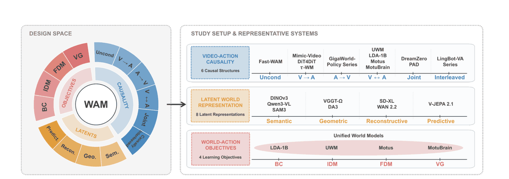
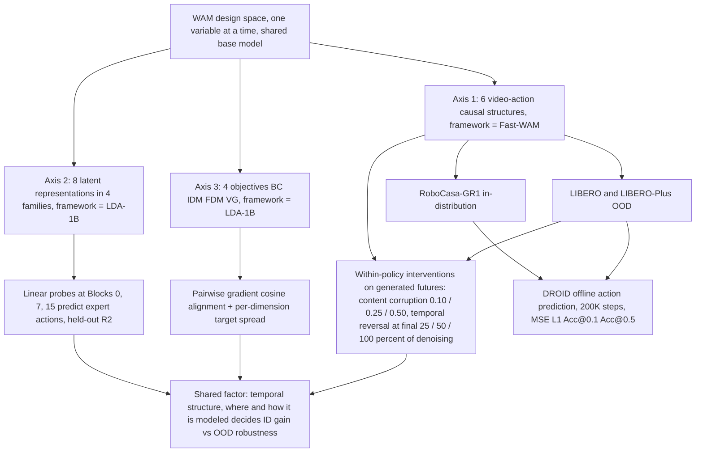

# What Matters in Designing World Action Models: An Empirical Study（WAM 设计要素受控实证研究）

- arXiv：https://arxiv.org/abs/2609.24048
- 来源：https://arxiv.org/abs/2609.24048
- 项目主页：
- 本地 PDF：`/Users/luogu/physical_intelligence/papers/world-model/WhatMattersWAM_2609.24048.pdf`
- 年份：2026
- 分类：world-model
- 优先级：high

## 一句话总结

这篇来自 Samsung Robotics eXperience 等机构的论文不做新系统、专做**受控消融**——把 WAM（世界-动作模型）的设计空间拆成三个正交轴（6 种视频-动作因果结构、8 种潜表征、4 种训练目标），在固定基座内逐轴做结构受控实验（ID 用 RoboCasa-GR1、OOD 用 LIBERO/LIBERO-Plus、真机数据用 DROID 离线验证），得到三个反直觉结论：(1) 生成未来对动作的影响主要走**时间组织**通道——最强内容腐蚀（强度 0.50）只改变动作预测 <1%，而时序反转在 OOD 下改变动作 12.79-14.36%、掉成功率 24.24-32.37%；(2) 帧间（inter-frame）潜表征利于 ID 控制、帧级（framewise）潜表征 OOD 更稳，两者排序在分布内外**完全反转**；(3) ID 场景下一切辅助目标都拖累 BC-only，但 BC+VG 把 OOD 从 77.96% 提到 81.22%，且分阶段训练（前 80% BC+VG、末 20% 加动力学）达到最高 83.15%。

## 九问速览

1. **Problem**：WAM 设计空间混乱——因果结构/潜表征/训练目标哪轴真正有效
2. **Bottleneck**：系统论文混杂多变量，无法归因单一设计贡献
3. **Insight**：生成未来对动作的影响主要走"时间组织"通道而非内容通道
4. **Method**：固定基座内对 6 因果结构x8 潜表征x4 目标做结构受控消融
5. **Evidence**：时序反转 OOD 掉 24.24-32.37%，最强内容腐蚀仅 <1%
6. **Ablation**：帧间表征 ID 强/帧级 OOD 强（排序完全反转）；分阶段 83.15% 最高
7. **Assumption**：所选基座与数据规模能代表 WAM 家族的典型行为
8. **Failure**：结论依赖特定基座；ID 收益与 OOD 收益常相互冲突
9. **Opportunity**：更大规模验证、真机在线闭环、内容通道深挖未做

| 维度 | 论文答案 |
|---|---|
| Perception | 多帧视频（LIBERO/RoboCasa-GR1/DROID 各自原生观测） |
| Closed-loop | 离线训练+仿真评测（BC 式）；无执行反馈回路 |
| Correction | 无执行校正（消融研究对象即"未来信息进动作"的通路） |
| Deployment | RoboCasa-GR1（ID）/LIBERO-Plus（OOD）仿真；DROID 真机数据仅离线验证 |

## 核心技术

*论文 Figure 1（p2）：Fig. 1: This work systematically investigates three fundamental aspects in building WAMs: (1) video-*

1. **三轴解耦的受控协议**：不提单一新架构，而是在每个设计轴内固定基座只动一个变量——因果结构轴全部在 Fast-WAM 框架（arXiv:2603.16666）内实例化，潜表征轴与训练目标轴在 LDA-1B 框架（arXiv:2602.12215）内实例化；所有策略变体独立从零训练、不做检查点续训初始化，排除训练历史的混淆。
2. **六种视频-动作因果结构**：Disentangled/Unconditional、Video-to-Action、Action-to-Video、Bidirectional、Joint、Causally Interleaved（单一 group-causal 流的抽象，保留 LingBot-VA 系的时间交错依赖但保证架构一致）。分类按"规范策略路径的视频-动作依赖"：DreamZero 被归为 Joint（chunk 内联合去噪两模态）、LingBot-VA 系被归为 Causally Interleaved。
3. **8 种潜表征 × 4 个家族**：语义（DINOv3、Qwen3-VL、SAM3）、几何（VGGT-Ω、Depth Anything 3）、重构（Image-VAE/SDXL 系、Wan Video-VAE）、预测（V-JEPA 2.1）；按"是否编码跨帧时间关系"二次分组——帧间组（DA3、VGGT-Ω、V-JEPA、Qwen3-VL 视频模式、Video-VAE）vs 帧级组（DINOv3、SAM3、Image-VAE），时间整合发生在编码器内还是策略主干内是关键变量。
4. **4 种训练目标**：BC $p(a_{t+1:t+k}|o_t,\ell)$、逆动力学 IDM $p(a|o,z,\ell)$、前动力学 FDM $p(z|o,a,\ell)$、视频生成 VG $p(z|o,\ell)$，比较 BC-only、BC+单辅助、leave-one-out 与全目标联合。
5. **策略内干预（intervention）技术**：不止比较分开训练的策略，还直接对 route-enabled（Joint/Bidirectional）策略的生成未来潜变量动手——内容腐蚀（以 0.10/0.25/0.50 强度混入固定噪声但保持每通道空间均值/方差）与时序反转（在去噪最后 25%/50%/100% 阶段交换两个未来 slot），观测当前帧 slot 不动——以此区分"依赖未来内容"与"依赖时间组织"。
6. **可解释性探针**：在策略主干 Block 0/7/15 拟合线性探针预测专家动作（held-out $R^2$），度量不同潜表征给策略的动作先验；用目标歧义度（per-dimension target spread）与目标间梯度余弦对齐解释目标间竞争。
7. **真机数据离线验证协议**：DROID 按任务语义切 train/val/test，各变体匹配设定训 200K 步，用归一化动作空间的逐元素指标（MSE、L1、Accuracy@0.1、Accuracy@0.5）替代二值成功率以分辨细粒度差异。

## 底层原理与数学推导

研究设计的骨架是"同一基座、单变量替换、双分布评估"：ID 分布 $D_{\text{id}}$（RoboCasa-GR1）测的是设计能否利用熟悉轨迹的先验，OOD 分布 $D_{\text{ood}}$（LIBERO-Plus 的布局/视角/初始状态/语言/光照/纹理/传感器噪声七类受控扰动）测的是先验失效后表征还剩多少可迁移结构。

**四种目标的形式化**（第 III-B 节原文符号）：记 $o_t$ 当前观测、$\ell$ 任务指令、$a_{t+1:t+k}$ 未来动作 chunk、$z_{t+1:t+k}$ 对应未来视觉潜变量，四个目标分别是

$$\mathcal{L}_{\text{BC}}=-\log p(a_{t+1:t+k}\mid o_t,\ell),\qquad \mathcal{L}_{\text{IDM}}=-\log p(a_{t+1:t+k}\mid o_t,z_{t+1:t+k},\ell),$$

$$\mathcal{L}_{\text{FDM}}=-\log p(z_{t+1:t+k}\mid o_t,a_{t+1:t+k},\ell),\qquad \mathcal{L}_{\text{VG}}=-\log p(z_{t+1:t+k}\mid o_t,\ell).$$

关键区别在条件集：IDM 让动作以**生成的未来为条件**（未来解释动作），FDM 让未来以动作为条件（动作解释未来），VG 完全不依赖动作（无条件预测未来）——三者与 BC 组合时形成不同的监督耦合。

**干预的构造**：设策略内生成的未来潜 slot 为 $z^{g}_{t+1},z^{g}_{t+2}$，内容腐蚀为 $z'=(1-\rho)z^{g}+\rho\,n$，强度 $\rho\in\{0.10,0.25,0.50\}$，其中噪声 $n$ 经标准化保持每通道空间均值与方差不变（只破坏内容不破坏一阶统计量）；时序反转在去噪过程的最后 $\kappa\in\{25\%,50\%,100\%\}$ 阶段交换 $z^g_{t+1}\leftrightarrow z^g_{t+2}$。若动作生成依赖未来**内容**，腐蚀应改变动作预测；若依赖**时间组织**，反转才有效——实验结果是后者压倒性成立（最强腐蚀 <1% 动作变化 vs OOD 反转 12.79-14.36%）。

**离线指标定义**：Accuracy@$\tau$ 定义为绝对误差至多 $\tau$ 的有效动作元素比例，

$$\text{Accuracy}@\tau=\frac{|\{j:\lvert\hat{a}_j-a_j\rvert\le\tau,\;a_j\text{ valid}\}|}{|\{j:a_j\text{ valid}\}|},$$

配合 MSE 与 L1 构成对动作预测质量的逐元素刻画——这是绕开"真机二值成功率分辨不出细粒度差异"的工程手段。

**解释性工具**：目标间梯度对齐用余弦相似度 $\cos\langle\nabla_\theta\mathcal{L}_i,\nabla_\theta\mathcal{L}_j\rangle$（图 5a 上三角 LIBERO、下三角 RoboCasa-GR1）——IDM 与 BC 强对齐所以"像额外动作监督"、退化最少，FDM/VG 近正交所以表现为"与 BC 正交的正则"，其收益在感知扰动下才显现；per-dimension target spread 度量 BC/IDM 的动作目标或 FDM/VG 的潜目标在局部数据上的歧义度——VG 的未来目标比 FDM 更宽（broader target），逼着表征保留更丰富的视觉-时间信息，解释了为何 VG 的 OOD 增益（+3.26）大于 FDM（marginal）。

## 物理直觉解释

**第一段：未来视频对动作的作用是"节拍器"而不是"照片"**。把 WAM 的生成未来想成乐队排练里的**节拍器**：乐手（动作头）真正跟上的是节拍与顺序——什么时候该出手、下一个动作排在第几位；至于节拍器上贴的照片拍的是什么（未来帧的具体内容），换成一张噪声图只要节拍还在，演奏几乎不受影响（最强内容腐蚀只动 <1% 的动作预测）。但把节拍倒过来放（时序反转），乐手立刻错乱——OOD 下动作预测被改变 12.79-14.36%、成功率掉 24.24-32.37%。Video-Causal Global 变体的结果补全了图景：保留逐帧因果的视频生成（节拍照打）但放开动作组读全视界，反而比严格视频-动作交错再高 2.51 个点（79.84% vs 77.33%）——说明**有用的时间结构主要在"视频自己按时间生成"这件事里**，而不在"动作 token 必须按时间排队看视频"这件事里。

**第二段：帧间表征是预判型运动员，帧级表征是守门员**。帧间潜表征（DA3、V-JEPA、Video-VAE 等）像一个**爱预判的运动员**：编码时就把多帧关系压进特征，熟悉对手的套路（ID 分布）时预判又快又准，RoboCasa-GR1 上全面领先、每层探针的专家动作线性可解码度都更高；可一旦对手换了打法（OOD：传感器噪声、视角变化），预判反而变成包袱——论文用时间扰动实验直接验证了这种脆弱性：把历史帧或当前帧换成同轨迹更早的观测（[H',C]、[H,C']、[H',C']），帧间组策略退化显著大于帧级组。帧级表征（DINOv3、SAM3、Image-VAE）则像**稳住的守门员**：每帧独立看、不赌走势，ID 上拿不到预判红利，但扰动来了靠帧内证据稳住局面——LIBERO-Plus 上排序反转、在噪声与视角扰动下优势最大。启示是：时间结构有价值，但**预编码进输入表征的时间结构是刚性的，学在策略里的时间结构才可随上下文调整**。

**第三段：辅助目标像做菜的分阶段下料**。ID 场景下加任何辅助目标都掉分（BC-only 最高），像是**一锅乱炖**——四个目标的梯度在表征形成早期互相打架，全目标联合训练比 BC+VG 低 4.04%；分阶段训练（前 80% 只用 BC+VG，最后 20% 才加入动力学目标）拿到全场最高的 83.15%，像做菜先大火定型再小火收汁：BC+VG 先建立稳定的策略与视觉-时间表征，动力学目标此时只当"晚期弱正则"，既不会主导表征形成，也来不及利用早期训练捷径（数据集特定的动作-转移相关性）。这套"目标互补性取决于训练日程"的结论有清晰的梯度对齐证据支撑（IDM 与 BC 余弦高、FDM/VG 近正交），也解释了为什么同样的目标组合在别人系统里时而有益时而有害——不是目标本身好坏，而是**什么时候喂**。

## 工程细节与实操指南

- **基准与数据规模**：RoboCasa-GR1（ID）——24 个语言条件任务、24K 人类遥操作演示，GR-1 人形双灵手桌面操作；LIBERO 四套件训练、LIBERO-Plus 七类受控扰动评估（物体布局、相机视角、机器人初始状态、语言指令、光照、背景纹理、传感器噪声）；DROID 真机数据按任务语义切分，各变体匹配设定训 200K 步、离线评估。
- **评估协议细节**：为隔离训练目标影响，所有策略变体独立训练、不从已训策略检查点初始化；LIBERO 训练的模型在 LIBERO-Plus 扰动下测 OOD。
- **干预强度**：内容腐蚀 3 档（0.10/0.25/0.50），时序反转 3 档（去噪最后 25%/50%/100%）；两干预均保持观测当前帧 slot 不变；完整强度扫描结果在附录（v1 正文未含）。
- **探针设定**：策略主干 Block 0、7、15 三个深度，线性探针预测专家动作，报告 held-out $R^2$；ID/OOD 双侧都做。
- **模型规模、lr/batch/训练步数（仿真部分）、训练硬件**：待确认——arXiv v1 正文 8 页未含附录，全部实现级超参与算力信息未披露（真机部分仅披露 200K 步）。
- **分类速查（复用价值高）**：DreamZero = Joint（chunk 内双模态联合去噪）；LingBot-VA 系 = Causally Interleaved（统一因果序列内时间排序；自回归 chunk 调度本身不定类）；Fast-WAM = Unconditional 一侧的框架基座（本论文因果轴全部在 Fast-WAM 框架内实例化，包括其 2603.16666 所质疑的"test-time future imagination"问题）。
- **真机指标**：归一化动作空间的 MSE/L1（越低越好）与 Accuracy@0.1/0.5（越高越好）——若要在自己的 DROID 离线管线复现，这四个指标是论文给定的完整集合。
- **代码/项目页**：待确认——论文未提供代码或项目页链接。

## 实验协议清单

| 项目 | 论文设置 | 来源与备注 |
|---|---|---|
| 观测 | 多帧视频+动作 token（各基准原生输入） | 第 3 节 |
| 动作空间 | 动作 chunk（WAM 标准） | 第 3 节 |
| 控制频率 | 未报告 | PDF 未披露 |
| 重规划频率 | 每 chunk | 第 3 节 |
| 动作 horizon | 未报告 | PDF 未披露 |
| 数据 | RoboCasa-GR1（ID）、LIBERO/LIBERO-Plus（OOD）、DROID（真机离线） | 第 4 节 |
| 奖励 | 无（BC+辅助目标：视频生成 VG、动力学预测） | 第 3 节 |
| Reset | 仿真自动 | 标准协议 |
| 成功定义 | 成功率%（ID/OOD）；DROID 离线动作预测 MSE/L1/Acc@k | 第 4 节 |
| 评估次数 | LIBERO 标准协议（具体次数未详报） | PDF 未详列 |
| 随机种子 | 未报告 | PDF 未披露 |
| 扰动测试 | 有：LIBERO-Plus 视角/光照扰动；内容腐蚀与时序反转策略内干预 | 第 4 节 |
| 真机 | 无在线真机（DROID 为离线真机数据） | 第 4 节 |
| 算力 | 未报告（PDF 无 GPU 信息） | PDF 未披露 |
| 特权信息 | 无 | — |

**附录陷阱自查**：
- privileged 信息：无
- reward shaping：无（纯模仿+辅助自监督目标）
- reset 难度：正常
- eval budget：标准基准
- 底层控制栈：无
- 数据优势：各配置同数据同基座受控对比（本文方法论核心）
- 关键方法论发现：检查点全谱（10K-200K）一致性的 DROID 离线验证，避免单检查点侥幸

## 消融实验与分析

三个轴的核心数字（成功率为 LIBERO-Plus OOD / RoboCasa-GR1 ID，DROID 为离线动作预测）：

| 设计轴 | 对照 | OOD / 离线结果 | 结论量级 |
|---|---|---|---|
| 因果结构（结构对比） | Joint vs Uncond、Bidirectional vs Action-to-Video | LIBERO-Plus 上 route-enabled 分别 +16.14%、+14.93%；RoboCasa-GR1 上反而 −2.33%、−4.00% | 未来视频通路只在 OOD 有益 |
| 因果结构（策略内干预） | 内容腐蚀 0.50 vs 时序反转 100% | 腐蚀：动作变化 <1%、成功率无实质变化；反转：ID 动作变化 2.30-2.41%、成功率 −6.08-11.08%，OOD 动作变化 12.79-14.36%、成功率 −24.24-32.37% | 时间组织是因果中介 |
| 因果结构（变体） | Causally Interleaved vs Video-Causal Global | LIBERO-Plus 77.33% vs 79.84%（+2.51） | 帧因果视频生成优于严格模态间时序 |
| 训练目标 | BC-only vs BC+VG vs 全联合 vs 分阶段 | 77.96% → 81.22%（+3.26）；全联合比 BC+VG 低 4.04%；分阶段（80/20 日程）最高 83.15%；VG 单项视角扰动 +13.32% | 目标互补性取决于日程 |
| 潜表征（真机） | DA3（帧间） vs DINOv3（帧级） | DROID MSE 0.0702 vs 0.0684、L1 0.1612 vs 0.1583、Acc@0.1 52.40% vs 53.08%、Acc@0.5 93.97% vs 94.05% | 帧级在真机未见数据上四指标全胜 |
| 因果结构（真机） | Uncond vs Causally Interleaved | DROID MSE 0.0730 vs 0.0666、L1 0.1630 vs 0.1544、Acc@0.1 51.83% vs 53.78%、Acc@0.5 93.87% vs 94.52%（10K-200K 全部检查点一致占优） | 因果整合迁移到真机数据 |
| 训练目标（真机） | BC-only vs BC+VG | DROID MSE 0.0769 vs 0.0697、L1 0.1741 vs 0.1656、Acc@0.1 49.94% vs 51.84%、Acc@0.5 91.84% vs 92.52% | VG 增益在真机数据复现 |

**核心结论：**
1. **未来视频不是"仅训练期辅助信号"**：结构对比（OOD +16.14/+14.93）与策略内干预（时序反转掉 24.24-32.37 个点）双重证明生成未来在推理期因果地参与动作生成，且中介变量是时间组织而非内容（最强腐蚀 <1% 动作变化）。
2. **时间结构的"位置"决定它帮 ID 还是帮 OOD**：预编码进潜表征（帧间组）换 ID 优势 + OOD 脆弱（时间扰动实验、探针排序随分布反转）；学在策略主干里（帧级组 + WAM 式联合建模）换 OOD 稳健——三轴结论被"时间结构在哪里建模"这条主线统一。
3. **辅助目标的收益是条件性的**：ID 下全部退化（BC-only 最高）、OOD 下 VG 独有 +3.26 且集中在视角类扰动（+13.32），联合训练互相干扰（比 BC+VG 低 4.04），80/20 分阶段日程解除干扰并拿到 83.15 的全场最高。
4. **仿真三大结论全部在 DROID 真机数据上方向复现**（Causally Interleaved、DINOv3、BC+VG 各自四指标全胜），且因果结构的优势在 10K-200K 步所有检查点上一致——不是训练后期偶然。
5. **注意跨轴数字不可直接排序**：因果轴在 Fast-WAM 框架、目标轴/表征轴在 LDA-1B 框架内实例化，77.33%（因果轴最佳）与 77.96%（目标轴 BC-only）来自不同基座，论文未提供跨轴统一基线——这是引用其数字时最容易犯的错。

## 技术权衡（Trade-off）

| 优势 | 劣势 |
|---|---|
| 结构受控：每轴固定基座单变量替换 + 独立从零训练，归因干净，可直接指导 WAM 系统设计选型 | 规模有限（作者自认 moderate-scale），结论在"模型/数据大幅放大后是否翻转"未验证——其刻意保留的取舍 |
| 策略内干预（腐蚀/反转）把"相关"升级为"因果"，方法学上优于纯结构对比 | 干预只覆盖未来潜 slot 的内容与时序两个维度，未干预未来质量（如去噪步数、CFG 强度），因果图谱不完整 |
| 三轴结论被一条统一主线（时间结构的位置）贯穿，且 DROID 真机数据方向复现 | 真机验证是离线动作预测而非闭环成功率，与部署表现的差距未度量 |
| 给出了设计速查表级别的结论（选帧级表征做 OOD、VG 做辅助、80/20 日程） | OOD 结论依赖 LIBERO-Plus 的七类扰动族；几何类 shift（此前 WAM vs VLA 稳健性研究指出 WAM 的弱项）未在本研究覆盖范围内单独报告 |
| 梯度对齐 + 目标歧义度提供了"为什么"层面的解释，不是纯经验表格 | 无代码无项目页，八类表征/六种结构的复现成本高；附录（全强度扫描、分项统计）未随 v1 发布 |

## 技术价值与演进定位

WAM 赛道在 2026 年已经堆满了整体系统（DreamZero、GigaWorld-Policy、Cosmos-Policy、Motus、LingBot-VA、Fast-WAM……），每篇都捆绑架构+表征+目标+日程多重改动，胜负归因不可能——这篇论文做的是这个领域欠账的**受控实证科学**，角色类似系统级 RL 研究里的 RoboVLMs/OpenVLA-OFT 之于 VLA、或 agentic RL 社区的 ARLArena 式受控消融之于 agent 训练。它的三个结论都有直接工程含义：做 OOD 部署选帧级表征（DINOv3 一线）、未来视频通路值得保留但赢在时间组织（Video-Causal Global 是更便宜的结构）、辅助目标要 80/20 分阶段下料。更深一层，它把"世界建模的价值"从表征质量转移到**时间结构建模位置**这个此前无人显式讨论的变量上，这为后续工作（如把时间建模完全交给策略主干、或做自适应帧间/帧级切换）划出了明确的假设空间。局限也同样明确：中等规模、附录未发、真机只做离线——结论应视为该规模下的强先验而非定律。

## 与其他论文的关系

1. **notes/world-model/dreamzero.md（DreamZero，2602.15922）**：本文将其归入 Joint 结构（chunk 内联合去噪视频与动作）；结构对比显示 route-enabled 结构 OOD 增益 +16.14/+14.93 但 ID 反而 −2.33/−4.00，与库内 dreamzero 笔记记载的零样本策略路线互补——DreamZero 证明了 WAM 可作零样本策略，本文回答了它赢在哪个部件。
2. **notes/architecture/lingbot-va.md（LingBot-VA，2601.21998）**：本文将其归入 Causally Interleaved（统一因果序列内时间排序视频-动作），且该结构是六结构中 LIBERO-Plus 最佳（77.33%），Video-Causal Global 再 +2.51 到 79.84%——对 LingBot 系的"因果交错"设计给出了受控证据：有效成分是帧因果视频生成，而非严格的模态间时序因果。
3. **notes/world-model/thinkwvla.md（ThinkWVLA，2609.24682）**：Fast-WAM 在两文中角色不同——ThinkWVLA 把 Fast-WAM（Wan2.2-TI2V-5B 底座）当蒸馏教师拿到 LIBERO 96.9%，本文把 Fast-WAM 当因果结构实验的固定框架；两文合读可回答"世界模型的价值留在表征里（ThinkWVLA）还是留在时间组织里（本文）"——ThinkWVLA 的逐视图池化教师特征蒸馏恰好只传表征不传生成过程，与本文"内容不重要、时间组织重要"的结论形成有趣的张力。
4. **notes/world-model/v-jepa2.md（V-JEPA 2，2506.09985）**：V-JEPA 2.1 在本文中是预测家族潜表征的代表、属帧间组（ID 占优、OOD 脆弱）；这为库内 V-JEPA 主线的使用方式给出警示——V-JEPA 表征做 OOD 部署时帧级 DINOv3 系可能更稳（DROID 四指标 DINOv3 全胜）。
5. **notes/world-model/worldvla.md（WorldVLA，2506.21539）**：WorldVLA 是自回归 action-image 联合生成（Joint/Bidirectional 家族），本文的结构对比直接覆盖其设计选择；库内 worldvla 笔记记载的 LIBERO 81.8% 与本文 BC+VG 81.22%、分阶段 83.15% 处于同一量级（但基座不同，不可直接排序）。
6. **notes/world-model/tacwam.md（TacWAM，2607.28391）**：TacWAM 走的是本文三轴之外的第四个维度——模态扩展（触觉未来进 WAM 但被注意力掩码隔离在动作通路外）；本文的干预方法学（对生成 slot 做内容/时序扰动）可直接移植去测 TacWAM 的触觉未来 token 到底通过什么通道帮助动作生成。
7. **notes/architecture/fast-tokenizer.md / notes/architecture/openvla.md**：本文的相关工作把 RoboVLMs 与 OpenVLA-OFT 定位为 VLA 侧的同类受控研究（VLM 底座/历史融合/并行解码/动作 chunk/连续动作表征），本文补的是 WAM 侧缺位的对应物。

## 精读问题

1. "时间组织是因果中介"的结论来自对 2 个未来 slot 的反转干预——若未来视界扩展到 8-16 帧（WAM 系常见配置），时间组织的重要性是随 slot 数放大还是饱和，是否存在时间感受野的最优长度？
2. 内容腐蚀保持每通道均值/方差不变，所以 <1% 动作变化可能只说明"一阶统计量足够"——若用结构化腐蚀（保持光流统计但破坏物体身份），动作变化是否会显著上升，即"内容不重要"的结论边界在哪里？
3. 帧间表征的 OOD 脆弱性被归因于"冻结编码器预编码的固定时间关系"，那么把视觉编码器解冻做任务适配（成本更高）能否修复脆弱性，还是说脆弱性是帧间编码的固有属性？
4. 80/20 分阶段日程的切换点是唯一被测的配置吗——若把切换点在 50%-95% 间扫描、或把动力学目标换成渐进加权（连续日程而非二阶段），83.15% 是否还能提升，最优日程是否随数据规模移动？
5. 全部结论在中等规模（作者自述 moderate-scale）下取得：若基座扩大一个数量级，"ID 下辅助目标全负收益"是否会被推翻（更大容量可能足以同时吸收多目标）——需要什么规模的预注册复制实验来检验？
6. ID 与 OOD 的结论反转（帧间 vs 帧级）提示可能存在分布自适应的表征路由——能否训练一个轻量分布判别器在线切换两类表征，或在单模型内做帧间-帧级插值，以同时保住两侧收益？
7. DROID 离线指标（Acc@0.1 差异约 1-2 个百分点）与闭环成功率的对应关系未知——离线动作预测的微小优势何时能兑换成闭环性能，何时会被误差累积吞掉？
