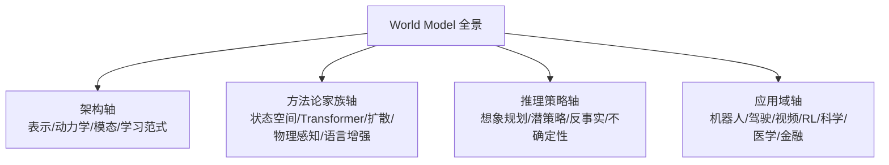

# World Models: A Comprehensive Survey of Architectures, Methodologies, Reasoning Paradigms, and Applications

- 本地 PDF：`papers/world-model/WM-Comprehensive_2606.00133.pdf`
- arXiv：https://arxiv.org/abs/2606.00133
- 年份：2026（6 月）
- 团队：Zidan 等 26 位作者
- 阶段：世界模型全景综述 — 147 页，四轴统一框架

## 一句话总结

这是目前最全面的世界模型综述（147 页，26 作者），用四轴统一框架组织整个领域：**架构**（表示、动力学、模态、学习范式、应用）、**方法论家族**（状态空间/循环、Transformer、扩散、物理感知、语言增强）、**推理策略**（想象规划、潜策略学习、反事实推理、不确定性规划）、**应用领域**（机器人、驾驶、视频预测、RL、科学、医学、金融）。锚定系统包括 Dreamer 家族、Cosmos、MuZero、Sora、Genie、V-JEPA 2、DIAMOND、GameNGen。

## 核心概念

### 四轴统一框架

### 锚定系统（领域里程碑）

| 系统 | 类型 | 关键点 |
|------|------|--------|
| Dreamer V1-V3 | 潜空间 RL 世界模型 | V2 离散 categorical latent（Atari 超人类）；V3 固定超参 150+ 任务 + 首个 Minecraft 钻石 |
| Cosmos (NVIDIA) | 世界基础模型 | 4B-14B 参数，2000 万小时视频，Cosmos-Predict2.5 flow matching + RL 后训练 |
| MuZero | 无规则规划 | 不依赖显式规则的规划 |
| Sora | 视频生成即世界模拟 | 大规模视频生成 |
| Genie | 交互世界模型 | 11B 参数，互联网视频训练 |
| V-JEPA 2 | 自监督预训练 | +62 小时机器人微调 → Franka 零样本规划 |
| DIAMOND | 扩散世界模型 | Atari 100k 最佳纯世界模型 agent (1.46 human-normalized) |
| GameNGen | 实时仿真 | DOOM 实时 20+ FPS |

## 关键洞察

1. **混合表示 > 单一表示**：视频模型 + flow 条件、几何基元上的 latent 预测、高斯场景模型 + 物理约束、学习模拟器 + 验证器——"操作世界模型很少需要预测一切，只需要预测决定动作可执行性/物理可信度/有用性的未来变量"
2. **CoT × 世界模型**：推理进入 latent 空间——世界模型作为接地时空"想象链"，可能替代基于语言的 CoT（Coconut, LCDrive, FutureX）
3. **评估转向控制相关标准**：rank consistency, value fidelity, decision reliability, inverse-dynamics recoverability, action executability

## 开放挑战

- 长程预测误差累积
- Sim-to-real 迁移
- 评估碎片化（无统一 benchmark）
- 计算效率
- 安全关键场景的可靠部署

## 核心技术

综述的四轴框架（详见核心概念）：
1. **架构轴**：表示（像素/latent/物理量）、动力学（学习/显式）、模态、学习范式、应用
2. **方法论家族轴**：状态空间/循环（Dreamer）、Transformer、扩散（DIAMOND）、物理感知（Physics-Informed）、语言增强（CoT）
3. **推理策略轴**：想象规划、潜策略学习、反事实推理、不确定性规划
4. **应用域轴**：机器人、驾驶、视频预测、RL、科学、医学、金融

## 底层原理与数学推导

**世界模型的通用形式**（POMDP 语境）：

$$p(z_{t+1} \mid z_t, a_t) \quad \text{或} \quad p(o_{t+1} \mid o_t, a_t)$$

**方法论家族的建模差异**：
- 状态空间/循环：$z_{t+1} = f(z_t, a_t)$（RSSM 递归状态）
- 扩散：$p(o_{t+1} \mid o_t, a_t) = \text{denoise}(\epsilon)$（去噪生成）
- 物理感知：$\dot{x} = g(x, u)$（ODE/物理方程）
- 语言增强：$o_{t+1} \sim \text{LLM}(o_t, a_t, \text{CoT})$

## 物理直觉解释

四轴框架像"生物学的纲目科属"分类法——每个世界模型工作都能在这四个轴上定位。方法论家族的直觉：**状态空间像"规则计算器"**（一步步推演）、**扩散像"画家"**（从噪声画未来帧）、**物理感知像"物理学家"**（用方程预测）、**语言增强像"推理者"**（用常识想象）。

"想象链替代 CoT"的直觉：语言 CoT 是"用文字推理"，世界模型 CoT 是"用画面推理"——就像工程师看图纸（画面）比读说明书（文字）更直观。

## 工程细节与实操指南

- **锚定系统速查**：Dreamer（潜空间 RL）、Cosmos（基础模型）、DIAMOND（扩散 agent）、Genie（交互世界模型）
- **选方法家族**：要控制精度→状态空间；要视觉保真→扩散；要物理严谨→物理感知
- **评估**：参考 12+ benchmarks 中的 WorldArena / WorldEval / WoW-World-Eval

## 消融实验与分析

综述无独立消融，但跨系统对比揭示关键规律：

| 系统 | 家族 | 强项 | 弱项 |
|------|------|------|------|
| Dreamer V3 | 状态空间 | 样本效率、泛化 | 像素保真低 |
| DIAMOND | 扩散 | 视觉质量、agent 性能 | 计算贵 |
| Cosmos | 基础模型 | 规模、多样性 | 物理一致性待验证 |
| MuZero | 无规则 | 规划深度 | 需精确环境模型 |
| Genie | 交互生成 | 无标签视频利用 | 动作可控性弱 |

**核心结论**：没有单一最优家族——选择取决于"预测什么、怎么用、多少数据"。

## 技术权衡（Trade-off）

| 权衡维度 | 选择 |
|---------|------|
| 表示 | 像素（保真）↔ latent（效率） |
| 生成 | 扩散（质量）↔ 状态空间（速度） |
| 物理 | 显式方程（严谨）↔ 学习（灵活） |
| 推理 | 语言 CoT（可解释）↔ 想象链（接地） |

## 技术价值与演进定位

这份综述的价值在于"全景视野"——前两份综述（WRL, WMRM）聚焦机器人，这份覆盖所有领域（含驾驶、科学、医学、金融）。对你的意义：
- **方法论家族轴** 帮你判断一个世界模型工作属于哪个家族（状态空间 vs 扩散 vs 物理感知）
- **推理策略轴** 帮你理解"世界模型怎么用"（想象规划 vs 潜策略学习 vs 反事实）
- 锚定系统表 = 补历史知识的检查清单（Dreamer 系列你已有，Cosmos/MuZero/Genie/V-JEPA 2/DIAMOND 是缺口）

## 与其他论文的关系

- **WRL-Survey (2605.00080)** — 聚焦机器人学习，评估框架三级；本综述跨领域全景
- **WMRM-Survey (2606.00113)** — 聚焦操作，5 表示家族
- **WAM-Survey (2605.12090)** — 聚焦 World Action Model
- **Dreamer v3 / V-JEPA** — 本综述的锚定系统，你已有笔记
- **LeWorldModel / SD-JEPA** — 潜空间家族 2026 新进展

## 精读问题

1. "想象链替代语言 CoT"——世界模型能否真正替代推理模型？边界在哪里？
2. 扩散世界模型 vs 潜空间世界模型——DIAMOND（扩散，Atari 最强）vs Dreamer（潜空间）的取舍规律？
3. 四轴框架中"应用域轴"的交叉——机器人世界模型能否迁移到驾驶/科学？
4. 147 页综述中列出的 benchmark——哪些值得在后续拉取时作为评估标准参考？
