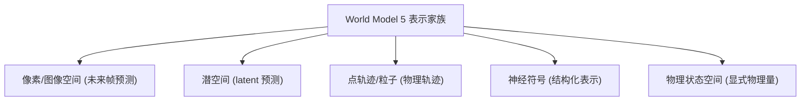

# World Models for Robotic Manipulation: A Survey

- 本地 PDF：`papers/world-model/WMRM-Survey_2606.00113.pdf`
- arXiv：https://arxiv.org/abs/2606.00113
- 年份：2026（6 月）
- 团队：多机构联合（NTU MARS Lab / UC Berkeley / Stanford / ETH Zurich 等）
- 阶段：机器人操作世界模型系统综述 — 从"任务特定动力学预测器"到"预测基础设施"

## 一句话总结

综述将世界模型定义为"**动作条件预测系统**"——区别于感知模块、逆模型、策略和奖励函数。将工作组织为 5 个表示家族，区分"整合的预测-动作模型"与"显式预测规划器"，审阅 34 个操作数据集，并刻画基础设施角色（合成经验生成、候选过滤、基于搜索的评估、学习环境、结果验证）。核心发现：世界模型正从"任务特定动力学预测器"进化为"机器人学习的预测基础设施"，开放挑战在接触建模、幻觉控制、动作对齐和闭环基准测试。

## 核心概念

### 世界模型的操作性定义

```
世界模型 = 动作条件预测系统
         p(未来 | 当前, 动作)
```

与四类相关模块的区别：
- **感知模块**：现在 → 现在（观测理解），不做预测
- **逆模型**：未来 → 动作（从目标反推动作）
- **策略**：观测 → 动作（不建模未来）
- **奖励/价值**：状态 → 标量（不建模演化）

### 5 个表示家族



### 基础设施角色

| 角色 | 说明 |
|------|------|
| 合成经验生成 | 用世界模型生成训练数据（数据放大） |
| 候选过滤 | 从候选动作中筛出最优（基于 rollout 评估） |
| 基于搜索的评估 | 离线搜索评估策略 |
| 学习环境 | 世界模型作为可微分的训练环境（想象 RL） |
| 结果验证 | 验证物理可行性/计划一致性 |

## 关键发现

1. **从任务特定 → 预测基础设施**：世界模型的角色在扩大——不只是"某个任务的动力学"，而是通用预测基础设施
2. **集成模型 vs 显式规划器**：两条路线并存——统一预测-动作模型 vs 独立规划器 + 世界模型
3. **34 个操作数据集**：系统审阅数据生态

## 开放挑战

- **接触建模**：接触丰富的操作（力、摩擦、形变）是世界模型最难建模的部分
- **幻觉控制**：预测的"合理但不可能"的物理事件（与 LeWM 的 surprise evaluation 呼应）
- **动作对齐**：世界模型预测与动作执行的协调
- **闭环基准**：需要统一的闭环评估协议


## 核心技术

世界模型的 5 个表示家族（详见"核心概念"）：像素/图像空间、潜空间、点轨迹/粒子、神经符号、物理状态空间。每个家族代表一种"预测什么"的选择——像素预测最直接但最贵，潜空间预测最抽象但最便宜。

## 底层原理与数学推导

**世界模型的操作性定义**（动作条件预测系统）：

$$\text{WM}: p(s_{t+1} \mid s_t, a_t) \quad \text{（预测环境如何随动作演化）}$$

与四类模块的区分：
- 感知：$s_t = f(o_t)$（现在→现在）
- 逆模型：$a_t = g(s_t, s_{t+1})$（未来→动作）
- 策略：$a_t = \pi(s_t)$（观测→动作）
- 世界模型：$p(s_{t+1}|s_t, a_t)$（现在+动作→未来）

## 物理直觉解释

世界模型像"驾驶模拟器"——你不需要真的开车就能知道"如果在这个路口左转会发生什么"。策略（VLA）是"驾驶员"（看到什么做什么），世界模型是"模拟器"（预测动作后果）。好的模拟器让策略能在头脑中试错（想象 RL），而不必每次都在真实世界冒险。

**从"任务特定预测器"到"预测基础设施"**：早期世界模型为单一任务服务（预测这个任务的动力学），现在它成为通用基础设施——生成合成数据、评估候选动作、验证计划、作为训练环境。就像从"为某个游戏写的模拟器"进化到"通用的物理引擎"。

## 工程细节与实操指南

- **表示选择**：像素（解释性强、贵）vs 潜空间（便宜、抽象）vs 点轨迹（物理直观、处理接触）
- **基础设施用法**：合成数据生成（放大真实数据）、候选过滤（从 rollout 筛最优）、想象 RL（作为训练环境）
- **数据**：34 个操作数据集，选择时考虑是否覆盖接触/形变/多模态动态
- **评估**：闭环基准（预测质量→任务效用→物理一致性三级）

## 消融实验与分析

综述无独立消融，但跨方法对比揭示关键取舍：

| 表示家族 | 优势 | 劣势 |
|---------|------|------|
| 像素 | 可解释、可验证 | 计算贵、含无关细节 |
| 潜空间 | 高效、聚焦语义 | 不可解释、需防坍塌 |
| 点轨迹 | 物理直观、接触建模好 | 复杂场景覆盖有限 |
| 神经符号 | 结构化、可推理 | 接地（grounding）困难 |
| 物理状态 | 精确、符合物理 | 需显式状态估计 |

**开放挑战**：接触建模、幻觉控制、动作对齐、闭环基准。

## 技术权衡（Trade-off）

| 权衡维度 | 选择 |
|---------|------|
| 预测粒度 | 像素（完整但贵）↔ 潜空间（高效但抽象） |
| 模块架构 | 集成预测-动作模型 ↔ 显式规划器 + 世界模型 |
| 训练信号 | 监督预测 ↔ 任务驱动（TD-learning） |
| 数据来源 | 遥操作（完整但贵）↔ 无动作视频（便宜但需逆动力学） |


## 技术价值与演进定位

这份综述和你已有的世界模型笔记直接对话——它提供了一个坐标系：你的 Dreamer v3（潜空间+像素重建）、TD-MPC2（潜空间无重建）、V-JEPA（潜空间预测）、UniPi（像素空间视频）、GR-MG（2D 世界模型辅助策略）都能在"5 个表示家族 × 5 个基础设施角色"矩阵中定位。它也是理解"为什么世界模型从被动预测走向主动训练环境（RISE/WEAVER）"的背景文献。

## 与其他论文的关系

- **WAM-Survey (2605.12090)** — 姐妹综述，聚焦 World Action Model（含动作生成）；本综述聚焦纯世界模型
- **RISE / WEAVER** — "世界模型作为学习环境"的实例（基础设施角色的"学习环境"）
- **LeWorldModel** — 潜空间表示家族 + 惊喜评估（幻觉控制挑战的解法）
- **Dreamer v3 / TD-MPC2** — 潜空间家族的经典代表

## 精读问题

1. 接触建模为什么难——世界模型在接触丰富场景的失败模式具体是什么？
2. "幻觉控制"是否有统一的度量标准？LeWM 的 surprise evaluation 能否推广？
3. 34 个数据集中，哪些是"为世界模型设计"而非"为策略设计"的？
4. 5 个表示家族的优劣势——像素 vs 潜空间 vs 点轨迹在真实机器人部署中的取舍？
