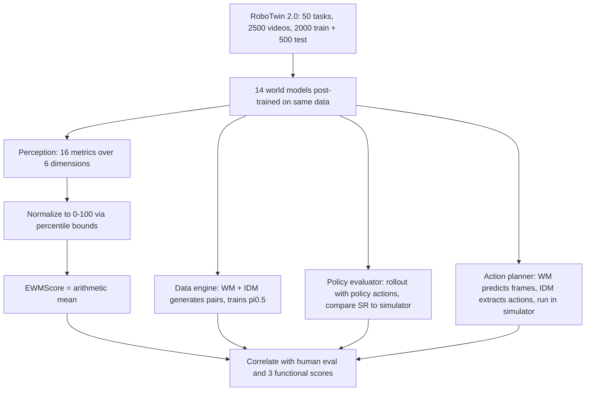

# WorldArena: A Unified Benchmark for Evaluating Perception and Functional Utility of Embodied World Models

- 本地 PDF：`papers/world-model/WorldArena_2602.08971.pdf`
- arXiv：https://arxiv.org/abs/2602.08971（v2，2026-02-11）
- 年份：2026（2 月，preprint）
- 团队：清华大学主导 + 上海交大 / 港大 / 普林斯顿 / 中科院自动化所 / 中科大 / 北大 / NUS；通讯作者 Yong Li
- 阶段：具身世界模型评估基准 —— 16 个视频指标 x 6 维度 + 3 类功能角色 + 人类评测合成 EWMScore

## 一句话总结

WorldArena 的核心主张是：**视觉保真度不等于具身可用性**。它对 14 个代表性世界模型（通用视频生成模型 CogvideoX/Wan 2.2/Wan 2.6/Veo 3.1、文本条件具身模型 Genie Envisioner/GigaWorld/TesserAct/Cosmos-Predict 2.5/WoW/RoboMaster/Vidar、动作条件模型 IRASim/Cosmos-Predict 2.5 (action)/CtrlWorld）做统一评测：感知侧 16 指标覆盖视觉/运动/内容一致性/物理符合性/3D 精度/可控性六个维度；功能侧把世界模型分别当**数据引擎**（生成数据训 pi0.5）、**策略评估器**（与 RoboTwin 仿真成功率算相关性）、**动作规划器**（配 IDM 闭环执行）。最有分量的数字是三个相关性：EWMScore 与人类判断 Pearson r = 0.825（证明指标有效），但与数据引擎性能只有 r = 0.600、与动作规划性能仅 r = 0.360——"好看"与"好用"的鸿沟被量化了。

## 核心技术

1. **16 指标 x 6 维度的感知评测面** — 视觉质量 3 项（MUSIQ 图像质量、LAION aesthetic、V-JEPA 特征 MMD 相似度）、运动质量 3 项（RAFT 光流 top-5% 活跃像素的 Dynamic Degree、Flow Score、插值模型的 Motion Smoothness）、内容一致性 3 项（DINO Subject Consistency / CLIP Background Consistency / 光流端点误差 Photometric Consistency）、物理符合性 2 项、3D 精度 2 项、可控性 3 项。
2. **VLM-as-judge 与防作弊设计** — Interaction Quality 用 Qwen3-VL 按 1-5 Likert 打分；Photometric Consistency 引入 Dynamic Degree 加权惩罚静态画面（防止"不动所以像素几乎不变"刷高分）；Trajectory Accuracy 用 SAM 3 提取机械臂框后计算 NDTW 对齐真值轨迹。
3. **三种功能角色的可操作化协议** — 数据引擎：世界模型 + VPP 式 IDM diffusion 头产出视频-动作对，用每任务仅 **25 条合成轨迹**训练 pi0.5 并在真实仿真里测增益；策略评估器：5 个不同能力档位的 pi0.5 与动作可控世界模型 rollout，rollout 长度上限为真值的 120%，VLM 判成功后与 RoboTwin 真实成功率算 Pearson 相关；规划器：世界模型 + IDM 直接闭环执行于 RoboTwin。
4. **EWMScore 单一指数** — 各指标按经验边界线性归一化到 [0,100] 再取算术平均；归一边界取全体模型上该指标的 99 百分位（max）与 1 百分位（min），保证可比且可解释。
5. **人类评测双协议** — 70 名标注者评 3500 条视频：绝对打分（整体质量/指令遵循/物理符合性，1-5 分映射 0-100）+ 两两对比胜率。

## 底层原理与数学推导

**EWMScore 的构造**：设某模型在第 $i$ 个指标上的原始分为 $s_i$，该指标在全体模型上的分布上界为 $b_i^{99}$、下界为 $b_i^1$，则归一化为

$$\tilde{s}_i = \frac{s_i - b_i^{1}}{b_i^{99} - b_i^{1}} \times 100, \qquad \mathrm{EWMScore} = \frac{1}{16}\sum_{i=1}^{16} \mathrm{clip}(\tilde{s}_i,\, 0,\, 100)$$

采用百分位而非理论范围的原因：不同指标量纲完全异质（FVD 类距离、余弦相似度、Likert 分数、NDTW），而百分位锚点让"同一维度的相对位置"成为唯一被比较的对象。

**光流一致性指标的动态门控**：传统光度一致性 $\bar{e}$（平均端点误差）在静止序列上天然接近完美，论文引入动态度 $S_{dyn}$ 做乘性调制（附录 A.9）：当 $S_{dyn} < \gamma$ 时按比例削减得分

$$S_{photo}^{raw} = \frac{1}{\mathrm{AEPE}(V_{gen}, V_{gt})}, \qquad S_{photo} \leftarrow S_{photo}^{raw}\cdot g(S_{dyn}), \;\; g(S_{dyn}) = \min\!\left(1,\, \frac{S_{dyn}}{\gamma}\right)$$

这是整个指标体系里最能体现"反 Goodhart"意识的一处：不是加一个新指标，而是给会被静态场景钻空子的旧指标装上运动量门槛。

**轨迹精度的度量链**：先用 SAM 3 在每帧分割出机械臂包围盒得到序列 $P$，与真值 $GT$ 做 Dynamic Time Warping 后取归一化形式，由于 NDTW 越小越好需再取倒数方向翻转：

$$S_{traj}^{raw} = \frac{1}{\mathrm{NDTW}(GT, P)}$$

物理意义是"空间-时间双重对齐程度"，能捕捉通用视频模型常见的"手臂动作看着流畅但完全没走到物体上"这类失效。

## 物理直觉解释

**为什么"照片级逼真"和"能用来训练机器人"差这么远？** 数据引擎实验给出了最直观的注脚：Wan 2.2 生成的数据训练出的 pi0.5 只有 15%/41% 成功率，而同等数量真实数据是 77%/66%。视频生成模型擅长复现统计意义上的画面纹理——光影、材质、轮廓——但机器人学习需要的是**状态转移的因果结构**："夹爪闭合 3 cm 后物体是否会跟着动"。前者是条件分布的表面统计，后者是要精确到位的反事实预测；一张逼真的图片里可能藏着一个肉眼难辨但违反力学的接触瞬间，而策略恰好就在这个瞬间学到错误的本体感受关联。这就像让人看电影学游泳：画质再高你也学不会换气，因为水对身体的作用力根本不在画面里。

**为什么动作条件模型的排名普遍高于参数量更大的闭源通用模型？** 排行榜末端是 Genie Envisioner 43.65、Cosmos-Predict 2.5(text) 50.81，顶端是 Wan 2.6 61.86 与 CtrlWorld 59.70。有趣的是 Trajectory Accuracy 这一列：Veo 3.1 只有 0.1231、Wan 2.6 只有 0.1182，而 CtrlWorld 高达 0.4766。商业通用模型的生成式先验极强，却没有动机把"这条轨迹对应哪个关节位移"内化进来——它们学的输入是文本，输出是像素，中间没有动作变量可依赖。**就像一个技艺精湛的画师可以画出以假乱真的舞者，却未必能说出舞者的重心在哪只脚上**——能画出来和能让另一具身体照着做，是两种能力。

**为什么把世界模型当策略评估器要专门测相关性而不直接看分数？** 单纯的成功率没有参照系——如果世界模型对所有策略都给出偏高的分数（论文确实观察到两个模型都系统性地高估成功率，归因于对成功轨迹的部分过拟合），那是系统性偏差，可以做校准；真正致命的是排序错乱，即 A 策略真实比 B 强却被判为更弱。CtrlWorld 的 r=0.986 说明它保序能力近乎完美，可以放心当虚拟测试场；Cosmos-Predict 2.5 的 r=0.483 则意味着用它筛 checkpoint 会漏掉真正的改进。这就是 benchmark 的价值所在：不告诉你谁最强，而是告诉你**哪个模型的"测量仪器"最准**。

## 工程细节与实操指南

- **数据基座**：RoboTwin 2.0 双臂操作域，50 个任务场景共 2500 条视频；2000 训练 / 500 测试；所有有训练代码的模型都用统一数据按官方实现 post-train 以求公平。
- **被测模型清单**：通用类 CogvideoX、Wan 2.2、Wan 2.6、Veo 3.1（闭源 API）；文本条件具身类 Genie Envisioner、GigaWorld-0、TesserAct、WoW、RoboMaster、Vidar、Cosmos-Predict 2.5(text)；动作条件类 IRASim、Cosmos-Predict 2.5(action)、CtrlWorld。
- **功能评测三件套的具体配置**：数据引擎任务选 adjust bottle 与 click bell 各执行 100 次；每个世界模型只生成 25 条合成轨迹训 pi0.5；策略评估器的 rollout 超过真值帧数 20% 即截断并用 VLM 判定；规划器同样走世界模型 + IDM 组合在 RoboTwin 里闭环。
- **人类评测规模**：70 位标注者、3500 条视频、双协议（绝对 1-5 分制打分 + 成对比较算 Win Rate）。
- **榜单速览（EWMScore）**：Wan 2.6 61.86 > CtrlWorld 59.70 > Veo 3.1 58.87 > IRASim 58.11 > CogvideoX 57.88 > Cosmos-Predict 2.5(action) 55.90 > WoW 54.88 > Wan 2.2 54.54 > GigaWorld-0 53.39 > TesserAct 53.23 > RoboMaster 51.84 > Vidar 51.60 > Cosmos-Predict 2.5(text) 50.81 > Genie Envisioner 43.65。
- **关键相关性结论**：EWMScore vs 人类评分 r = 0.825；vs 数据引擎表现 r = 0.600；vs 动作规划表现 r = 0.360。
- **资源入口**：world-arena.ai 提供公开 leaderboard，可持续提交新模型。

## 消融实验与分析

本文是基准工作，没有传统意义的消融表，以下改为摘录其**主结果表的功能部分**（正文 Table 4 为数据引擎任务成功率、Table 5 为动作规划成功率，均为 RoboTwin 真实仿真测评，20 次以上执行取平均），并补充相关性分析（Fig. 4/Fig. 5）。这两个表共用同一批任务（Task 1 = adjust bottle，Task 2 = click bell），恰好构成纵向可比的两条线。

| 方法 | 数据引擎：pi0.5 用其合成数据训练（Task 1 / Task 2） | 规划器：WM+IDM 直接闭环（Task 1 / Task 2） | 对照：真实数据训练 pi0.5 |
|------|-----------------------------|-----------------------|------------|
| Genie Envisioner | 7% / 21% | 10% / 20% | 77% / 66% |
| TesserAct | 1% / 35% | 1% / 35% | 77% / 66% |
| RoboMaster | 7% / 68% | 8% / 20% | 77% / 66% |
| Vidar | 13% / 53% | 2% / 19% | 77% / 66% |
| WoW | 45% / 71% | 20% / 21% | 77% / 66% |
| Wan 2.2 | 15% / 41% | 12% / 20% | 77% / 66% |
| pi0.5 本体（零样本） | 2% / 5% | 真实策略直接执行的参照上界 77% / 66% | 77% / 66% |

补一行关键量化证据（策略评估器角色，Fig. 4）：CtrlWorld 与 RoboTwin 仿真成功率的 Pearson r = 0.986，而 Cosmos-Predict 2.5 仅 r = 0.483，且两者给出的绝对成功率均系统性高于仿真真值——作者解读为"部分过拟合到成功轨迹"。

**核心结论**：即便是这一批最强的候选者，合成数据也几乎全面落后于真实数据，唯一的例外是 Task 2 上 RoboMaster（68%）与 WoW（71%）略超真实数据的 66%——但这并未换来规划能力的同步改善，WoW 作为规划器只剩 20%/21%；纵向看"同一个模型当数据引擎"与"当规划器"的成绩单严重不一致（TesserAct 在两条线上都是 35%/35% 极不均衡，Vidar 从 53% 崩到 19%），印证了视觉分数只是必要条件。EWMScore 的定位也因此更清晰：它是**感知质量的可靠代理（r=0.825 对齐人类）**，而不是具身效用的代理（r=0.360），购买前应分别查这两张榜。

## 技术权衡（Trade-off）

| 优势 | 局限与代价 |
|------|-----------|
| 首个同时覆盖感知 + 三种功能角色 + 人类评测的具身世界模型基准，Table 1 对比中唯一全勾选项 | 所有功能评测绑定在 RoboTwin 单一仿真生态，跨平台结论存疑 |
| 14 个模型横向可比，含闭源商用 API（Veo 3.1） | 闭源模型的 post-train 公平性无法真正保证（只能调用官方接口，无法统一微调） |
| EWMScore 经 r=0.825 验证与人类感知一致 | 加权方式是最朴素的等权算术平均，未区分各维度对下游任务的因果重要性 |
| 功能评测直接回答用户真正关心的问题（能不能造数据、能不能当测试场） | 动作规划的 IDM 是外挂的 VPP 式组件，低分可能是 IDM 能力上限问题而非世界模型问题 |
| 防作弊指标设计（动态门控光度一致性、VLM 物理判官） | VLM 判官本身有偏好与噪声，Qwen3-VL-8B 的打分可靠性未做交叉验证 |

## 技术价值与演进定位

WorldArena 在 WAM 辩论中的角色比较特殊：它不出方法，而是给三方立场的争论提供了**裁判工具**。DreamZero 式的"预训练 backbone"主张假设"视频质量决定策略上限"，但本文的 r = 0.360 直接对这个假设泼了冷水——至少在当前技术水位下，把感知分拉满并不自动带来动作规划收益，这意味着 backbone 派必须额外解释动作侧的对齐机制。对 V-JEPA 2 式的"独立规划器"路线，CtrlWorld 拿到 0.986 的保序相关给了强证据：动作条件的世界模型确实已经够格当虚拟测试场。而对 WorldVLA 式的"辅助目标"路线，本文的证据是间接但不利的：世界模型生成的数据目前还不足以可靠替代真实数据训策略（除个别任务外全面落后）。更长远地看，这篇工作把"具身世界模型"这个词从营销语拆成了三个可测量的职业分工——data engine / policy evaluator / action planner——未来任何一篇 WAM 论文都应该自报在这三个岗位上的成绩，而不是只贴几张漂亮的生成帧。

## 与其他论文的关系

- **V-JEPA 2 (Meta)** — 本文的被测模型之一虽未直接列出 JEPA 系，但其定义的三种功能角色正好涵盖 V-JEPA 2-AC 的用法（latent 规划器即 action planner 一类）；CtrlWorld 的高相关性结果侧面支持"显式动作条件"是规划器可用性的前提，这恰是 V-JEPA 2 要靠后训练 AC 版本才能获得的属性。
- **DreamZero (NVIDIA)** — DreamZero 断言"提升视频生成质量就能提升策略表现"；WorldArena 的 Fig. 5 给出修正版答案：r = 0.360 说明 2026 年初的模型还远没有进入"视觉质量自动转化为控制能力"的区域，DreamZero 的等式目前只在自家 500 小时专有数据的闭环里成立。
- **Genie Envisioner (Agibot)** — 榜单垫底（43.65 EWMScore），但在数据引擎任务上拿到 7%/21%、作为早期机器人专用世界模型仍优于零样本 pi0.5 的 2%/5%；说明专用架构即便感知粗糙也能提供有用的动力学信号。
- **TesserAct** — 具身模型里 subject consistency 第一梯队（0.8250，背景一致性 0.9238，正文点名与 CtrlWorld 并列），却是 Table 4 里 Task 1 最差的 1%：典型的"感知强、功能弱"样本，也是这篇论文标题里 perception–functionality gap 的具体化身。
- **CtrlWorld** — 全场最大赢家：59.70 的总分在动作条件类第一，Trajectory Accuracy 0.4766 远超一切通用模型，策略评估相关 r=0.986 更是唯一具备"虚拟实验室"资格的模型。
- **RoboTwin 2.0** — 整个评测的数据底座（50 场景/2500 视频），提供双臂操作所需的强域随机化，这也意味着 WorldArena 结论目前无法外推到单臂桌面场景之外的形态。
- **VBench / WorldScore 等 T2V 基准** — 本文 Table 1 的直接批评对象：这些基准在世界模型当作视频生成器来评，物理符合性与可控性最多是点缀，完全无法回答"能否用于决策"的问题。
- **TacWAM (清华 + Manifold AI)** — 同一作者群体的另一篇工作（Lei Jin、Yiding Ma、Chen Gao、Wei Wu、Yong Li 重叠）：TacWAM 在四个真实接触丰富任务上达 75.0% 平均成功率，恰可作为 WorldArena 未覆盖的"力学感知世界模型"评测方向的延伸提案。

## 精读问题

1. EWMScore 对 16 个指标等权平均，但 Data Engine 表现与 Trajectory Accuracy / Interaction Quality 这些物理维度似乎关系更大——若改成按维度对下游任务做回归学权重，r = 0.360 还能提到多少？还是说 gap 主要来自感知指标体系本身的盲区？
2. 数据引擎实验只在每任务 25 条合成轨迹这一个数据量档位上就下了"合成数据不足"的结论——如果 WoW 提供 250 条或 2500 条，Task 1 那 45% 到 77% 的缺口会关闭多少？
3. 两个被测策略评估器给出的成功率都系统性高于仿真真值，作者归因于"对成功轨迹的部分过拟合"——那么是否可以在评测协议中加入反事实探测（故意喂失败动作序列）来度量这种乐观偏差并做校准？
4. 动作规划全线溃败（最好 21%）到底是世界模型预测不准，还是配套 IDM 的容量不足？如果不换世界模型、单独把 IDM 换成更强的动作解码器做对照，能把责任切分清楚吗？
5. 世界模型 1.0 时代 Genie Envisioner 拿到最低的 43.65，却在指令遵循指标上有 0.8544 的高分——这种"可控性不差但整体垫底"的组合暗示哪些维度的权重设计可能与人类直觉相悖？
