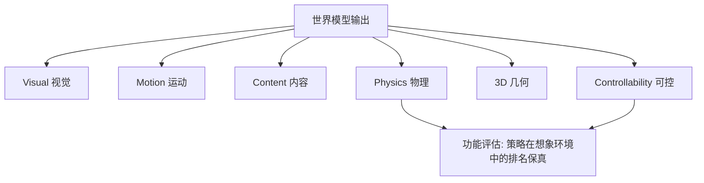

# WorldArena: Functional Evaluation of World Models for Embodied Agents

- 本地 PDF：`papers/world-model/WorldArena_2602.08971.pdf`
- arXiv：https://arxiv.org/abs/2602.08971
- 年份：2026（2 月）
- 团队：多机构（Shang 等）
- 阶段：世界模型功能评估 benchmark — 16 指标 × 6 维度

## 一句话总结

WorldArena 是世界模型的**功能评估** benchmark：16 个指标覆盖 6 个维度（视觉/运动/内容/物理/3D/可控性），核心主张是**评估世界模型应该看"功能性"（能否支持下游任务）而非仅视觉保真度**——明确将策略评估（policy evaluation）列为具身世界模型的核心下游用途：在想象环境中评估机器人策略和 checkpoint，无需真实部署。

## 核心技术

1. **6 维度评估框架** — Visual（视觉质量）、Motion（运动质量）、Content（内容保真）、Physics（物理一致性）、3D（几何一致）、Controllability（可控性）
2. **16 个指标** — 覆盖生成质量 + 功能效用
3. **策略评估作为核心用途** — 世界模型在想象环境中评估策略/checkpoint，无需真实部署
4. **强调"视觉真实与具身效用之间的 gap"** — 这是 WRL-Survey 提到的核心 benchmark

## 底层原理与数学推导

**核心主张**：世界模型的价值 = 能否在想象环境中准确评估策略。如果世界模型对策略 A 和策略 B 的排名与真实环境一致（rank consistency），它就是有用的——即使预测的帧不完全逼真。

## 物理直觉解释

WorldArena 的逻辑：**世界模型是"想象环境"，评估它的标准不是"画面多好看"，而是"在里面测试策略准不准"**。就像风洞——评估风洞的价值不是"风洞多好看"，而是"测出的空气动力学数据准不准"。WorldArena 把世界模型的评估从"生成质量"转向"决策支持能力"。

## 工程细节与实操指南

- **6 维度**：视觉、运动、内容、物理、3D、可控性
- **16 指标**：每维度多个指标，兼顾生成质量 + 功能效用
- **策略评估协议**：在想象环境 rollout 策略 → 与真实环境结果比较排名一致性
- **定位**：作为 WRL-Survey 推荐的核心 benchmark 之一

## 消融实验与分析

| 评估维度 | 揭示的问题 |
|---------|-----------|
| 视觉保真 vs 功能效用 | 高视觉逼真的世界模型可能功能差——两者可解耦 |
| 物理一致性 | 多数世界模型在物理指标上失败（与 IntPhys 2 结论一致） |
| 策略评估保真 | 世界模型对策略的排名与真实环境不一致时，无法作为评估器 |

## 技术权衡（Trade-off）

| 优势 | 劣势与工程代价 |
|------|----------------|
| 功能评估而非视觉评估——回答"有没有用" | 策略评估需要额外的策略集 + 真实环境对照 |
| 6 维度 × 16 指标全面 | 指标之间权重/聚合方式需人工设计 |
| 明确策略评估为核心用途 | benchmark 依赖特定世界模型和策略选择 |

## 技术价值与演进定位

WorldArena 是 2026 年评估标准迁移的代表——从"像素精度"到"功能效用"。它和 WRL-Survey 的三级评估框架、WoW-World-Eval 的物理+可执行性标准一起，构成了 2026 年世界模型评估的新坐标。对你后续拉取世界模型论文的判断标准："这篇工作用什么评估？"——WorldArena 是参考答案之一。

## 与其他论文的关系

- **WRL-Survey** — 推荐的 12+ benchmark 之一
- **WoW-World-Eval** — 物理定律 + 可执行性导向（IDM Turing Test），互补
- **WorldEval** — 在想象环境排名机器人策略/checkpoint，同类功能评估
- **IntPhys 2 (V-JEPA 2 发布)** — 物理一致性评估，WorldArena 物理维度的参照
- **WMRM-Survey** — 5 表示家族的评估框架参照

## 精读问题

1. 16 个指标的权重如何确定——视觉和物理各占多少？
2. 策略评估的"策略集"选择——不同策略集是否导致不同的世界模型排名？
3. 世界模型作为评估器 vs 作为训练环境——哪个用途对"功能"的定义更本质？
4. 与真实环境对照的成本——策略评估协议在大规模应用中的可操作性？
