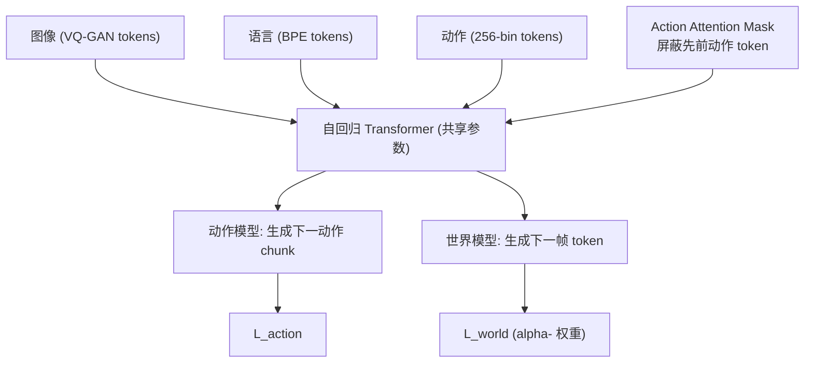

# WorldVLA: Towards Autoregressive Action World Model

- 本地 PDF：`papers/world-model/WorldVLA_2506.21539.pdf`
- arXiv：https://arxiv.org/abs/2506.21539
- 代码：https://github.com/alibaba-damo-academy/WorldVLA
- 年份：2025（6 月）
- 团队：阿里巴巴 DAMO 学院 + 湖畔实验室 + 浙江大学
- 阶段：WAM-VLA 融合 — 首个统一"动作模型 + 世界模型"的自回归框架

## 一句话总结

WorldVLA 是首个把 VLA 动作模型和世界模型融合进**同一个自回归模型**的框架：动作模型从图像+语言生成下一动作，世界模型从过去观测+动作预测下一帧——共享同一套参数联合训练（互正则化）。Chameleon 风格离散自回归设计：VQ-GAN 图像 tokenizer（8192 codebook）+ BPE 文本 + 256-bin 动作 tokenizer。核心创新是 **action attention mask**——生成动作 chunk 时屏蔽先前动作 token，防止自回归动作误差累积。LIBERO 512×512 平均 81.8%（超 OpenVLA 76.5%），世界模型分支使动作成功率 +4pp，动作分支使视频 FVD 降 ~10%。

## 核心技术

1. **统一自回归动作世界模型** — 动作模型 + 世界模型共享参数联合训练：$L = L_{action} + \alpha L_{world}$
2. **离散 token 化** — VQ-GAN 图像（8192 codebook, 256×256→256 tokens）、BPE 文本（65536 vocab）、动作（每维 256 bins, 7 tokens/action: 3 平移 + 3 旋转 + 1 夹爪）
3. **Action Attention Mask** — 动作 chunk 生成时屏蔽先前动作 token（动作只依赖文本/视觉），世界模型保持标准因果 attention——防止自回归动作误差累积
4. **互正则化** — 世界模型任务强制学环境物理 → 提升动作生成；动作任务提升视觉理解 → 提升视频预测

## 底层原理与数学推导

**联合训练目标**：$L = L_{action} + \alpha L_{world}$

**Action Attention Mask 的原理**：标准因果 attention 下，预测第 k 个动作 token 时能看到前 k-1 个动作 token——如果前一个预测错了，误差会累积（10-50% 成功率下降）。WorldVLA 在动作 chunk 生成时屏蔽所有先前动作 token，使每个动作只依赖视觉/文本上下文——就像"每次动作都是独立决策"，消除误差传播。

## 物理直觉解释

**为什么把世界模型和动作模型合并？** 这像是"一边做一边观察后果"——动作模型生成"我该怎么做"，世界模型预测"这么做会发生什么"。共享参数 = 同一个大脑同时负责"决策"和"预测后果"。互正则化的直觉：**会预测后果的决策者更靠谱**——就像下棋的人如果能看到"走这步会导致对方将军"，就不会走这步。

**Action Attention Mask 的直觉**：标准的自回归动作生成像"多米诺骨牌"——第一张牌倒错，后面全倒。Mask 把骨牌拆开——每张牌独立站立，只靠"地基"（视觉）支撑。代价是失去了动作之间的时序依赖（连贯性），但换来了鲁棒性（一个错不连累全部）。

## 工程细节与实操指南

- **图像 tokenizer**：VQ-GAN，8192 codebook；256×256→256 tokens，512×512→1024 tokens
- **文本 tokenizer**：BPE，65536 vocab
- **动作 tokenizer**：每维 256 bins；7 tokens/action（3 相对平移 + 3 相对角度 + 1 夹爪状态）
- **训练**：$L = L_{action} + \alpha L_{world}$，动作 chunk + 世界模型联合
- **分辨率**：512×512（256×256 时 LIBERO 79.1%）
- **基准**：LIBERO 四套件 + LeRobot 真机

## 消融实验与分析

| 消融/对比 | 结论 |
|---------|------|
| 世界模型分支 on/off | 动作成功率 62.8%→67.2%（无 chunking）；76.6%→78.1%（chunking） |
| Action Attention Mask on/off | 恢复 4-23% 成功率；LIBERO-Goal 5-action chunk 36.7%→81.8% |
| 动作分支对世界模型 | 50 帧 FVD 718.6→674.1（~10% 改善） |
| vs OpenVLA | LIBERO 81.8% vs 76.5% |
| 512 vs 256 分辨率 | 79.1%→81.8% |

## 技术权衡（Trade-off）

| 优势 | 劣势与工程代价 |
|------|----------------|
| 世界模型+动作模型共享参数，互增强 | 离散图像 tokenizer 限制感知丰富度 |
| Action Attention Mask 消除误差累积 | 长动作 chunk 性能仍退化 |
| 无需大规模机器人预训练（81.8% LIBERO） | LIBERO-Long 仅 60%（长程短板） |
| 开源（Apache-2.0） | 扰动鲁棒性差：LIBERO-Plus 81.8%→25.0% |

## 技术价值与演进定位

WorldVLA 是"WAM 与 VLA 融合"的代表——它回答了 WAM 辩论中的一个关键问题：**世界建模目标应该放在预训练 backbone（WAM 立场）、辅助目标（WorldVLA 立场）、还是独立规划器（V-JEPA 2 立场）？** WorldVLA 证明辅助目标路线有效——世界模型 loss 对动作生成有正则化价值，动作 loss 对视频预测也有价值——互增强而非互干扰。

## 与其他论文的关系

- **LingBot-VA** — 也是视频-动作联合模型，但用 MoT 双专家（非共享参数）；WorldVLA 共享全部参数
- **V-JEPA 2** — 独立规划器立场（世界模型只用做 MPC）；WorldVLA 是辅助目标立场
- **DreamZero (NVIDIA)** — WAM 预训练 backbone 立场（14B 视频扩散基座）
- **π0 / OpenVLA** — 纯 VLA baseline，WorldVLA 融合世界建模超越
- **RynnVLA-002** — 同团队（阿里 DAMO），LIBERO 97.4%，WorldVLA 的后续强化

## 精读问题

1. Action Attention Mask 消除误差累积的同时是否损失了动作时序连贯性？长 chunk 的退化是否源于此？
2. 世界模型分支学到的"物理"是显式的还是隐式的——能否用 probing 验证？
3. alpha- 权重的敏感性——世界模型 loss 占比多少时动作性能最优？
4. 与 RynnVLA-002 的关系——后续工作具体改进了什么（97.4% vs 81.8%）？
5. 离散图像 tokenizer 的瓶颈——VQ-GAN vs 连续 latent（如 V-JEPA 2 路线）的取舍？
