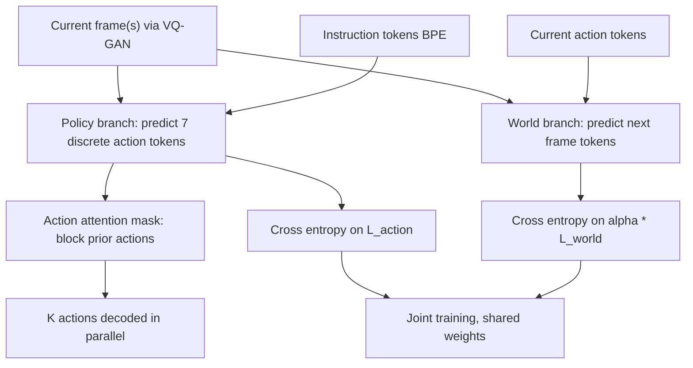

# WorldVLA: Towards Autoregressive Action World Model

- 本地 PDF：`papers/world-model/WorldVLA_2506.21539.pdf`
- arXiv：https://arxiv.org/abs/2506.21539
- 代码：https://github.com/alibaba-damo-academy/WorldVLA
- 年份：2025（6 月，arXiv v1）
- 团队：阿里巴巴 DAMO Academy + Hupan Lab + 浙江大学
- 阶段：WAM 三立场辩论中"**辅助训练目标**"一极的代表 —— 在 VLA 之上叠加世界模型目标，用 action mask 修自回归动作的误差累积

## 一句话总结

WorldVLA 把 VLA 动作模型与视频世界模型塞进同一个 Chameleon 式离散 token 自回归骨干：动作模型吃图像+语言出 7 个离散动作 token，世界模型吃当前帧+当前动作预测下一帧 token 序列，两路数据混训共享参数互为正则。实验给出双向证据——世界模型分支把动作成功率从 62.8% 拉到 67.2%（+4 pp），动作分支反过来让 50 帧长序列生成的 FVD 从 718.6 降到 674.1。更重要的发现是：纯自回归串行生成动作 chunk 时成功率会掉 10%-50%（LIBERO-Spatial 从 77.8% 跌到 36.7%），而他们提出的 **action attention mask**（生成第 $k$ 个动作时屏蔽所有先前动作、只看文本/视觉）把这波损失基本收回来（4-23 pp 提升）。

## 核心技术

1. **三 tokenizer 统一词表** — 图像走 VQ-GAN（压缩比 16，codebook 8192；256x256 出 256 个 token / 512x512 出 1024 个），文本走 BPE（词表 65536，其中预留 8192 图像码 + 256 动作码），动作每维量化到 256 bins；三种模态在同一段 token 序列里以 [BOI]/[EOI]/[BOA]/[EOA] 分段。
2. **双向数据流混训** — 动作模型数据格式 `[BOS]{text}[BOI]{image}xM[EOS][BOA]{action}xK[EOS]` 只对 $L_{action}$ 算 loss；世界模型数据 `[BOS]{text}[BOI]{image}[EOI][BOA]{action}[EOA][EOS][BOI]{image}xN[EOS]` 只对 $L_{world}$ 算 loss，总 loss 为 $\mathcal{L}=\mathcal{L}_{action}+\alpha \mathcal{L}_{world}$，$\alpha=0.04$ 平衡 token 数差异（256-1024 图像 token vs 7 动作 token）。
3. **Action attention mask** — 默认 causal 掩码下后续动作能读到先前动作，而 MLLM 对动作模态几乎没有预训练先验，前面的错动作会污染后面的动作；改成"每个动作只看 text + image + 自己"，多个动作即可并行解码，等价于并行 action chunking。
4. **动作语义化输入输出** — 7 个 token = 3 相对位置 + 3 相对角度 + 1 绝对夹爪状态；世界模型的文本 prompt 是固定句式 "Generate the next frame based on the current image and the action."，动作模型是 "What action should the robot take to + 任务 + ?"。
5. **Tactile-free 但可对比的评估面** — 与不条件于动作的视频预测模型（GR-1/GR-2 预训练范式）做了正面对照，证明"有没有喂动作"决定这个辅助目标是有益还是引入噪声。

## 底层原理与数学推导

**两个子模型的形式化定义**（式 1-3）：策略 $\pi_\theta$ 与世界模型 $f_\phi$ 分别是

$$a_t = \pi_\theta(a_t \mid o_{t-h:t},\, l), \qquad o_t = f_\phi(o_t \mid o_{t-h:t-1},\, a_{t-h:t-1})$$

统一模型 $\mathcal{M}_\psi$ 要求同一组权重同时承担 $\mathcal{M}_\psi^{policy}$ 与 $\mathcal{M}_\psi^{world}$ 两个角色，通过把两种数据格式交替喂进同一网络实现。

**联合损失与权重平衡**（式 4）：

$$\mathcal{L} = \mathcal{L}_{action} + \alpha\,\mathcal{L}_{world}$$

$\alpha$ 不是拍脑袋的超参：一张 512x512 图像展开是 1024 个重建 token 而一条动作只有 7 个，若不加权，梯度会被世界模型分支淹没，所以 $\alpha=0.04$ 本质上是在做 **token 数量的逆频率归一**。

**信息拓扑的三种掩码**（图 3）：默认动作模型掩码允许 $a_k$ 读到 $a_{<k}$（causal）；改进掩码强制 $a_k$ 的注意力集合只含文本与图像 token；世界模型分支保持 causal。可以把改进后的可见性写成

$$\mathrm{Attn}(a_k) \subseteq \{\,\text{text tokens}\,\} \cup \{\text{image tokens}\}, \qquad a_j \notin \mathrm{Attn}(a_k) \;\; \forall j < k$$

这条约束把"chunk 内动作间依赖"从注意力通路里删掉——模型的响应变成 $p(a_k \mid o, l)$ 而非 $p(a_k \mid a_{<k}, o, l)$，从而把累积误差的传递链直接物理切断。

**为什么世界模型分支要读动作而不是只读文本？** 无动作条件下下一帧是不适定的——同一个起始帧对应多条合法未来轨迹。设未来状态分布为 $p(o_t \mid o_{t-1})$，其熵显著高于 $p(o_t \mid o_{t-1}, a_{t-1})$；训练时高熵目标的梯度本身就是噪声源。这也是论文区分"world model"与"video prediction model"的形式依据。

## 物理直觉解释

**为什么给动作模型加一个看似无关的"预测画面"任务反而让它抓得更准？** 学会预测"我施加这个力之后物体会怎么动"，等于被迫在内部建立一份物体几何、摩擦、重力方向的粗糙地图。当之后真正执行抓取时，这些知识已经内化为表征的一部分。这就像练台球的人先学"瞄哪个方向球会滚到哪里"——你不是在练推杆肌肉，而是在脑内装一个物理模拟器；一旦模拟器在，出杆精度自然提高。论文的视觉证据很直白：纯动作模型会不看对象径直把末端移到目的地（没抓住奶酪），加了世界模型的版本会先反复尝试直到成功抓住再移动。

**为什么动作误差会在自回归 chunk 里滚雪球？** MLLM 见过数万亿图像与文本 token，却几乎没见过机器人动作 token——动作模态在这个主干上没有任何预训练先验可以兜底。于是第 1 个动作一旦有偏差，第 2 个动作把它当作可靠事实继续 conditioning，偏差不是衰减而是复利放大，chunk 越长崩得越狠。**屏蔽前序动作相当于给一排互相抄作业的学生隔开座位**：每个人都只能看课本（观测）答题，谁也污染不了谁，而且因为不再互相等待，整条 chunk 还能并行解出来。

**为什么同样做视觉预测，"读动作"比"读任务描述"更值得？** "基于任务和当前帧生成未来图像"是一个一对多问题——从杯子的初始状态出发，既可以是被人拿起也可以是被撞倒，两条都符合任务语义。这种多义性会让模型学到模糊的平均化动力学，梯度信号充满矛盾；而条件上具体动作后，下一帧几乎被唯一确定。**就像给学生讲题：告诉他"目标是把杯子放架子上"远不如告诉他"现在手腕内旋 30 度、向上抬"来得确定**——后者才让他真正理解因果。

## 工程细节与实操指南

- **骨干初始化**：Chameleon（unified understanding + generation 模型）；图像 tokenizer 为带感知损失的 VQ-GAN。分辨率选 512x512 优于 256x256，主因是 Chameleon 预训练即在该分辨率下优化，且抓取类任务需要细粒度视觉细节。
- **默认超参**：历史图像数 $M=2$；chunk 大小 LIBERO-Long 用 $K=10$、其余三个任务 $K=5$；世界模型单轮 $N=1$；loss 权重 $\alpha=0.04$。
- **数据清洗**：沿用 OpenVLA 做法，过滤失败轨迹与 no-op 动作；90%/10% 划分训练/验证集（Table 2 对外比较时例外地用了全量数据以保证公平）。
- **评测协议**：每任务 50 条 rollout 报成功率；世界模型侧报 FVD / PSNR / SSIM / LPIPS。
- **历史帧数的边际收益**：不加 chunking 时 1 帧输入 SR 58.4%、2 帧 67.3%、4 帧 78.7%；但配合 chunking 后 1 帧 74.0%、2 帧 84.4%、4 帧 84.7%——收益饱和，故默认取 2 帧换取吞吐（FPS 从 3.13 降到 2.78 仅小幅代价，而 4 帧会掉到 2.78 以下）。
- **可选配方：世界模型做预训练** — 先只用世界模型数据训一轮再转入动作训练，平均成功率 62.8% 提升到 66.8%（LIBERO-Long 从 23.0% 到 30.2%），这是一个比联合训练更保守的两阶段替代方案。
- **repo 可跑性**：官方开源了代码（alibaba-damo-academy/WorldVLA），本文结论均为 LIBERO 仿真结果，无真机实验——这点在使用其结论时必须注意。

## 消融实验与分析

核心消融见论文 Table 3（5 行嵌套设计）、Table 4（世界模型质量）、Table 6（世界模型预训练）。以下数字全部逐字摘自 PDF 表格：

| 编号 | Action Model | World Model | Chunking | Action Mask | Goal | Object | Spatial | Long | Average |
|------|-------------|-------------|----------|-------------|------|--------|---------|------|---------|
| 1 | 有 | 无 | 无 | 无 | 67.3 | 82.9 | 77.8 | 23.0 | 62.8 |
| 2 | 有 | 有 | 无 | 无 | 73.1 | 88.0 | 80.2 | 27.3 | 67.2 |
| 3 | 有 | 无 | 有 | 无 | 79.6 | 82.9 | 36.7 | 16.9 | 54.0 |
| 4 | 有 | 无 | 有 | 有 | 84.4 | 90.9 | 81.8 | 49.3 | 76.6 |
| 5 | 有 | 有 | 有 | 有 | 85.1 | 90.9 | 84.0 | 52.4 | 78.1 |

补充行（Table 4 世界模型生成分支质量，50 帧长序列）：纯世界模型 FVD 718.6 / PSNR 23.98 / SSIM 83.41 / LPIPS 15.60；动作世界模型 FVD 674.1 / PSNR 24.30 / SSIM 83.55 / LPIPS 15.44。10 帧短序列时两者打平甚至纯世界模型 FVD 略优（250.0 vs 255.1）。

**核心结论**：这张表的杀伤力在 row 3 —— 不加任何处理的 naive 自回归 action chunking 让 Spatial 从 77.8% 崩到 36.7%、Long 从 23.0% 掉到 16.9%，平均分净跌 8.8 pp；仅加上 action attention mask 就回到 76.6%（+22.6 pp），证实动作误差传播而非视野不足才是崩溃根因。row 2 vs row 1 与 row 5 vs row 4 两处独立对照显示世界模型分支稳定带来 +4.4/+1.5 pp（最弱的 Long 上分别为 +4.3/+3.1 pp），而 Table 4 显示反向收益（FVD 降 44.5，约 6%）集中在长序列场景。作者还测得朴素 chunking 成功率随 chunk 长度增长单调恶化（下降幅度 10%-50%），mask 方案则在大 chunk 长度下优势最大——同时提醒 chunk 过长会导致机器人来不及响应新观测而掉分，存在长度上限。

## 技术权衡（Trade-off）

| 优势 | 付出的代价 |
|------|-----------|
| 单一模型同时具备策略与世界建模能力，推理零额外模块 | 离散 action tokenizer 造成信息损失——OpenVLA 原版平均只有 76.5%，而带连续动作头的 OpenVLA-OFT 达 95.4%，差距说明上限受限 |
| 世界模型目标可在同一次训练中白拿 +4 pp 策略增益 | LIBERO 是仿真基准且无真机验证，"互增强"结论能否迁移到真实接触场景未知 |
| Action mask 让 chunk 并行解码，弥补自回归速度劣势 | 屏蔽动作间依赖意味着放弃了显式建模"动作连贯性"的能力，只能靠视觉条件隐式保证平滑 |
| 512x512 高分辨率带来更强操作精度 | 图像 token 数暴涨到 1024，世界模型分支的训练成本同步放大 |

## 技术价值与演进定位

在 WAM 三立场框架里，WorldVLA 代表最温和的一极：**世界模型作为 VLA 训练的辅助监督目标**，而不是独立 backbone（DreamZero）也不是独立规划器（V-JEPA 2）。它没有大模型规模（Chameleon 中型骨干，未公开具体参数量）、没有海量专有真机数据（只用了 LIBERO），却贡献了两件被后续工作持续引用的事：(1) 一张干净的嵌套消融表证明世界模型目标与 action chunking 二者独立有效且可叠加；(2) 第一次系统量化了"自回归模型串行生成动作 chunk 的误差累积"这一当时少有人注意的失效模式，并用一个零成本掩码修复。工程层面它的贡献更多是方法论上的警示：Naive autoregressive action generation is actively harmful——这对后来 DreamZero 这类纯 AR WAM 是一个必须回应的设计约束（DreamZero 的应对是把动作视为回归量而不进入自回归链路）。

## 与其他论文的关系

- **OpenVLA / OpenVLA-OFT** — 同为离散 token 化动作的自回归路线，WorldVLA (512x512) 平均 81.8% 高于未微调 OpenVLA 的 76.5%，但远低于在 OFT 框架下并行解码头版的 95.4%，暴露出离散自回归动作表示的天花板。
- **UVA (Unified Video Action Model)** — 同样统一动作与图像生成，但走 diffusion 头路线；本文用离散 AR 架构实现同一目标并声明为差异化方向（文末也承认 future work 应考虑辅助动作头来突破离散化瓶颈）。
- **GR-1 / GR-2 (ByteDance)** — "视频预测预训练 + 动作微调"的代表；WorldVLA 的 Fig. 7 对照显示不带动作条件的视频预测目标对动作性能的提升不稳定（两个任务有益、一个任务有害），而有动作条件的世界模型目标在全部四个任务上一致有益。
- **Chameleon** — 直接底座。三个 tokenizer 复用 Chameleon 的统一词表设计，后续 512 分辨率的收益也来自其原生预训练配置；WorldVLA 证明了通用 unified model 可以低成本改造成 action world model。
- **iVideoGPT / DWS** — 论文 Table 1 里归类为经典 world model（输入 T+V+A、输出 V）；WorldVLA 补上了它们缺失的动作输出能力，形成 T+V+A 输入、V+A 输出的完整闭环。
- **DreamZero (NVIDIA)** — 立场对照组：DreamZero 以视频扩散为骨干、强调非重复大数据与 14B 缩放，但需为此付出专门设计去满足实时性；WorldVLA 选择保持小成本在中型 LLM 上叠加辅助目标，规模上是另一个极端，二者共同界定"用世界模型目标强化动作学习"这条谱系的两端。
- **Seer (PIDM)** — 同样做"预测逆动力学"，思路相反：Seer 显式建 IDM，WorldVLA 通过世界模型目标隐式获得类似表征收益。

## 精读问题

1. $\alpha=0.04$ 是否随图像分辨率变化——换成 1024 token 的 512x512 配置后仍沿用按 256 token 标定的权重，世界模型分支的实际梯度权重是否已被稀释一半以上？
2. Action mask 取得了 22.6 pp 恢复，但它同时也禁止了模型表达"手已经握住杯子，下一步该合拢"这类显式动作依赖——如果把 mask 改成局部窗口（比如只允许读前 1 个动作），能否在保留部分连贯性建模的同时控制住误差累积？
3. Table 4 里 10 帧短序列时纯世界模型 FVD 反而更好（250.0 vs 255.1），到 50 帧才反转（718.6 vs 674.1）——动作条件的收益是否主要来自抑制长程漂移而非提升局部真实感？如果是，它对短 horizon 操作任务的贡献机制又是什么？
4. LIBERO-Long 的 improvement 最戏剧化（23.0% 到 27.3%、再到 52.4%）：这是世界模型分支帮助了长 horizon 的记忆，还是仅仅因为 chunk=10 时 mask 省掉了 9 次"条件于错误动作"的机会？如何解耦这两个因素？
5. 本文完全没有真机实验，而其在 LIBERO 仿真里证明有效的互增强在真实接触丰富场景中往往失效（视觉遮挡、力反馈缺失）——如果把同样的混训配比直接搬到 TacWAM 类触觉 WAM 上，$\alpha$ 与掩码结构需要怎样改造才能避免触觉模态成为新的"弱先验误差源"？
