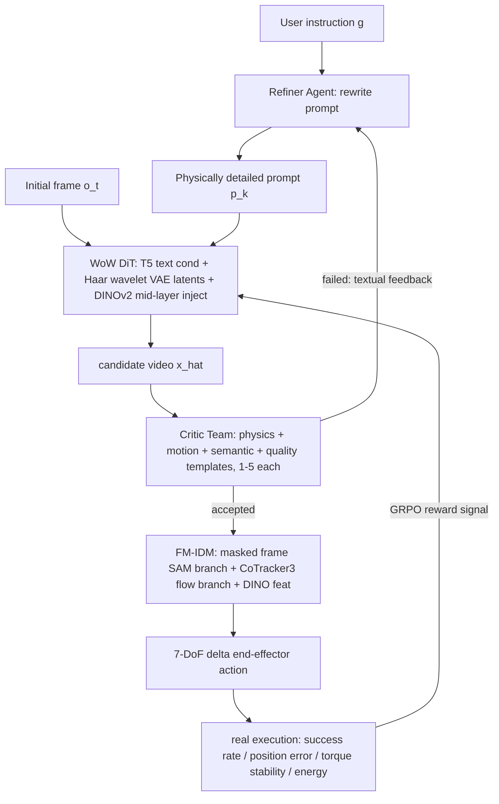

# WoW: Towards a World-Omniscient World-model Through Embodied Interaction

- 本地 PDF：`papers/world-model/WoW_2509.22642.pdf`
- arXiv：https://arxiv.org/abs/2509.22642
- 年份：2025（9 月 arXiv v1，10 月 16 日 v2，全文 45 页，无独立附录，35 页起为参考文献）
- 团队：北京人形机器人创新中心 + 北大 + 港科大
- 阶段：工业级具身交互式世界系统 —— WAM 路线之争里的**第四立场**：不是预训练 backbone（DreamZero）、不是辅助目标（WorldVLA）、也不是独立 latent 规划器（V-JEPA 2），而是 DiT 生成器 + Critic VLM + IDM Actor + 短期记忆组成的闭环交互系统（图 1 五组件：Perception / Embodied Video Foundation Model / Critic VLM / Actor / Short Memory）

## 一句话总结

WoW 是一个 14B 参数的视频扩散世界模型，用 203 万条真机交互轨迹（约 7300 小时、6.33 亿帧 @24fps、12 种机器人本体、过滤掉约 75% 原始数据）训练，其核心论点是：**大规模因果丰富的交互数据才能把"视频生成器"抬升为"世界模型"**。它的独特处在于承认扩散模型学到的物理只是"合理结果的概率分布"，因此外挂一套 SOPHIA 测试时框架——Refiner Agent 反复改写语言指令、"Dynamic Critic Model Team" 打分（physics/motion/semantic/quality 四模板）、不过关就重新生成，即所谓 Prover-Verifier 范式移植到视频域；再由 Flow-Mask IDM（SAM 掩码分支 + CoTracker3 光流分支 + MLP 头，64.6 万图像-动作对）把想象出的未来帧翻译成 7-DoF 末端动作，在真机上 Easy 94.5% / Mid 75.2% 回放成功。配套的 WoWBench（606 样本、4 大能力、20 子任务）上，纯 DiT 版自治评测 Overall 49.39、加 SOPHIA Agent 后 51.97，均超过最强的原版底座 Cosmos-Predict2（42.71，配 Agent 为 50.53）。

## 核心技术

1. **数据引擎（Section 4.1.1）** — 四阶段流水线 Collection（Agibot、DROID、RoboMIND + 大量自有数据）→ Filtering（仅保留 RGB、最短 90 帧、限 head/wrist/third-person 视角）→ Caption Refinement（预训练 VLM 把稀疏标注扩成稠密描述，稀疏 : 稠密 约 1:4 混合，并手工加入机器人型号标识）→ Rebalancing（上调低频任务采样概率）。最终 640×480 原生分辨率上采样到 720×1024。
2. **DiT 视频条件生成器（Section 4.1.2）** — 文本走 InternVL3-78B 改写成含环境/相机位姿/embodiment/动作的叙述再用 T5 编码注入；视觉走时空 VAE + **3D Haar 小波分解**（低频承载场景结构、高频保留碰撞与形变细节）；骨干 DiT 用 adaLN 做时间步调制，同时使用绝对 3D 位置编码（保全局轨迹一致性）与相对 3D RoPE（保局部接触因果性）；**DINOv2 特征注入中间层**做自监督表征对齐（论文声称是首次把强自监督视觉特征嵌入扩散世界模型主干，见图 6(b) 的 token relation distillation 训练路径）。
3. **SOPHIA Solver-Critic 闭环（Section 4.2）** — DiT 的一次采样被视为 System 1 提案；Critic VLM 在真实 + 生成视频混合的 QA 数据上微调，沿五个维度评审（task completion、action success、物理合理性如稳定/形变、kinematic smoothness、整体质量），输出 1-5 分加自然语言解释；Refiner Agent 把结构化批评转成下一版提示词。关键声明：整个迭代**不改 DiT 权重**，物理真实性通过搜索离散提示词空间逼近，论文称之为把 Prover-Verifier 范式第一次搬进高维连续随机域。
4. **Flow-Mask IDM（Section 4.3）** — 显式放弃模型私有特征路线，选像素级解码换通用性与精度："trading real-time performance for greater generality"。两个编码-解码分支：微调过的 SAM 处理掩码后的当前帧提供场景与 embodiment 上下文，CoTracker3 光流 $F_{t \to t+1}$ 承载细粒度动态，辅以 DINO 特征，MLP 头输出 7-DoF 末端 delta 动作。插件式设计声明兼容任意视觉生成世界模型。
5. **WoWBench（Section 5）** — Image+Text-to-Video 条件生成任务，606 个样本、4 能力维度（Perception Understanding / Predictive Reasoning / Decision-making and Planning / Generalized Execution）共 20 子任务；难度划分为 231 Easy / 237 Medium / 其余 Hard（由总数 606 推算为 138）；评委会包含 12 名领域专家人工评测 + GPT-4o / 微调 Qwen-2.5-VL 自治裁判。
6. **五个后训练应用（Section 8）** — 4D 新视角合成（VGGT 重建几何 + wrist-head 位姿回归 + 投影损失，无需首帧引导即可产出腕部视角视频供 VLA 训练）；空间感知轨迹引导生成（接 ManipDreamer3D 占据栅格内轨迹规划）；Action-to-Video（最高 640×480、超 300 帧、逐 block 动作条件模块、支持成败 rollout 双向建模）；视觉风格迁移增强数据工具箱（light/embodiment/object/background 四路可控增广，SegAnyMo 动态物体掩码 + Light-A-Video）；世界模型当 VLM 的交互沙盒做测试时扩展（表 6）。

## 底层原理与数学推导

**1) 具身世界模型的通用形式化**（Section 2.1，式 1-2）：给定状态 $s_t \in \mathcal{S}$、低层控制动作 $a_t \in \mathcal{A}$ 与元级策略/计划 $p_t \in \mathcal{P}$，

$$s_{t+1} = f_\theta(s_t, a_t, p_t), \qquad a_t \sim \pi_\phi(a_t \mid s_t, p_t), \qquad p_t \sim \pi_\omega(p_t \mid s_t, H_t)$$

其中历史上下文 $H_t = (s_{t-h:t}, a_{t-h:t}, p_{t-h:t})$，$h$ 为 recall horizon；概率形式为 $s_{t+1} \sim P_\theta(s_{t+1} \mid s_t, a_t, p_t)$。进入隐空间后经典目标是最小化转移误差：

$$\min_\theta \; \mathcal{L}_{trans}(\theta) = \mathbb{E}_{(z_t, a_t, z_{t+1}) \sim \mathcal{D}} \Big[ \big\| f_\theta(z_t, a_t) - z_{t+1} \big\|_2^2 \Big]$$

WoW 与该式的差别在于刻意不做隐空间回归，而是保留完整像素观测，使后续 IDM 可以直接读光流。

**2) WoW 的条件生成映射**（式 5）：

$$\big\{ o_t,\; p_t,\; [a_t, C_{pose}, \dots] \big\} \;\xrightarrow{\text{World Model}}\; \hat{s}_{t+1} : o_{t+1}$$

可选输入 $a_t$ 与相机位姿 $C_{pose}$ 提供细粒度控制。论文将去噪骨干描述为带 adaLN 的 DiT，但**未公布具体噪声参数化（epsilon/v-prediction）与损失加权**；按标准惯例应写作

$$\begin{aligned}
\mathcal{L}_{diff} &= \mathbb{E}_{x_0,\, c,\, t,\, \epsilon} \Big[ w(t) \big\| \hat{x}_0(x_t,\, t,\, c) - x_0 \big\|_2^2 \Big], \\
c &= \{ z_{t-h:t},\, \text{T5}(p_t),\, \dots\}
\end{aligned}$$

其中 $x_t$ 为加噪隐视频、$\hat{x}_0$ 为去噪网络的单步估计（此式为按文献惯例补全，损失加权与噪声调度属于未披露项）。

**3) SOPHIA 闭环作为提示词空间上的非光滑优化**。设生成器为 $G_\theta$、Critic 评分为 $C_\xi(\hat{x}, g)$（$g$ 为任务指令），系统真正求解的是

$$p^\* \;=\; \arg\max_{p \in \mathcal{P}} \; \mathbb{E}_{\hat{x} \sim G_\theta(\cdot \mid p)} \big[ C_\xi(\hat{x},\, g) \big]$$

而 Refiner Agent 的每一步迭代是文本空间里的一阶近似更新：

$$\hat{x}^{(k)} \sim G_\theta(\cdot \mid p^{(k)}), \qquad p^{(k+1)} = R_\psi\!\big(p^{(k)},\; C_\xi(\hat{x}^{(k)}, g)\big)$$

其理论授权来自论文的 Hypothesis 1（语言表示完备性）：对连续输入序列 $x = \{x_t\}_{t=1}^T$、$x_t \in \mathbb{R}^D$ 且 $\|x_t\| < K$，存在语言系统 $L_\epsilon = (V, N, f_\epsilon)$ 使得任何距离不小于 $\epsilon$ 的两段轨迹有不同编码。该假设是"把物理细节写进提示词就能指挥物理细节"的形式化包装——注意它是假设而非定理（是否被验证满足，正文只给了经验观察）。这一节的形式化写法是我依论文第 4.2.1/4.2.5 节的文字描述整理，非原文给出的公式。

**4) FM-IDM 的动作推断与训练目标**（式 6-7，原文公式）：

$$\hat{a}_t = F_\delta\big(o_t,\; F_{t \to t+1}\big), \qquad \min_\delta \; \mathbb{E}_{(o_t, o_{t+1}, a_t)} \Big[ d\big(a_t,\; F_\delta(o_t, F_{t \to t+1})\big) \Big]$$

$d(\cdot,\cdot)$ 是末端执行器动作空间中的加权 smooth L1 损失；$F_\delta$ 两分支分别吃掩码后的当前帧（fine-tuned SAM）与光流 $F_{t \to t+1}$（CoTracker3），再拼 DINO 特征进 MLP 头。

**5) WoWBench 的度量数学**（Section 5.3-5.4）。规划得分（式 8）：$S_{plan} = (0.5 \times R_k + 0.5 \times R_s) \times P_k$，$R_k$ 为关键步骤召回、$R_s$ 为最长正确有序序列归一化长度、$P_k$ 为关键步骤精确率。单项指标先经锚点截断线性映射，例如 FVD 按 lower-is-better 取 $L_{FVD}=0, U_{FVD}=2000$：

$$\hat{x}^{\,LIB}_{i,m} = 1 - \frac{\mathrm{clip}(x_{i,m}; L_m, U_m) - L_m}{U_m - L_m} \in [0, 1], \qquad s_{i,m} = 100\, f_m(\hat{x}_{i,m}; \theta_m) \in (0, 100)$$

单调映射族三选一：幂函数 $f_\gamma(x) = x^\gamma$（$\gamma > 1$ 强调高端）、logit 温度 $f_T(x) = \sigma(\mathrm{logit}(x)/T)$（$T < 1$ 展开中段）、tanh 斜率 $f_\kappa(x) = \frac{1}{2}(\tanh(\kappa(2x-1)) + 1)$（$\kappa > 1$ 同理）；每组参数 $\theta_m$ 在固定开发集上以 K-fold CV 下与人类评分的 Fisher-z 平均 Pearson 相关最大化选出、Spearman 作并列裁决后冻结。组内算术平均得 $G_{i,g}$，总分为可用组的加权均值 $O_i = \sum_g \tilde{W}_{i,g} G_{i,g}$。

**6) 闭环的完整信息流**（含真实奖励回传 GRPO 的通道，摘要与 Section 4.3）：

**为什么闭环要对"分布"而非"样本"操作？** 扩散模型的输出本身是从 $G_\theta$ 中抽样，物理失真是个体样本偏离支撑集的现象；SOPHIA 不修 $G_\theta$ 的权重而是筛样本 + 缩小条件熵（更具体的 $p$ 使 $G_\theta(\cdot \mid p)$ 更集中），等价于在不触碰生成器的前提下做条件熵压缩。

## 物理直觉解释

**为什么扩散世界模型的物理直觉注定是一团概率云？** 去噪训练的最优解是各多模态未来的某种平均化匹配：杯子从桌沿掉落既可能碎也可能弹起，两种结局都拿过梯度，于是模型学到的是"合理结果的分布"而非"力导致结果的机制"。这正是论文在摘要里的自白——物理理解是 a probabilistic distribution of plausible outcomes，代价是 stochastic instabilities 与物理幻觉。**这就像一个看过一万段打蛋视频却从未碰过鸡蛋的人**：他每一次"演示"看上去都对，但你无法保证这次是真打开了还是捏碎了，因为他复现的是人群行为的统计中心，不是手劲与蛋壳应力之间的因果关系。SOPHIA 的角色就是在这团概率云里加一道质检闸门：不合格的样本退回重抽，并把"哪里不合理"翻译回语言通道。

**为什么不改权重、而是进化提示词来约束物理性？** 三个理由：其一，Critic 输出的"物理不对"是不可导的自然语言判断，想反哺梯度只能借助类似 TextGrad 的文本梯度——按论文引用的说法这是 guided search over discrete prompt space；其二，Hypothesis 1 承诺语言带宽足够编码物理差异，所以"夹爪必须先闭合再施加向上力"这类一句话修正可以合法地改变采样分布；其三，DiT 保持冻结意味着零训练成本、随时热插拔。**这好比教练不下场替球员踢球，而在场边一句句喊话纠正站位**——球员的肌肉记忆（网络权重）不动，改进全部发生在战术布置（提示词）层面。代价也由此而来：教练能纠正的所有问题都必须能被语言表达且能被执行落实，那些根植于权重里的系统性幻觉（比如始终不明白摩擦系数）喊多少句都无效。

**为什么 Flow-Mask 要绕道光流而不直接从两帧差分回归动作？** 像素值把"外观"和"运动"混在同一条信号里，光照变了、背景换了、机械臂涂装不同了，回归目标的数值就整个漂移。光流先把"什么在往哪儿动多少"抽出来——运动矢量对手感而言是不变量：同一套手腕旋转在厨房和实验室里矢量几乎相同。掩码设计则强制模型只关注 embodiment 上下文而不被场景干扰。**等于把作业里的题干和装饰花纹拆成两条信道，考试只考前者**。这条设计路线的直接红利是跨 embodiment（Franka FR3 双臂、UR5e 单双臂、AgileX、TienKung 灵巧手等）与跨风格（照片、铅笔素描、油画）都能跑通，但也付出了论文自己承认的实时性代价。

**为什么 200 万条交互数据带来的是跨越"相关阶梯第二级"的能力？** 按 Judea Pearl 的引言隐喻（seeing, doing, imagining），被动视频只覆盖 seeing；而交互数据的每个样本自带一个受控变量 $a_t$ 及其后果，这让模型得以拟合并回答反事实问题。论文第 7.1 节的重物实验是最直白的展示：把指令改成"蓝方块重到举不起来"，生成的视频是夹爪绷紧、关节吃力、方块纹丝不动的失败过程——模型没有重复基准轨迹，而是改写了结局。**看完一千遍烤蛋糕教程不等于摸过烤箱温度旋钮**，只有自己调错几次火候的人才会在看到"糖放多了"时预判会焦。九种反事实设定（水浸海绵材质、45 度倾斜重力、滑溜桌面、方块复制、时间冻结等）能生成物理自洽的失败，说明 $p(s' \mid s, a)$ 这一层确实学到了某种条件化的东西。

## 工程细节与实操指南

- **训练数据账面**：203 万条片段 / 7300+ 小时 / 约 6.33 亿帧（24 fps 均匀采样）；200+ 程序化生成的仿真场景（家庭到仓库/流水线）；12 种本体；主导本体为双臂 Franka FR3、单臂 UR5e、双臂 UR5e，另有多个 Franka Emika Panda 配置及 ARK、AgileX、Tienkung 系列。原始数据约 75% 被过滤掉（剔除仿真不稳、剧烈碰撞、任务失败、静止段）。引言口径：200 万条真机轨迹、5275 个任务、12 种机器人。
- **未披露项（重要）**：GPU 型号/数量、batch size、学习率、训练时长、SOPHIA 实测迭代轮数均未给出；待确认：第三方复现需要自行摸索训练配方，开源 checkpoint 是唯一可信起点（论文承诺放出所有尺寸 checkpoint）。
- **Critic 微调数据配方**：混入真实与模型生成视频的 QA 对，五维结构化提问（task completion / action success / 物理合理性如稳定性形变 / kinematic smoothness / 质量）；推理阶段四模板并行打分（Physics 判守恒与异常、Motion 判平滑抖动、Semantic 判指令一致、Quality 判清晰度），汇总后再给 overall 决策（completed/failed + 原因）。生成侧还有一个 Parallel Critique 步骤用于最终判定（图 7 右半）。
- **FM-IDM 数据集**：64.6 万图像-动作对、219 个任务，刻意密集覆盖可达工作空间以保证物理可行的末端位形密度；动作回放上限实测 94%（即理想情况下 IDM 的天花板）；实机评测抽了 20 个代表性任务。难度分层规则可直接抄用：需至少 5 DoF 或容差小于 2 cm / 10 度 → hard；至少 4 DoF 或涉及简单避障 → medium；其余 easy。
- **真实部署的四类失败模式**（正是难度分层的依据）：多自由度控制时的意外碰撞、旋转运动的显著不准、末端平移精度不足、夹爪开合时机错误。奖励形态给了四种可选项：二元成败、预测与实际末端位置的距离度量、接触期力矩稳定性、能耗画像；并明说这些奖励可以通过 GRPO（DanceGRPO 路线）回灌世界模型——但该通道只在文中出现一处，未见实验数字。
- **WoWBench 构造配方**：GPT-4o 先做四维相关性粗筛 + 人工复核 + 专家标注初始帧与跟踪点；每条样本四元组（自然语言指令、初始图、GT 视频、关键点标注）。样本配比：物体属性约 143（颜色/数量/形状/大小/类型各约 20 + 功能 50）、空间 46、affordance 60、无遮挡 107、半遮挡 54、单物体操作 83（rigid/deformable/articulated/fluid = 30/30/30/10）、多物体交互 63、双臂协作仅 3、长期规划 25、OOD 仅 20——双臂与 OOD 明显是数据荒地（双臂 3 条论文自称将继续收集）。
- **感知一致性指标的implementation抄法**：Grounded-SAM2 + 人工标注取机械臂/操作物/背景三块掩码，DINOv3 对每个区域逐帧提 embedding 算时序余弦相似度，可定位"哪一块在闪"；轨迹侧用 SAM2 点传播后算 MED、DTW、Frechet 距离三元组；物理常识裁判是微调过的 Qwen-2.5-VL，六类维度 1-5 打分。
- **4D 新视角管线要点**：VGGT 从少量 anchor 视角重建稠密对应并升维点云，专门的 wrist head 从多视角特征回归目标腕部相机位姿，点云投影成粗糙条件图；投影损失分前后两面处理——朝前点最小化重投影误差，背面点鼓励正深度保证几何可行。随后条件图经 VAE 编码与噪声腕部 latent 拼接，anchor 视角的 CLIP 嵌入再加时间与视角 embedding 注入。图 22 给出三档对比数字 3.67 / 3.81 / 4.00；待确认：图中仅标 VLA Evaluation/VLA Training 与三档标注（w/o wrist、gt wrist、gen wrist），三个数对应的具体协议与指标名称论文正文未明说。
- **Style-transfer 工具箱的顺序敏感**：前景分割先固定 embodiment（保机械臂语义），对象级用 SegAnyMo（带运动线索的时间一致掩码），最后背景取前景并集的余集整体替换；Light-A-Video 提供 relighting。多重条件可以混合叠加。
- **交互沙盒用法**（Section 8.5）：VLM 提子目标 → 世界模型仿真出未来帧 → VLM critic 评估进度 → 回写计划（借鉴 MindJourney）。两轮交互后 Qwen-2.5-VL-7B-Instruct 规划成功率从 1/3 升至 8/9，任务成功率 0 → 4/9（表 6）。

## 消融实验与分析

本文是系统报告，没有传统的"去掉某模块"单一表格消融；最接近消融的是**同配方换底座**的正文 Table 1（图 10 散点为其可视化）——七个配置共享同一训练方案，唯独底座与来源不同，可以横向读出"我们的数据 + DINOv2 注入"的贡献。以下数字逐字摘自 PDF Table 1（Human Evaluation 四个子分与 Overall 均为 1-5 分制的求和口径，Autonomous Evaluation 为 0-100 归一分）：

| 模型 | Base | Human Overall | 自治 VQ | 自治 IF | 自治 PL | 自治 Plan | 自治 Overall |
|------|------|---------------|---------|---------|---------|-----------|--------------|
| CogVideo | cogvideo | 7.84 | 38.52 | 54.09 | 63.30 | 2.32 | 39.56 |
| Cosmos-Predict1 | cosmos1 | 10.34 | 39.06 | 61.46 | 59.05 | 7.47 | 41.76 |
| Wan2.1 | wan | 9.21 | 40.23 | 56.85 | 59.66 | 5.6 | 40.59 |
| Cosmos-Predict2 | cosmos2 | 10.09 | 46.81 | 56.80 | 60.56 | 6.67 | 42.71 |
| WoW-DiT | cosmos1 | 11.60 | 49.35 | 69.68 | 62.28 | 2.89 | 46.05 |
| WoW-DiT | wan | 12.37 | 55.38 | 62.16 | 63.75 | 4.74 | 46.51 |
| WoW-DiT | cosmos2 | 13.34 | 54.12 | 70.36 | 66.18 | 6.88 | 49.39 |

另一条主线是 SOPHIA 开启后的增量（正文 Table 2，同为自治评测）：

| 模型 | Base | VQ | IF | PL | Plan | Overall |
|------|------|----|----|----|------|---------|
| cosmos1 + Agent | cosmos1 | 35.43 | 61.07 | 53.78 | 8.23 | 39.63 |
| cosmos2 + Agent | cosmos2 | 49.7 | 75.96 | 64.66 | 11.77 | 50.53 |
| WoW + Agent | cosmos1 | 59.39 | 72.54 | 69.71 | 4.26 | 51.47 |
| WoW + Agent | wan | 60.53 | 50.83 | 67.48 | 6.75 | 46.40 |
| WoW + Agent | cosmos2 | 56.82 | 76.16 | 67.15 | 7.76 | 51.97 |

第三条主线是 FM-IDM 与外挂 IDM 基线的视频回放成功率对决（正文 Table 5，20 个代表性任务的分层数据）：

| 方法 | Easy Acc. | Mid Acc. | Hard Acc. |
|------|-----------|----------|-----------|
| ResNet-MLPs (Baseline) | 68.1% | 20.1% | 7.7% |
| MaskDino-IDM | 84.3% | 59.9% | 12.1% |
| Flow-IDM | 89.1% | 61.1% | 11.3% |
| AnyPos | 86.9% | 65.2% | 13.8% |
| FM-IDM | 94.5% | 75.2% | 17.5% |

**核心结论**：第一，底座越新收益越大但边际递减明显——同为 WoW 配方，cosmos1 → cosmos2 底座只带回 +3.34 自治 Overall（46.05 → 49.39），而从零写起的原版最好成绩（Cosmos-Predict2 42.71）到 WoW 最高分之间 6.68 分的差距才是"数据 + 表征对齐"的真实贡献，其中 IF 维度最夸张（cosmos1 上 +30.62，39.06 → 69.68），说明语义遵从（喂 InternVL3-78B 稠密叙述）比画质更能被这份配方拉动。第二，一个诚实的反常：两个 Plan 口径都在拖后腿——Table 1 里 WoW-DiT-cosmos1 的 Plan 2.89 远低于裸 cosmos1 的 7.47，Table 2 里 WoW+Agent cosmos1 4.26 也输给 cosmos1+Agent 的 8.23，即他们的模型自己变好了但规划这个维度反而恶化，官方正文对此未作解释。第三，Agent 循环的正负收益高度依赖底座：给 cosmos2 加 Agent 净赚 +0.58，给 wan 加反而从 46.51 掉到 46.40 且 IF 从 62.16 崩到 50.83，说明 Critic 反馈质量必须压得住底座的先验偏差。第四，FM-IDM 的优势集中在 Mid 档（75.2%，领先次名 AnyPos 10 pp），Hard 档全员溃败（17.5% 为最好成绩，相对基线 +9.8 pp）且与 94% 的回放上界相距甚远——瓶颈已不在 IDM 结构而在世界模型长程预测质量。

补充两组缩放数字（Section 6.3）：数据侧 30k → 200k → 600k 时 PBench Overall 从 0.3612 → 0.4855 → 0.5077（VLM 子分 0.3901 → 0.5920 → 0.6240，Table 3），即主要增益来自第一个十倍；模型侧 7B 比 2B 提升 19.22%，14B 只比 7B 再涨 5.91%，而推理耗时反向增加（7B 比 14B 快 44.16%、2B 又比 7B 快 56.21%）——图 11 进一步按 Easy/Medium/Hard 分层显示 Easy 任务随数据增长开始饱和、Hard 任务仍在受益。

## 技术权衡（Trade-off）

| 优势 | 局限与代价 |
|------|-----------|
| 闭环框架完全作用于测试时（Refiner 不重训 DiT），可移植到任意扩散世界模型之上 | 每次迭代都要重跑一次 DiT 采样，迭代轮数与延迟开销全文未披露；在线部署的真实成本不透明 |
| 像素级解码 IDM 通用性强，宣称兼容任意视觉生成世界模型 | 自己承认牺牲实时性（"trading real-time performance for greater generality"），7-DoF 回归头在高精度任务上 Hard 档只有 17.5% |
| 语言完备性假设让物理约束可以被口头修正 | 无法修复权重内的系统性物理错误；"文本梯度"可能过拟合 Critic 的偏好而非真实物理 |
| 缩放到 14B 有收益且提供全套尺寸 checkpoint | 收益骤减（+19.22% → +5.91%）伴随推理时间陡增 44.16%，实用部署区间大概率在 7B |
| WoWBench 带 12 名专家的人工评测背书 | 基准作者与模型作者是同一批人，自治裁判又是自家微调的 Qwen-2.5-VL；"highly correlated with human preference" 未给出具体相关系数数值，自评风险未被定量排除 |
| 数据配方全部透明（含 75% 弃样比例与视角筛选规则），是全篇最可复用的部分 | 训练算力、batch、学习率全缺；GRPO 奖励回灌只有一句话没有实验 |

## 技术价值与演进定位

这篇工作真正的长期价值不在榜单分数，而在三条方法论示范。第一，它把"世界模型需要交互数据"从口号变成了可测量的命题：同样是这些底座，加上 203 万条交互轨迹后自治 Overall 从 39.56-42.71 的区间抬到 46-49，且提升集中在指令遵循与物理定律维度——正好是被动互联网视频最缺的两样东西。第二，SOPHIA 把 Prover-Verifier 结构引进视频生成域，本质上是把"物理正确性"当作不可导偏好交给可更新的提示词策略去追，这与 RLHF 之后 prompt-space optimisation 的思路一脉相承，对没有算力重训大模型的团队是一条现实路径。第三，WoWBench 的锚点归一 + 参数冻结 + 人类相关性校准的度量工程值得所有要做视频世界模型评测的人抄。在 WAM 立场谱系中，WoW 的位置相当微妙：它不像 DreamZero 试图成为策略的躯体、也不像 V-JEPA 2 追求隐空间规划的端到端效率，而是把世界模型当成一台**可供审问与返工的物理沙盒**——所有智能行为（反思、反事实、规划调试）都发生在 DiT 外围的控制回路里。这条路线的上限取决于控制回路的开销能否随生成成本一起下降；如果做不到，它会被缩放派吞噬；做得好，它就是具身智能体的操作系统雏形。

## 与其他论文的关系

- **DreamZero（NVIDIA）** — 立场对照组的一极：DreamZero 让世界模型充当策略的预训练 backbone 并押注 14B 缩放；WoW 同为 14B 但把容量花在生成质量 + 外围控制回路上，二者共同界定了"规模放在生成器内部还是外部系统"的分岔。注意两文互不引用比较，WoW 的对照只覆盖 Cosmos/Wan/CogVideoX 系。
- **V-JEPA 2（Meta）** — WoW 相关工作明确点名 V-JEPA 2："pretraining on web video augmented with a small amount of interaction data yields world-model-like priors"，但评价其在控制意义上不算 full-fledged world model；方法的实质分歧在于 JEPA 在隐空间预测避免像素浪费、WoW 则坚持像素级输出以便光流与掩码直接可读——这个选择直接决定了 IDM 能不能做成即插即用。
- **WorldVLA（阿里 DAMO）** — 另一极：WorldVLA 通过联合损失 $\mathcal{L}_{action} + \alpha \mathcal{L}_{world}$ 在训练期耦合两种能力；WoW 完全相反，模块化拆分后在推理期耦合。前者买的是参数共享的白送增益，后者买的是每个模块独立升级的自由度，尚未有研究量化这两条路线的开销-收益交叉点。
- **LingBot-VA / 记忆系工作** — WoW 架构图（Figure 1）列有 Short Memory 组件，正文却没有对应小节或实验描述其实现，仅在 2.3 节综述了 SlowFast-VGen 的临时 LoRA episodic memory 与显式记忆架构两条外部路线；待确认：Short Memory 可能仅指条件生成所用的短历史帧窗口。与之相比，库里 LingBot-VA 一系的记忆方向论文恰好是补齐这块拼图的候选参照。
- **WorldArena（本库已有笔记）** — 第三方压力测试的结果并不站在 WoW 一边：RoboTwin 协议下 WoW 的 EWMScore 54.88 在 14 个被测模型中排第 7；当数据引擎 pi0.5 用其合成数据训练达 45%/71%（Task 1/Task 2，Task 2 略超真实数据基线的 66%），但当闭环规划器只剩 20%/21%（真实数据基线 77%/66%，引自本库 notes/world-model/worldarena.md 及其标注的 WorldArena 正文 Table 4/5）。也就是说，WoW 榜单上的强项（指令遵循、物理外观）与其在功能角色里的短板（规划）形成了显著裂缝，与本文 Table 1 中 Plan 维度的自身退化相互印证。
- **MindJourney** — Section 8.5 的 VLM 测试时扩展实验直接继承其认知循环模式（提议-仿真-评估），WoW 在这里扮演的角色是世界模型供应商：把别人的循环跑在自己的沙盒里，证明了"生成模型可以被其他智能体当环境调用"这一新接口的可行性。
- **EVA / MIND（Xiaowei Chi 前作）** — 同一作者的谱系可见清晰的演化链条：EVA（2024）做未来视频预期、MIND（2025）做分层统一想象与控制、WoW（2025）把规模与系统性推满并补齐 Critic 与基准，适合按此顺序阅读以理解闭环思想的来历。

## 精读问题

1. **Plan 维度的双重退化**：Table 1 中 WoW-DiT-cosmos1 的自治 Plan（2.89）不到裸 cosmos1（7.47）的一半，Table 2 中 Agent 化后又出现同类倒挂（WoW+Agent cosmos1 4.26 对 cosmos1+Agent 8.23）——这是 DAG 关键步骤抽取器（Gemini-2.5-flash 解析生成视频）对扩散输出风格的系统性偏差，还是稠密叙述条件真的让模型的分步规划变混乱了？怎样设计一个人类盲评实验把度量伪影与能力退化分开？
2. **语言完备性假设的饱和点在哪**：Hypothesis 1 保证存在区分度为 $\epsilon$ 的语言编码，但 T5 嵌入的实际语义粒度有限；Refiner 持续细化提示词到第几轮会开始为了迎合 Critic 而写入非物理描述（reward hacking 到判官口味），以及是否存在一个实证方法测量这种发散？
3. **Flow-Mask 的误差预算分解**：94% 动作回放精度构成理论上界，Easy 94.5% 已贴近、Hard 只有 17.5%——剩余差距应当如何在 CoTracker3 光流估计误差、SAM 掩码质量、MLP 头容量与上游世界模型长程漂移四个来源间做归因？做一个只换光流来源、其余冻结的对照是否足以分离前三者？
4. **未披露的闭环成本曲线**：SOPHIA 每个任务的期望迭代次数、每次 DiT 重采样的墙钟时间、以及成功率随轮次的收敛形状都没有报告；Section 8.5 甚至留有字面上的未填空（"after an average of X interactions"）——在实际机器人部署的延迟预算下，这套 Self-Optimizing 框架究竟还能不能实时运行？
5. **自评裁判的可信度边界**：自治评测的 Instruction Understanding 判官是 GPT-4o、Physical 判官是自家微调的 Qwen-2.5-VL，而摘要引用的 96.53% / 80.16% 两个百分比数字只出现在引言且未标明对应哪个评测协议（人工还是自治、是否经 Table 5.4 的映射）；12 名专家的一致性与人机相关系数全文没给数值——如果把这两项换了中立判官，排序还会保持吗？
