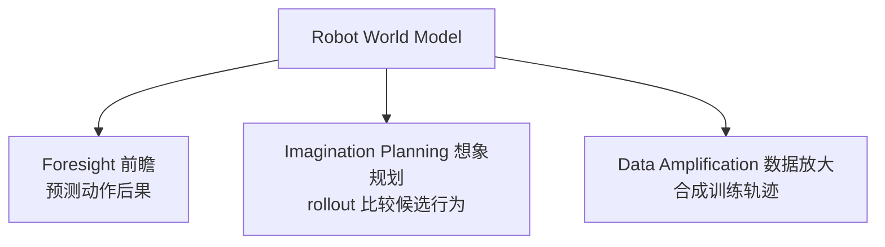

# World Model for Robot Learning: A Comprehensive Survey

- 本地 PDF：`papers/world-model/WRL-Survey_2605.00080.pdf`
- arXiv：https://arxiv.org/abs/2605.00080
- 年份：2026（5 月）
- 团队：NTU MARS Lab / UC Berkeley / Stanford / Harvard / Princeton / ETH Zurich / Oxford / 东京大学 / Microsoft（多机构联合）
- 阶段：机器人学习世界模型全景综述 — 43 页，定义三大能力 + 五类耦合范式 + 三级评估

## 一句话总结

综述定义机器人世界模型为"描述环境在智能体动作下如何演化的预测结构"，强调价值在于支持策略学习/规划而非视觉保真度。识别三大核心能力：**前瞻**（预测动作后果）、**想象驱动规划**（通过 rollout 比较候选行为）、**数据放大**（合成轨迹）。目录化五类耦合范式（解耦管线、单骨干共享、MoE/MoT 混合、统一 VLA、潜空间世界模型），提出三级评估框架（开环预测质量、闭环任务效用、物理一致性/可执行性诊断），并梳理了 12+ 个世界模型 benchmark（RBench, EWMBench, WorldArena, WorldEval 等）。

## 核心概念

### 三大核心能力

### 五类耦合范式

| 范式 | 描述 | 代表 |
|------|------|------|
| 解耦管线 | 世界模型和策略分开训练 | UniPi, SuSIE |
| 单骨干共享 | 同一 backbone 同时做预测和动作 | GR-1, GR-2 |
| MoE/MoT 混合 | 专家分工（视频专家 + 动作专家） | Motus, LingBot-VA |
| 统一 VLA | 视频-语言-动作统一序列模型 | DreamVLA, UniVLA |
| 潜空间世界模型 | 在 latent 空间预测 | VLA-JEPA, JEPA-VLA |

### 三级评估框架

1. **开环预测质量**：预测帧/状态和真值的相似度
2. **闭环任务效用**：用世界模型做规划/策略后的任务成功率
3. **物理一致性/可执行性**：预测是否符合物理、是否可执行（诊断）

## 关键发现

- **价值不在视觉保真度**：世界模型的价值由"能否帮助策略学习/规划"决定，而非预测帧的美观
- **12+ 个 benchmark 生态**：RBench, EWMBench, DreamGen Bench, EVA-Bench, WorldArena, WorldEval, WorldGym, World-in-World, WorldSimBench, WoW-World-Eval, DrivingGen, WM-ABench, RoVid-X
- **评估标准迁移**：从像素精度转向控制相关标准（rank consistency, value fidelity, decision reliability, inverse-dynamics recoverability, action executability）

## 开放挑战

- 多模态物理信号融合（力、触觉、音频）
- MPC 计算成本
- 符号结构整合
- 跨具身泛化
- 长程预测误差累积
- 统一 benchmark 缺失

## 核心技术

综述提炼的世界模型功能框架：
1. **三大能力**：前瞻（预测动作后果）、想象规划（rollout 比较）、数据放大（合成轨迹）
2. **五类耦合范式**：解耦管线 / 单骨干共享 / MoE-MoT 混合 / 统一 VLA / 潜空间世界模型
3. **三级评估框架**：开环预测质量 → 闭环任务效用 → 物理一致性诊断

## 底层原理与数学推导

**世界模型的形式化定义**：

$$\text{WM}: \hat{o}_{t+1:T} = f_\theta(o_t, a_{t:T-1}) \quad \text{（预测未来观测序列）}$$

**三大能力对应不同用途**：
- 前瞻：$\hat{o}_{t+1} = f(o_t, a_t)$ — 单步/短程预测
- 想象规划：$\arg\max_{a_{t:T}} \sum R(\hat{o}_{t+1:T})$ — 用预测做 rollout 搜索
- 数据放大：$\{(\hat{o}_{t+1:T}, a_{t:T})\} \to$ 训练集扩充

## 物理直觉解释

世界模型像"机器人的飞行模拟器"——不真的让机器人飞，先在模拟器里试。三大能力对应模拟器的三种用法：**前瞻** = 这个动作会怎样（单步模拟）；**想象规划** = 模拟所有可能路径挑最好的（蒙特卡洛搜索）；**数据放大** = 用模拟器生成大量训练数据（数据增强）。

五类耦合范式是"世界模型和策略的关系"谱系——从完全分离（解耦）到完全融合（统一 VLA）：就像"教练和运动员分开"（解耦）到"教练和运动员是一个人"（统一）。

## 工程细节与实操指南

- **评估世界模型的正确姿势**：先看开环预测质量（快但弱）→ 再看闭环任务效用（真但贵）→ 最后看物理一致性（诊断）
- **选范式**：数据充足+解耦简单→解耦管线；要效率→单骨干共享；要规模→MoE/MoT
- **benchmark 参考**：WorldArena（功能评估）、WorldEval（价值保真度）、WoW-World-Eval（物理+可执行性）

## 消融实验与分析

综述本身无消融，但梳理了评估标准的迁移（关键发现）：

| 旧标准 | 新标准（控制相关） |
|--------|-------------------|
| 像素精度（SSIM/PSNR） | rank consistency（排序保真） |
| 视觉逼真度 | value fidelity（价值保真） |
| 生成质量 | decision reliability（决策可靠） |
| - | inverse-dynamics recoverability（动作可恢复） |
| - | action executability（动作可执行性） |

**核心结论**：世界模型的价值标准正在从"像不像"转向"有没有用"——评估从生成质量迁移到控制相关指标。

## 技术权衡（Trade-off）

| 权衡维度 | 选择 |
|---------|------|
| 表示空间 | 像素（可解释）↔ 潜空间（高效） |
| 耦合度 | 解耦（可独立改进）↔ 统一（端到端） |
| 评估深度 | 开环（便宜）↔ 闭环（可信） |
| 规模 | 单骨干（简单）↔ MoE/MoT（可扩展） |

## 技术价值与演进定位

这份综述是 2026 年世界模型方向最全面的"地图"之一。对你已有笔记的直接价值：
- **五类耦合范式** = 你已有笔记的坐标系（UniPi→解耦, LingBot-VA→MoT, DreamVLA→统一 VLA, JEPA→潜空间）
- **三级评估框架** = 评价任何世界模型工作的标准模板（先看开环质量，再看闭环效用，最后看物理一致性）
- **12+ benchmark** = 后续拉取世界模型论文时判断"这个工作用什么评估"的参照

## 与其他论文的关系

- **WMRM-Survey (2606.00113)** — 姐妹综述，聚焦操作世界模型 + 34 数据集；本综述更广（含导航/驾驶）+ 评估框架更系统
- **WAM-Survey (2605.12090)** — 聚焦 World Action Model（含动作生成）
- **LingBot-VA / DreamVLA / UniPi** — 五类耦合范式的具体实例
- **LeWorldModel / SD-JEPA** — 潜空间世界模型家族

## 精读问题

1. "价值不在视觉保真度"——如何量化"价值"？三级评估的每一级对最终任务效用的贡献？
2. 五类耦合范式的演化关系——是替代还是并存？MoE/MoT 是否最终统一？
3. 12+ benchmarks 中哪个最接近"统一标准"？各自的评估盲区？
4. 闭环任务效用评估的"任务"选择——是否偏向特定任务类型（导致 benchmark 过拟合）？
